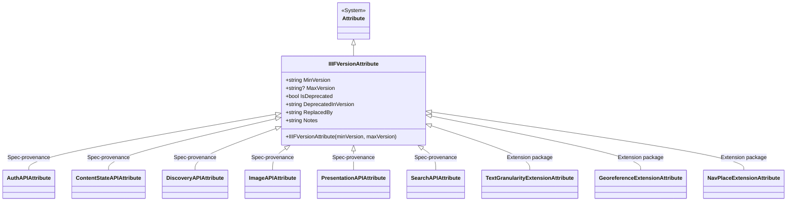

# Attributes

## Contents

- [Overview](#overview)
- [Files](#files)
- [Types & Members](#types--members)
  - [IIIFVersionAttribute](#iiifversionattribute)
  - [AuthAPIAttribute](#authapiattribute)
  - [ContentStateAPIAttribute](#contentstateapiattribute)
  - [DiscoveryAPIAttribute](#discoveryapiattribute)
  - [ImageAPIAttribute](#imageapiattribute)
  - [PresentationAPIAttribute](#presentationapiattribute)
  - [SearchAPIAttribute](#searchapiattribute)
  - [TextGranularityExtensionAttribute](#textgranularityextensionattribute)
  - [GeoreferenceExtensionAttribute](#georeferenceextensionattribute)
  - [NavPlaceExtensionAttribute](#navplaceextensionattribute)
- [Diagrams](#diagrams)
- [Package Dependencies](#package-dependencies)
- [See Also](#see-also)

## Overview

`IIIF.Manifests.Serializer.Attributes` provides a small family of custom C# attributes used across the whole SDK purely for **spec-provenance metadata**: they record which IIIF specification (Presentation, Image, Auth, Content State, Change Discovery, Search) or which optional extension package (navPlace, Georeference, Text Granularity) a class, property, or method belongs to, plus which API version range supports it and whether it is deprecated. They carry no runtime behavior of their own — nothing in this folder reads JSON, writes JSON, or validates anything at build time. Instead they act as declarative documentation/reflection metadata that the rest of the SDK (serializers, converters, tooling) can query via reflection to answer "is this member part of spec X, and is it still current?". Every attribute in this folder derives from a single base, `IIIFVersionAttribute`, which is where all the actual version/deprecation state lives.

## Files

| File | Primary type(s) | LOC (approx) | Responsibility |
| --- | --- | --- | --- |
| `AuthAPIAttribute.cs` | `AuthAPIAttribute` | 9 | Marks a member as part of the IIIF Auth API |
| `ContentStateAPIAttribute.cs` | `ContentStateAPIAttribute` | 9 | Marks a member as part of the IIIF Content State API |
| `DiscoveryAPIAttribute.cs` | `DiscoveryAPIAttribute` | 9 | Marks a member as part of the IIIF Change Discovery API |
| `GeoreferenceExtensionAttribute.cs` | `GeoreferenceExtensionAttribute` | 16 | Marks a property as part of the Georeference extension |
| `IIIFVersionAttribute.cs` | `IIIFVersionAttribute` | 52 | Base attribute: min/max supported version, deprecation state, notes |
| `ImageAPIAttribute.cs` | `ImageAPIAttribute` | 9 | Marks a member as part of the IIIF Image API |
| `NavPlaceExtensionAttribute.cs` | `NavPlaceExtensionAttribute` | 14 | Marks a property as part of the navPlace extension |
| `PresentationAPIAttribute.cs` | `PresentationAPIAttribute` | 15 | Marks a member as part of the IIIF Presentation API |
| `SearchAPIAttribute.cs` | `SearchAPIAttribute` | 9 | Marks a member as part of the IIIF Search API |
| `TextGranularityExtensionAttribute.cs` | `TextGranularityExtensionAttribute` | 9 | Marks a member as part of the Text Granularity extension |

[↑ Back to top](#contents)

## Types & Members

| Type | Kind | Summary | Inherits/Implements | Key Members |
| --- | --- | --- | --- | --- |
| `IIIFVersionAttribute` | `class` (attribute base) | Base attribute carrying version range + deprecation metadata; every other attribute here derives from it | `System.Attribute` | `MinVersion`, `MaxVersion`, `IsDeprecated`, `DeprecatedInVersion`, `ReplacedBy`, `Notes`, ctor `(string minVersion, string? maxVersion = null)` |
| `AuthAPIAttribute` | `class` (attribute) | Marks Auth API membership | `IIIFVersionAttribute` | ctor `(string minVersion, string? maxVersion = null)` |
| `ContentStateAPIAttribute` | `class` (attribute) | Marks Content State API membership | `IIIFVersionAttribute` | ctor `(string minVersion, string? maxVersion = null)` |
| `DiscoveryAPIAttribute` | `class` (attribute) | Marks Change Discovery API membership | `IIIFVersionAttribute` | ctor `(string minVersion, string? maxVersion = null)` |
| `ImageAPIAttribute` | `class` (attribute) | Marks Image API membership | `IIIFVersionAttribute` | ctor `(string minVersion, string? maxVersion = null)` |
| `PresentationAPIAttribute` | `class` (attribute) | Marks Presentation API membership | `IIIFVersionAttribute` | ctor `(string minVersion, string? maxVersion = null)` |
| `SearchAPIAttribute` | `class` (attribute) | Marks Search API membership | `IIIFVersionAttribute` | ctor `(string minVersion, string? maxVersion = null)` |
| `TextGranularityExtensionAttribute` | `class` (attribute) | Marks Text Granularity extension membership | `IIIFVersionAttribute` | ctor `(string minVersion, string? maxVersion = null)` |
| `GeoreferenceExtensionAttribute` | `class` (attribute) | Marks a property as belonging to the Georeference extension | `IIIFVersionAttribute` | ctor `(string version)` |
| `NavPlaceExtensionAttribute` | `class` (attribute) | Marks a property as belonging to the navPlace extension | `IIIFVersionAttribute` | ctor `(string version)` |

### IIIFVersionAttribute

- **Kind / Namespace**: `class` : `System.Attribute` — `IIIF.Manifests.Serializer.Attributes`
- **Inherits/Implements**: `System.Attribute`
- **Notable attributes**: `[AttributeUsage(AttributeTargets.Class | AttributeTargets.Property | AttributeTargets.Method | AttributeTargets.Field, AllowMultiple = false)]` — the widest target set of the family (also allows `Field`); single application per member.
- **Key properties**:
  - `MinVersion : string` — the minimum IIIF API version that supports the feature; set via constructor, read-only.
  - `MaxVersion : string?` — the maximum supported version; `null` means "still current/latest"; read-only.
  - `IsDeprecated : bool` — settable flag indicating the feature is deprecated in newer versions.
  - `DeprecatedInVersion : string` — settable; the version the feature was deprecated in (defaults to `null!` until set — treat as nullable in practice despite the non-nullable annotation).
  - `ReplacedBy : string` — settable; suggested replacement for a deprecated feature (defaults to `null!`).
  - `Notes : string` — settable free-text notes on version compatibility (defaults to `null!`).
- **Key methods**: none beyond the constructor — this is a pure data-holder attribute.
  - `IIIFVersionAttribute(string minVersion, string? maxVersion = null)` — sets `MinVersion`/`MaxVersion`; the `IsDeprecated`/`DeprecatedInVersion`/`ReplacedBy`/`Notes` properties are populated afterwards via object initializer syntax since they have public setters.
- **Notes**: This is the base class every attribute in this folder derives from (directly). It can also be applied standalone wherever a generic "supported IIIF API version" marker is needed without tying it to one specific spec.

**Usage Recipe**

```csharp
[IIIFVersionAttribute("2.0", "3.0", IsDeprecated = true, DeprecatedInVersion = "3.0", ReplacedBy = nameof(NewProperty))]
public string? LegacyProperty { get; set; }
```

### AuthAPIAttribute

- **Kind / Namespace**: `class` : `IIIFVersionAttribute` — `IIIF.Manifests.Serializer.Attributes`
- **Inherits/Implements**: `IIIFVersionAttribute`
- **Notable attributes**: `[AttributeUsage(AttributeTargets.Class | AttributeTargets.Property | AttributeTargets.Method, AllowMultiple = false)]`
- **Key properties**: none of its own — inherits `MinVersion`, `MaxVersion`, `IsDeprecated`, `DeprecatedInVersion`, `ReplacedBy`, `Notes` from `IIIFVersionAttribute`.
- **Key methods**: `AuthAPIAttribute(string minVersion, string? maxVersion = null)` — primary-constructor class that forwards both arguments to the base constructor.

**Usage Recipe**

```csharp
[AuthAPIAttribute("1.0")]
public class AccessTokenService { }
```

### ContentStateAPIAttribute

- **Kind / Namespace**: `class` : `IIIFVersionAttribute` — `IIIF.Manifests.Serializer.Attributes`
- **Inherits/Implements**: `IIIFVersionAttribute`
- **Notable attributes**: `[AttributeUsage(AttributeTargets.Class | AttributeTargets.Property | AttributeTargets.Method, AllowMultiple = false)]`
- **Key properties**: inherited only (see `IIIFVersionAttribute`).
- **Key methods**: `ContentStateAPIAttribute(string minVersion, string? maxVersion = null)` — forwards to base.

**Usage Recipe**

```csharp
[ContentStateAPIAttribute("1.0")]
public string? ContentStateToken { get; set; }
```

### DiscoveryAPIAttribute

- **Kind / Namespace**: `class` : `IIIFVersionAttribute` — `IIIF.Manifests.Serializer.Attributes`
- **Inherits/Implements**: `IIIFVersionAttribute`
- **Notable attributes**: `[AttributeUsage(AttributeTargets.Class | AttributeTargets.Property | AttributeTargets.Method, AllowMultiple = false)]`
- **Key properties**: inherited only.
- **Key methods**: `DiscoveryAPIAttribute(string minVersion, string? maxVersion = null)` — forwards to base.

**Usage Recipe**

```csharp
[DiscoveryAPIAttribute("1.0")]
public class ActivityStreamCollection { }
```

### ImageAPIAttribute

- **Kind / Namespace**: `class` : `IIIFVersionAttribute` — `IIIF.Manifests.Serializer.Attributes`
- **Inherits/Implements**: `IIIFVersionAttribute`
- **Notable attributes**: `[AttributeUsage(AttributeTargets.Class | AttributeTargets.Property | AttributeTargets.Method, AllowMultiple = false)]`
- **Key properties**: inherited only.
- **Key methods**: `ImageAPIAttribute(string minVersion, string? maxVersion = null)` — forwards to base.

**Usage Recipe**

```csharp
[ImageAPIAttribute("2.0", "3.0")]
public string? Tiles { get; set; }
```

### PresentationAPIAttribute

- **Kind / Namespace**: `class` : `IIIFVersionAttribute` — `IIIF.Manifests.Serializer.Attributes`
- **Inherits/Implements**: `IIIFVersionAttribute`
- **Notable attributes**: `[AttributeUsage(AttributeTargets.Class | AttributeTargets.Property | AttributeTargets.Method, AllowMultiple = false)]`
- **Key properties**: none of its own — like its siblings, uses the inherited `MinVersion`/`MaxVersion`/`IsDeprecated`/`DeprecatedInVersion`/`ReplacedBy`/`Notes` from `IIIFVersionAttribute`.
- **Key methods**: `PresentationAPIAttribute(string minVersion, string? maxVersion = null)` — explicit constructor body that calls `base(minVersion, maxVersion)`.

**Usage Recipe**

```csharp
[PresentationAPIAttribute("3.0")]
public string? Behavior { get; set; }

// Deprecated member example, combining the constructor with the inherited settable properties:
[PresentationAPIAttribute("2.0", "3.0", IsDeprecated = true, DeprecatedInVersion = "3.0", ReplacedBy = "Behavior")]
public string? ViewingHint { get; set; }
```

### SearchAPIAttribute

- **Kind / Namespace**: `class` : `IIIFVersionAttribute` — `IIIF.Manifests.Serializer.Attributes`
- **Inherits/Implements**: `IIIFVersionAttribute`
- **Notable attributes**: `[AttributeUsage(AttributeTargets.Class | AttributeTargets.Property | AttributeTargets.Method, AllowMultiple = false)]`
- **Key properties**: inherited only.
- **Key methods**: `SearchAPIAttribute(string minVersion, string? maxVersion = null)` — forwards to base.

**Usage Recipe**

```csharp
[SearchAPIAttribute("1.0", "2.0")]
public class SearchService { }
```

### TextGranularityExtensionAttribute

- **Kind / Namespace**: `class` : `IIIFVersionAttribute` — `IIIF.Manifests.Serializer.Attributes`
- **Inherits/Implements**: `IIIFVersionAttribute`
- **Notable attributes**: `[AttributeUsage(AttributeTargets.Class | AttributeTargets.Property | AttributeTargets.Method, AllowMultiple = false)]` — note this matches the spec-API attributes' target set and two-argument `(minVersion, maxVersion)` constructor shape, unlike the other two extension attributes below which take a single `version` argument and target `Property` only.
- **Key properties**: inherited only.
- **Key methods**: `TextGranularityExtensionAttribute(string minVersion, string? maxVersion = null)` — forwards to base.

**Usage Recipe**

```csharp
[TextGranularityExtensionAttribute("1.0")]
public class TextGranularityExtension { }
```

### GeoreferenceExtensionAttribute

- **Kind / Namespace**: `class` : `IIIFVersionAttribute` — `IIIF.Manifests.Serializer.Attributes`
- **Inherits/Implements**: `IIIFVersionAttribute`
- **Notable attributes**: `[AttributeUsage(AttributeTargets.Property)]` — property-only, and only a single version argument is accepted (no `maxVersion` overload).
- **Key properties**: inherited only.
- **Key methods**: `GeoreferenceExtensionAttribute(string version)` — calls `base(version)`, leaving `MaxVersion` at its default (`null`, i.e. "current").

**Usage Recipe**

```csharp
[GeoreferenceExtensionAttribute("1.0")]
public NavPlaceFeatureCollection? NavPlace { get; set; }
```

### NavPlaceExtensionAttribute

- **Kind / Namespace**: `class` : `IIIFVersionAttribute` — `IIIF.Manifests.Serializer.Attributes`
- **Inherits/Implements**: `IIIFVersionAttribute`
- **Notable attributes**: `[AttributeUsage(AttributeTargets.Property)]` — property-only, single-argument constructor, same shape as `GeoreferenceExtensionAttribute`.
- **Key properties**: inherited only.
- **Key methods**: `NavPlaceExtensionAttribute(string version)` — calls `base(version)`.

**Usage Recipe**

```csharp
[NavPlaceExtensionAttribute("1.0")]
public FeatureCollection? NavPlace { get; set; }
```

[↑ Back to top](#contents)

## Diagrams

`IIIFVersionAttribute` is a genuine shared base class — every attribute in this folder derives from it directly (single level of inheritance, no further subclassing). The ten types split naturally into two conceptual groups: **spec-provenance attributes** (one per core IIIF API, taking `(minVersion, maxVersion?)`) and **extension-package attributes** (marking membership of the three optional extension packages described in the top-level `../README.md`). Note that `TextGranularityExtensionAttribute` is shaped like the spec-provenance group (two-arg constructor, `Class|Property|Method` targets) while `GeoreferenceExtensionAttribute`/`NavPlaceExtensionAttribute` are shaped differently (single-arg constructor, `Property`-only targets) — the grouping below is by *conceptual purpose*, not by constructor shape.



[↑ Back to top](#contents)

## Package Dependencies

| Package | Version | Description | Links |
| --- | --- | --- | --- |
| Newtonsoft.Json | 13.0.4 | JSON.NET — this SDK's serialization engine (custom JsonConverters, attribute-driven read/write) | [NuGet](https://www.nuget.org/packages/Newtonsoft.Json/13.0.4) |

[↑ Back to top](#contents)

## See Also

- [`../README.md`](../README.md) — top-level SDK documentation, including the "Extension packages" section describing navPlace, Georeference, and Text Granularity extension packages referenced by the extension attributes above.
- [`../SDK_VERSIONING_GUIDE.md`](../SDK_VERSIONING_GUIDE.md) — SDK versioning conventions that these attributes' `MinVersion`/`MaxVersion`/deprecation metadata align with.

[↑ Back to top](#contents)
