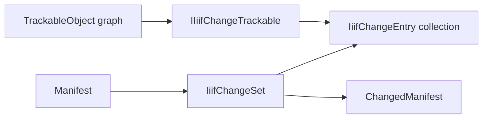

# ChangeTracking

## Overview

`IIIF.Manifests.Serializer.ChangeTracking` defines the public, pull-based change model used by
every SDK object derived from `TrackableObject`. Changes are collected recursively, use SDK-style
paths such as `items[0].label`, and retain original/current values.

## Files and types

| File | Public type | Purpose |
| --- | --- | --- |
| `IIiifChangeTrackable.cs` | `IIiifChangeTrackable` | Recursive `HasChanges`, `GetChanges`, `ClearChanges`, and `AcceptChanges` contract |
| `IiifChangeEntry.cs` | `IiifChangeEntry` | Immutable record for one change, including path, kind, values, and UTC timestamp |
| `IiifChangeKind.cs` | `IiifChangeKind` | Added, modified, removed, collection, and child change kinds |
| `IiifChangeSet.cs` | `IiifChangeSet` | Manifest delta envelope containing the complete change list and a best-effort changed manifest |

## Usage

```csharp
manifest.ClearChanges();                 // establish the baseline
manifest.Items.OfType<Canvas>().First().SetLabel(new Label("Updated canvas"));

if (manifest.HasChanges)
{
    IReadOnlyCollection<IiifChangeEntry> changes = manifest.GetChanges();
    IiifChangeSet delta = manifest.GetChangeSet();
}
```

`ClearChanges()` and `AcceptChanges()` are equivalent. `Manifest.GetChangedManifest()` is a
convenient partial reconstruction, but removals cannot always be represented as valid IIIF JSON;
use `GetChangeSet().Changes` when a complete delta is required.

## Diagrams



## See also

- [Change-tracking design and semantics](../CHANGE_TRACKING.md)
- [Trackable infrastructure](../Shared/Trackable/README.md)
- [Manifest model](../Nodes/README.md)
