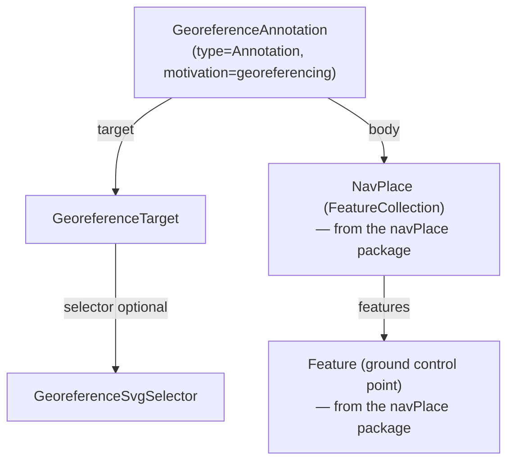

# Georeference

## Contents

- [Overview](#overview)
- [Files](#files)
- [Types & Members](#types--members)
- [Diagrams](#diagrams)
- [Package Dependencies](#package-dependencies)
- [See Also](#see-also)

## Overview

This folder holds the direct files (not the `ResourceCoords/` or `Transformations/` subfolders — see
their own READMEs) of the `IIIF.Manifest.Serializer.Net.Georeference` NuGet package, which implements
the IIIF **Georeference** extension: pinning ground-control points on a map to pixel/frame
coordinates on a Canvas or Image Service, so a viewer can align (georeference) the resource against
real-world geography. The spec's actual top-level construct is a full **W3C Web Annotation** with
`motivation: "georeferencing"` (`GeoreferenceAnnotation`), wrapping a `target` (`GeoreferenceTarget`
— the Canvas/Image being georeferenced, optionally a `GeoreferenceSvgSelector`-selected region) and a
`body` (a GeoJSON FeatureCollection of ground control points — this package reuses the **navPlace**
extension's `NavPlace`/`Feature` type directly for that body, since both specs describe the same
shape). This package therefore has a `ProjectReference` to
`IIIF.Manifest.Serializer.Net.NavPlace` (see [Package Dependencies](#package-dependencies)). It ships
and versions independently of the core `IIIF.Manifest.Serializer.Net` library and of the navPlace/
Text Granularity extensions.

Like navPlace, Georeference postdates Presentation API 3.0, so `GeoreferenceAnnotation` uses
unprefixed `id`/`type`/`@context` conventions matching the spec's own JSON examples rather than the
core SDK's 2.x-compatible `@id`/`@type` `BaseItem<T>` shape.

[↑ Back to top](#contents)

## Files

| File | Primary type(s) | LOC (approx) | Responsibility |
| --- | --- | --- | --- |
| `GeoreferenceAnnotation.cs` | `GeoreferenceAnnotation` | 87 | The top-level Georeference construct: a W3C Annotation with fixed `type`/`motivation`, a `Target`, and a `Body` (navPlace FeatureCollection). |
| `GeoreferenceSvgSelector.cs` | `GeoreferenceSvgSelector` | 38 | The W3C `SvgSelector` shape (`type`/`value`) — the selector the spec prefers for narrowing a Georeference Annotation's target to a specific polygonal/rectangular region. |
| `GeoreferenceTarget.cs` | `GeoreferenceTarget` | 81 | A Georeference Annotation's `target`: a Canvas/Image Service reference, optionally narrowed via a `Selector`, plus optional `SourceHeight`/`SourceWidth`/`SpecificResourceId`. |
| `GeoreferenceTargetJsonConverter.cs` | `GeoreferenceTargetJsonConverter` | 135 | Reads/writes `GeoreferenceTarget`'s 3 polymorphic JSON shapes: a bare URI string, a full resource object (`id`/`type`/`height`/`width`), or a `SpecificResource` wrapping a `GeoreferenceSvgSelector`. |

[↑ Back to top](#contents)

## Types & Members

| Type | Kind | Summary | Inherits/Implements | Key Members |
| --- | --- | --- | --- | --- |
| `GeoreferenceAnnotation` | class | Top-level Georeference W3C Annotation wrapper | `TrackableObject<GeoreferenceAnnotation>` | `Context`, `Id`, `Type`, `Motivation`, `Target`, `Body`, `SetId` |
| `GeoreferenceSvgSelector` | class | W3C SvgSelector (`type`/`value`) | `TrackableObject<GeoreferenceSvgSelector>` | `Type`, `Value` |
| `GeoreferenceTarget` | class | Annotation target: Canvas/Image + optional selector | `TrackableObject<GeoreferenceTarget>` | `SourceId`, `SourceType`, `SourceHeight`, `SourceWidth`, `SpecificResourceId`, `Selector`, `SetSelector` |
| `GeoreferenceTargetJsonConverter` | class | Polymorphic reader/writer for `GeoreferenceTarget`'s 3 JSON shapes | `JsonConverter<GeoreferenceTarget>` | `ReadJson`, `WriteJson` |

### GeoreferenceAnnotation

- **Kind / Namespace**: class, `IIIF.Manifests.Serializer.Extensions`
- **Inherits/Implements**: `TrackableObject<GeoreferenceAnnotation>`
- **Notable attributes**: `[GeoreferenceExtension("3.0")]` on `Motivation`; `[JsonProperty]` on every serialized property; `[JsonConverter(typeof(ObjectArrayJsonConverter))]` on `Context`.
- **Constants**: `DefaultGeoreferenceContext = "http://iiif.io/api/extension/georef/1/context.json"`, `DefaultPresentationContext = "http://iiif.io/api/presentation/3/context.json"`.
- **Key properties**:
  - `Context : IReadOnlyCollection<string>` — defaults to both the Georeference and Presentation 3.0 context URIs.
  - `Id : string?` — the Annotation's own id (optional; set via `SetId`).
  - `Type : string` — defaults to `"Annotation"`.
  - `Motivation : string` — defaults to `"georeferencing"` (the spec-fixed motivation value; the property itself is what carries `[GeoreferenceExtension("3.0")]`).
  - `Target : GeoreferenceTarget` — the Canvas/Image being georeferenced.
  - `Body : NavPlace` — the ground-control-point FeatureCollection (reuses the navPlace package's `NavPlace` type).
- **Key methods**: `SetId(string) : GeoreferenceAnnotation` — fluent.
- **Constructors**: `GeoreferenceAnnotation(GeoreferenceTarget target, NavPlace body)` — sets `Context`/`Type`/`Motivation` to their spec defaults and assigns `Target`/`Body`.
- **Usage Recipe**:
  ```csharp
  using IIIF.Manifests.Serializer.Extensions;

  var target = new GeoreferenceTarget("https://example.org/iiif/canvas/p1", "Canvas")
      .SetSourceDimensions(2000, 1500)
      .SetSelector(new GeoreferenceSvgSelector("<svg>...</svg>"));

  var body = new NavPlace("https://example.org/iiif/georef/1/gcps")
      .AddFeature(new Feature("https://example.org/iiif/georef/1/gcp1")
          .SetGeometry(new Geometry(GeometryType.Point).AddCoordinate(new CoordinateItem(-73.968, 40.785))));

  var georeferenceAnnotation = new GeoreferenceAnnotation(target, body)
      .SetId("https://example.org/iiif/georef/1");
  ```

### GeoreferenceSvgSelector

- **Kind / Namespace**: class, `IIIF.Manifests.Serializer.Extensions`
- **Inherits/Implements**: `TrackableObject<GeoreferenceSvgSelector>`
- **Notable attributes**: `[GeoreferenceExtension("3.0")]` on `Type`; `[JsonConstructor]` on its constructor.
- **Key properties**: `Type : string` — always `"SvgSelector"`; `Value : string` — the raw SVG markup.
- **Constructors**: `GeoreferenceSvgSelector(string value)` — sets `Type = "SvgSelector"` and `Value = value`.
- **Usage Recipe**:
  ```csharp
  var selector = new GeoreferenceSvgSelector("<svg><polygon points=\"0,0 100,0 100,100 0,100\"/></svg>");
  target.SetSelector(selector);
  ```

### GeoreferenceTarget

- **Kind / Namespace**: class, `IIIF.Manifests.Serializer.Extensions`
- **Inherits/Implements**: `TrackableObject<GeoreferenceTarget>`
- **Notable attributes**: `[JsonConverter(typeof(GeoreferenceTargetJsonConverter))]` on the class; `[GeoreferenceExtension("3.0")]` on `Selector`.
- **Key properties**:
  - `SourceId : string` — the Canvas/Image Service URI being targeted.
  - `SourceType : string?` — e.g. `"Canvas"`.
  - `SourceHeight : int?`, `SourceWidth : int?` — set together via `SetSourceDimensions`.
  - `SpecificResourceId : string?` — the wrapping `SpecificResource`'s own id; only meaningful when `Selector` is set.
  - `Selector : GeoreferenceSvgSelector?` — narrows the target to a specific region.
- **Key methods**: `SetSourceDimensions(int height, int width)`, `SetSelector(GeoreferenceSvgSelector)`, `SetSpecificResourceId(string)` — all fluent.
- **Constructors**: `GeoreferenceTarget(string sourceId, string? sourceType = null)`.
- **Usage Recipe**:
  ```csharp
  // Whole-Canvas target (no selector) — serializes as a bare URI or {"id","type","height","width"}.
  var wholeCanvasTarget = new GeoreferenceTarget("https://example.org/iiif/canvas/p1", "Canvas")
      .SetSourceDimensions(2000, 1500);

  // Region-of-Canvas target — serializes as a SpecificResource wrapping the SvgSelector.
  var regionTarget = new GeoreferenceTarget("https://example.org/iiif/canvas/p1", "Canvas")
      .SetSourceDimensions(2000, 1500)
      .SetSelector(new GeoreferenceSvgSelector("<svg>...</svg>"))
      .SetSpecificResourceId("https://example.org/iiif/georef/1/target");
  ```

### GeoreferenceTargetJsonConverter

- **Kind / Namespace**: class, `IIIF.Manifests.Serializer.Extensions`
- **Inherits/Implements**: `Newtonsoft.Json.JsonConverter<GeoreferenceTarget>`
- **Key methods**:
  - `WriteJson(JsonWriter, GeoreferenceTarget?, JsonSerializer) : void` — writes a bare URI or `{"id","type","height","width"}` when `Selector` is null; otherwise writes a `{"id"?,"type":"SpecificResource","source":...,"selector":...}` object.
  - `ReadJson(JsonReader, Type, GeoreferenceTarget?, bool, JsonSerializer) : GeoreferenceTarget?` — dispatches on the token shape (string vs. object vs. `"type":"SpecificResource"` object) to reconstruct the right `GeoreferenceTarget`.
- **Usage Recipe**: applied automatically via `GeoreferenceTarget`'s `[JsonConverter]` attribute — no direct usage needed.

[↑ Back to top](#contents)

## Diagrams



A `GeoreferenceAnnotation` is a W3C Annotation whose `target` is the Canvas/Image being georeferenced
(optionally narrowed by an `SvgSelector`-based region) and whose `body` is a navPlace FeatureCollection
of ground control points, reusing the navPlace package's types directly rather than redefining them.

[↑ Back to top](#contents)

## Package Dependencies

| Package | Version | Description | Links |
| --- | --- | --- | --- |
| Newtonsoft.Json | 13.0.4 | JSON.NET — the core SDK's serialization engine, also used here | [NuGet](https://www.nuget.org/packages/Newtonsoft.Json/13.0.4) |
| IIIF.Manifest.Serializer.Net | (ProjectReference) | Core SDK — supplies `TrackableObject<T>`, `ObjectArrayJsonConverter`, and the `[GeoreferenceExtension]` attribute | [../../README.md](../../README.md) |
| IIIF.Manifest.Serializer.Net.NavPlace | (ProjectReference) | Supplies the `NavPlace`/`Feature`/`Geometry`/`CoordinateItem` types this package's `GeoreferenceAnnotation.Body` reuses directly | [../NavPlace/README.md](../NavPlace/README.md) |

[↑ Back to top](#contents)

## See Also

- [./ResourceCoords/README.md](./ResourceCoords/README.md) — pixel-space `resourceCoords` on a Feature's properties
- [./Transformations/README.md](./Transformations/README.md) — the `polynomial`/`thinPlateSpline` transformation algorithms
- [../README.md](../README.md) — Extensions index (all 3 extension packages)
- [../NavPlace/README.md](../NavPlace/README.md) — the navPlace package this one depends on
- [../../README.md](../../README.md) — docs root / core SDK overview
- [../../SDK_VERSIONING_GUIDE.md](../../SDK_VERSIONING_GUIDE.md) — see [Milestone 17: model Georeference Annotation wrapper](../../SDK_VERSIONING_GUIDE.md#milestone-17-done--model-georeference-annotation-wrapper)

[↑ Back to top](#contents)
