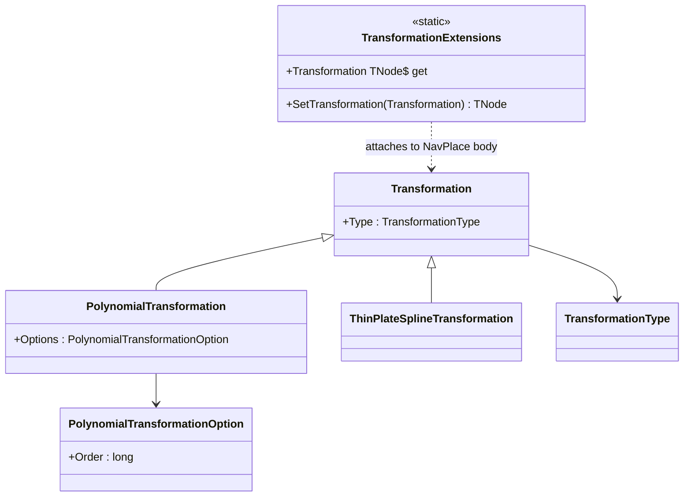

# Transformations

## Contents

- [Overview](#overview)
- [Files](#files)
- [Types & Members](#types--members)
- [Diagrams](#diagrams)
- [Package Dependencies](#package-dependencies)
- [See Also](#see-also)

## Overview

This is a subfolder of the `IIIF.Manifest.Serializer.Net.Georeference` NuGet package (same assembly
as [../README.md](../README.md), not a separate package). It models the two georeferencing
transformation algorithms the Georeference extension spec allows for mapping pixel-space ground
control points to real-world coordinates: **polynomial** (1st/2nd/3rd order, parameterized by an
`order` option) and **thin plate spline** ("rubber sheeting", no options). Both derive from a shared
`Transformation` base (`type` + spec-fixed `TransformationType` vocabulary), and
`TransformationExtensions` fluently attaches a `Transformation` to the navPlace FeatureCollection
that is a Georeference Annotation's `body` (see [../README.md](../README.md)), via the core SDK's
additional-properties mechanism.

[↑ Back to top](#contents)

## Files

| File | Primary type(s) | LOC (approx) | Responsibility |
| --- | --- | --- | --- |
| `PolynomialTransformation.cs` | `PolynomialTransformation` | 20 | Polynomial transformation (`type: "polynomial"`) carrying a `PolynomialTransformationOption` (the `order`). |
| `PolynomialTransformationOption.cs` | `PolynomialTransformationOption` | 11 | The `options` object for a polynomial transformation: just an `Order`. |
| `ThinPlateSplineTransformation.cs` | `ThinPlateSplineTransformation` | 2 | Thin plate spline transformation (`type: "thinPlateSpline"`) — a one-line primary-constructor type with no options. |
| `Transformation.cs` | `Transformation` | 26 | Shared base: the `type` property common to every transformation shape. |
| `TransformationExtensions.cs` | `TransformationExtensions` | 33 | Fluent `SetTransformation`/`Transformation` extension members attaching a `Transformation` to a `TrackableObject<T>` (the navPlace `NavPlace` body). |
| `TransformationType.cs` | `TransformationType` | 19 | Enum-like vocabulary of the 2 spec-defined transformation type strings. |

[↑ Back to top](#contents)

## Types & Members

| Type | Kind | Summary | Inherits/Implements | Key Members |
| --- | --- | --- | --- | --- |
| `Transformation` | class | Shared base for both transformation shapes | `TrackableObject<Transformation>` | `Type` |
| `PolynomialTransformation` | class | 1st/2nd/3rd-order polynomial transformation | `Transformation` | `Options` |
| `PolynomialTransformationOption` | class | The `order` option for a polynomial transformation | `TrackableObject<PolynomialTransformationOption>` | `Order` |
| `ThinPlateSplineTransformation` | class | Rubber-sheeting transformation, no options | `Transformation` | *(none beyond base)* |
| `TransformationType` | class | Enum-like vocabulary of transformation type strings | `ValuableItem<TransformationType>` | `Polynomial`, `ThinPlateSpline` |
| `TransformationExtensions` | static class | Fluent attach-point for `TrackableObject<T>` | *(none)* | `SetTransformation(Transformation)`, `Transformation` (get) |

### Transformation

- **Kind / Namespace**: class, `IIIF.Manifests.Serializer.Extensions.Transformations`
- **Inherits/Implements**: `TrackableObject<Transformation>`
- **Constants**: `TransformationJName = "transformation"`.
- **Notable attributes**: `[JsonProperty("type")]` on `Type`.
- **Key properties**: `Type : TransformationType` — `"polynomial"` or `"thinPlateSpline"`.
- **Constructors**: `Transformation(TransformationType type)`.
- **Usage Recipe**: not instantiated directly — use `PolynomialTransformation` or `ThinPlateSplineTransformation`.

### PolynomialTransformation

- **Kind / Namespace**: class, `IIIF.Manifests.Serializer.Extensions.Transformations`
- **Inherits/Implements**: `Transformation`
- **Notable attributes**: `[JsonProperty("options")]` on `Options`.
- **Key properties**: `Options : PolynomialTransformationOption` — the transformation's coefficient/order parameters.
- **Constructors**: `PolynomialTransformation(PolynomialTransformationOption options) : base(TransformationType.Polynomial)`.
- **Usage Recipe**:
  ```csharp
  using IIIF.Manifests.Serializer.Extensions.Transformations;

  var polynomial = new PolynomialTransformation(new PolynomialTransformationOption { /* Order set via TrackableObject fluent API */ });
  navPlaceBody.SetTransformation(polynomial);
  ```

### PolynomialTransformationOption

- **Kind / Namespace**: class, `IIIF.Manifests.Serializer.Extensions.Transformations`
- **Inherits/Implements**: `TrackableObject<PolynomialTransformationOption>`
- **Key properties**: `Order : long` — the polynomial order (1, 2, or 3 per the spec).
- **Usage Recipe**:
  ```csharp
  var options = new PolynomialTransformationOption(); // Order set through the trackable-object element API
  var polynomial = new PolynomialTransformation(options);
  ```

### ThinPlateSplineTransformation

- **Kind / Namespace**: class, `IIIF.Manifests.Serializer.Extensions.Transformations`
- **Inherits/Implements**: `Transformation`
- **Constructors**: primary constructor `ThinPlateSplineTransformation() : Transformation(TransformationType.ThinPlateSpline)` — the entire type is a single line (`public class ThinPlateSplineTransformation() : Transformation(TransformationType.ThinPlateSpline);`), since thin plate spline has no options per the spec.
- **Usage Recipe**:
  ```csharp
  using IIIF.Manifests.Serializer.Extensions.Transformations;

  var thinPlateSpline = new ThinPlateSplineTransformation();
  navPlaceBody.SetTransformation(thinPlateSpline);
  ```

### TransformationType

- **Kind / Namespace**: class, `IIIF.Manifests.Serializer.Extensions.Transformations`
- **Inherits/Implements**: `ValuableItem<TransformationType>`
- **Notable attributes**: `[JsonConverter(typeof(ValuableItemJsonConverter<TransformationType>))]`
- **Key members (static factories)**: `Polynomial` ("1st, 2nd or 3rd order polynomial transformation. Options: order"), `ThinPlateSpline` ("Thin plate spline transformation, also known as rubber sheeting. Options: N/A").
- **Usage Recipe**:
  ```csharp
  var type = TransformationType.Polynomial;
  ```

### TransformationExtensions

- **Kind / Namespace**: static class, `IIIF.Manifests.Serializer.Extensions.Transformations`
- **Key members**: an `extension<TNode>(TNode node) where TNode : TrackableObject<TNode>, IAdditionalPropertiesSupport<TNode>` block exposing:
  - `SetTransformation(Transformation transformation) : TNode` — calls `node.SetAdditionalProperty(Transformation.TransformationJName, transformation)`.
  - `Transformation : Transformation?` (get) — calls `node.GetAdditionalProperty<TNode, Transformation>(Transformation.TransformationJName)`; carries `[GeoreferenceExtension("3.0")]`.
- **Design note**: constrained to `TrackableObject<TNode>` rather than the narrower `BaseNode<TNode>` (unlike `NavPlaceExtensions`/`TextGranularityExtensions`), because `transformation` belongs on the navPlace `NavPlace` FeatureCollection body (a `BaseItem`, not a `BaseNode`) per Georeference spec §3.6 — not on arbitrary Presentation resources.
- **Usage Recipe**:
  ```csharp
  using IIIF.Manifests.Serializer.Extensions.Transformations;

  var body = new NavPlace("https://example.org/iiif/georef/1/gcps")
      .SetTransformation(new ThinPlateSplineTransformation());
  ```

[↑ Back to top](#contents)

## Diagrams



`Transformation` is the shared base; `PolynomialTransformation` (carrying an `order` option) and
`ThinPlateSplineTransformation` (no options) are the two spec-allowed concrete shapes.
`TransformationExtensions` attaches either one to a navPlace FeatureCollection body.

[↑ Back to top](#contents)

## Package Dependencies

| Package | Version | Description | Links |
| --- | --- | --- | --- |
| Newtonsoft.Json | 13.0.4 | JSON.NET — the core SDK's serialization engine, also used here | [NuGet](https://www.nuget.org/packages/Newtonsoft.Json/13.0.4) |
| IIIF.Manifest.Serializer.Net | (ProjectReference) | Core SDK — supplies `TrackableObject<T>`, `ValuableItem<T>`, `IAdditionalPropertiesSupport<T>`, and the `[GeoreferenceExtension]` attribute | [../../../README.md](../../../README.md) |
| IIIF.Manifest.Serializer.Net.NavPlace | (ProjectReference, via the parent Georeference project) | Supplies `NavPlace`, the type `TransformationExtensions` attaches `transformation` to | [../../NavPlace/README.md](../../NavPlace/README.md) |

[↑ Back to top](#contents)

## See Also

- [../README.md](../README.md) — the parent Georeference package (this folder is part of the same assembly)
- [../ResourceCoords/README.md](../ResourceCoords/README.md) — sibling subfolder: pixel-space ground-control-point coordinates used alongside a transformation
- [../../README.md](../../README.md) — Extensions index (all 3 extension packages)
- [../../../README.md](../../../README.md) — docs root / core SDK overview
- [../../../SDK_VERSIONING_GUIDE.md](../../../SDK_VERSIONING_GUIDE.md) — see [Milestone 17: model Georeference Annotation wrapper](../../../SDK_VERSIONING_GUIDE.md#milestone-17-done--model-georeference-annotation-wrapper)

[↑ Back to top](#contents)
