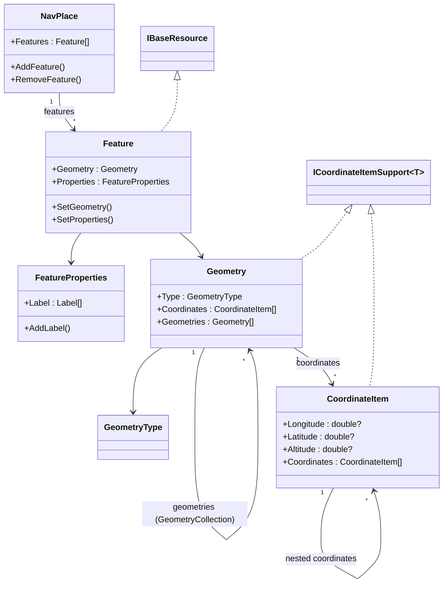

# NavPlace

## Contents

- [Overview](#overview)
- [Files](#files)
- [Types & Members](#types--members)
- [Diagrams](#diagrams)
- [Package Dependencies](#package-dependencies)
- [See Also](#see-also)

## Overview

This folder is the entire `IIIF.Manifest.Serializer.Net.NavPlace` NuGet package (flat, no
subfolders) — it implements the IIIF **navPlace** extension, which attaches a GeoJSON-shaped
geographic location to a `Collection`, `Manifest`, `Range`, or `Canvas`. The model follows RFC 7946
(GeoJSON) directly: a `NavPlace` FeatureCollection wraps one or more `Feature`s, each carrying a
`Geometry` (`Point`/`MultiPoint`/`LineString`/`MultiLineString`/`Polygon`/`MultiPolygon`/
`GeometryCollection`) built from `CoordinateItem` coordinate pairs/triples, plus optional
`FeatureProperties` (currently just `label`). `NavPlaceExtensions` is the fluent entry point that
attaches a `NavPlace` value to any core-SDK `BaseNode<T>` via the additional-properties mechanism,
so this package needs no core SDK changes to work. It ships and versions independently of the core
`IIIF.Manifest.Serializer.Net` library and of the Georeference/Text Granularity extensions (though
Georeference depends on this package — see [../Georeference/README.md](../Georeference/README.md)).

navPlace postdates Presentation API 3.0 (it has no 2.x form), so its top-level types use unprefixed
`id`/`type` (via `UnprefixedBaseItem<T>`) rather than the core SDK's `@id`/`@type` `BaseItem<T>`
shape.

[↑ Back to top](#contents)

## Files

| File | Primary type(s) | LOC (approx) | Responsibility |
| --- | --- | --- | --- |
| `CoordinateItem.cs` | `CoordinateItem` | 71 | A GeoJSON coordinate: a lon/lat(/alt) leaf, or (for Multi*/Polygon geometries) a nested array of further `CoordinateItem`s. |
| `CoordinateItemJsonConverter.cs` | `CoordinateItemJsonConverter` | 75 | Reads/writes `CoordinateItem` as a raw JSON array (`[lon,lat]`, `[lon,lat,alt]`, or nested arrays), matching GeoJSON's positional (non-object) coordinate shape. |
| `Feature.cs` | `Feature` | 57 | A GeoJSON Feature (one geolocated area): wraps a `Geometry` + `FeatureProperties`. Also implements `IBaseResource` so a bare Feature can stand in as an Annotation body. |
| `FeatureProperties.cs` | `FeatureProperties` | 41 | The open "properties" bag on a `Feature`; currently models only `label`. |
| `Geometry.cs` | `Geometry` | 88 | A GeoJSON geometry object supporting all RFC 7946 types, including `GeometryCollection`'s nested `geometries` array. |
| `GeometryJsonConverter.cs` | *(none — empty file)* | 0 | Declared in the `.csproj` as `DependentUpon` of `Geometry.cs`, but the file itself is empty (BOM only, 0 lines of code). `Geometry`'s actual `[JsonConverter]` is `ValuableItemJsonConverter<GeometryType>` on its `Type` property, not this file — this appears to be an unused/leftover placeholder. |
| `GeometryType.cs` | `GeometryType` | 19 | Enum-like vocabulary of the 7 RFC 7946 geometry type strings. |
| `ICoordinateItemSupport.cs` | `ICoordinateItemSupport<T>` | 12 | Shared "has a `Coordinates` collection" contract implemented by both `CoordinateItem` (self-nesting) and `Geometry`. |
| `NavPlace.cs` | `NavPlace` | 42 | The navPlace property value itself: a GeoJSON FeatureCollection wrapping `Feature`s. |
| `NavPlaceExtensions.cs` | `NavPlaceExtensions` | 31 | Fluent `SetNavPlace`/`NavPlace` extension members attaching a `NavPlace` to any `BaseNode<T>`. |

[↑ Back to top](#contents)

## Types & Members

| Type | Kind | Summary | Inherits/Implements | Key Members |
| --- | --- | --- | --- | --- |
| `CoordinateItem` | class | A coordinate leaf or nested coordinate array | `TrackableObject<CoordinateItem>`, `ICoordinateItemSupport<CoordinateItem>` | `Longitude`, `Latitude`, `Altitude`, `Coordinates`, `AddCoordinate` |
| `CoordinateItemJsonConverter` | class | Custom array-shaped JSON (de)serialization for `CoordinateItem` | `JsonConverter<CoordinateItem>` | `ReadJson`, `WriteJson` |
| `Feature` | class | A single GeoJSON Feature (geometry + properties) | `UnprefixedBaseItem<Feature>`, `IBaseResource` | `Geometry`, `Properties`, `SetGeometry`, `SetProperties` |
| `FeatureProperties` | class | Open properties bag on a `Feature` | `TrackableObject<FeatureProperties>` | `Label`, `SetLabel`, `AddLabel`, `RemoveLabel` |
| `Geometry` | class | GeoJSON geometry of any RFC 7946 type | `TrackableObject<Geometry>`, `ICoordinateItemSupport<Geometry>` | `Type`, `Coordinates`, `Geometries`, `AddGeometry` |
| `GeometryType` | class | Enum-like vocabulary of geometry type strings | `ValuableItem<GeometryType>` | `Point`, `MultiPoint`, `LineString`, `MultiLineString`, `Polygon`, `MultiPolygon`, `GeometryCollection` |
| `ICoordinateItemSupport<T>` | interface | Shared coordinate-collection contract | *(none)* | `Coordinates`, `SetCoordinates`, `AddCoordinate`, `RemoveAddCoordinate` |
| `NavPlace` | class | The navPlace FeatureCollection value | `UnprefixedBaseItem<NavPlace>` | `Features`, `SetFeatures`, `AddFeature`, `RemoveFeature` |
| `NavPlaceExtensions` | static class | Fluent attach-point for `BaseNode<T>` | *(none)* | `SetNavPlace(NavPlace)`, `NavPlace` (get) |

### CoordinateItem

- **Kind / Namespace**: class, `IIIF.Manifests.Serializer.Extensions`
- **Inherits/Implements**: `TrackableObject<CoordinateItem>`, `ICoordinateItemSupport<CoordinateItem>`
- **Attributes**: `[JsonConverter(typeof(CoordinateItemJsonConverter))]` on the class.
- **Key properties**:
  - `Longitude : double?` — the first array element; nullable because a "nested" `CoordinateItem` (one whose `Coordinates` collection is populated) has no leaf value of its own.
  - `Latitude : double?` — the second array element.
  - `Altitude : double?` — the optional third array element.
  - `Coordinates : IReadOnlyCollection<CoordinateItem>` — non-null (defaults to empty); populated instead of the lon/lat/alt trio when this instance represents a nested ring/line (e.g. a `Polygon`'s outer ring, or one ring of a `MultiPolygon`).
- **Key methods**: `SetCoordinates(IReadOnlyCollection<CoordinateItem>)`, `AddCoordinate(CoordinateItem)`, `RemoveAddCoordinate(CoordinateItem)` — all fluent, return `this`.
- **Constructors**: `internal CoordinateItem()` (parameterless, used by the converter while parsing); `CoordinateItem(CoordinateItem[])` (nested form); `CoordinateItem(double longitude, double latitude)`; `CoordinateItem(double longitude, double latitude, double altitude)`.
- **Usage Recipe**:
  ```csharp
  var point = new CoordinateItem(-73.968285, 40.785091); // [lon, lat]
  var withAltitude = new CoordinateItem(-73.968285, 40.785091, 10.0); // [lon, lat, alt]

  // A Polygon ring: an array of coordinate pairs wrapped in one more array level.
  var ring = new CoordinateItem([
      new CoordinateItem(-73.981, 40.768),
      new CoordinateItem(-73.958, 40.768),
      new CoordinateItem(-73.958, 40.800),
      new CoordinateItem(-73.981, 40.768)
  ]);
  ```

### CoordinateItemJsonConverter

- **Kind / Namespace**: class, `IIIF.Manifests.Serializer.Extensions`
- **Inherits/Implements**: `Newtonsoft.Json.JsonConverter<CoordinateItem>`
- **Key methods**:
  - `ReadJson(JsonReader, Type, CoordinateItem?, bool, JsonSerializer) : CoordinateItem` — walks a JSON array token; recurses into `CoordinateItem` for any nested array element (`Coordinates`), otherwise accumulates up to 3 numeric values and builds the 2- or 3-arg leaf constructor.
  - `WriteJson(JsonWriter, CoordinateItem?, JsonSerializer) : void` — writes `Longitude`/`Latitude`(/`Altitude` if `> 0`) as a flat array when `Coordinates` is empty, otherwise serializes each nested `CoordinateItem` inside the array.
- **Usage Recipe**: applied automatically via `CoordinateItem`'s `[JsonConverter]` attribute — no direct usage needed; any `IiifSerializer.Serialize`/`JsonConvert.SerializeObject` call touching a `CoordinateItem` uses it transparently.

### Feature

- **Kind / Namespace**: class, `IIIF.Manifests.Serializer.Extensions`
- **Inherits/Implements**: `UnprefixedBaseItem<Feature>`, `IBaseResource` (explicit interface implementation of `Type`)
- **Notable behavior**: a `static` constructor calls `ResourceTypeRegistry.Register("Feature", obj => obj.ToObject<Feature>(BaseResourceJsonConverter.LeafSerializer)!)` — this is the "Group H" self-registration hook. Because the core SDK's `Annotation`-body dispatch (`BaseResourceJsonConverter`) cannot reference this extension assembly, `Feature` registers itself the first time it is touched, letting a bare `"type":"Feature"` JSON object be recognized and deserialized as an Annotation body (cookbook recipe 0139-geolocate-canvas-fragment "tags" a Canvas region with a GeoJSON location this way) — distinct from navPlace's usual Manifest/Canvas-level `navPlace` property.
- **Attributes**: `[JsonProperty("geometry")]` on `Geometry`, `[JsonProperty("properties")]` on `Properties`.
- **Key properties**:
  - `Geometry : Geometry?` — the feature's shape.
  - `Properties : FeatureProperties?` — the feature's open properties bag.
  - `ResourceType? IBaseResource.Type` — explicit implementation; returns `new ResourceType(Type ?? "Feature")`.
- **Key methods**: `SetGeometry(Geometry) : Feature`, `SetProperties(FeatureProperties) : Feature` — both fluent.
- **Constructors**: `Feature(string id) : base(id, "Feature")`.
- **Usage Recipe**:
  ```csharp
  var feature = new Feature("https://example.org/iiif/feature/1")
      .SetGeometry(new Geometry(GeometryType.Point).AddCoordinate(new CoordinateItem(-73.968285, 40.785091)))
      .SetProperties(new FeatureProperties().AddLabel(new Label("Central Park")));

  // Attached to navPlace normally...
  var navPlace = new NavPlace("https://example.org/iiif/navplace/1").AddFeature(feature);
  manifest.SetNavPlace(navPlace);

  // ...or, per Group H, used directly as a bare Annotation body:
  var annotation = new Annotation("https://example.org/iiif/annotation/geo1", feature, canvas.Id);
  ```

### FeatureProperties

- **Kind / Namespace**: class, `IIIF.Manifests.Serializer.Extensions`
- **Inherits/Implements**: `TrackableObject<FeatureProperties>`
- **Attributes**: `[JsonProperty("label")]` on `Label`.
- **Key properties**: `Label : IReadOnlyCollection<Label>` — non-null (defaults to empty).
- **Key methods**: `SetLabel(IReadOnlyCollection<Label>)`, `AddLabel(Label)`, `RemoveLabel(Label)` — all fluent.
- **Usage Recipe**:
  ```csharp
  var properties = new FeatureProperties()
      .AddLabel(new Label("Central Park", "en"))
      .AddLabel(new Label("Parc Central", "fr"));
  feature.SetProperties(properties);
  ```

### Geometry

- **Kind / Namespace**: class, `IIIF.Manifests.Serializer.Extensions`
- **Inherits/Implements**: `TrackableObject<Geometry>`, `ICoordinateItemSupport<Geometry>`
- **Attributes**: `[JsonProperty("type")]` on `Type`, `[JsonProperty("coordinates")]` on `Coordinates`, `[JsonProperty("geometries")]` on `Geometries`.
- **Key properties**:
  - `Type : GeometryType` — one of the 7 RFC 7946 geometry type strings.
  - `Coordinates : IReadOnlyCollection<CoordinateItem>` — non-null; the geometry's coordinate data (unused when `Type` is `GeometryCollection`).
  - `Geometries : IReadOnlyCollection<Geometry>` — non-null; only meaningful when `Type` is `GeometryType.GeometryCollection` (RFC 7946 §3.1.8: a GeometryCollection has no `coordinates` of its own and instead wraps other complete `Geometry` objects, which may themselves be further `GeometryCollection`s).
- **Key methods**: `SetCoordinates`, `AddCoordinate`, `RemoveAddCoordinate`, `SetGeometries`, `AddGeometry`, `RemoveGeometry` — all fluent.
- **Constructors**: `Geometry(GeometryType type)`.
- **Usage Recipe**:
  ```csharp
  // A Point.
  var point = new Geometry(GeometryType.Point).AddCoordinate(new CoordinateItem(-73.968285, 40.785091));

  // A GeometryCollection wrapping two nested geometries.
  var collection = new Geometry(GeometryType.GeometryCollection)
      .AddGeometry(new Geometry(GeometryType.Point).AddCoordinate(new CoordinateItem(-73.968, 40.785)))
      .AddGeometry(new Geometry(GeometryType.LineString)
          .AddCoordinate(new CoordinateItem(-73.981, 40.768))
          .AddCoordinate(new CoordinateItem(-73.958, 40.768)));
  ```

### GeometryType

- **Kind / Namespace**: class, `IIIF.Manifests.Serializer.Extensions`
- **Inherits/Implements**: `ValuableItem<GeometryType>`
- **Attributes**: `[JsonConverter(typeof(ValuableItemJsonConverter<GeometryType>))]`
- **Key members (static factories)**: `Point`, `MultiPoint`, `LineString`, `MultiLineString`, `Polygon`, `MultiPolygon`, `GeometryCollection` — each a `static` property returning a new instance wrapping the matching literal string.
- **Usage Recipe**:
  ```csharp
  var geometry = new Geometry(GeometryType.Polygon);
  ```

### ICoordinateItemSupport\<TCoordinateItemSupport\>

- **Kind / Namespace**: interface, `IIIF.Manifests.Serializer.Extensions`
- **Key members**: `Coordinates : IReadOnlyCollection<CoordinateItem>` (get); `SetCoordinates(IReadOnlyCollection<CoordinateItem>)`, `AddCoordinate(CoordinateItem)`, `RemoveAddCoordinate(CoordinateItem)` — all return `TCoordinateItemSupport` for fluent chaining.
- **Implementers**: `CoordinateItem` (self-nesting — a coordinate can contain further coordinates for Multi*/Polygon shapes) and `Geometry` (a geometry's own `coordinates` array).
- **Usage Recipe**: not used directly — consume it polymorphically if writing code generic over "anything with a coordinate list":
  ```csharp
  static void AddRing<T>(T target, params CoordinateItem[] points) where T : ICoordinateItemSupport<T>
  {
      foreach (var p in points) target.AddCoordinate(p);
  }
  ```

### NavPlace

- **Kind / Namespace**: class, `IIIF.Manifests.Serializer.Extensions`
- **Inherits/Implements**: `UnprefixedBaseItem<NavPlace>`
- **Attributes**: `[JsonProperty("features")]` on `Features`.
- **Key properties**: `Features : IReadOnlyCollection<Feature>` — non-null (defaults to empty).
- **Key methods**: `SetFeatures(Feature[])`, `AddFeature(Feature)`, `RemoveFeature(Feature)` — all fluent.
- **Constructors**: `NavPlace(string id) : base(id, "FeatureCollection")`.
- **Notable reuse**: this same type is reused directly as the Georeference extension's Annotation `body` (see `GeoreferenceAnnotation` in [../Georeference/README.md](../Georeference/README.md)) — both specs describe the identical GeoJSON FeatureCollection shape.
- **Usage Recipe**:
  ```csharp
  var navPlace = new NavPlace("https://example.org/iiif/navplace/1")
      .AddFeature(feature1)
      .AddFeature(feature2);
  manifest.SetNavPlace(navPlace);
  ```

### NavPlaceExtensions

- **Kind / Namespace**: static class, `IIIF.Manifests.Serializer.Extensions`
- **Key members**: an `extension<TNode>(TNode node) where TNode : BaseNode<TNode>, IAdditionalPropertiesSupport<TNode>` block (C# extension-member syntax) exposing:
  - `SetNavPlace(NavPlace navPlace) : TNode` — calls `node.SetAdditionalProperty(NavPlace.NavPlaceJName, navPlace)`.
  - `NavPlace : NavPlace?` (get) — calls `node.GetAdditionalProperty<TNode, NavPlace>(NavPlace.NavPlaceJName)`; carries `[NavPlaceExtension("2.0")]`.
- **Usage Recipe**:
  ```csharp
  using IIIF.Manifests.Serializer.Extensions;

  manifest.SetNavPlace(navPlace);
  NavPlace? existing = manifest.NavPlace;
  ```

[↑ Back to top](#contents)

## Diagrams



`NavPlace` is a FeatureCollection of `Feature`s; each `Feature` carries a `Geometry` (which self-nests
via `Geometries` for `GeometryCollection`) built from `CoordinateItem`s (which self-nest for
Multi*/Polygon rings), plus a `FeatureProperties` label bag. `Feature` also implements `IBaseResource`
so it can appear as a bare Annotation body.

[↑ Back to top](#contents)

## Package Dependencies

| Package | Version | Description | Links |
| --- | --- | --- | --- |
| Newtonsoft.Json | 13.0.4 | JSON.NET — the core SDK's serialization engine, also used here | [NuGet](https://www.nuget.org/packages/Newtonsoft.Json/13.0.4) |
| IIIF.Manifest.Serializer.Net | (ProjectReference) | Core SDK — supplies `BaseNode<T>`, `UnprefixedBaseItem<T>`, `TrackableObject<T>`, `ValuableItem<T>`, `IBaseResource`, `ResourceTypeRegistry`, `Label`, and the additional-properties mechanism this package extends | [../../README.md](../../README.md) |

[↑ Back to top](#contents)

## See Also

- [../README.md](../README.md) — Extensions index (all 3 extension packages)
- [../Georeference/README.md](../Georeference/README.md) — depends on this package for its Annotation `body` shape
- [../../README.md](../../README.md) — docs root / core SDK overview
- [../../SDK_VERSIONING_GUIDE.md](../../SDK_VERSIONING_GUIDE.md) — see [Milestone 16: navPlace GeometryCollection.geometries](../../SDK_VERSIONING_GUIDE.md#milestone-16-done--navplace-geometrycollectiongeometries) and [Group H (Feature as IBaseResource)](../../SDK_VERSIONING_GUIDE.md)

[↑ Back to top](#contents)
