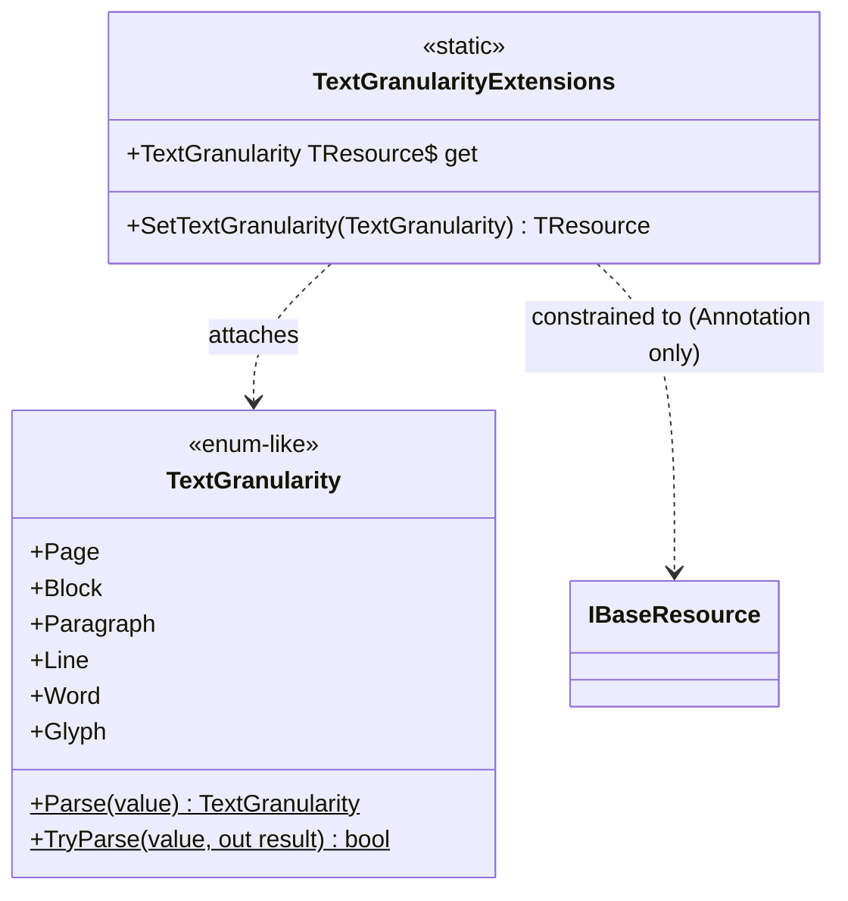

# TextGranularity

## Contents

- [Overview](#overview)
- [Files](#files)
- [Types & Members](#types--members)
- [Diagrams](#diagrams)
- [Package Dependencies](#package-dependencies)
- [See Also](#see-also)

## Overview

This folder is the entire `IIIF.Manifest.Serializer.Net.TextGranularity` NuGet package (flat, no
subfolders) — it implements the IIIF **Text Granularity** extension, a small controlled vocabulary
describing the level of text segmentation available in OCR or other transcribed text content
(`page`/`block`/`paragraph`/`line`/`word`/`glyph`). `TextGranularityExtensions` fluently attaches a
`TextGranularity` value to an Annotation via the core SDK's additional-properties mechanism, so this
package needs no core SDK changes to work. It ships and versions independently of the core
`IIIF.Manifest.Serializer.Net` library and of the navPlace/Georeference extensions.

The 6 vocabulary values (`page`, `block`, `paragraph`, `line`, `word`, `glyph`) were corrected in a
past milestone from a wrong set (`character` instead of `glyph`, and missing `paragraph` entirely) —
`TextGranularity.cs` in this folder holds the current, spec-verified 6 values; see
[../../SDK_VERSIONING_GUIDE.md](../../SDK_VERSIONING_GUIDE.md) Milestone 15 for the correction history.

[↑ Back to top](#contents)

## Files

| File | Primary type(s) | LOC (approx) | Responsibility |
| --- | --- | --- | --- |
| `TextGranularity.cs` | `TextGranularity` | 86 | Enum-like vocabulary of the 6 spec-defined text granularity levels, plus `Parse`/`TryParse`. |
| `TextGranularityExtensions.cs` | `TextGranularityExtensions` | 26 | Fluent `SetTextGranularity`/`TextGranularity` extension members attaching a `TextGranularity` value to an Annotation-typed resource. |

[↑ Back to top](#contents)

## Types & Members

| Type | Kind | Summary | Inherits/Implements | Key Members |
| --- | --- | --- | --- | --- |
| `TextGranularity` | class | Enum-like vocabulary of the 6 text granularity levels | `ValuableItem<TextGranularity>` | `Page`, `Block`, `Paragraph`, `Line`, `Word`, `Glyph`, `Parse`, `TryParse` |
| `TextGranularityExtensions` | static class | Fluent attach-point for `IBaseResource` (Annotation-only) | *(none)* | `SetTextGranularity(TextGranularity)`, `TextGranularity` (get) |

### TextGranularity

- **Kind / Namespace**: class, `IIIF.Manifests.Serializer.Extensions`
- **Inherits/Implements**: `ValuableItem<TextGranularity>`
- **Notable attributes**: `[JsonConverter(typeof(ValuableItemJsonConverter<TextGranularity>))]` and `[TextGranularityExtension("3.0")]` on the class.
- **Constants**: `TextGranularityJName = "textGranularity"`.
- **Key members (static, `readonly`, verified against the spec source — the current, corrected 6 values)**:
  - `Page` — "A page in a paginated document."
  - `Block` — "An arbitrary region of text."
  - `Paragraph` — "A paragraph."
  - `Line` — "A topographic line."
  - `Word` — "A single word."
  - `Glyph` — "A single glyph or symbol."
- **Key methods**:
  - `static TextGranularity Parse(string value) : TextGranularity` — case-insensitive match against the 6 values; throws `ArgumentException` if unrecognized.
  - `static bool TryParse(string value, out TextGranularity? result) : bool` — non-throwing wrapper around `Parse`.
- **Constructors**: `private TextGranularity(string value) : base(value)` — instances are only ever obtained via the 6 static fields or `Parse`/`TryParse`.
- **Usage Recipe**:
  ```csharp
  using IIIF.Manifests.Serializer.Extensions;

  var granularity = TextGranularity.Line;
  var parsed = TextGranularity.Parse("word");
  bool ok = TextGranularity.TryParse("glyph", out var glyph);
  ```

### TextGranularityExtensions

- **Kind / Namespace**: static class, `IIIF.Manifests.Serializer.Extensions`
- **Notable attributes**: `[TextGranularityExtension("3.0")]` on both extension members.
- **Key members**: an `extension<TResource>(TResource resource) where TResource : IBaseResource, IAdditionalPropertiesSupport<TResource>` block exposing:
  - `SetTextGranularity(TextGranularity textGranularity) : TResource` — calls `resource.SetAdditionalProperty(TextGranularity.TextGranularityJName, textGranularity)` **only if `resource.Type == ResourceType.Annotation`**; otherwise throws `InvalidOperationException("The textGranularity property is only valid for resources of type Annotation.")`.
  - `TextGranularity : TextGranularity?` (get) — returns `resource.GetAdditionalProperty<TResource, TextGranularity>(...)` when `resource.Type == ResourceType.Annotation`, otherwise `null`.
- **Usage Recipe**:
  ```csharp
  using IIIF.Manifests.Serializer.Extensions;

  var annotation = new Annotation("https://example.org/iiif/annotation/ocr1", textualBody, canvas.Id)
      .SetTextGranularity(TextGranularity.Line);

  TextGranularity? existing = annotation.TextGranularity;

  // Throws InvalidOperationException — Canvas is not an Annotation:
  // canvas.SetTextGranularity(TextGranularity.Page);
  ```

[↑ Back to top](#contents)

## Diagrams



`TextGranularityExtensions` attaches a `TextGranularity` value to any `IBaseResource` whose
`Type == ResourceType.Annotation`, throwing `InvalidOperationException` for any other resource type.

[↑ Back to top](#contents)

## Package Dependencies

| Package | Version | Description | Links |
| --- | --- | --- | --- |
| Newtonsoft.Json | 13.0.4 | JSON.NET — the core SDK's serialization engine, also used here | [NuGet](https://www.nuget.org/packages/Newtonsoft.Json/13.0.4) |
| IIIF.Manifest.Serializer.Net | (ProjectReference) | Core SDK — supplies `ValuableItem<T>`, `IBaseResource`, `IAdditionalPropertiesSupport<T>`, `ResourceType`, and the `[TextGranularityExtension]` attribute | [../../README.md](../../README.md) |

[↑ Back to top](#contents)

## See Also

- [../README.md](../README.md) — Extensions index (all 3 extension packages)
- [../../README.md](../../README.md) — docs root / core SDK overview
- [../../SDK_VERSIONING_GUIDE.md](../../SDK_VERSIONING_GUIDE.md) — see [Milestone 15: fix Text Granularity enum values](../../SDK_VERSIONING_GUIDE.md#milestone-15-done--fix-text-granularity-enum-values)

[↑ Back to top](#contents)
