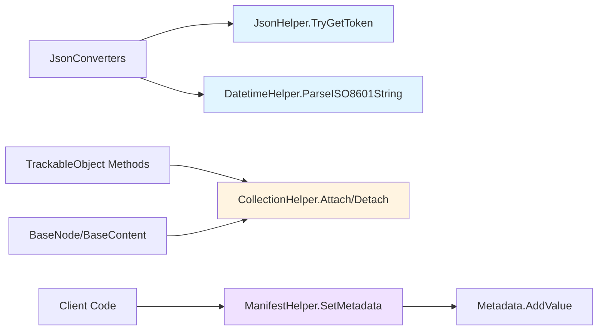
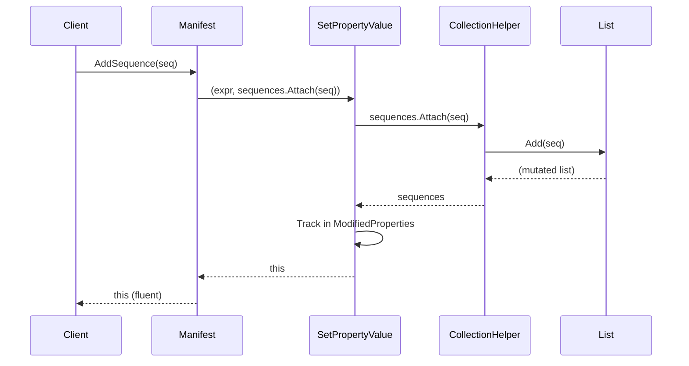
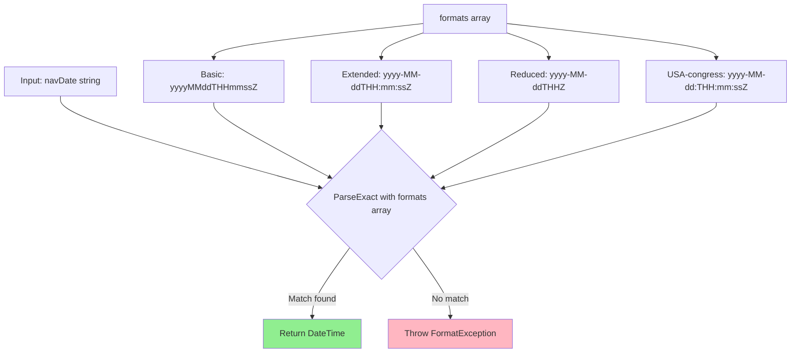

# Helpers

## Contents
- [Overview](#overview)
- [Files](#files)
- [Types & Members](#types--members)
- [CollectionHelper](#collectionhelper)
- [DatetimeHelper](#datetimehelper)
- [JsonHelper](#jsonhelper)
- [ManifestHelper](#manifesthelper)
- [Diagrams](#diagrams)
- [Examples](#examples)
- [See Also](#see-also)

## Overview

The Helpers folder provides utility classes that streamline common operations across the IIIF Presentation API 2.0 serialization library. These helpers encapsulate fluent collection manipulation, ISO-8601 date parsing for navDate fields, safe JSON token access, and manifest-specific metadata operations using Newtonsoft.Json. They support the TrackableObject pattern by enabling chainable modifications and simplifying JsonConverter implementations.

## Files

| File | Primary type(s) | LOC (approx) | Responsibility |
|------|-----------------|--------------|----------------|
| [CollectionHelper.cs](../../src/IIIF.Manifest.Serializer.Net/Helpers/CollectionHelper.cs) | `CollectionHelper` (static) | 40 | Fluent collection attach/detach/enumerate extensions |
| [DatetimeHelper.cs](../../src/IIIF.Manifest.Serializer.Net/Helpers/DatetimeHelper.cs) | `DatetimeHelper` (static) | 38 | ISO-8601 date format parsing for navDate fields |
| [JsonHelper.cs](../../src/IIIF.Manifest.Serializer.Net/Helpers/JsonHelper.cs) | `JsonHelper` (static) | 12 | Safe JToken access via TryGetToken extension |
| [ManifestHelper.cs](../../src/IIIF.Manifest.Serializer.Net/Helpers/ManifestHelper.cs) | `ManifestHelper` (static) | 40 | Manifest-specific metadata set/get operations |

[↑ Back to top](#contents)

## Types & Members

| Type | Kind | Summary | Inherits/Implements | Key Members |
|------|------|---------|---------------------|-------------|
| `CollectionHelper` | Static class | Extension methods for fluent collection manipulation via Attach/Detach/Enumerate; returns the collection to enable method chaining | N/A | `Attach<TCollection, TItem>`, `AttachRange<TCollection, TItem>`, `Detach<TCollection, TItem>`, `Enumerate<TEnumerable, TItem>` |
| `DatetimeHelper` | Static class | Parses ISO-8601 datetime strings in multiple formats (basic, extended, reduced accuracy) for IIIF navDate field support | N/A | `formats` (string[]), `ParseISO8601String(string)` |
| `JsonHelper` | Static class | Safely accesses JToken child properties without throwing exceptions when property is missing | N/A | `TryGetToken(this JToken, string)` |
| `ManifestHelper` | Static class | Manifest-specific operations: sets metadata with language support (merges language-specific values) and retrieves metadata by label | N/A | `SetMetadata(this Manifest, string, string, string)`, `GetMetadata(this Manifest, string)` |

[↑ Back to top](#contents)

## CollectionHelper

Provides fluent extension methods for `ICollection<T>` and `IEnumerable<T>` to support the immutable-property pattern used throughout the library. All Add/Remove operations flow through `SetPropertyValue` to update `ModifiedProperties` tracking.

**Key Members:**
- `Attach<TCollection, TItem>(this TCollection collection, TItem item)` – Adds item and returns collection for chaining
- `AttachRange<TCollection, TItem>(this TCollection collection, IEnumerable<TItem> items)` – Adds multiple items
- `Detach<TCollection, TItem>(this TCollection collection, TItem item)` – Removes item and returns collection
- `Enumerate<TEnumerable, TItem>(this TEnumerable enumerable, Action<TItem> action)` – Executes action for each item and returns enumerable

**Usage:**
```csharp
// Used internally by BaseNode/BaseContent methods
public Manifest AddSequence(Sequence sequence) 
    => SetPropertyValue(a => a.sequences, a => a.Sequences, sequences.Attach(sequence));

// Chaining example
manifest.AddLabel(label1).AddMetadata(metadata1).AddSequence(sequence);
```

[↑ Back to top](#contents)

## DatetimeHelper

Parses ISO-8601 datetime strings using a predefined set of formats matching IIIF navDate requirements. Supports basic (yyyyMMddTHHmmssZ), extended (yyyy-MM-ddTHH:mm:ssZ), and reduced accuracy formats (date-only, hour-only). Includes a USA-congress-specific format (yyyy-MM-dd:THH:mm:ssZ) for compatibility.

**Key Members:**
- `formats` (string[]) – 24 ISO-8601 format strings covering basic, extended, and reduced accuracy
- `ParseISO8601String(string str)` – Parses string using DateTimeStyles.AssumeUniversal and throws FormatException if no match

**Usage:**
```csharp
// Used by ManifestJsonConverter.ReadJson
var navDate = DatetimeHelper.ParseISO8601String("2023-01-15T10:30:00Z");
manifest.SetNavDate(navDate);

// Handles various formats
DatetimeHelper.ParseISO8601String("20230115T103000Z");        // Basic
DatetimeHelper.ParseISO8601String("2023-01-15T10:30:00Z");    // Extended
DatetimeHelper.ParseISO8601String("2023-01-15T10Z");          // Reduced accuracy
```

[↑ Back to top](#contents)

## JsonHelper

Provides a safe alternative to direct JToken property indexing by returning null when a property doesn't exist, avoiding NullReferenceException in JsonConverters. Used extensively in deserialization to check for optional IIIF fields.

**Key Members:**
- `TryGetToken(this JToken element, string propertyName)` – Returns JToken if property exists in JObject, otherwise null

**Usage:**
```csharp
// Used throughout JsonConverters for optional fields
var jThumbnail = element.TryGetToken(BaseNode<TBaseNode>.ThumbnailJName);
if (jThumbnail != null)
    item.SetThumbnail(jThumbnail.ToObject<Thumbnail>());

// Replaces unsafe direct access
// var thumbnail = element["thumbnail"]; // Would throw if missing
```

[↑ Back to top](#contents)

## ManifestHelper

Provides manifest-specific operations for setting and retrieving metadata with language support. `SetMetadata` merges language-specific values instead of replacing wholesale, enabling incremental metadata construction. `GetMetadata` retrieves all values for a given label.

**Key Members:**
- `SetMetadata(this Manifest manifest, string label, string value, string language = null)` – Sets metadata value with optional language; creates new Metadata if label doesn't exist, otherwise adds/updates MetadataValue
- `GetMetadata(this Manifest manifest, string label)` – Returns IReadOnlyCollection<MetadataValue> for given label or null

**Usage:**
```csharp
// Set English and French titles
manifest.SetMetadata("Title", "The Book", "en")
        .SetMetadata("Title", "Le Livre", "fr");

// Add simple metadata without language
manifest.SetMetadata("Date", "1850");

// Retrieve all title values
var titles = manifest.GetMetadata("Title");
// Returns collection with { Value: "The Book", Language: "en" }, { Value: "Le Livre", Language: "fr" }

// Update existing value
manifest.SetMetadata("Title", "The Updated Book", "en"); // Replaces English value
```

[↑ Back to top](#contents)

## Diagrams

### Helper Utilities Architecture



### Collection Helper Flow



### DatetimeHelper Format Matching



[↑ Back to top](#contents)

## Examples

### Building a Manifest with Helper Methods

```csharp
using IIIF.Manifests.Serializer.Nodes;
using IIIF.Manifests.Serializer.Properties;
using IIIF.Manifests.Serializer.Helpers;
using Newtonsoft.Json;

// Create manifest with multilingual metadata
var manifest = new Manifest("https://example.org/manifest", new Label("Book"))
    .SetMetadata("Title", "Collected Works", "en")
    .SetMetadata("Title", "Œuvres complètes", "fr")
    .SetMetadata("Author", "Jane Doe")
    .SetMetadata("Date", "1850")
    .SetNavDate(DatetimeHelper.ParseISO8601String("1850-01-01T00:00:00Z"));

// Add sequence with canvases
var sequence = new Sequence()
    .AddCanvas(new Canvas("https://example.org/canvas/1", new Label("Page 1"), 1000, 800))
    .AddCanvas(new Canvas("https://example.org/canvas/2", new Label("Page 2"), 1000, 800));

manifest.AddSequence(sequence);

// Retrieve metadata
var titles = manifest.GetMetadata("Title");
foreach (var title in titles)
{
    Console.WriteLine($"{title.Language}: {title.Value}");
}
// Output:
// en: Collected Works
// fr: Œuvres complètes

// Serialize
var json = JsonConvert.SerializeObject(manifest, Formatting.Indented);
```

### Custom Date Parsing

```csharp
// Parse various ISO-8601 formats
var date1 = DatetimeHelper.ParseISO8601String("2023-01-15T10:30:00Z");
var date2 = DatetimeHelper.ParseISO8601String("20230115T103000Z");
var date3 = DatetimeHelper.ParseISO8601String("2023-01-15T10Z");

// All produce DateTime with correct timezone handling
manifest.SetNavDate(date1);
```

### Safe JSON Token Access in Custom Converter

```csharp
public override MyType ReadJson(JsonReader reader, Type objectType, 
    MyType existingValue, bool hasExistingValue, JsonSerializer serializer)
{
    var jObject = JObject.Load(reader);
    
    // Safe access - no exception if missing
    var jOptional = jObject.TryGetToken("optionalField");
    if (jOptional != null)
    {
        // Process optional field
    }
    
    // Required field still throws JsonNodeRequiredException if missing
    var jRequired = jObject[RequiredFieldJName];
    if (jRequired == null)
        throw new JsonNodeRequiredException<MyType>(RequiredFieldJName);
    
    return new MyType(jRequired.Value<string>());
}
```

[↑ Back to top](#contents)

## See Also

- [../Nodes/README.md](../Nodes/README.md) – IIIF node types that use these helpers
- [../Shared/Trackable/README.md](../Shared/Trackable/README.md) – TrackableObject pattern with SetPropertyValue
- [../Properties/Metadata/README.md](../Properties/Metadata/README.md) – Metadata types used by ManifestHelper
- [IIIF Presentation API 2.0](https://iiif.io/api/presentation/2.0/) – Official specification

[↑ Back to top](#contents)
