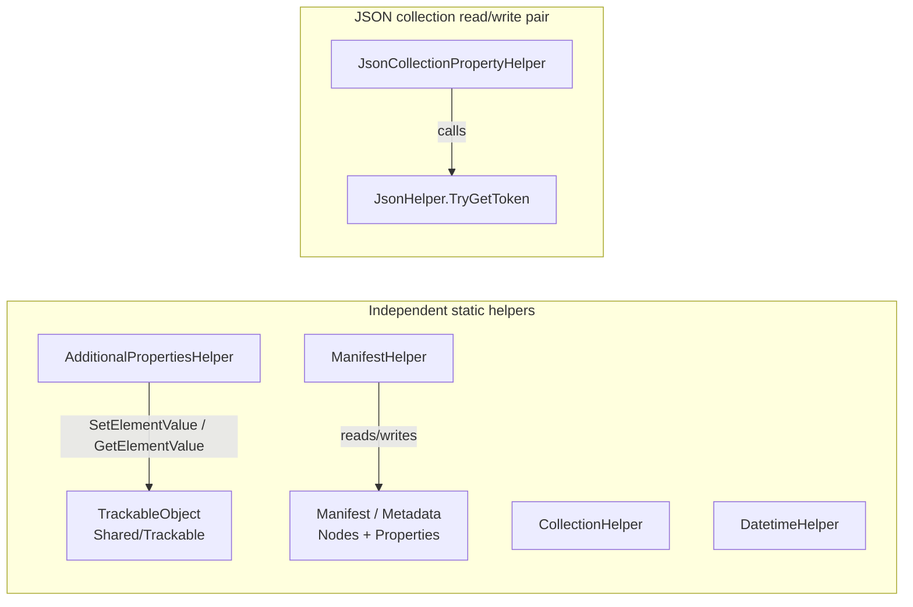

# Helpers

## Contents

- [Overview](#overview)
- [Files](#files)
- [Types & Members](#types--members)
  - [AdditionalPropertiesHelper](#additionalpropertieshelper)
  - [CollectionHelper](#collectionhelper)
  - [DatetimeHelper](#datetimehelper)
  - [JsonHelper](#jsonhelper)
  - [JsonCollectionPropertyHelper](#jsoncollectionpropertyhelper)
  - [ManifestHelper](#manifesthelper)
- [Diagrams](#diagrams)
- [Package Dependencies](#package-dependencies)
- [See Also](#see-also)

## Overview

`IIIF.Manifests.Serializer.Helpers` is a collection of independent `static` utility classes providing general-purpose extension methods used across the SDK: change-tracked "additional property" storage, immutable/fluent collection manipulation, lenient ISO-8601 date parsing, single-vs-array JSON collection property read/write support, and small `Manifest`-specific metadata convenience methods. Most of these helpers exist to eliminate repetitive boilerplate that would otherwise be duplicated across the `Shared/` trackable-object infrastructure and the `SystemTextJson`/Newtonsoft `JsonConverter` implementations. Several files use C#'s newer `extension` member-declaration syntax (extension blocks) rather than classic `this`-parameter extension methods, so read each type's members carefully — the syntax differs but the calling convention from consumer code is the same.

## Files

| File | Primary type(s) | LOC (approx) | Responsibility |
| --- | --- | --- | --- |
| `AdditionalPropertiesHelper.cs` | `AdditionalPropertiesHelper` | 44 | Extension methods for storing/retrieving unhandled ("additional") properties on trackable objects |
| `CollectionHelper.cs` | `CollectionHelper` | 83 | Immutable add/remove helpers plus fluent `Attach`/`Detach`/`Enumerate` collection extensions |
| `DatetimeHelper.cs` | `DatetimeHelper` | 45 | Lenient multi-format ISO-8601 date/time string parsing (e.g. for IIIF `navDate`) |
| `JsonCollectionPropertyHelper.cs` | `JsonCollectionPropertyHelper` | 108 | Reads/writes JSON properties that may be a single value or an array, for use inside `JsonConverter`s |
| `JsonHelper.cs` | `JsonHelper` | 12 | Single extension method for safely fetching a named token from a `JObject` |
| `ManifestHelper.cs` | `ManifestHelper` | 42 | Convenience extension methods for getting/setting `Manifest` metadata by label and language |

[↑ Back to top](#contents)

## Types & Members

| Type | Kind | Summary | Inherits/Implements | Key Members |
| --- | --- | --- | --- | --- |
| `AdditionalPropertiesHelper` | `static class` | Extension methods on any `IAdditionalPropertiesSupport<T>` implementer for storing/retrieving unhandled JSON properties | none (static) | `SetAdditionalProperty<TValue>`, `GetAdditionalProperty<TValue>` |
| `CollectionHelper` | `static class` | Immutable-style `With`/`Without` for `IReadOnlyCollection<T>`, plus fluent mutation/enumeration extensions | none (static) | `With`, `Without`, `Attach`, `AttachRange`, `Detach`, `Enumerate` (x2 overloads) |
| `DatetimeHelper` | `static class` | Lenient ISO-8601 date/time parsing against a fixed list of accepted formats | none (static) | `formats` (field), `ParseISO8601String(string)` |
| `JsonHelper` | `static class` | Single safe-token-lookup extension for `JToken`/`JObject` | none (static) | `TryGetToken(this JToken, string)` |
| `JsonCollectionPropertyHelper` | `static class` | Read/write helpers for JSON properties shaped as either a single value or an array | none (static); depends on `JsonHelper.TryGetToken` | `ReadCollectionProperty<TNode,TProperty>`, `WriteCollectionProperty<TProperty>`, `WriteCollectionPropertyAsArray<TProperty>` |
| `ManifestHelper` | `static class` | Extension methods on `Manifest` for label/language-based metadata get/set | none (static) | `SetMetadata(this Manifest, ...)`, `GetMetadata(this Manifest, ...)` |

### AdditionalPropertiesHelper

- **Kind / Namespace**: `static class` — `IIIF.Manifests.Serializer.Helpers`
- **Inherits/Implements**: none — static class; operates via a C# `extension<TAdditionalPropertiesSupport>(TAdditionalPropertiesSupport target)` block constrained to `where TAdditionalPropertiesSupport : IAdditionalPropertiesSupport<TAdditionalPropertiesSupport>`.
- **Relationship to `Shared/Trackable`**: this helper is the public-surface companion to the change-tracking infrastructure in `Shared/Trackable` — it calls `target.SetElementValue(value, propertyName)` / `target.GetElementValue<TValue>(propertyName)`, which are members implemented by `TrackableObject` (the base for trackable IIIF nodes) via `IAdditionalPropertiesSupport<T>`. In other words, this is how "unknown"/unmapped JSON properties encountered during deserialization get stored on and retrieved from a `TrackableObject`-derived instance with `isAdditional = true` markers in its `ElementDescriptors`.
- **Key methods** (both stateless, thread-safety follows whatever `target` provides — no shared/static mutable state in the helper itself):
  - `TAdditionalPropertiesSupport SetAdditionalProperty<TValue>(string propertyName, TValue? value)` — stores a value into `target`'s element descriptors marked as additional; returns `target` for fluent chaining.
  - `TValue? GetAdditionalProperty<TValue>(string propertyName)` — retrieves a previously stored additional value, or `default` if not found/not marked additional.
- **Known caveat (from source comment)**: values that are enumerable get wrapped in a `BindingList` internally and subscribed to `ListChanged`, but unsubscription on element removal is not fully implemented (handler references aren't retained) — a potential memory-leak risk in long-running processes with heavy additional-property churn.

**Usage Recipe**

```csharp
// Assume SomeNode : TrackableObject, IAdditionalPropertiesSupport<SomeNode>
someNode.SetAdditionalProperty("customField", "customValue");
var value = someNode.GetAdditionalProperty<string>("customField");
```

### CollectionHelper

- **Kind / Namespace**: `static class` — `IIIF.Manifests.Serializer.Helpers`
- **Inherits/Implements**: none — static class.
- **Key methods** (all stateless; the `With`/`Without` members build a brand-new `HashSet<TItem>` each call rather than mutating the input, so they are effectively immutable/copy-on-write; `Attach`/`AttachRange`/`Detach`/`Enumerate` mutate the passed-in collection in place and return it for chaining):
  - `IReadOnlyCollection<TItem> With(TItem item)` — extension on `IReadOnlyCollection<TItem>?` (via an `extension<TItem>` block); returns a **new** collection (backed by `HashSet<TItem>`) containing the original items plus `item`. Tolerates a `null` source collection.
  - `IReadOnlyCollection<TItem> Without(TItem item)` — same block; returns a new `HashSet<TItem>`-backed collection with `item` removed. Tolerates a `null` source collection.
  - `static TCollection Attach<TCollection, TItem>(this TCollection collection, TItem item) where TCollection : ICollection<TItem>` — adds `item` to `collection` in place, returns `collection` for fluent chaining.
  - `static TCollection AttachRange<TCollection, TItem>(this TCollection collection, IEnumerable<TItem> items) where TCollection : ICollection<TItem>` — adds every item in `items`, returns `collection`.
  - `static TCollection Detach<TCollection, TItem>(this TCollection collection, TItem item) where TCollection : ICollection<TItem>` — removes `item` from `collection`, returns `collection`.
  - `static TEnumerable Enumerate<TEnumerable, TItem>(this TEnumerable enumerable, Action<TItem> action) where TEnumerable : IEnumerable<TItem>` — invokes `action` for every item, returns `enumerable` for fluent chaining (a fluent "forEach").
  - `static IEnumerable<TItem> Enumerate<TItem>(this IEnumerable<TItem> enumerable, Action<TItem> action)` — convenience overload that forwards to the generic `Enumerate<TEnumerable, TItem>` for plain `IEnumerable<TItem>` call sites.

**Usage Recipe**

```csharp
IReadOnlyCollection<string> tags = originalTags.With("newTag").Without("obsoleteTag");

var list = new List<string> { "a" };
list.Attach("b").AttachRange(new[] { "c", "d" }).Detach("a");

items.Enumerate(item => Console.WriteLine(item));
```

### DatetimeHelper

- **Kind / Namespace**: `static class` — `IIIF.Manifests.Serializer.Helpers`
- **Inherits/Implements**: none — static class.
- **Key members** (stateless; `formats` is a read-only static array, safe to share across threads):
  - `static readonly string[] formats` — an ordered list of accepted date/time patterns, covering basic and extended ISO-8601 forms with varying precision (full timestamp with offset down to year-only), plus a non-standard `"yyyy-MM-dd:THH:mm:ssZ"` variant labeled "USA-congress" in the source.
  - `static DateTime ParseISO8601String(string str)` — parses `str` against `formats` using `DateTime.ParseExact(..., CultureInfo.InvariantCulture, DateTimeStyles.AssumeUniversal)`; throws `FormatException` if `str` matches none of the patterns. Used for parsing IIIF date-valued properties such as `navDate`.

**Usage Recipe**

```csharp
DateTime navDate = DatetimeHelper.ParseISO8601String("2023-05-01T00:00:00Z");
DateTime yearOnly = DatetimeHelper.ParseISO8601String("2023");
```

### JsonHelper

- **Kind / Namespace**: `static class` — `IIIF.Manifests.Serializer.Helpers`
- **Inherits/Implements**: none — static class.
- **Key methods** (stateless):
  - `static JToken? TryGetToken(this JToken element, string propertyName)` — returns the token at `propertyName` if `element` is a `JObject` containing that property, otherwise `null`. A safe alternative to indexer access that avoids exceptions/null-reference issues when `element` isn't an object or the property is absent.
- **Collaborators**: this method is called directly by `JsonCollectionPropertyHelper.ReadCollectionProperty` (see below) — it is the smallest building block in this folder and the one other helper in this folder depends on it.

**Usage Recipe**

```csharp
JToken token = JToken.Parse("{\"label\": \"hello\"}");
JToken? label = token.TryGetToken("label"); // non-null
JToken? missing = token.TryGetToken("missing"); // null
```

### JsonCollectionPropertyHelper

- **Kind / Namespace**: `static class` — `IIIF.Manifests.Serializer.Helpers`
- **Inherits/Implements**: none — static class. Depends on `JsonHelper.TryGetToken`.
- **Purpose**: eliminates repetitive `JsonConverter` code for IIIF properties that the spec allows to appear as either a single value or a JSON array (a common IIIF Presentation API pattern) — intended for use from custom `Newtonsoft.Json` `JsonConverter` implementations elsewhere in the SDK (e.g. under `SystemTextJson`/`Shared`).
- **Key methods** (all stateless; take the `JsonWriter`/`JsonSerializer`/`JToken` as parameters rather than holding any instance state):
  - `static TNode ReadCollectionProperty<TNode, TProperty>(JToken element, TNode node, string propertyName, Action<TNode, TProperty> addMethod)` — looks up `propertyName` on `element` via `JsonHelper.TryGetToken`; if the token is a `JArray`, deserializes each element as `TProperty` and calls `addMethod(node, item)` for each; if it's a single value, deserializes once and calls `addMethod` once; returns `node` either way (no-op if the property is absent or `null` after conversion).
  - `static void WriteCollectionProperty<TProperty>(JsonWriter writer, JsonSerializer serializer, string propertyName, IReadOnlyCollection<TProperty> collection, bool writeSingleAsArray = false)` — writes nothing if `collection` is empty; otherwise writes the property name, then serializes the single item directly (no array wrapper) if `collection.Count == 1` and `writeSingleAsArray` is `false`, else wraps all items in a JSON array.
  - `static void WriteCollectionPropertyAsArray<TProperty>(JsonWriter writer, JsonSerializer serializer, string propertyName, IReadOnlyCollection<TProperty> collection)` — convenience wrapper that calls `WriteCollectionProperty` with `writeSingleAsArray: true`, i.e. always emits an array (still emits nothing for an empty collection).

**Usage Recipe**

```csharp
// Inside a custom JsonConverter.ReadJson:
node = JsonCollectionPropertyHelper.ReadCollectionProperty<MyNode, Metadata>(
    jObject, node, "metadata", (n, item) => n.AddMetadata(item));

// Inside a custom JsonConverter.WriteJson:
JsonCollectionPropertyHelper.WriteCollectionProperty(writer, serializer, "items", node.Items);
JsonCollectionPropertyHelper.WriteCollectionPropertyAsArray(writer, serializer, "behavior", node.Behaviors);
```

### ManifestHelper

- **Kind / Namespace**: `static class` — `IIIF.Manifests.Serializer.Helpers`
- **Inherits/Implements**: none — static class. Extension methods target `Manifest` (`IIIF.Manifests.Serializer.Nodes`) and operate on `Metadata`/`MetadataValue` (`IIIF.Manifests.Serializer.Properties.MetadataProperty[.MetadataValue]`).
- **Key methods** (stateless; both mutate the passed-in `Manifest`'s metadata collection):
  - `static Manifest SetMetadata(this Manifest manifest, string label, string value, string? language = null)` — finds an existing `Metadata` entry matching `label`; if found and `language` is given, updates the matching-language `MetadataValue` (`SetValue`) or adds a new language variant (`AddValue`) if none matches; if found and `language` is `null`, resets the whole value (`ResetValue`); if no matching `Metadata` entry exists, creates and adds a new `Metadata(label, value[, language])`. Returns `manifest` for fluent chaining.
  - `static IReadOnlyCollection<MetadataValue>? GetMetadata(this Manifest manifest, string label)` — returns the `Value` collection of the first `Metadata` entry whose `Label` equals `label`, or `null` if none match.

**Usage Recipe**

```csharp
manifest.SetMetadata("Author", "Jane Doe")
        .SetMetadata("Author", "Jane Doe (FR)", language: "fr");

IReadOnlyCollection<MetadataValue>? authorValues = manifest.GetMetadata("Author");
```

[↑ Back to top](#contents)

## Diagrams

Most helpers in this folder are independent static classes with no calls into one another — `AdditionalPropertiesHelper`, `CollectionHelper`, `DatetimeHelper`, and `ManifestHelper` have no structural relationship to each other or to the other helpers. The one real collaboration is `JsonCollectionPropertyHelper.ReadCollectionProperty`, which calls `JsonHelper.TryGetToken` to safely look up the JSON property before branching on array-vs-single-value shape.


```mermaid
flowchart LR
    subgraph Independent static helpers
        A[AdditionalPropertiesHelper] -->|SetElementValue / GetElementValue| T[TrackableObject<br/>Shared/Trackable]
        C[CollectionHelper]
        D[DatetimeHelper]
        M[ManifestHelper] -->|reads/writes| Mf[Manifest / Metadata<br/>Nodes + Properties]
    end

    subgraph JSON collection read/write pair
        J[JsonHelper.TryGetToken]
        JCP[JsonCollectionPropertyHelper] -->|calls| J
    end
```

[↑ Back to top](#contents)

## Package Dependencies

| Package | Version | Description | Links |
| --- | --- | --- | --- |
| Newtonsoft.Json | 13.0.4 | JSON.NET — this SDK's serialization engine (custom JsonConverters, attribute-driven read/write) | [NuGet](https://www.nuget.org/packages/Newtonsoft.Json/13.0.4) |

[↑ Back to top](#contents)

## See Also

- [`../README.md`](../README.md) — top-level SDK documentation.
- [`../SDK_VERSIONING_GUIDE.md`](../SDK_VERSIONING_GUIDE.md) — SDK versioning conventions.

[↑ Back to top](#contents)
