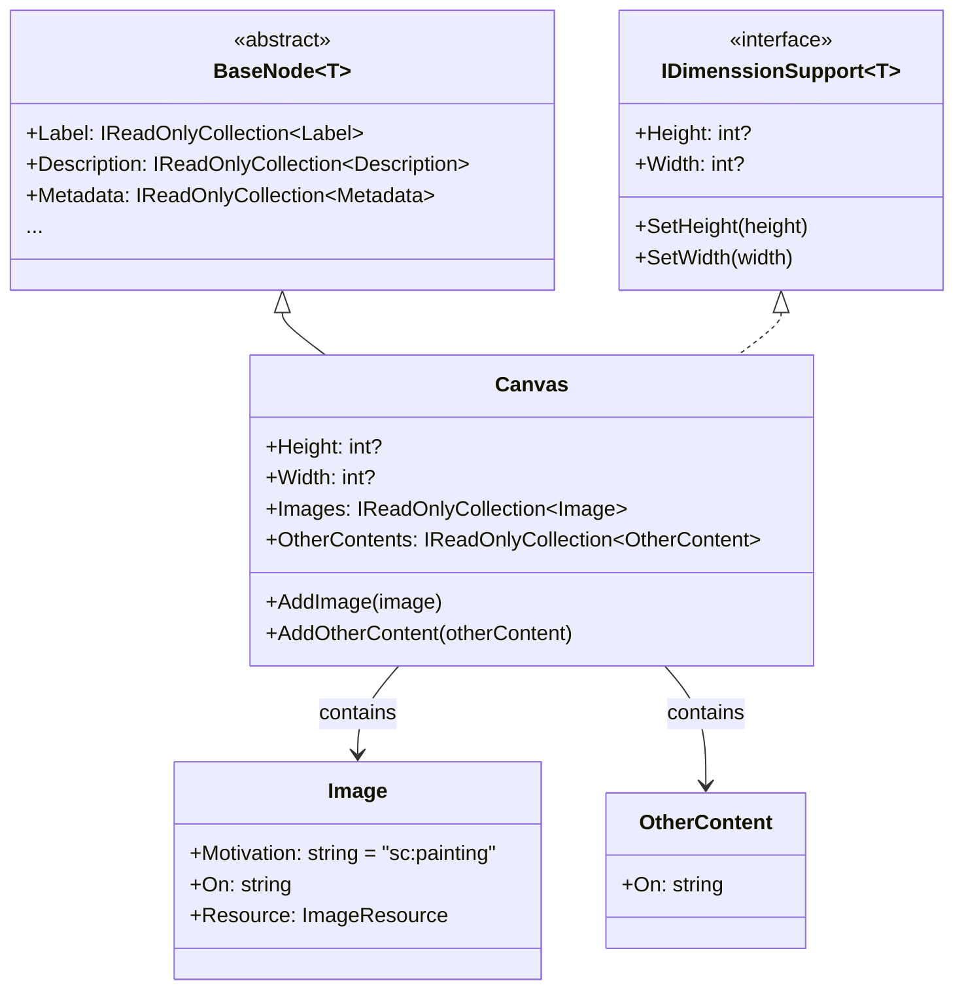
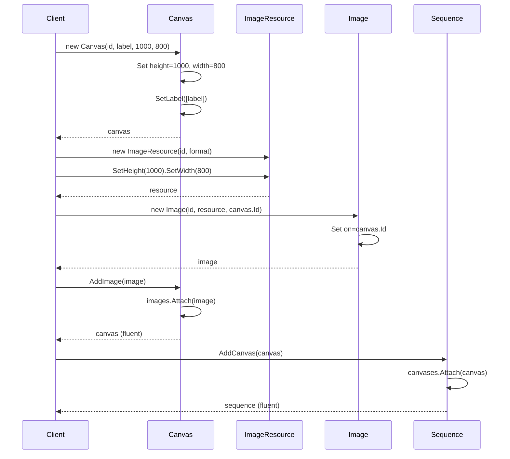

# Canvas

## Contents
- [Overview](#overview)
- [Files](#files)
- [Types & Members](#types--members)
- [Canvas](#canvas-1)
- [CanvasJsonConverter](#canvasjsonconverter)
- [Diagrams](#diagrams)
- [Examples](#examples)
- [See Also](#see-also)

## Overview

The Canvas folder contains the IIIF Presentation API 2.0 paintable surface type that serves as the target for content annotations. Canvas represents a single view (page, image, folio) with required dimensions (height/width), a collection of painting annotations (images) that render visual content, and optional otherContent annotations for non-painting data (transcriptions, commentary). CanvasJsonConverter enforces required label/height/width fields, parses images and otherContent arrays, and validates that at least one image exists using Newtonsoft.Json. Canvas inherits BaseNode for full metadata support and implements IDimenssionSupport for dimension handling.

## Files

| File | Primary type(s) | LOC (approx) | Responsibility |
|------|-----------------|--------------|----------------|
| [Canvas.cs](../../../src/IIIF.Manifest.Serializer.Net/Nodes/Canvas/Canvas.cs) | `Canvas` | 42 | Paintable surface with dimensions, images (painting), otherContent (non-painting) |
| [CanvasJsonConverter.cs](../../../src/IIIF.Manifest.Serializer.Net/Nodes/Canvas/CanvasJsonConverter.cs) | `CanvasJsonConverter` | 110 | Validates label/height/width required, enforces at least one image, parses annotations |

[↑ Back to top](#contents)

## Types & Members

| Type | Kind | Summary | Inherits/Implements | Key Members |
|------|------|---------|---------------------|-------------|
| `Canvas` | Class | Paintable surface with required dimensions; holds images (painting annotations) and otherContent (non-painting annotations); target for annotation "on" fields | `BaseNode<Canvas>`, `IDimenssionSupport<Canvas>` | `Height`, `Width`, `Images`, `OtherContents`, `AddImage`, `AddOtherContent`, `SetHeight`, `SetWidth` |
| `CanvasJsonConverter` | Class | Custom JsonConverter that enforces label/height/width required, validates at least one image exists, parses images and otherContent | `BaseNodeJsonConverter<Canvas>` | `CreateInstance`, `EnrichReadJson`, `EnrichMoreWriteJson` |

[↑ Back to top](#contents)

## Canvas

Paintable surface representing a single view (page, image, folio). Must have label, height, and width. Contains images (painting annotations linking ImageResources) and optional otherContent (non-painting annotations like transcriptions). Canvas is referenced by Image/EmbeddedContent/Segment annotations via the "on" field.

### Properties

- `Height` (int?) – Required pixel height; immutable after construction
- `Width` (int?) – Required pixel width; immutable after construction
- `Images` (IReadOnlyCollection<Image>) – Painting annotations linking image resources; REQUIRED (must have at least one)
- `OtherContents` (IReadOnlyCollection<OtherContent>) – Non-painting annotations (transcriptions, commentary, external annotation lists)

### Constants

- `ImagesJName` = "images"
- `OtherContentsJName` = "otherContent"
- `HeightJName` = "height" (from Constants)
- `WidthJName` = "width" (from Constants)

### Inherited from BaseNode

- Label, Description, Metadata, Attribution, Logo, Thumbnail, License, ViewingHint, Rendering, SeeAlso, Within, Related

### Inherited from BaseItem

- Context, Id, Type ("sc:Canvas"), Service

### Constructor

- `Canvas(string id, Label label, int height, int width)` – Creates canvas with required id, label, and dimensions; calls base with type "sc:Canvas"

### Methods

- `AddImage(Image image)` – Adds painting annotation via SetPropertyValue + Attach
- `AddOtherContent(OtherContent otherContent)` – Adds non-painting content via SetPropertyValue + Attach
- `SetHeight(int height)` – Sets height via SetPropertyValue (used during deserialization)
- `SetWidth(int width)` – Sets width via SetPropertyValue (used during deserialization)

### Usage

```csharp
// Create canvas with required fields
var canvas = new Canvas(
    "https://example.org/canvas/1",
    new Label("Page 1"),
    1000,  // height in pixels
    800    // width in pixels
);

// Create image resource matching canvas dimensions
var resource = new ImageResource("https://example.org/image.jpg", "image/jpeg")
    .SetHeight(1000)
    .SetWidth(800);

// Create painting annotation linking resource to canvas
var image = new Image(
    "https://example.org/annotation/1",
    resource,
    canvas.Id  // "on" field references this canvas
);

canvas.AddImage(image);

// Optional: add metadata
canvas.AddDescription(new Description("First page of manuscript"))
      .SetThumbnail(new Thumbnail("https://example.org/thumb1.jpg"));

// Add to sequence
sequence.AddCanvas(canvas);
```

[↑ Back to top](#contents)

## CanvasJsonConverter

Custom JsonConverter for Canvas type. Enforces that label, height, width are present, validates that at least one image exists, parses images and otherContent arrays, and delegates to BaseNodeJsonConverter for metadata fields.

### Methods

- `CreateInstance(JToken element, ...)` – Extracts @id, label, height, width from element; throws JsonNodeRequiredException if any required field missing; constructs Canvas
- `EnrichReadJson(Canvas item, JToken element, ...)` – Calls base.EnrichReadJson (BaseNode fields), parses images (required, array or single), parses otherContent (optional, array or single), validates at least one image
- `EnrichMoreWriteJson(JsonWriter writer, Canvas value, JsonSerializer serializer)` – Calls base.EnrichMoreWriteJson (BaseNode fields), writes height/width, writes images (always array), writes otherContent (always array if present)

### Validation Rules

1. @id is required (inherited from BaseItemJsonConverter)
2. label is required (at least one label must exist)
3. height is required (positive integer)
4. width is required (positive integer)
5. At least one image is required (enforced during deserialization)
6. otherContent is optional

### Usage

```csharp
// Deserialization
var json = @"{
  ""@id"": ""https://example.org/canvas/1"",
  ""@type"": ""sc:Canvas"",
  ""label"": ""Page 1"",
  ""height"": 1000,
  ""width"": 800,
  ""images"": [{...}],
  ""otherContent"": [{...}]
}";

var canvas = JsonConvert.DeserializeObject<Canvas>(json);
Console.WriteLine(canvas.Height);           // 1000
Console.WriteLine(canvas.Width);            // 800
Console.WriteLine(canvas.Images.Count);     // 1
Console.WriteLine(canvas.OtherContents.Count); // 1

// Serialization
var json2 = JsonConvert.SerializeObject(canvas, Formatting.Indented);
```

[↑ Back to top](#contents)

## Diagrams

### Canvas Structure

```mermaid
graph TD
    A[Canvas<br/>@id, label<br/>1000x800] --> B[Images painting]
    A --> C[OtherContent optional]
    A --> D[Metadata]
    
    B --> E[Image 1<br/>motivation: painting<br/>on: canvas@id]
    B --> F[Image 2<br/>motivation: painting<br/>on: canvas@id]
    
    E --> G[ImageResource<br/>@id, format<br/>1000x800]
    F --> H[ImageResource<br/>@id, format<br/>1000x800]
    
    G --> I[Service<br/>IIIF Image API]
    
    C --> J[OtherContent<br/>annotation list]
    
    style A fill:#f0e1ff
    style B fill:#e8f5e8
    style C fill:#fff4e1
```

### Canvas Type Hierarchy



### Canvas Construction Flow



[↑ Back to top](#contents)

## Examples

### Simple Canvas with Single Image

```csharp
using IIIF.Manifests.Serializer.Nodes;
using IIIF.Manifests.Serializer.Properties;

// Create canvas
var canvas = new Canvas(
    "https://example.org/canvas/1",
    new Label("Page 1"),
    1000,  // height
    800    // width
);

// Create image resource matching dimensions
var resource = new ImageResource("https://example.org/image.jpg", "image/jpeg")
    .SetHeight(1000)
    .SetWidth(800);

// Create painting annotation
var image = new Image(
    "https://example.org/annotation/1",
    resource,
    canvas.Id
);

// Add image to canvas
canvas.AddImage(image);

// Add to sequence
var sequence = new Sequence().AddCanvas(canvas);
var manifest = new Manifest("https://example.org/manifest", new Label("Book"))
    .AddSequence(sequence);
```

### Canvas with Multiple Images (Recto/Verso)

```csharp
// Canvas for folio showing both sides
var canvas = new Canvas(
    "https://example.org/canvas/folio1",
    new Label("Folio 1 Recto and Verso"),
    2000,  // Combined height
    1600   // Width
);

// Recto image
var rectoResource = new ImageResource("https://example.org/folio1-recto.jpg", "image/jpeg")
    .SetHeight(1000)
    .SetWidth(1600);

var rectoImage = new Image(
    "https://example.org/anno/folio1-recto",
    rectoResource,
    canvas.Id
);

// Verso image
var versoResource = new ImageResource("https://example.org/folio1-verso.jpg", "image/jpeg")
    .SetHeight(1000)
    .SetWidth(1600);

var versoImage = new Image(
    "https://example.org/anno/folio1-verso",
    versoResource,
    canvas.Id
);

// Add both images to canvas
canvas.AddImage(rectoImage)
      .AddImage(versoImage);
```

### Canvas with Deep-Zoom Support

```csharp
// Create canvas
var canvas = new Canvas(
    "https://example.org/canvas/1",
    new Label("High Resolution Page"),
    4000,  // Very high resolution
    3000
);

// Create IIIF Image Service for deep-zoom
var service = new Service(
    "http://iiif.io/api/image/2/context.json",
    "https://example.org/iiif/image1",
    "http://iiif.io/api/image/2/level1.json"
)
.SetHeight(4000)
.SetWidth(3000);

// Add tile specifications
service.AddTile(new Tile(512, new[] { 1, 2, 4, 8, 16 }));

// Create resource with service
var resource = new ImageResource("https://example.org/iiif/image1/full/full/0/default.jpg", "image/jpeg")
    .SetHeight(4000)
    .SetWidth(3000)
    .SetService(service);

var image = new Image(
    "https://example.org/annotation/1",
    resource,
    canvas.Id
);

canvas.AddImage(image);

// Result: viewer can zoom deeply into high-resolution image
```

### Canvas with OtherContent Annotations

```csharp
// Create canvas
var canvas = new Canvas(
    "https://example.org/canvas/1",
    new Label("Annotated Page"),
    1000,
    800
);

// Add primary image
var resource = new ImageResource("https://example.org/image.jpg", "image/jpeg")
    .SetHeight(1000)
    .SetWidth(800);

var image = new Image("https://example.org/anno/image", resource, canvas.Id);
canvas.AddImage(image);

// Add otherContent linking to external annotation list
// (transcriptions, commentary, tags, etc.)
var otherContent = new OtherContent("https://example.org/annotations/list1");
canvas.AddOtherContent(otherContent);

// Result JSON includes:
// "images": [{...}],
// "otherContent": [
//   {
//     "@id": "https://example.org/annotations/list1",
//     "@type": "sc:AnnotationList"
//   }
// ]
```

### Canvas with Rich Metadata

```csharp
// Canvas can have detailed metadata
var canvas = new Canvas(
    "https://example.org/canvas/titlepage",
    new Label("Title Page")
)
.SetHeight(1200)
.SetWidth(900);

// Add descriptive metadata
canvas.AddDescription(new Description("Ornate title page with publisher's mark"))
      .SetThumbnail(new Thumbnail("https://example.org/thumb-titlepage.jpg"))
      .AddMetadata(new Metadata("Illuminator", "Unknown"))
      .AddMetadata(new Metadata("Date", "ca. 1450"));

// Add image
var resource = new ImageResource("https://example.org/titlepage.jpg", "image/jpeg")
    .SetHeight(1200)
    .SetWidth(900);

var image = new Image("https://example.org/anno/titlepage", resource, canvas.Id);
canvas.AddImage(image);
```

[↑ Back to top](#contents)

## See Also

- [../Content/Image/README.md](../Content/Image/README.md) – Image painting annotations
- [../Content/OtherContent/README.md](../Content/OtherContent/README.md) – Non-painting annotations
- [../Sequence/README.md](../Sequence/README.md) – Sequence holds canvases
- [../../Shared/BaseNode/README.md](../../Shared/BaseNode/README.md) – Inherited metadata capabilities
- [../../Properties/Interfaces/README.md](../../Properties/Interfaces/README.md) – IDimenssionSupport interface
- [../README.md](../README.md) – Parent Nodes folder overview
- [IIIF Presentation API 2.0 - Canvas](https://iiif.io/api/presentation/2.0/#canvas) – Official specification

[↑ Back to top](#contents)
