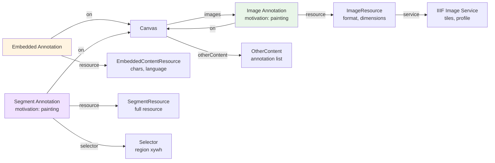

# Content

## Contents
- [Overview](#overview)
- [Subdirectories](#subdirectories)
- [Types & Members](#types--members)
- [Diagrams](#diagrams)
- [Examples](#examples)
- [See Also](#see-also)

## Overview

The Content folder contains IIIF Presentation API 2.0 annotation types that link resources to canvas regions. Image (painting annotations with ImageResource), EmbeddedContent (text annotations with EmbeddedContentResource), Segment (region-specific annotations with SegmentResource and optional Selector), and OtherContent (links to external annotation lists) inherit from BaseContent to provide format, dimensions, and metadata. All content types have an "on" field referencing the target canvas, motivation indicating purpose (sc:painting for images), and a resource field carrying the actual content. JsonConverters enforce required resource/on fields and write motivation/on/resource in order using Newtonsoft.Json.

## Subdirectories

| Directory | Purpose |
|-----------|---------|
| [./Image/README.md](./Image/README.md) | Image painting annotations linking ImageResource to canvas |
| [./Image/Resource/README.md](./Image/Resource/README.md) | ImageResource with format, dimensions, service |
| [./Embedded/README.md](./Embedded/README.md) | Embedded text content annotations |
| [./Embedded/Resource/README.md](./Embedded/Resource/README.md) | EmbeddedContentResource with chars and language |
| [./Segment/README.md](./Segment/README.md) | Region-specific annotations with selector support |
| [./Segment/Resource/README.md](./Segment/Resource/README.md) | SegmentResource with optional full resource reference |
| [./Segment/Selector/README.md](./Segment/Selector/README.md) | Selector for region specifications (xywh, time, etc.) |
| [./OtherContent/README.md](./OtherContent/README.md) | Links to external annotation lists |

## Types & Members

| Type | Kind | Summary | Inherits/Implements | Key Members |
|------|------|---------|---------------------|-------------|
| `Image` | Class | Painting annotation linking ImageResource to canvas; motivation="sc:painting"; primary visual content | `BaseContent<Image, ImageResource>` | `Motivation`, `On`, `Resource` |
| `ImageResource` | Class | Image resource with @id, format, dimensions, optional IIIF Image service | `BaseResource<ImageResource>`, `IDimenssionSupport` | `Height`, `Width`, `Format`, `Service` |
| `EmbeddedContent` | Class | Annotation with embedded text content; for transcriptions, captions | `BaseContent<EmbeddedContent, EmbeddedContentResource>` | `On`, `Resource` |
| `EmbeddedContentResource` | Class | Embedded text with chars and language; type="cnt:ContentAsText" | `BaseResource<EmbeddedContentResource>` | `Chars`, `Language` |
| `Segment` | Class | Region-specific annotation with optional selector; motivation="sc:painting" | `BaseContent<Segment, SegmentResource>` | `Motivation`, `On`, `Selector`, `Resource` |
| `SegmentResource` | Class | Resource for segment with optional full resource reference | `BaseResource<SegmentResource>` | `Full` |
| `Selector` | Class | Spatial/temporal region selector; supports region (xywh) | `BaseItem<Selector>` | `Region`, `SetRegion` |
| `OtherContent` | Class | Link to external annotation list; type="sc:AnnotationList" | `BaseContent<OtherContent>` | (no additional members) |

[↑ Back to top](#contents)

## Diagrams

### Content Annotation Types



### Content Type Hierarchy

```mermaid
classDiagram
    class BaseContent~T~ {
        <<abstract>>
        +Format: string
        +Height: int?
        +Width: int?
    }
    
    class BaseContentWithResource~T,TRes~ {
        <<abstract>>
        +Resource: TResource
    }
    
    class Image {
        +Motivation: string = "sc:painting"
        +On: string
        +Resource: ImageResource
    }
    
    class EmbeddedContent {
        +On: string
        +Resource: EmbeddedContentResource
    }
    
    class Segment {
        +Motivation: string = "sc:painting"
        +On: string
        +Selector: Selector
        +Resource: SegmentResource
        +SetSelector(selector)
    }
    
    class OtherContent {
        (link to annotation list)
    }
    
    class BaseResource~T~ {
        +Format: string
    }
    
    class ImageResource {
        +Height: int?
        +Width: int?
        +Service: Service
    }
    
    class EmbeddedContentResource {
        +Chars: string
        +Language: string
    }
    
    class SegmentResource {
        +Full: BaseResource
    }
    
    BaseContent~T~ <|-- BaseContentWithResource~T,TRes~
    BaseContent~T~ <|-- OtherContent
    BaseContentWithResource~T,TRes~ <|-- Image
    BaseContentWithResource~T,TRes~ <|-- EmbeddedContent
    BaseContentWithResource~T,TRes~ <|-- Segment
    
    BaseResource~T~ <|-- ImageResource
    BaseResource~T~ <|-- EmbeddedContentResource
    BaseResource~T~ <|-- SegmentResource
    
    Image --> ImageResource
    EmbeddedContent --> EmbeddedContentResource
    Segment --> SegmentResource
```

[↑ Back to top](#contents)

## Examples

### Image Painting Annotation

```csharp
// Create canvas
var canvas = new Canvas("https://example.org/canvas/1", new Label("Page 1"), 1000, 800);

// Create image resource
var resource = new ImageResource("https://example.org/image.jpg", "image/jpeg")
    .SetHeight(1000)
    .SetWidth(800);

// Create painting annotation
var image = new Image(
    "https://example.org/annotation/1",
    resource,
    canvas.Id  // "on" field
);

canvas.AddImage(image);

// Serializes to:
// {
//   "@id": "https://example.org/annotation/1",
//   "@type": "oa:Annotation",
//   "motivation": "sc:painting",
//   "resource": {
//     "@id": "https://example.org/image.jpg",
//     "@type": "dctypes:Image",
//     "format": "image/jpeg",
//     "height": 1000,
//     "width": 800
//   },
//   "on": "https://example.org/canvas/1"
// }
```

### Embedded Text Content

```csharp
// Create embedded text resource
var textResource = new EmbeddedContentResource(
    "This is the transcribed text",
    "en"
);

// Create embedded content annotation
var embedded = new EmbeddedContent(
    "https://example.org/annotation/text1",
    textResource,
    canvas.Id
);

// Add to canvas (as otherContent, not images)
canvas.AddOtherContent(embedded);
```

### Segment with Region Selector

```csharp
// Create segment resource
var segmentResource = new SegmentResource(
    "https://example.org/detail.jpg",
    "dctypes:Image"
)
.SetFormat("image/jpeg");

// Create selector for region
var selector = new Selector("https://example.org/selector/1", "oa:FragmentSelector")
    .SetRegion(100, 100, 200, 200); // x, y, width, height

// Create segment annotation
var segment = new Segment(
    "https://example.org/annotation/segment1",
    segmentResource,
    canvas.Id
)
.SetSelector(selector);

canvas.AddImage(segment);

// Result: annotation paints specific 200x200 region of canvas at offset 100,100
```

### OtherContent Link

```csharp
// Link to external annotation list
var otherContent = new OtherContent("https://example.org/annotations/list1");
canvas.AddOtherContent(otherContent);

// Serializes to:
// {
//   "@id": "https://example.org/annotations/list1",
//   "@type": "sc:AnnotationList"
// }
```

[↑ Back to top](#contents)

## See Also

- [./Image/README.md](./Image/README.md) – Image painting annotations
- [./Embedded/README.md](./Embedded/README.md) – Embedded text content
- [./Segment/README.md](./Segment/README.md) – Region-specific annotations
- [./OtherContent/README.md](./OtherContent/README.md) – External annotation lists
- [../../Shared/Content/README.md](../../Shared/Content/README.md) – BaseContent foundation
- [../Canvas/README.md](../Canvas/README.md) – Canvas target for annotations
- [../README.md](../README.md) – Parent Nodes folder overview
- [IIIF Presentation API 2.0 - Annotation](https://iiif.io/api/presentation/2.0/#annotation) – Official specification

[↑ Back to top](#contents)
