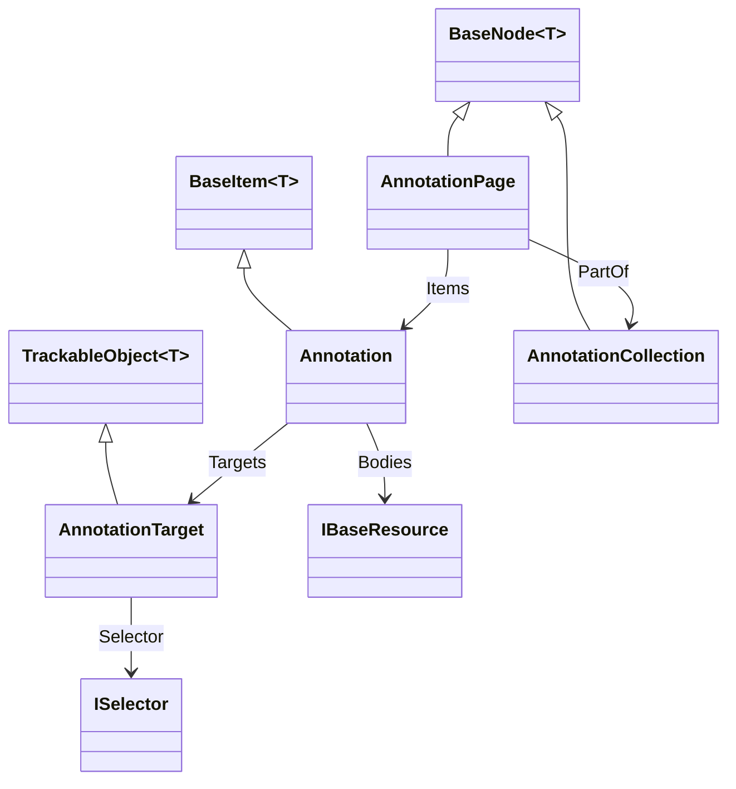

# Annotation

## Contents

- [Overview](#overview)
- [Files](#files)
- [Types & Members](#types--members)
- [Diagrams](#diagrams)
- [Package Dependencies](#package-dependencies)
- [See Also](#see-also)

## Overview

This folder models the W3C Web Annotation Model as used by IIIF Presentation API 3.0: `Annotation`
(a single body/target pairing, typically "painting" an Image/Audio/Video resource onto a `Canvas`),
`AnnotationPage` (a group of Annotations, or a reference to an external one), `AnnotationCollection`
(the standalone, paged top-level document distinct from the IIIF `Collection` resource), and
`AnnotationTarget` (the polymorphic target shape - bare URI, typed reference, or full
SpecificResource+selector). This is the 3.0-native replacement for the entire family of 2.x wrapper
classes (`Image`/`Audio`/`Video`/`OtherContent` in the sibling content folders) - `Canvas.Items`
holds `AnnotationPage`/`Annotation` directly, with the legacy wrappers now computed views. This
folder is discussed in depth in `SDK_VERSIONING_GUIDE.md` (Milestone 1's Canvas reshape, Milestone
10's Content State work, and the Annotation Collection paging model).

## Files

| File | Primary type(s) | LOC (approx) | Responsibility |
| --- | --- | --- | --- |
| `Annotation.cs` | `Annotation` | 159 | The core Web Annotation - body/target pairing, motivation, stylesheet, timeMode. |
| `AnnotationCollection.cs` | `AnnotationCollection` | 68 | Standalone paged annotation-list document (`total`/`first`/`last`). |
| `AnnotationPage.cs` | `AnnotationPage` | 52 | Groups Annotations via `Items`, or references an external page; supports `next`/`prev` paging. |
| `AnnotationTarget.cs` | `AnnotationTarget` | 103 | Polymorphic annotation target - bare URI, typed reference, or SpecificResource+selector. |
| `AnnotationTargetJsonConverter.cs` | `AnnotationTargetJsonConverter` | 154 | Reads/writes `AnnotationTarget`'s three JSON shapes. |

## Types & Members

| Type | Kind | Summary | Inherits/Implements | Key Members |
| --- | --- | --- | --- | --- |
| `Annotation` | class | Body/target pairing | `BaseItem<Annotation>` | `Motivation`, `Bodies`/`Body`, `Targets`/`Target`, `Stylesheet`, `TimeMode`, `AddTarget`, `AddBody` |
| `AnnotationCollection` | class | Paged annotation-list document | `BaseNode<AnnotationCollection>` | `Total`, `First`, `Last`, `SetTotal`, `SetFirst`, `SetLast` |
| `AnnotationPage` | class | Group/reference of Annotations | `BaseNode<AnnotationPage>` | `Next`, `Prev`, `SetNext`, `SetPrev` (plus inherited `Items`/`PartOf`) |
| `AnnotationTarget` | class | Polymorphic target value | `TrackableObject<AnnotationTarget>` | `SourceId`, `SourceType`, `PartOfId`/`PartOfType`, `SpecificResourceId`, `Selector`, `StyleClass`, implicit `string` conversion |
| `AnnotationTargetJsonConverter` | class | Custom converter | `JsonConverter<AnnotationTarget>` | `WriteJson`, `ReadJson` |

### Annotation

- **Kind / Namespace**: `class`, `IIIF.Manifests.Serializer.Nodes.Contents.Annotation`.
- **Inherits**: `BaseItem<Annotation>` (not `BaseNode` - an Annotation has no label/metadata/etc).
- **Attributes**: `[PresentationAPI("3.0", Notes = "Web Annotation model. In 2.x, this concept was split across Canvas.images/audio/video wrappers.")]`.
- **Key properties**:
  - `Motivation : string` (`motivation`) - defaults to `"painting"`.
  - `Bodies : IReadOnlyCollection<IBaseResource>` (`body`, `[JsonConverter(typeof(ObjectArrayJsonConverter))]`) - 3.0-native storage; the W3C model allows a single value or array (cookbook recipes 0022/0103/0258/0377 pair a comment with a linked resource as sibling bodies).
  - `Body : IBaseResource` (`[JsonIgnore]`) - computed single-value convenience over `Bodies`; setting it replaces the whole collection.
  - `Targets : IReadOnlyCollection<AnnotationTarget>` (`target`, `[JsonConverter(typeof(ObjectArrayJsonConverter))]`) - 3.0-native storage; can be multi-valued (recipes 0540/0599: one link annotation opening several canvases).
  - `Target : AnnotationTarget` (`[JsonIgnore]`) - computed single-value convenience over `Targets`.
  - `Stylesheet : string?` (`stylesheet`) - unofficial community CSS-extension convention (cookbook recipe 0045-css).
  - `TimeMode : TimeMode?` (`timeMode`) - spec §4.5, how a temporal body's duration relates to its target's when they differ (trim/scale/loop).
- **Key methods**: `SetMotivation`, `AddTarget`, `AddBody`, `SetStylesheet`, `SetTimeMode` - all fluent.
- **Constructors**: `[JsonConstructor] private Annotation(string id, IReadOnlyCollection<IBaseResource> body, IReadOnlyCollection<AnnotationTarget> target)` - deliberately takes the plural collection types, not scalars, because Newtonsoft's constructor-parameter matching binds by wire-name (`target`/`body` map to the plural properties); a scalar-typed constructor parameter previously corrupted every plain `JsonConvert` round-trip. Public convenience: `Annotation(string id, IBaseResource body, AnnotationTarget target)`.
- **Usage Recipe**:
  ```csharp
  var image = new ImageResource("https://example.org/full/full/0/default.jpg", "image/jpeg")
      .SetHeight(2000).SetWidth(1500);
  var annotation = new Annotation("https://example.org/anno/p1", image, canvas.Id)
      .SetTimeMode(TimeMode.Trim);
  canvas.AddAnnotation(annotation);
  ```

### AnnotationCollection

- **Kind / Namespace**: `class`, `IIIF.Manifests.Serializer.Nodes.Contents.Annotation`.
- **Inherits**: `BaseNode<AnnotationCollection>`.
- **Attributes**: `[PresentationAPI("3.0", Notes = "W3C Web Annotation Protocol paging concept, distinct from the IIIF Collection resource.")]`; `[System.Text.Json.Serialization.JsonConverter(typeof(SystemTextJson.AnnotationCollectionSystemTextJsonConverter))]` - bridges plain `System.Text.Json` calls to this SDK's Newtonsoft logic.
- **Key properties**: `Total : int?` (`total`), `First : string?` (`first`), `Last : string?` (`last`).
- **Key methods**: `SetTotal`, `SetFirst`, `SetLast`.
- **Constructors**: `[JsonConstructor] internal AnnotationCollection(string id)`; `AnnotationCollection(string id, Label label)`.
- **Usage Recipe** (cookbook recipe 0309-annotation-collection):
  ```csharp
  var annoCollection = new AnnotationCollection("https://example.org/anno_coll.json", new Label("All comments"))
      .SetTotal(42)
      .SetFirst("https://example.org/anno_coll/page1.json")
      .SetLast("https://example.org/anno_coll/page5.json");
  ```

### AnnotationPage

- **Kind / Namespace**: `class`, `IIIF.Manifests.Serializer.Nodes.Contents.Annotation`.
- **Inherits**: `BaseNode<AnnotationPage>`.
- **Attributes**: `[PresentationAPI("3.0", Notes = "No direct 2.x equivalent as a concrete type; 2.x inlined images/otherContent directly on Canvas.")]`.
- **Key properties**: `Next : string?` (`next`), `Prev : string?` (`prev`) - W3C-style paging between sibling pages. Also uses inherited `Items` (the actual `Annotation`s) and `PartOf` (points back at an owning `AnnotationCollection`, per recipe 0309).
- **Key methods**: `SetNext`, `SetPrev`.
- **Constructors**: `[JsonConstructor] AnnotationPage(string id)`.
- **Usage Recipe**:
  ```csharp
  var page = new AnnotationPage($"{canvas.Id}/page").SetItem(annotation);
  canvas.AddItem(page); // or canvas.AddAnnotationPageReference(externalPage) for an external reference
  ```

### AnnotationTarget

- **Kind / Namespace**: `class`, `IIIF.Manifests.Serializer.Nodes.Contents.Annotation`.
- **Inherits**: `TrackableObject<AnnotationTarget>`.
- **Attributes**: `[PresentationAPI("3.0")]`; `[JsonConverter(typeof(AnnotationTargetJsonConverter))]`.
- **Key properties**: `SourceId : string`, `SourceType : string?`, `PartOfId`/`PartOfType : string?`, `SpecificResourceId : string?` (only meaningful when `Selector` is set), `Selector : ISelector?`, `StyleClass : string?` (cookbook recipe 0045-css).
- **Key methods**: `SetSelector`, `SetPartOf(string, string)`, `SetSpecificResourceId`, `SetStyleClass`.
- **Constructors/Conversions**: `AnnotationTarget(string sourceId, string? sourceType = null)`; `public static implicit operator AnnotationTarget(string uri)` - every existing bare-URI call site keeps compiling unchanged.
- **Usage Recipe** (region-cropped target, cookbook recipe 0299-region):
  ```csharp
  var target = new AnnotationTarget(canvas.Id)
      .SetSelector(FragmentSelector.ForRegion(0, 0, 1000, 1000));
  var annotation = new Annotation("https://example.org/anno/region1", image, target);
  ```

### AnnotationTargetJsonConverter

- **Kind / Namespace**: `class`, `IIIF.Manifests.Serializer.Nodes.Contents.Annotation`.
- **Inherits**: `JsonConverter<AnnotationTarget>`.
- **Key methods**:
  - `WriteJson(JsonWriter, AnnotationTarget?, JsonSerializer)` - picks the minimal shape: bare string when no selector/styleClass/partOf; otherwise a full `SpecificResource`-shaped object with `source`/`selector`/`styleClass`.
  - `ReadJson(JsonReader, Type, AnnotationTarget?, bool, JsonSerializer)` - dispatches on token shape (string vs. object vs. `"type":"SpecificResource"` object).
- **Usage Recipe**: not called directly - Newtonsoft invokes it automatically wherever `AnnotationTarget` appears (declared via `[JsonConverter(typeof(AnnotationTargetJsonConverter))]` on the type itself).

[↑ Back to top](#contents)

## Diagrams



`Annotation` is the hub: it composes a polymorphic body (`IBaseResource`, e.g. `ImageResource` or a
`Choice`) and one or more `AnnotationTarget`s. `AnnotationPage` groups Annotations and optionally
points back at its owning `AnnotationCollection` for paging.

[↑ Back to top](#contents)

## Package Dependencies

| Package | Version | Description | Links |
| --- | --- | --- | --- |
| Newtonsoft.Json | 13.0.4 | JSON.NET - this SDK's serialization engine (custom JsonConverters, attribute-driven read/write) | [NuGet](https://www.nuget.org/packages/Newtonsoft.Json/13.0.4) |

[↑ Back to top](#contents)

## See Also

- [`../README.md`](../README.md) - parent `Contents` grouping folder.
- [`../../README.md`](../../README.md) - grandparent `Nodes` folder (`Canvas.AddAnnotation`/`AddAnnotationPageReference`).
- [`../../../README.md`](../../../README.md) - repository/docs top-level documentation.
- [`../../../SDK_VERSIONING_GUIDE.md`](../../../SDK_VERSIONING_GUIDE.md) - covers this folder in depth: Milestone 1 (`Canvas`/`AnnotationPage`/`Annotation` reshape), the `Start`/`AnnotationTarget` reuse in §5, and Milestone 10 (Content State's own target shape, closely related to `AnnotationTarget`).

[↑ Back to top](#contents)
