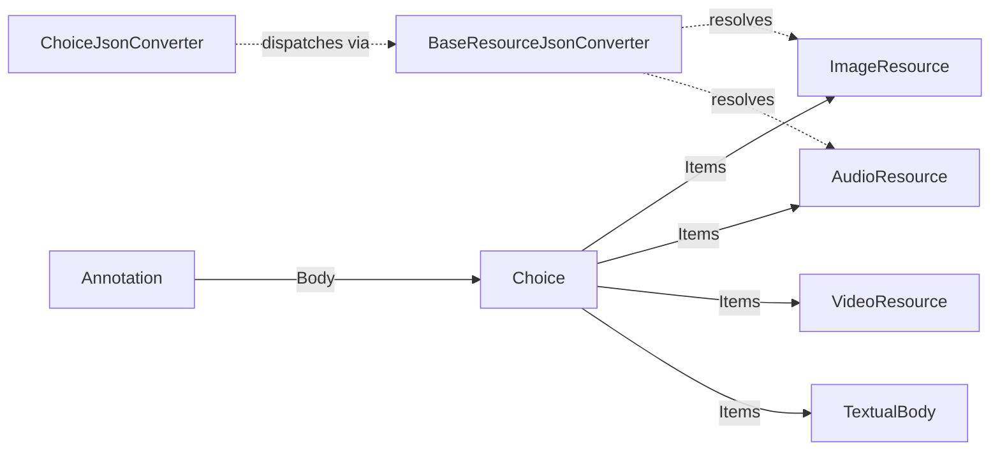

# Choice

## Contents

- [Overview](#overview)
- [Files](#files)
- [Types & Members](#types--members)
- [Diagrams](#diagrams)
- [Package Dependencies](#package-dependencies)
- [See Also](#see-also)

## Overview

This folder models the Web Annotation Model's "Choice" body type (`type:"Choice"`, `items:[...]`)
- a 3.0-only mechanism for presenting several mutually-exclusive alternative resources as one
Annotation body, such as "Natural Light" vs. "X-Ray" imagery (cookbook recipe 0033-choice) or
several audio formats (recipe 0434-choice-av). Each alternative is dispatched polymorphically
through `IBaseResource`, so a `Choice` can mix `ImageResource`, `AudioResource`, `TextualBody`, etc.
This folder is covered in depth in `SDK_VERSIONING_GUIDE.md` alongside `Annotation` and
`ContentState` as one of the polymorphic-dispatch shapes this SDK models.

## Files

| File | Primary type(s) | LOC (approx) | Responsibility |
| --- | --- | --- | --- |
| `Choice.cs` | `Choice` | 54 | The `Choice` body type - a `type`/`items` pairing implementing `IBaseResource`. |
| `ChoiceJsonConverter.cs` | `ChoiceJsonConverter` | 49 | Forces `items` to always serialize as a JSON array, even with one element, and dispatches each item polymorphically on read. |

## Types & Members

| Type | Kind | Summary | Inherits/Implements | Key Members |
| --- | --- | --- | --- | --- |
| `Choice` | class | Alternative-resource body wrapper | `TrackableObject<Choice>`, `IBaseResource` | `Type`, `Items`, `AddItem` |
| `ChoiceJsonConverter` | class | Custom converter forcing array-shaped `items` | `JsonConverter<Choice>` | `WriteJson`, `ReadJson` |

### Choice

- **Kind / Namespace**: `class`, `IIIF.Manifests.Serializer.Nodes.Contents.Choice`.
- **Inherits/Implements**: `TrackableObject<Choice>`, `IBaseResource` (explicit `ResourceType? IBaseResource.Type => new(Type)`).
- **Attributes**: `[PresentationAPI("3.0")]`; `[JsonConverter(typeof(ChoiceJsonConverter))]` - a dedicated converter is needed (rather than the general `ObjectArrayJsonConverter` used elsewhere) because `items` must always be an array, even for a single alternative, unlike properties where a lone value legitimately collapses to a bare scalar.
- **Key properties**:
  - `Type : string` (`type`) - defaults to `"Choice"`.
  - `Items : IReadOnlyCollection<IBaseResource>` (`items`) - the alternative resources, each dispatched via `BaseResourceJsonConverter`.
- **Key methods**: `AddItem(IBaseResource)` - fluent.
- **Constructors**: `Choice(IReadOnlyCollection<IBaseResource> items)`.
- **Usage Recipe** (cookbook recipe 0033-choice: Natural Light vs. X-Ray):
  ```csharp
  var naturalLight = new ImageResource("https://example.org/natural.jpg", "image/jpeg").SetLabel(new Label("Natural Light"));
  var xray = new ImageResource("https://example.org/xray.jpg", "image/jpeg").SetLabel(new Label("X-Ray"));
  var choice = new Choice([naturalLight, xray]);
  var annotation = new Annotation("https://example.org/anno/choice1", choice, canvas.Id);
  canvas.AddAnnotation(annotation);
  ```

### ChoiceJsonConverter

- **Kind / Namespace**: `class`, `IIIF.Manifests.Serializer.Nodes.Contents.Choice`.
- **Inherits**: `JsonConverter<Choice>`.
- **Key methods**:
  - `WriteJson` - always writes `{"type":"Choice","items":[...]}` with `items` as an array regardless of count.
  - `ReadJson` - reads `items` as a `JArray`, converting each element to `IBaseResource` via the serializer (which dispatches through `BaseResourceJsonConverter`), skipping any element that fails to convert.
- **Usage Recipe**: not called directly - applied automatically wherever a `Choice` appears via its `[JsonConverter(typeof(ChoiceJsonConverter))]` attribute.

[↑ Back to top](#contents)

## Diagrams



`Choice` sits between an `Annotation`'s `Body` and any concrete resource type; `ChoiceJsonConverter`
guarantees array-shaped `items` while `BaseResourceJsonConverter` (in `Shared/Content/Resources/`)
resolves each item's concrete type by `type`/`@type`.

[↑ Back to top](#contents)

## Package Dependencies

| Package | Version | Description | Links |
| --- | --- | --- | --- |
| Newtonsoft.Json | 13.0.4 | JSON.NET - this SDK's serialization engine (custom JsonConverters, attribute-driven read/write) | [NuGet](https://www.nuget.org/packages/Newtonsoft.Json/13.0.4) |

[↑ Back to top](#contents)

## See Also

- [`../README.md`](../README.md) - parent `Contents` grouping folder.
- [`../../README.md`](../../README.md) - `Nodes` folder (`Canvas.AddAnnotation`, the usual place a `Choice` ends up).
- [`../../../README.md`](../../../README.md) - repository/docs top-level documentation.
- [`../../../SDK_VERSIONING_GUIDE.md`](../../../SDK_VERSIONING_GUIDE.md) - discusses `Choice` alongside `Annotation`/`ContentState` as one of the SDK's polymorphic-dispatch body shapes.

[↑ Back to top](#contents)
