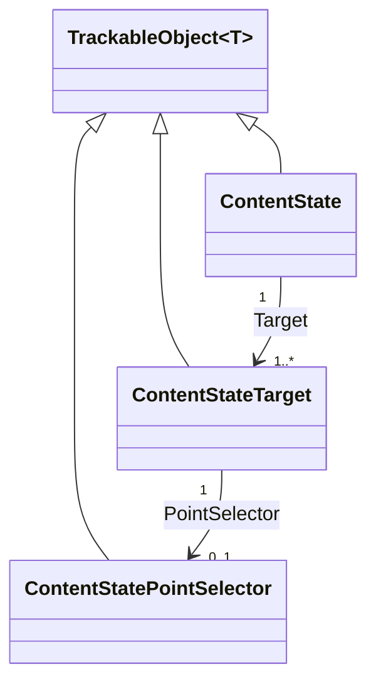
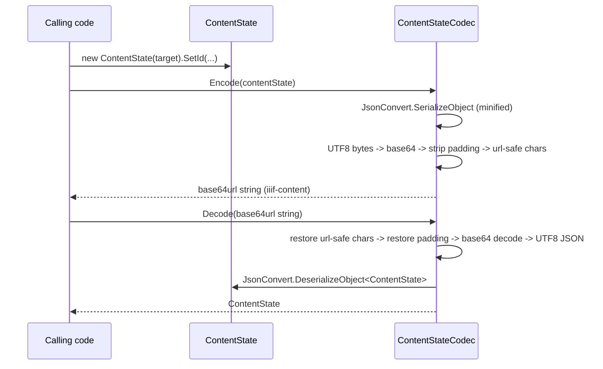

# ContentState

## Contents

- [Overview](#overview)
- [Files](#files)
- [Types & Members](#types--members)
- [Diagrams](#diagrams)
- [Package Dependencies](#package-dependencies)
- [See Also](#see-also)

## Overview

This folder models IIIF Content State API 1.0 - a compact, encodable description of "what a user was
looking at" (which resource(s), and optionally which region/point in time) used for deep-linking
into a viewer via the `iiif-content` query parameter or URI fragment. Per spec, a content state is a
W3C Annotation with `motivation: "contentState"`. `ContentState` is the root document, `Target`
models the three shapes the spec allows (bare URI, typed reference, or SpecificResource+selector),
`ContentStatePointSelector` selects a moment in an A/V recording, and `ContentStateCodec` handles
the base64url encode/decode round-trip. This was a 0%-modeled gap identified in
`SDK_VERSIONING_GUIDE.md` §10 and added in Milestone 10 - see that guide for the full design
rationale and spec citations.

## Files

| File | Primary type(s) | LOC (approx) | Responsibility |
| --- | --- | --- | --- |
| `ContentState.cs` | `ContentState` | 82 | The root Content State 1.0 document (W3C-Annotation-shaped: `id?`, `type`, `motivation`, `target`). |
| `ContentStateCodec.cs` | `ContentStateCodec` | 52 | `Encode`/`Decode` between a `ContentState` object and the base64url "content state string". |
| `ContentStatePointSelector.cs` | `ContentStatePointSelector` | 40 | Selects a single point in time (`t`, seconds) within an AV recording. |
| `ContentStateTarget.cs` | `ContentStateTarget` | 80 | The polymorphic target a content state points at. |
| `ContentStateTargetJsonConverter.cs` | `ContentStateTargetJsonConverter` | 131 | Reads/writes `ContentStateTarget`'s three JSON shapes. |

## Types & Members

| Type | Kind | Summary | Inherits/Implements | Key Members |
| --- | --- | --- | --- | --- |
| `ContentState` | class | Root Content State document | `TrackableObject<ContentState>` | `Id`, `Type`, `Motivation`, `Target`, `SetId`, `AddTarget`, `RemoveTarget` |
| `ContentStateCodec` | static class | Base64url encode/decode | *(none)* | `Encode(ContentState)`, `Decode(string)` |
| `ContentStatePointSelector` | class | AV time-offset selector | `TrackableObject<ContentStatePointSelector>` | `Type`, `T` |
| `ContentStateTarget` | class | Polymorphic target value | `TrackableObject<ContentStateTarget>` | `Id`, `ResourceType`, `PointSelector`, `PartOfId`/`PartOfType`, `SetPointSelector`, `SetPartOf` |
| `ContentStateTargetJsonConverter` | class | Custom converter | `JsonConverter<ContentStateTarget>` | `WriteJson`, `ReadJson` |

### ContentState

- **Kind / Namespace**: `class`, `IIIF.Manifests.Serializer.Nodes.Contents.ContentState`.
- **Inherits**: `TrackableObject<ContentState>` directly - **not** `BaseItem`, because Content State's `id`/`type` are unprefixed (matching `Activity`/`ActivityObject`'s precedent), unlike the `@id`/`@type` `BaseItem` bakes in.
- **Attributes**: `[ContentStateAPI("1.0")]`; `[System.Text.Json.Serialization.JsonConverter(typeof(SystemTextJson.ContentStateSystemTextJsonConverter))]` - bridges plain `System.Text.Json` calls to this SDK's Newtonsoft logic.
- **Key properties**:
  - `Id : string?` (`id`) - optional per spec.
  - `Type : string` (`type`) - defaults to `"Annotation"`.
  - `Motivation : string` (`motivation`) - defaults to `"contentState"`.
  - `Target : IReadOnlyCollection<ContentStateTarget>` (`target`, `[JsonConverter(typeof(ObjectArrayJsonConverter))]`) - one or more targets; a single target serializes bare, multiple as an array.
- **Key methods**: `SetId`, `AddTarget`, `RemoveTarget` - fluent.
- **Constructors**: `ContentState(params ContentStateTarget[] targets)`.
- **Usage Recipe**:
  ```csharp
  var target = new ContentStateTarget(canvas.Id, "Canvas").SetPartOf(manifest.Id);
  var contentState = new ContentState(target).SetId("https://example.org/state/1");
  string iiifContent = ContentStateCodec.Encode(contentState);
  // https://viewer.example.org/?iiif-content={iiifContent}
  ```

### ContentStateCodec

- **Kind / Namespace**: `static class`, `IIIF.Manifests.Serializer.Nodes.Contents.ContentState`.
- **Key methods**:
  - `Encode(ContentState) : string` - UTF-8 minified JSON → standard base64 → strip `=` padding → `+`/`/` replaced with `-`/`_`.
  - `Decode(string) : ContentState` - reverses the above (restores padding based on length mod 4, throws `FormatException` on an invalid length, throws `JsonSerializationException` if decoding produces null).
- **Usage Recipe**:
  ```csharp
  var decoded = ContentStateCodec.Decode(iiifContent);
  var firstTargetId = decoded.Target.First().Id;
  ```

### ContentStatePointSelector

- **Kind / Namespace**: `class`, `IIIF.Manifests.Serializer.Nodes.Contents.ContentState`.
- **Inherits**: `TrackableObject<ContentStatePointSelector>`.
- **Attributes**: `[ContentStateAPI("1.0")]` - spec §5.2.
- **Key properties**: `Type : string` (`type`, defaults `"PointSelector"`), `T : double` (`t`) - time offset in seconds.
- **Constructors**: `[JsonConstructor] ContentStatePointSelector(double t)`.
- **Usage Recipe**: see `ContentStateTarget.SetPointSelector(double)` below - rarely constructed standalone.

### ContentStateTarget

- **Kind / Namespace**: `class`, `IIIF.Manifests.Serializer.Nodes.Contents.ContentState`.
- **Inherits**: `TrackableObject<ContentStateTarget>`.
- **Attributes**: `[ContentStateAPI("1.0")]`; `[JsonConverter(typeof(ContentStateTargetJsonConverter))]`.
- **Key properties**: `Id : string`, `ResourceType : string?`, `PointSelector : ContentStatePointSelector?` (spec §5.2), `PartOfId`/`PartOfType : string?`. Note: region-targeting (spec §5.1) has no SpecificResource/selector form at all - it's expressed as a Media Fragments suffix directly on `Id` (e.g. `"https://example.org/canvas7#xywh=1000,2000,1000,2000"`), which the bare-string constructor already supports.
- **Key methods**: `SetPointSelector(ContentStatePointSelector)`, `SetPointSelector(double t)` (convenience overload), `SetPartOf(string, string)`.
- **Constructors**: `ContentStateTarget(string id, string? resourceType = null)`.
- **Usage Recipe** (deep-link to a specific moment in an A/V canvas):
  ```csharp
  var target = new ContentStateTarget(canvas.Id, "Canvas").SetPointSelector(125.5);
  var contentState = new ContentState(target);
  ```

### ContentStateTargetJsonConverter

- **Kind / Namespace**: `class`, `IIIF.Manifests.Serializer.Nodes.Contents.ContentState`.
- **Inherits**: `JsonConverter<ContentStateTarget>`.
- **Key methods**: `WriteJson` - bare string if no `ResourceType`/`PartOfId`/`PointSelector`; typed `{id,type}` (+`partOf`) if no selector; full `{"type":"SpecificResource","source":...,"selector":...}` when a `PointSelector` is present. `ReadJson` - dispatches on token shape (string / plain object / `SpecificResource` object).
- **Usage Recipe**: not called directly - applied automatically via `[JsonConverter(typeof(ContentStateTargetJsonConverter))]`.

[↑ Back to top](#contents)

## Diagrams





The class diagram shows composition (`ContentState` → `ContentStateTarget` → optional
`ContentStatePointSelector`); the sequence diagram shows the encode/decode round trip
`ContentStateCodec` performs.

[↑ Back to top](#contents)

## Package Dependencies

| Package | Version | Description | Links |
| --- | --- | --- | --- |
| Newtonsoft.Json | 13.0.4 | JSON.NET - this SDK's serialization engine (custom JsonConverters, attribute-driven read/write) | [NuGet](https://www.nuget.org/packages/Newtonsoft.Json/13.0.4) |

[↑ Back to top](#contents)

## See Also

- [`../README.md`](../README.md) - parent `Contents` grouping folder.
- [`../../README.md`](../../README.md) - `Nodes` folder.
- [`../../../README.md`](../../../README.md) - repository/docs top-level documentation.
- [`../../../SDK_VERSIONING_GUIDE.md`](../../../SDK_VERSIONING_GUIDE.md) - Milestone 10 documents this folder's design in full, including the base64url codec algorithm and why region-targeting has no SpecificResource form.

[↑ Back to top](#contents)
