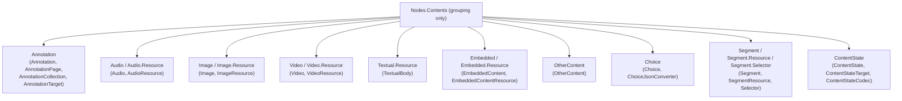

# Contents

## Contents

- [Overview](#overview)
- [Files](#files)
- [Diagrams](#diagrams)
- [Package Dependencies](#package-dependencies)
- [See Also](#see-also)

## Overview

`Nodes.Contents` is a pure grouping namespace - it holds no types of its own. It exists to organize
the concrete annotation body/resource types (and their supporting selectors/converters) that get
painted onto a `Canvas` via `Annotation`/`AnnotationPage`, or referenced from a `SpecificResource`
or `Choice`. Each child folder below corresponds to one W3C Web Annotation / IIIF content shape:
the Web Annotation model itself (`Annotation`), the four media body types (`Audio`, `Image`,
`Video`, `Textual`), the two "alternative content" mechanisms (`Choice`, `Segment`), the legacy 2.x
content wrapper (`OtherContent`), the legacy inline-text body (`Embedded`), and the Content State
1.0 deep-link document (`ContentState`).

## Files

*No files directly in this folder — see child folders below.*

## Diagrams

Each leaf is an independent child folder documented in its own README; `Contents` itself contributes
no classes, only the namespace grouping.

## Package Dependencies

| Package | Version | Description | Links |
| --- | --- | --- | --- |
| Newtonsoft.Json | 13.0.4 | JSON.NET - this SDK's serialization engine (custom JsonConverters, attribute-driven read/write) | [NuGet](https://www.nuget.org/packages/Newtonsoft.Json/13.0.4) |

[↑ Back to top](#contents)

## See Also

- [`../README.md`](../README.md) - parent `Nodes` folder (`Manifest`/`Collection`/`Canvas`/`Structure`).
- Child folders: [`Annotation`](Annotation/README.md), [`Audio`](Audio/README.md), [`Choice`](Choice/README.md),
  [`ContentState`](ContentState/README.md), [`Embedded`](Embedded/README.md), [`Image`](Image/README.md),
  [`OtherContent`](OtherContent/README.md), [`Segment`](Segment/README.md), [`Textual`](Textual/README.md),
  [`Video`](Video/README.md).
- [`../../README.md`](../../README.md) - repository/docs top-level documentation.
- [`../../SDK_VERSIONING_GUIDE.md`](../../SDK_VERSIONING_GUIDE.md) - architecture reference for the 3.0-native reshape these content types participate in.

[↑ Back to top](#contents)
