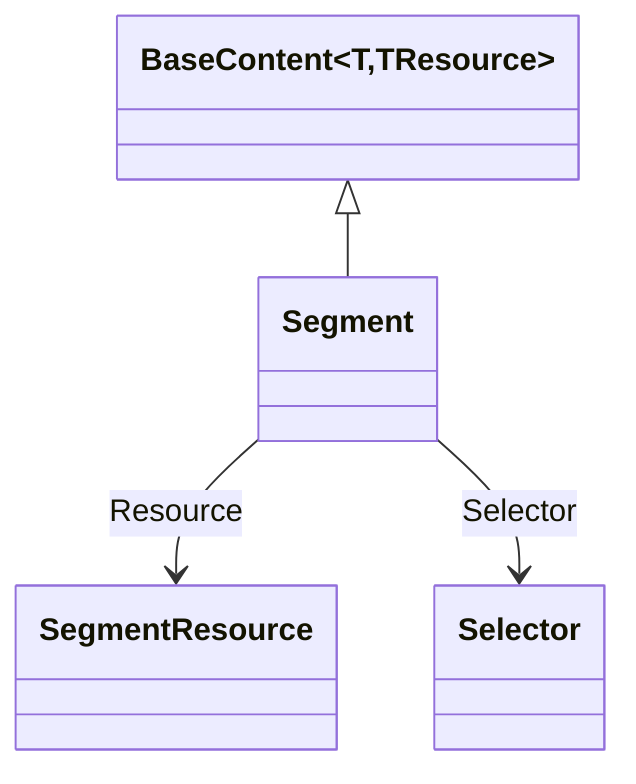

# Segment

## Contents

- [Overview](#overview)
- [Files](#files)
- [Types & Members](#types--members)
- [Diagrams](#diagrams)
- [Package Dependencies](#package-dependencies)
- [See Also](#see-also)

## Overview

This folder models the legacy (2.x) `oa:Annotation` wrapper for painting a *segment* of another
resource - a `SegmentResource` (which itself wraps a `Full` resource) cropped or trimmed via a
`Selector` (see [`Selector`](Selector/README.md)). This is the pre-3.0 shape for what a 3.0-native
document would express as a `SpecificResource` (`Shared/Content/Resources/SpecificResource.cs`)
with a `Selector` - see [`Resource`](Resource/README.md) for the resource half of this pairing.

## Files

| File | Primary type(s) | LOC (approx) | Responsibility |
| --- | --- | --- | --- |
| `Segment.cs` | `Segment` | 28 | Legacy 2.x `oa:Annotation` wrapper pairing a `SegmentResource` with a target (`on`) and a `Selector`. |

## Types & Members

| Type | Kind | Summary | Inherits/Implements | Key Members |
| --- | --- | --- | --- | --- |
| `Segment` | class | Legacy segment-painting annotation wrapper | `BaseContent<Segment, SegmentResource>` | `Motivation`, `On`, `Selector`, `SetSelector` |

### Segment

- **Kind / Namespace**: `class`, `IIIF.Manifests.Serializer.Nodes.Contents.Segment`.
- **Inherits**: `BaseContent<Segment, SegmentResource>`.
- **Key properties**:
  - `Motivation : string` (`motivation`) - read-only, always `"sc:painting"` (set via `SetElementValue` in the constructor rather than a settable property with a public setter method - this type exposes the getters as expression-bodied members, e.g. `public string Motivation => GetElementValue(x => x.Motivation)!;`).
  - `On : string` (`on`) - the id of the target resource/canvas.
  - `Selector : Selector.Selector?` (`selector`) - the crop/region selector (see [`Selector`](Selector/README.md)).
  - Inherited: `Resource : SegmentResource` (`resource`).
- **Key methods**: `SetSelector(Selector.Selector)` - fluent.
- **Constructors**: `Segment(string id, SegmentResource resource, string on)`.
- **Usage Recipe** (legacy-shim construction; for new 3.0-native code use `SpecificResource` + `ISelector` as an `Annotation` body instead):
  ```csharp
  var segmentResource = new SegmentResource("https://example.org/segment/1", ResourceType.Image)
      .SetFull(new ImageResource("https://example.org/full/full/0/default.jpg", "image/jpeg"));
  var segment = new Segment("https://example.org/anno/segment1", segmentResource, canvas.Id)
      .SetSelector(new Selector.Selector("https://example.org/selector/1", "oa:FragmentSelector").SetRegion(0, 0, 500, 500));
  ```

[↑ Back to top](#contents)

## Diagrams



`Segment` composes a `SegmentResource` body (documented in [`Resource/README.md`](Resource/README.md))
and an optional `Selector` (documented in [`Selector/README.md`](Selector/README.md)) that crops the
resource's `Full` sibling.

[↑ Back to top](#contents)

## Package Dependencies

| Package | Version | Description | Links |
| --- | --- | --- | --- |
| Newtonsoft.Json | 13.0.4 | JSON.NET - this SDK's serialization engine (custom JsonConverters, attribute-driven read/write) | [NuGet](https://www.nuget.org/packages/Newtonsoft.Json/13.0.4) |

[↑ Back to top](#contents)

## See Also

- [`Resource/README.md`](Resource/README.md) - the `SegmentResource` body type this wrapper carries.
- [`Selector/README.md`](Selector/README.md) - the `Selector` type used to crop/select part of the resource.
- [`../README.md`](../README.md) - parent `Contents` grouping folder.
- [`../../README.md`](../../README.md) - grandparent `Nodes` folder.
- [`../../../README.md`](../../../README.md) - repository/docs top-level documentation.

[↑ Back to top](#contents)
