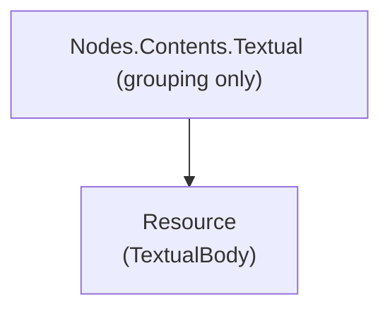

# Textual

## Contents

- [Overview](#overview)
- [Files](#files)
- [Diagrams](#diagrams)
- [Package Dependencies](#package-dependencies)
- [See Also](#see-also)

## Overview

`Textual` is a pure grouping folder - it holds no types of its own directly, only the
[`Resource`](Resource/README.md) child folder containing `TextualBody`, the W3C Web Annotation
Model's inline string body type (3.0-native replacement for the legacy `cnt:ContentAsText` shape
modeled in `../Embedded/Resource`). `TextualBody` is used extensively across the cookbook recipes
for commenting, tagging, and transcription motivations.

## Files

*No files directly in this folder — see child folders below.*

## Diagrams

`Textual` contributes no classes of its own; `TextualBody` lives in the single child folder below.

## Package Dependencies

| Package | Version | Description | Links |
| --- | --- | --- | --- |
| Newtonsoft.Json | 13.0.4 | JSON.NET - this SDK's serialization engine (custom JsonConverters, attribute-driven read/write) | [NuGet](https://www.nuget.org/packages/Newtonsoft.Json/13.0.4) |

[↑ Back to top](#contents)

## See Also

- [`Resource/README.md`](Resource/README.md) - the `TextualBody` type.
- [`../README.md`](../README.md) - parent `Contents` grouping folder.
- [`../../README.md`](../../README.md) - grandparent `Nodes` folder.
- [`../Embedded/README.md`](../Embedded/README.md) - the legacy `cnt:ContentAsText` equivalent this type replaces.
- [`../../../README.md`](../../../README.md) - repository/docs top-level documentation.

[↑ Back to top](#contents)
