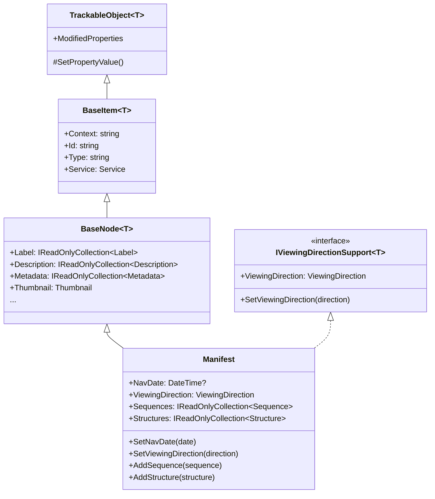
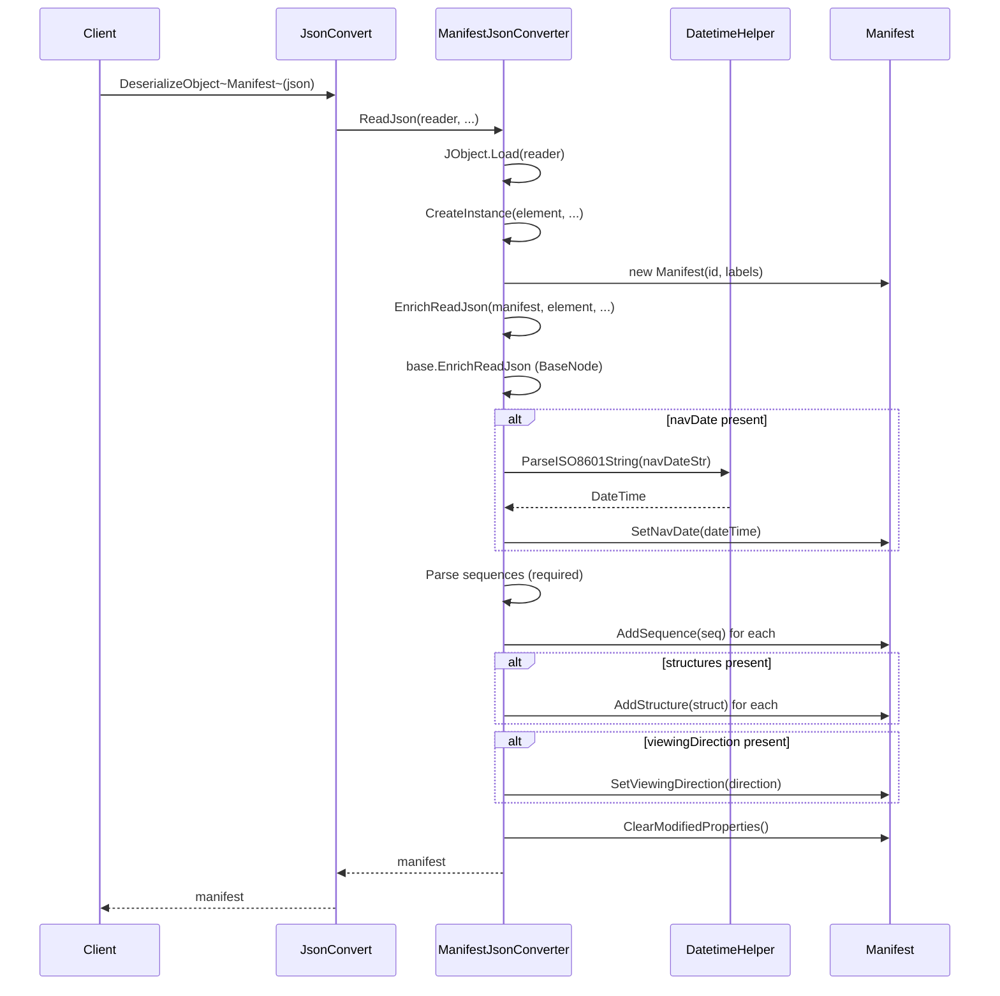
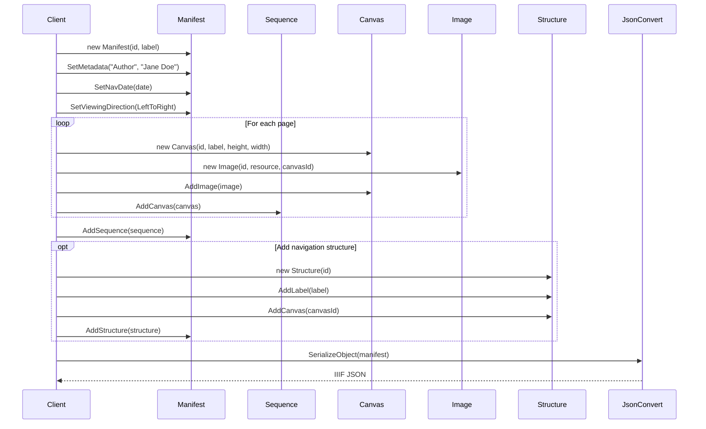

# Manifest

## Contents
- [Overview](#overview)
- [Files](#files)
- [Types & Members](#types--members)
- [Manifest](#manifest-1)
- [ManifestJsonConverter](#manifestjsonconverter)
- [Diagrams](#diagrams)
- [Examples](#examples)
- [See Also](#see-also)

## Overview

The Manifest folder contains the top-level IIIF Presentation API 2.0 resource type that represents a single object (book, manuscript, image collection, etc.). Manifest holds sequences (ordered canvas lists), structures (hierarchical ranges for navigation), navDate (publication/creation date), viewingDirection (left-to-right, right-to-left, etc.), and inherits all BaseNode metadata fields (label, description, metadata, thumbnail, etc.). ManifestJsonConverter enforces required sequences, parses ISO-8601 navDate strings, handles viewingDirection enum serialization, and writes complete JSON-LD manifests using Newtonsoft.Json. Manifest is the entry point for deserialization and the root for all IIIF viewing applications.

## Files

| File | Primary type(s) | LOC (approx) | Responsibility |
|------|-----------------|--------------|----------------|
| [Manifest.cs](../../../src/IIIF.Manifest.Serializer.Net/Nodes/Manifest/Manifest.cs) | `Manifest` | 52 | Top-level resource with sequences, structures, navDate, viewingDirection |
| [ManifestJsonConverter.cs](../../../src/IIIF.Manifest.Serializer.Net/Nodes/Manifest/ManifestJsonConverter.cs) | `ManifestJsonConverter` | 120 | Validates sequences required, parses navDate/viewingDirection, writes complete manifest JSON |

[↑ Back to top](#contents)

## Types & Members

| Type | Kind | Summary | Inherits/Implements | Key Members |
|------|------|---------|---------------------|-------------|
| `Manifest` | Class | Top-level IIIF resource representing a single object (book, manuscript, etc.); holds sequences (canvas ordering), structures (ranges for navigation), navDate (publication date), and viewingDirection | `BaseNode<Manifest>`, `IViewingDirectionSupport<Manifest>` | `NavDate`, `ViewingDirection`, `Sequences`, `Structures`, `AddSequence`, `RemoveSequence`, `AddStructure`, `RemoveStructure`, `SetNavDate`, `SetViewingDirection` |
| `ManifestJsonConverter` | Class | Custom JsonConverter that enforces sequences required, parses ISO-8601 navDate, handles viewingDirection serialization | `BaseNodeJsonConverter<Manifest>` | `CreateInstance`, `EnrichReadJson`, `EnrichMoreWriteJson` |

[↑ Back to top](#contents)

## Manifest

Top-level IIIF Presentation API 2.0 resource representing a single object. Must contain at least one Sequence with Canvases. Optionally contains Structures for hierarchical navigation outlines (chapters, sections). NavDate provides temporal metadata. ViewingDirection controls default page-turn behavior.

### Properties

- `NavDate` (DateTime?) – Optional navigation date for temporal objects (e.g., newspapers, diaries); parsed from ISO-8601 string
- `ViewingDirection` (ViewingDirection) – Default viewing direction; values: LeftToRight (Western books), RightToLeft (Arabic/Hebrew), TopToBottom (scrolls), BottomToTop, Unspecified
- `Sequences` (IReadOnlyCollection<Sequence>) – Ordered list of sequences; typically one sequence containing all canvases; REQUIRED (must have at least one)
- `Structures` (IReadOnlyCollection<Structure>) – Optional hierarchical ranges for navigation (table of contents, chapters, etc.)

### Constants

- `NavDateJName` = "navDate"
- `SequencesJName` = "sequences"
- `StructuresJName` = "structures"
- `ViewingDirectionJName` = "viewingDirection" (from Constants)

### Inherited from BaseNode

- Label, Description, Metadata, Attribution, Logo, Thumbnail, License, ViewingHint, Rendering, SeeAlso, Within, Related

### Inherited from BaseItem

- Context (defaults to "http://iiif.io/api/presentation/2/context.json"), Id, Type ("sc:Manifest"), Service

### Constructors

- `Manifest(string id, IEnumerable<Label> labels)` – Creates manifest with id and labels; calls Enumerate to add each label
- `Manifest(string id, Label label)` – Convenience constructor for single label; calls AddLabel
- `Manifest(string id)` – Internal constructor; requires id only

### Methods

- `SetNavDate(DateTime navDate)` – Sets navigation date via SetPropertyValue
- `SetViewingDirection(ViewingDirection viewingDirection)` – Sets viewing direction via SetPropertyValue
- `AddSequence(Sequence sequence)` – Adds sequence via SetPropertyValue + Attach
- `RemoveSequence(Sequence sequence)` – Removes sequence via SetPropertyValue + Detach
- `AddStructure(Structure structure)` – Adds structure/range via SetPropertyValue + Attach
- `RemoveStructure(Structure structure)` – Removes structure/range via SetPropertyValue + Detach

### Usage

```csharp
// Create manifest with label
var manifest = new Manifest(
    "https://example.org/manifest",
    new Label("Complete Works")
);

// Add descriptive metadata
manifest.SetMetadata("Author", "Jane Doe")
        .SetMetadata("Date", "1850")
        .SetNavDate(DatetimeHelper.ParseISO8601String("1850-01-01T00:00:00Z"))
        .SetViewingDirection(ViewingDirection.LeftToRight)
        .SetThumbnail(new Thumbnail("https://example.org/thumb.jpg"));

// Add sequence with canvases
var sequence = new Sequence()
    .AddCanvas(canvas1)
    .AddCanvas(canvas2);

manifest.AddSequence(sequence);

// Add hierarchical structure
var chapter1 = new Structure("https://example.org/range/ch1")
    .AddLabel(new Label("Chapter 1"))
    .AddCanvas(canvas1.Id);

manifest.AddStructure(chapter1);

// Serialize
var json = JsonConvert.SerializeObject(manifest, Formatting.Indented);
```

[↑ Back to top](#contents)

## ManifestJsonConverter

Custom JsonConverter for Manifest type. Enforces that at least one sequence exists, parses ISO-8601 navDate strings using DatetimeHelper, handles viewingDirection serialization via IViewingDirectionSupportHelper, and delegates to BaseNodeJsonConverter for metadata fields.

### Methods

- `CreateInstance(JToken element, ...)` – Extracts @id and label(s) from element; throws JsonNodeRequiredException if @id missing; constructs Manifest with id and labels
- `EnrichReadJson(Manifest item, JToken element, ...)` – Calls base.EnrichReadJson (BaseNode fields), parses navDate (ISO-8601), parses sequences (required), parses structures (optional), parses viewingDirection (optional)
- `EnrichMoreWriteJson(JsonWriter writer, Manifest value, JsonSerializer serializer)` – Calls base.EnrichMoreWriteJson (BaseNode fields), writes navDate (ISO-8601 format "o"), writes viewingDirection (if not Unspecified), writes sequences (array), writes structures (if any)

### Validation Rules

1. @id is required (inherited from BaseItemJsonConverter)
2. At least one sequence is required (enforced during deserialization)
3. navDate must parse as ISO-8601 or throw
4. viewingDirection defaults to Unspecified (not written unless set)

### Usage

```csharp
// Deserialization
var json = @"{
  ""@context"": ""http://iiif.io/api/presentation/2/context.json"",
  ""@id"": ""https://example.org/manifest"",
  ""@type"": ""sc:Manifest"",
  ""label"": ""Book"",
  ""navDate"": ""1850-01-01T00:00:00Z"",
  ""viewingDirection"": ""left-to-right"",
  ""sequences"": [{...}]
}";

var manifest = JsonConvert.DeserializeObject<Manifest>(json);
Console.WriteLine(manifest.NavDate);          // 1850-01-01 00:00:00
Console.WriteLine(manifest.ViewingDirection); // LeftToRight
Console.WriteLine(manifest.Sequences.Count);  // 1

// Serialization
var json2 = JsonConvert.SerializeObject(manifest, Formatting.Indented);
// Produces correctly formatted IIIF Presentation 2.0 manifest
```

[↑ Back to top](#contents)

## Diagrams

### Manifest Structure

```mermaid
graph TD
    A[Manifest<br/>@id, @type, label] --> B[Sequences 1..n]
    A --> C[Structures 0..n]
    A --> D[Metadata]
    A --> E[NavDate]
    A --> F[ViewingDirection]
    
    B --> G[Sequence<br/>canvases]
    G --> H[Canvas 1]
    G --> I[Canvas 2]
    G --> J[Canvas n]
    
    C --> K[Structure/Range<br/>label, canvases, ranges]
    K --> L[Canvas refs]
    K --> M[Nested ranges]
    
    D --> N[Label]
    D --> O[Description]
    D --> P[Metadata]
    D --> Q[Attribution]
    D --> R[Thumbnail]
    
    style A fill:#e1f5ff
    style B fill:#fff4e1
    style C fill:#f0e1ff
    style D fill:#e8f5e8
```

### Manifest Type Hierarchy



### ManifestJsonConverter Deserialization Flow



### Building a Complete Manifest



[↑ Back to top](#contents)

## Examples

### Simple Manifest

```csharp
using IIIF.Manifests.Serializer.Nodes;
using IIIF.Manifests.Serializer.Properties;
using Newtonsoft.Json;

var manifest = new Manifest(
    "https://example.org/manifest/book1",
    new Label("My Book")
);

manifest.AddLabel(new Label("Mon Livre")); // Multiple labels

// Add metadata
manifest.SetMetadata("Author", "Jane Doe")
        .SetMetadata("Date", "1850")
        .AddAttribution(new Attribution("Example Archive"))
        .SetThumbnail(new Thumbnail("https://example.org/thumb.jpg"));

// Create sequence with canvas
var canvas = new Canvas(
    "https://example.org/canvas/1",
    new Label("Page 1"),
    1000,
    800
);

var resource = new ImageResource("https://example.org/image.jpg", "image/jpeg")
    .SetHeight(1000)
    .SetWidth(800);

var image = new Image("https://example.org/anno/1", resource, canvas.Id);
canvas.AddImage(image);

var sequence = new Sequence().AddCanvas(canvas);
manifest.AddSequence(sequence);

var json = JsonConvert.SerializeObject(manifest, Formatting.Indented);
```

### Manifest with NavDate and ViewingDirection

```csharp
using IIIF.Manifests.Serializer.Helpers;

// Create newspaper issue manifest with date
var manifest = new Manifest(
    "https://example.org/newspaper/1850-01-15",
    new Label("Daily News - January 15, 1850")
);

// Set navigation date for temporal browsing
manifest.SetNavDate(DatetimeHelper.ParseISO8601String("1850-01-15T00:00:00Z"));

// Set viewing direction for RTL manuscript
var manuscriptManifest = new Manifest(
    "https://example.org/arabic-manuscript",
    new Label("Arabic Manuscript")
)
.SetViewingDirection(ViewingDirection.RightToLeft);

// Serializes to:
// {
//   ...
//   "navDate": "1850-01-15T00:00:00Z",
//   "viewingDirection": "right-to-left"
// }
```

### Manifest with Hierarchical Structure

```csharp
// Create book manifest with chapters
var manifest = new Manifest(
    "https://example.org/book",
    new Label("Complete Works")
);

// Add all canvases to sequence
var sequence = new Sequence();
for (int i = 1; i <= 100; i++)
{
    var canvas = new Canvas($"https://example.org/canvas/{i}", 
                           new Label($"Page {i}"), 1000, 800);
    // ... add images ...
    sequence.AddCanvas(canvas);
}
manifest.AddSequence(sequence);

// Create hierarchical structure for navigation
var part1 = new Structure("https://example.org/range/part1")
    .AddLabel(new Label("Part I: Introduction"));

var chapter1 = new Structure("https://example.org/range/ch1")
    .AddLabel(new Label("Chapter 1"))
    .AddCanvas("https://example.org/canvas/1")
    .AddCanvas("https://example.org/canvas/2")
    .AddCanvas("https://example.org/canvas/3");

var chapter2 = new Structure("https://example.org/range/ch2")
    .AddLabel(new Label("Chapter 2"))
    .AddCanvas("https://example.org/canvas/4")
    .AddCanvas("https://example.org/canvas/5");

// Part1 contains nested chapter ranges
part1.AddRange(chapter1.Id)
     .AddRange(chapter2.Id);

manifest.AddStructure(part1)
        .AddStructure(chapter1)
        .AddStructure(chapter2);

// Results in hierarchical navigation:
// Part I: Introduction
//   - Chapter 1 (pages 1-3)
//   - Chapter 2 (pages 4-5)
```

### Deserializing Existing Manifest

```csharp
var json = File.ReadAllText("manifest.json");
var manifest = JsonConvert.DeserializeObject<Manifest>(json);

// Access properties
Console.WriteLine(manifest.Label.First().Value);
Console.WriteLine(manifest.Id);
Console.WriteLine(manifest.Sequences.Count);

foreach (var sequence in manifest.Sequences)
{
    Console.WriteLine($"Sequence has {sequence.Canvases.Count} canvases");
    foreach (var canvas in sequence.Canvases)
    {
        Console.WriteLine($"  Canvas: {canvas.Label.First().Value} ({canvas.Width}x{canvas.Height})");
        Console.WriteLine($"    Images: {canvas.Images.Count}");
    }
}

// Modify and re-serialize
manifest.SetMetadata("Modified", DateTime.Now.ToString());
var updatedJson = JsonConvert.SerializeObject(manifest, Formatting.Indented);
```

[↑ Back to top](#contents)

## See Also

- [../Sequence/README.md](../Sequence/README.md) – Sequence type with canvas ordering
- [../Canvas/README.md](../Canvas/README.md) – Canvas painting surface
- [../Structure/README.md](../Structure/README.md) – Hierarchical navigation structures
- [../../Shared/BaseNode/README.md](../../Shared/BaseNode/README.md) – Inherited metadata capabilities
- [../../Properties/README.md](../../Properties/README.md) – Property types (Label, Metadata, Service, etc.)
- [../../Helpers/README.md](../../Helpers/README.md) – DatetimeHelper for navDate parsing
- [../README.md](../README.md) – Parent Nodes folder overview
- [IIIF Presentation API 2.0 - Manifest](https://iiif.io/api/presentation/2.0/#manifest) – Official specification

[↑ Back to top](#contents)
