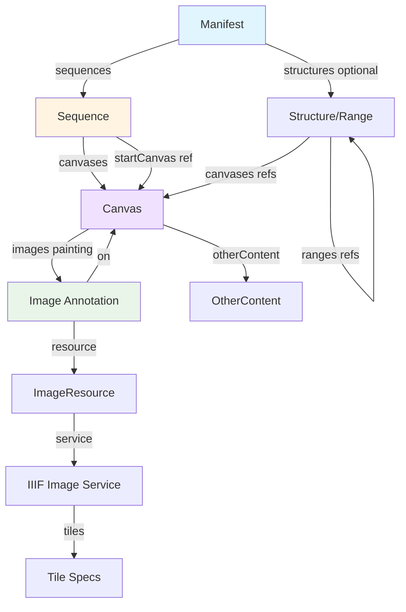
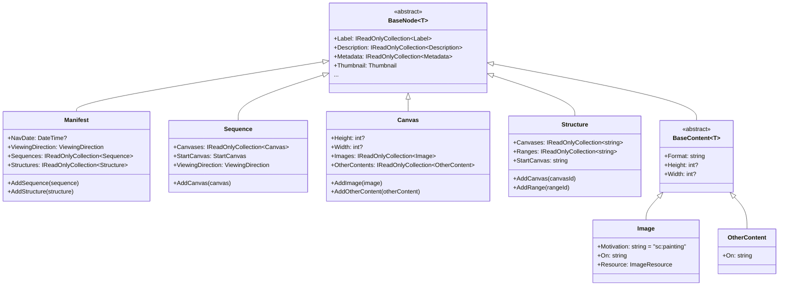
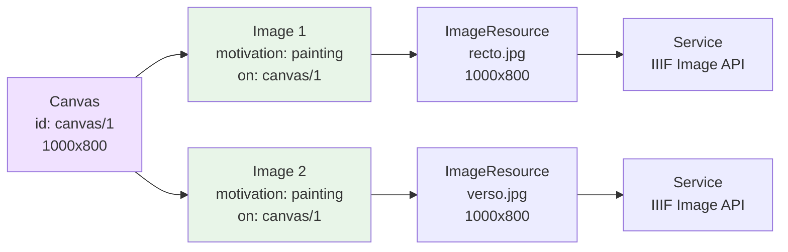
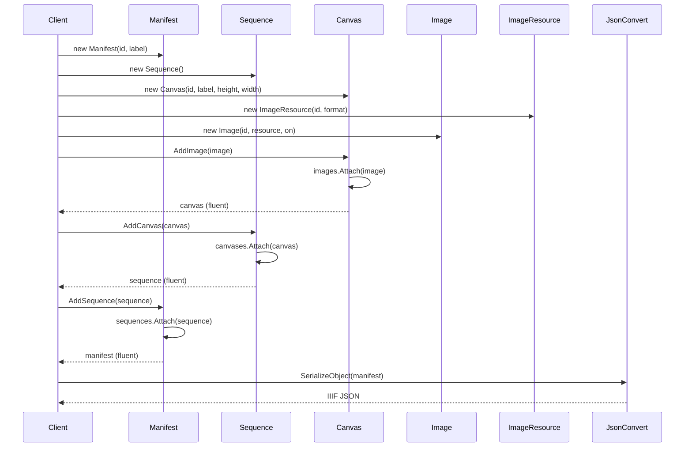

# Nodes

## Contents
- [Overview](#overview)
- [Subdirectories](#subdirectories)
- [Types & Members](#types--members)
- [Diagrams](#diagrams)
- [Examples](#examples)
- [See Also](#see-also)

## Overview

The Nodes folder contains the primary IIIF Presentation API 2.0 domain types that form the structural skeleton of a manifest: Manifest (top-level resource with sequences and structures), Sequence (ordered list of canvases with optional startCanvas), Canvas (paintable surface with dimensions, images, and otherContent), Structure/Range (hierarchical table of contents), and the Content subfolder with annotation types (Image, EmbeddedContent, Segment, OtherContent) that link resources to canvas regions. These types inherit from BaseNode or BaseContent, enforce required children (Manifest needs sequences, Sequence needs canvases, Canvas needs images), and use custom JsonConverters to validate IIIF structure using Newtonsoft.Json.

## Subdirectories

| Directory | Purpose |
|-----------|---------|
| [./Manifest/README.md](./Manifest/README.md) | Top-level Manifest type with sequences, structures, navDate, viewingDirection |
| [./Sequence/README.md](./Sequence/README.md) | Sequence type with canvas ordering, startCanvas, viewingDirection |
| [./Canvas/README.md](./Canvas/README.md) | Canvas type with dimensions, images (painting annotations), otherContent |
| [./Structure/README.md](./Structure/README.md) | Structure/Range type for hierarchical navigation outlines |
| [./Content/README.md](./Content/README.md) | Annotation content types (Image, EmbeddedContent, Segment, OtherContent) |

## Types & Members

| Type | Kind | Summary | Inherits/Implements | Key Members |
|------|------|---------|---------------------|-------------|
| `Manifest` | Class | Top-level IIIF resource; holds sequences (canvas ordering), structures (ranges for navigation), navDate (publication date), viewingDirection | `BaseNode<Manifest>`, `IViewingDirectionSupport<Manifest>` | `NavDate`, `ViewingDirection`, `Sequences`, `Structures`, `AddSequence`, `AddStructure`, `SetNavDate`, `SetViewingDirection` |
| `Sequence` | Class | Ordered list of canvases; optional startCanvas indicates initial view; optional viewingDirection controls page-turn behavior | `BaseNode<Sequence>`, `IViewingDirectionSupport<Sequence>` | `Canvases`, `StartCanvas`, `ViewingDirection`, `AddCanvas`, `RemoveCanvas`, `SetStartCanvas`, `SetViewingDirection` |
| `Canvas` | Class | Paintable surface with required height/width; holds images (painting annotations linking image resources) and otherContent (non-painting annotations) | `BaseNode<Canvas>`, `IDimenssionSupport<Canvas>` | `Height`, `Width`, `Images`, `OtherContents`, `AddImage`, `AddOtherContent` |
| `Structure` | Class | Hierarchical range/structure for navigation outlines; holds canvas IDs and nested range IDs; optional startCanvas indicates focus | `BaseNode<Structure>` | `Canvases`, `Ranges`, `StartCanvas`, `AddCanvas`, `AddRange`, `SetStartCanvas` |

[↑ Back to top](#contents)

## Diagrams

### IIIF Manifest Structure



### Type Hierarchy



### Canvas with Multiple Images (e.g., Recto/Verso)



### Sequence Flow: Manifest → Sequence → Canvas → Image



[↑ Back to top](#contents)

## Examples

### Simple Single-Image Manifest

```csharp
using IIIF.Manifests.Serializer.Nodes;
using IIIF.Manifests.Serializer.Properties;
using Newtonsoft.Json;

// Create manifest
var manifest = new Manifest(
    "https://example.org/manifest",
    new Label("Single Page Document")
);

// Create canvas with dimensions
var canvas = new Canvas(
    "https://example.org/canvas/1",
    new Label("Page 1"),
    1000,
    800
);

// Create image resource
var resource = new ImageResource(
    "https://example.org/image.jpg",
    "image/jpeg"
)
.SetHeight(1000)
.SetWidth(800);

// Create painting annotation linking resource to canvas
var image = new Image(
    "https://example.org/annotation/1",
    resource,
    canvas.Id
);

// Assemble hierarchy
canvas.AddImage(image);

var sequence = new Sequence()
    .AddCanvas(canvas);

manifest.AddSequence(sequence);

// Serialize
var json = JsonConvert.SerializeObject(manifest, Formatting.Indented);
Console.WriteLine(json);
```

### Multi-Page Book with Navigation

```csharp
// Create manifest with viewing direction
var manifest = new Manifest("https://example.org/book-manifest", new Label("Complete Works"))
    .SetViewingDirection(ViewingDirection.LeftToRight)
    .SetMetadata("Author", "Jane Doe")
    .SetMetadata("Date", "1850");

// Create sequence
var sequence = new Sequence()
    .SetViewingDirection(ViewingDirection.LeftToRight);

// Add canvases for each page
for (int i = 1; i <= 100; i++)
{
    var canvas = new Canvas(
        $"https://example.org/canvas/{i}",
        new Label($"Page {i}"),
        1200,
        900
    );
    
    var resource = new ImageResource(
        $"https://example.org/images/page{i}.jpg",
        "image/jpeg"
    )
    .SetHeight(1200)
    .SetWidth(900);
    
    // Add IIIF Image Service for deep-zoom
    var service = new Service(
        "http://iiif.io/api/image/2/context.json",
        $"https://example.org/iiif/page{i}",
        "http://iiif.io/api/image/2/level1.json"
    )
    .AddTile(new Tile(512, new[] { 1, 2, 4, 8 }));
    
    resource.SetService(service);
    
    var image = new Image(
        $"https://example.org/annotation/{i}",
        resource,
        canvas.Id
    );
    
    canvas.AddImage(image);
    sequence.AddCanvas(canvas);
}

manifest.AddSequence(sequence);

// Add hierarchical structure for chapters
var chapter1 = new Structure("https://example.org/range/chapter1")
    .AddLabel(new Label("Chapter 1: Introduction"))
    .AddCanvas("https://example.org/canvas/1")
    .AddCanvas("https://example.org/canvas/2")
    .AddCanvas("https://example.org/canvas/3");

var chapter2 = new Structure("https://example.org/range/chapter2")
    .AddLabel(new Label("Chapter 2: Main Content"))
    .AddCanvas("https://example.org/canvas/4")
    .AddCanvas("https://example.org/canvas/5");

manifest.AddStructure(chapter1)
        .AddStructure(chapter2);

var json = JsonConvert.SerializeObject(manifest);
```

### Canvas with OtherContent (Annotations)

```csharp
// Create canvas
var canvas = new Canvas(
    "https://example.org/canvas/1",
    new Label("Annotated Page"),
    1000,
    800
);

// Add painting annotation (primary image)
var imageResource = new ImageResource("https://example.org/image.jpg", "image/jpeg")
    .SetHeight(1000)
    .SetWidth(800);

var image = new Image(
    "https://example.org/annotation/image",
    imageResource,
    canvas.Id
);

canvas.AddImage(image);

// Add otherContent (e.g., link to annotation list)
var otherContent = new OtherContent(
    "https://example.org/annotationlist/1",
    canvas.Id
);

canvas.AddOtherContent(otherContent);

// Result includes both images and otherContent
Console.WriteLine(canvas.Images.Count);        // 1
Console.WriteLine(canvas.OtherContents.Count); // 1
```

[↑ Back to top](#contents)

## See Also

- [./Manifest/README.md](./Manifest/README.md) – Top-level Manifest details
- [./Sequence/README.md](./Sequence/README.md) – Sequence canvas ordering
- [./Canvas/README.md](./Canvas/README.md) – Canvas painting surface
- [./Structure/README.md](./Structure/README.md) – Navigation ranges
- [./Content/README.md](./Content/README.md) – Annotation content types
- [../Shared/BaseNode/README.md](../Shared/BaseNode/README.md) – BaseNode metadata capabilities
- [../Properties/README.md](../Properties/README.md) – IIIF property types (Label, Service, etc.)
- [IIIF Presentation API 2.0](https://iiif.io/api/presentation/2.0/) – Official specification

[↑ Back to top](#contents)
