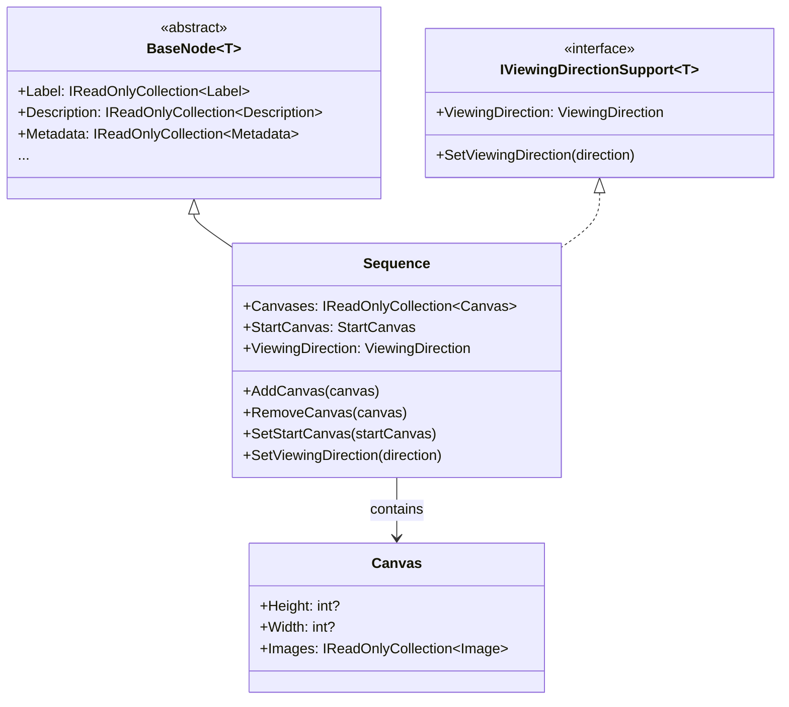
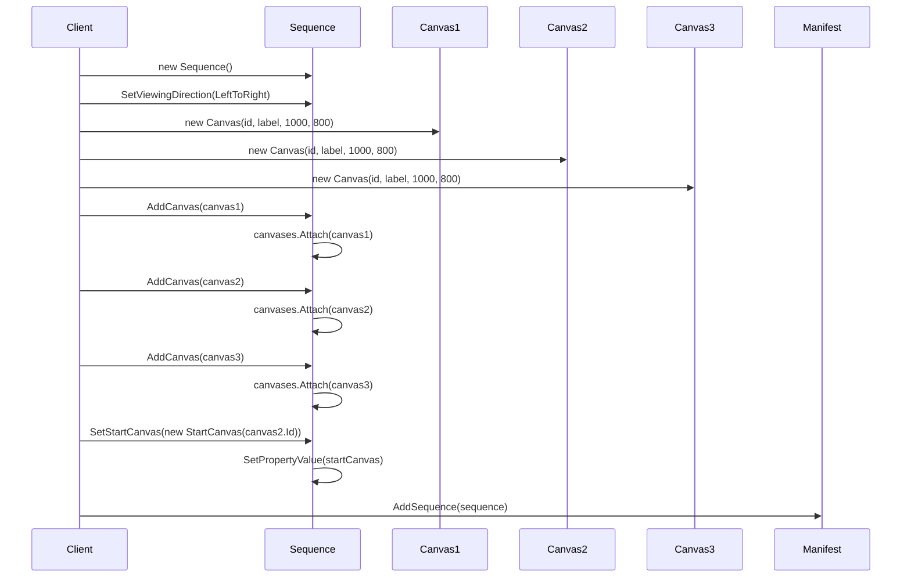

# Sequence

## Contents
- [Overview](#overview)
- [Files](#files)
- [Types & Members](#types--members)
- [Sequence](#sequence-1)
- [SequenceJsonConverter](#sequencejsonconverter)
- [Diagrams](#diagrams)
- [Examples](#examples)
- [See Also](#see-also)

## Overview

The Sequence folder contains the IIIF Presentation API 2.0 type that orders canvases for viewing. Sequence holds an ordered list of Canvas objects, an optional StartCanvas reference indicating the initial view, and an optional viewingDirection controlling page-turn behavior. Manifests must contain at least one Sequence (typically only one, representing the primary viewing order). SequenceJsonConverter enforces required canvases, parses startCanvas as object or string @id, handles viewingDirection serialization, and delegates to BaseNodeJsonConverter for metadata fields using Newtonsoft.Json.

## Files

| File | Primary type(s) | LOC (approx) | Responsibility |
|------|-----------------|--------------|----------------|
| [Sequence.cs](../../../src/IIIF.Manifest.Serializer.Net/Nodes/Sequence/Sequence.cs) | `Sequence` | 44 | Ordered canvas list with optional startCanvas and viewingDirection |
| [SequenceJsonConverter.cs](../../../src/IIIF.Manifest.Serializer.Net/Nodes/Sequence/SequenceJsonConverter.cs) | `SequenceJsonConverter` | 95 | Validates canvases required, parses startCanvas (object or string), writes sequence JSON |

[↑ Back to top](#contents)

## Types & Members

| Type | Kind | Summary | Inherits/Implements | Key Members |
|------|------|---------|---------------------|-------------|
| `Sequence` | Class | Ordered list of canvases for viewing; optional startCanvas indicates initial view; optional viewingDirection controls page-turn behavior | `BaseNode<Sequence>`, `IViewingDirectionSupport<Sequence>` | `Canvases`, `StartCanvas`, `ViewingDirection`, `AddCanvas`, `RemoveCanvas`, `SetStartCanvas`, `SetViewingDirection` |
| `SequenceJsonConverter` | Class | Custom JsonConverter that enforces canvases required, parses startCanvas (accepts object form with @id or plain string), handles viewingDirection | `BaseNodeJsonConverter<Sequence>` | `CreateInstance`, `EnrichReadJson`, `EnrichMoreWriteJson` |

[↑ Back to top](#contents)

## Sequence

Ordered list of Canvas objects representing the primary viewing order for a manifest. Typically a manifest has one sequence containing all canvases. StartCanvas indicates which canvas to display initially (defaults to first if omitted). ViewingDirection controls page-turn behavior (left-to-right, right-to-left, etc.).

### Properties

- `Canvases` (IReadOnlyCollection<Canvas>) – Ordered list of canvases; REQUIRED (must have at least one)
- `StartCanvas` (StartCanvas) – Optional reference to initial canvas; if omitted, viewer starts at first canvas
- `ViewingDirection` (ViewingDirection) – Optional viewing direction; overrides manifest-level setting; values: LeftToRight, RightToLeft, TopToBottom, BottomToTop, Unspecified

### Constants

- `StartCanvasJName` = "startCanvas"
- `CanvasesJName` = "canvases"
- `ViewingDirectionJName` = "viewingDirection" (from Constants)

### Inherited from BaseNode

- Label, Description, Metadata, Attribution, Logo, Thumbnail, License, ViewingHint, Rendering, SeeAlso, Within, Related

### Inherited from BaseItem

- Context, Id, Type ("sc:Sequence"), Service

### Constructors

- `Sequence()` – Default constructor; id defaults to empty string
- `Sequence(string id)` – Constructor with explicit id; calls base with type "sc:Sequence"

### Methods

- `AddCanvas(Canvas canvas)` – Adds canvas via SetPropertyValue + Attach
- `RemoveCanvas(Canvas canvas)` – Removes canvas via SetPropertyValue + Detach
- `SetStartCanvas(StartCanvas startCanvas)` – Sets start canvas reference via SetPropertyValue
- `SetViewingDirection(ViewingDirection viewingDirection)` – Sets viewing direction via SetPropertyValue

### Usage

```csharp
// Create sequence
var sequence = new Sequence()
    .SetViewingDirection(ViewingDirection.LeftToRight);

// Add canvases in order
var canvas1 = new Canvas("https://example.org/canvas/1", new Label("Page 1"), 1000, 800);
var canvas2 = new Canvas("https://example.org/canvas/2", new Label("Page 2"), 1000, 800);
var canvas3 = new Canvas("https://example.org/canvas/3", new Label("Page 3"), 1000, 800);

sequence.AddCanvas(canvas1)
        .AddCanvas(canvas2)
        .AddCanvas(canvas3);

// Set start canvas to page 2
sequence.SetStartCanvas(new StartCanvas(canvas2.Id));

// Add to manifest
manifest.AddSequence(sequence);
```

[↑ Back to top](#contents)

## SequenceJsonConverter

Custom JsonConverter for Sequence type. Enforces that at least one canvas exists, parses startCanvas (accepts object with @id or plain string), handles viewingDirection serialization via IViewingDirectionSupportHelper, and delegates to BaseNodeJsonConverter for metadata fields.

### Methods

- `CreateInstance(JToken element, ...)` – Extracts optional @id from element (defaults to empty string); constructs Sequence
- `EnrichReadJson(Sequence item, JToken element, ...)` – Calls base.EnrichReadJson (BaseNode fields), parses canvases (required), parses startCanvas (optional, accepts object or string), parses viewingDirection (optional)
- `EnrichMoreWriteJson(JsonWriter writer, Sequence value, JsonSerializer serializer)` – Calls base.EnrichMoreWriteJson (BaseNode fields), writes startCanvas (plain string @id), writes viewingDirection (if not Unspecified), writes canvases (array)

### StartCanvas Parsing

The converter accepts startCanvas in two forms:
1. **Object form**: `"startCanvas": { "@id": "https://example.org/canvas/2" }`
2. **String form**: `"startCanvas": "https://example.org/canvas/2"`

During serialization, always writes as plain string for simplicity.

### Validation Rules

1. At least one canvas is required (enforced during deserialization)
2. startCanvas is optional; if present, must be valid string or object with @id
3. viewingDirection defaults to Unspecified (not written unless set)

### Usage

```csharp
// Deserialization
var json = @"{
  ""@id"": ""https://example.org/sequence/1"",
  ""@type"": ""sc:Sequence"",
  ""startCanvas"": ""https://example.org/canvas/2"",
  ""viewingDirection"": ""left-to-right"",
  ""canvases"": [{...}]
}";

var sequence = JsonConvert.DeserializeObject<Sequence>(json);
Console.WriteLine(sequence.StartCanvas.Value);     // https://example.org/canvas/2
Console.WriteLine(sequence.ViewingDirection);       // LeftToRight
Console.WriteLine(sequence.Canvases.Count);         // 1

// Serialization
var json2 = JsonConvert.SerializeObject(sequence, Formatting.Indented);
```

[↑ Back to top](#contents)

## Diagrams

### Sequence Structure

```mermaid
graph TD
    A[Sequence<br/>@id optional<br/>viewingDirection] --> B[Canvas 1]
    A --> C[Canvas 2]
    A --> D[Canvas 3]
    A --> E[StartCanvas ref]
    
    E -.references.-> C
    
    B --> F[Images]
    B --> G[OtherContent]
    
    style A fill:#fff4e1
    style B fill:#f0e1ff
    style C fill:#f0e1ff
    style D fill:#f0e1ff
    style E fill:#e8f5e8
```

### Sequence Type Hierarchy



### Building a Sequence



[↑ Back to top](#contents)

## Examples

### Simple Sequence with Three Canvases

```csharp
using IIIF.Manifests.Serializer.Nodes;
using IIIF.Manifests.Serializer.Properties;

// Create sequence
var sequence = new Sequence();

// Add canvases in order
for (int i = 1; i <= 3; i++)
{
    var canvas = new Canvas(
        $"https://example.org/canvas/{i}",
        new Label($"Page {i}"),
        1000,
        800
    );
    
    var resource = new ImageResource(
        $"https://example.org/image{i}.jpg",
        "image/jpeg"
    )
    .SetHeight(1000)
    .SetWidth(800);
    
    var image = new Image(
        $"https://example.org/anno/{i}",
        resource,
        canvas.Id
    );
    
    canvas.AddImage(image);
    sequence.AddCanvas(canvas);
}

// Add to manifest
var manifest = new Manifest("https://example.org/manifest", new Label("Book"))
    .AddSequence(sequence);
```

### Sequence with StartCanvas

```csharp
// Create canvases
var cover = new Canvas("https://example.org/canvas/cover", 
                       new Label("Cover"), 1000, 800);
var titlePage = new Canvas("https://example.org/canvas/title", 
                          new Label("Title Page"), 1000, 800);
var page1 = new Canvas("https://example.org/canvas/1", 
                       new Label("Page 1"), 1000, 800);

// ... add images to canvases ...

// Create sequence starting at title page (skip cover)
var sequence = new Sequence()
    .AddCanvas(cover)
    .AddCanvas(titlePage)
    .AddCanvas(page1)
    .SetStartCanvas(new StartCanvas(titlePage.Id));

// Viewer will initially display title page, not cover
```

### Sequence with ViewingDirection Override

```csharp
// Manifest has default left-to-right
var manifest = new Manifest("https://example.org/manifest", new Label("Mixed Content"))
    .SetViewingDirection(ViewingDirection.LeftToRight);

// Main sequence uses manifest default
var mainSequence = new Sequence("https://example.org/seq/main")
    .AddCanvas(canvas1)
    .AddCanvas(canvas2);

// Arabic supplement uses right-to-left
var arabicSequence = new Sequence("https://example.org/seq/arabic")
    .SetViewingDirection(ViewingDirection.RightToLeft)
    .AddCanvas(arabicCanvas1)
    .AddCanvas(arabicCanvas2);

manifest.AddSequence(mainSequence)
        .AddSequence(arabicSequence);

// Result: main sequence uses left-to-right (manifest default)
//         arabic sequence uses right-to-left (overridden)
```

### Sequence with Descriptive Metadata

```csharp
// Sequence can have its own metadata
var sequence = new Sequence("https://example.org/seq/volume1")
    .AddLabel(new Label("Volume 1"))
    .AddDescription(new Description("First volume containing chapters 1-10"))
    .SetThumbnail(new Thumbnail("https://example.org/vol1-thumb.jpg"));

// Add canvases
for (int i = 1; i <= 10; i++)
{
    var canvas = new Canvas($"https://example.org/canvas/{i}", 
                           new Label($"Chapter {i}"), 1000, 800);
    // ... add images ...
    sequence.AddCanvas(canvas);
}

// Multi-volume work with separate sequences
var manifest = new Manifest("https://example.org/complete-works", 
                           new Label("Complete Works"));
manifest.AddSequence(sequence);
// ... add more volume sequences ...
```

### Deserializing and Navigating Sequence

```csharp
var json = File.ReadAllText("manifest.json");
var manifest = JsonConvert.DeserializeObject<Manifest>(json);

foreach (var sequence in manifest.Sequences)
{
    Console.WriteLine($"Sequence: {sequence.Id}");
    Console.WriteLine($"  Viewing Direction: {sequence.ViewingDirection}");
    Console.WriteLine($"  Canvas Count: {sequence.Canvases.Count}");
    
    if (sequence.StartCanvas != null)
        Console.WriteLine($"  Start Canvas: {sequence.StartCanvas.Value}");
    
    foreach (var canvas in sequence.Canvases)
    {
        Console.WriteLine($"    Canvas: {canvas.Label.First().Value}");
        Console.WriteLine($"      Size: {canvas.Width}x{canvas.Height}");
        Console.WriteLine($"      Images: {canvas.Images.Count}");
    }
}
```

[↑ Back to top](#contents)

## See Also

- [../Canvas/README.md](../Canvas/README.md) – Canvas painting surface held by sequences
- [../Manifest/README.md](../Manifest/README.md) – Manifest holds sequences
- [../../Properties/README.md](../../Properties/README.md) – StartCanvas, ViewingDirection types
- [../../Shared/BaseNode/README.md](../../Shared/BaseNode/README.md) – Inherited metadata capabilities
- [../README.md](../README.md) – Parent Nodes folder overview
- [IIIF Presentation API 2.0 - Sequence](https://iiif.io/api/presentation/2.0/#sequence) – Official specification

[↑ Back to top](#contents)
