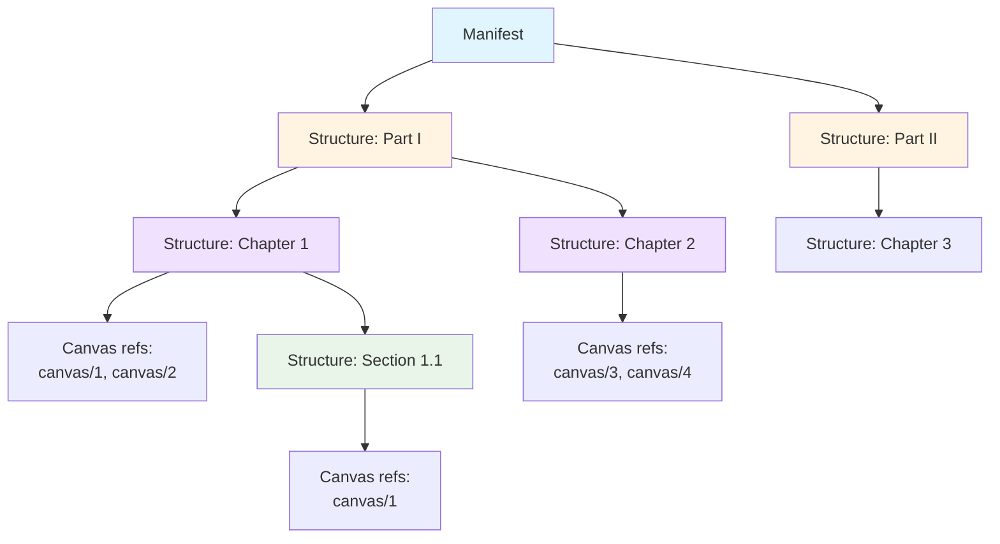
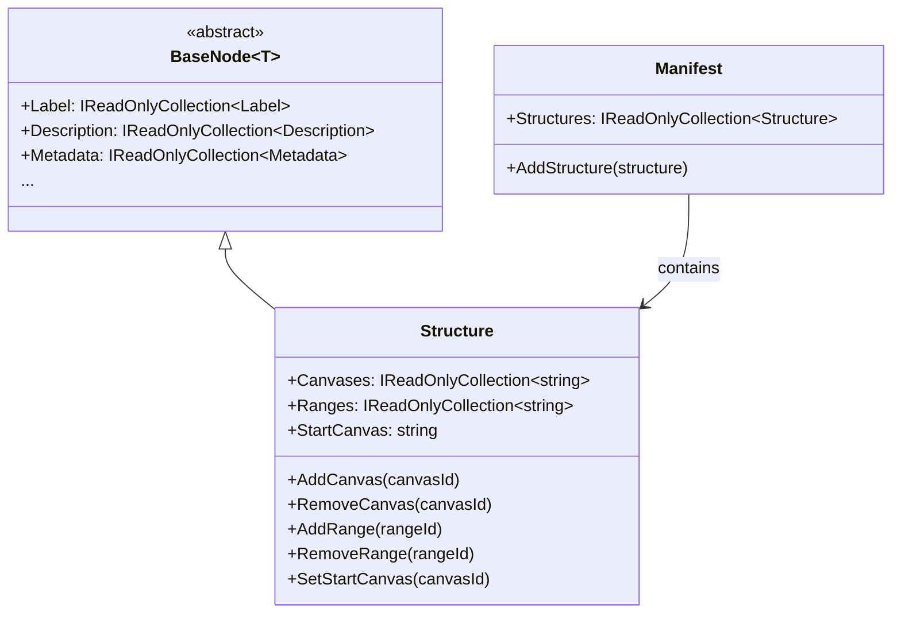
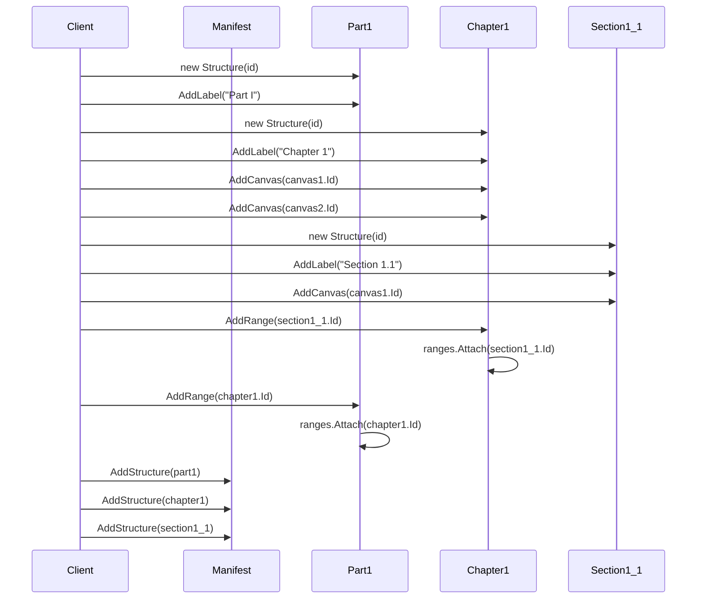

# Structure

## Contents
- [Overview](#overview)
- [Files](#files)
- [Types & Members](#types--members)
- [Structure (Range)](#structure-range)
- [StructureJsonConverter](#structurejsonconverter)
- [Diagrams](#diagrams)
- [Examples](#examples)
- [See Also](#see-also)

## Overview

The Structure folder contains the IIIF Presentation API 2.0 range/structure type for hierarchical navigation outlines (table of contents, chapters, sections). Structure holds canvas ID references (not full Canvas objects) and nested range ID references to create tree-like navigation hierarchies. Optional startCanvas indicates the focal canvas for a range. StructureJsonConverter enforces required @id, validates canvas/range arrays (throws if not arrays), and writes structure JSON using Newtonsoft.Json. Manifests may include zero or more structures for multi-level navigation (parts, chapters, pages).

## Files

| File | Primary type(s) | LOC (approx) | Responsibility |
|------|-----------------|--------------|----------------|
| [Structure.cs](../../../src/IIIF.Manifest.Serializer.Net/Nodes/Structure/Structure.cs) | `Structure` | 42 | Range/structure with canvas/range ID references and optional startCanvas |
| [StructureJsonConverter.cs](../../../src/IIIF.Manifest.Serializer.Net/Nodes/Structure/StructureJsonConverter.cs) | `StructureJsonConverter` | 90 | Validates @id required, enforces canvases/ranges as arrays, writes structure JSON |

[↑ Back to top](#contents)

## Types & Members

| Type | Kind | Summary | Inherits/Implements | Key Members |
|------|------|---------|---------------------|-------------|
| `Structure` | Class | Hierarchical range for navigation outlines; holds canvas ID references and nested range ID references; optional startCanvas indicates focus | `BaseNode<Structure>` | `Canvases`, `Ranges`, `StartCanvas`, `AddCanvas`, `RemoveCanvas`, `AddRange`, `RemoveRange`, `SetStartCanvas` |
| `StructureJsonConverter` | Class | Custom JsonConverter that enforces @id required, validates canvases/ranges are arrays (throws JsonObjectMustBeJArray if single object), writes structure JSON | `BaseNodeJsonConverter<Structure>` | `CreateInstance`, `EnrichReadJson`, `EnrichMoreWriteJson` |

[↑ Back to top](#contents)

## Structure (Range)

Hierarchical navigation structure (also called Range in IIIF terminology) that organizes canvases into logical groupings (chapters, sections, folios). Holds string IDs referencing canvases and nested ranges, not full objects. StartCanvas indicates which canvas to highlight when navigating to this range.

### Properties

- `Canvases` (IReadOnlyCollection<string>) – Canvas @id references; must be valid canvas URIs from the manifest's sequences
- `Ranges` (IReadOnlyCollection<string>) – Nested range @id references; creates hierarchical tree structure
- `StartCanvas` (string) – Optional canvas @id indicating focal canvas for this range

### Constants

- `CanvasesJName` = "canvases"
- `RangesJName` = "ranges"
- `StartCanvasJName` = "startCanvas"

### Inherited from BaseNode

- Label, Description, Metadata, Attribution, Logo, Thumbnail, License, ViewingHint, Rendering, SeeAlso, Within, Related

### Inherited from BaseItem

- Context, Id, Type ("sc:Range"), Service

### Constructor

- `Structure(string id)` – Creates structure with required @id; calls base with type "sc:Range"

### Methods

- `AddCanvas(string canvas)` – Adds canvas @id reference via SetPropertyValue + Attach
- `RemoveCanvas(string canvas)` – Removes canvas @id reference via SetPropertyValue + Detach
- `AddRange(string range)` – Adds nested range @id reference via SetPropertyValue + Attach
- `RemoveRange(string range)` – Removes nested range @id reference via SetPropertyValue + Detach
- `SetStartCanvas(string startCanvas)` – Sets start canvas @id via SetPropertyValue

### Usage

```csharp
// Create chapter structure
var chapter1 = new Structure("https://example.org/range/chapter1")
    .AddLabel(new Label("Chapter 1: Introduction"))
    .AddCanvas("https://example.org/canvas/1")
    .AddCanvas("https://example.org/canvas/2")
    .AddCanvas("https://example.org/canvas/3")
    .SetStartCanvas("https://example.org/canvas/1");

// Create nested sub-sections
var section1_1 = new Structure("https://example.org/range/section1.1")
    .AddLabel(new Label("Section 1.1: Background"))
    .AddCanvas("https://example.org/canvas/1")
    .AddCanvas("https://example.org/canvas/2");

var section1_2 = new Structure("https://example.org/range/section1.2")
    .AddLabel(new Label("Section 1.2: Methodology"))
    .AddCanvas("https://example.org/canvas/3");

// Link sub-sections to chapter
chapter1.AddRange(section1_1.Id)
        .AddRange(section1_2.Id);

// Add all structures to manifest
manifest.AddStructure(chapter1)
        .AddStructure(section1_1)
        .AddStructure(section1_2);

// Result: hierarchical navigation
// Chapter 1: Introduction (pages 1-3)
//   Section 1.1: Background (pages 1-2)
//   Section 1.2: Methodology (page 3)
```

[↑ Back to top](#contents)

## StructureJsonConverter

Custom JsonConverter for Structure type. Enforces @id required, validates that canvases and ranges are arrays (throws JsonObjectMustBeJArray if single object provided), parses canvas/range ID references, and delegates to BaseNodeJsonConverter for metadata fields.

### Methods

- `CreateInstance(JToken element, ...)` – Extracts @id from element; throws JsonNodeRequiredException if missing; constructs Structure
- `EnrichReadJson(Structure item, JToken element, ...)` – Calls base.EnrichReadJson (BaseNode fields), parses canvases (array of strings), parses ranges (array of strings), parses startCanvas (optional string), validates arrays
- `EnrichMoreWriteJson(JsonWriter writer, Structure value, JsonSerializer serializer)` – Calls base.EnrichMoreWriteJson (BaseNode fields), writes canvases (array if present), writes ranges (array if present), writes startCanvas (string if present)

### Validation Rules

1. @id is required (inherited from BaseItemJsonConverter)
2. canvases must be array if present (throws JsonObjectMustBeJArray<Structure> if single object)
3. ranges must be array if present (throws JsonObjectMustBeJArray<Structure> if single object)
4. startCanvas is optional string @id
5. At least one of canvases or ranges should exist (though not enforced)

### Usage

```csharp
// Deserialization
var json = @"{
  ""@id"": ""https://example.org/range/chapter1"",
  ""@type"": ""sc:Range"",
  ""label"": ""Chapter 1"",
  ""canvases"": [
    ""https://example.org/canvas/1"",
    ""https://example.org/canvas/2""
  ],
  ""ranges"": [
    ""https://example.org/range/section1.1""
  ],
  ""startCanvas"": ""https://example.org/canvas/1""
}";

var structure = JsonConvert.DeserializeObject<Structure>(json);
Console.WriteLine(structure.Canvases.Count);    // 2
Console.WriteLine(structure.Ranges.Count);      // 1
Console.WriteLine(structure.StartCanvas);       // https://example.org/canvas/1

// Serialization
var json2 = JsonConvert.SerializeObject(structure, Formatting.Indented);
```

[↑ Back to top](#contents)

## Diagrams

### Structure Hierarchy



### Structure Type Hierarchy



### Building Hierarchical Structure



[↑ Back to top](#contents)

## Examples

### Simple Chapter Structure

```csharp
using IIIF.Manifests.Serializer.Nodes;
using IIIF.Manifests.Serializer.Properties;

// Create chapter pointing to canvases
var chapter1 = new Structure("https://example.org/range/ch1")
    .AddLabel(new Label("Chapter 1: Introduction"))
    .AddCanvas("https://example.org/canvas/1")
    .AddCanvas("https://example.org/canvas/2")
    .AddCanvas("https://example.org/canvas/3");

var chapter2 = new Structure("https://example.org/range/ch2")
    .AddLabel(new Label("Chapter 2: Methods"))
    .AddCanvas("https://example.org/canvas/4")
    .AddCanvas("https://example.org/canvas/5");

// Add to manifest
manifest.AddStructure(chapter1)
        .AddStructure(chapter2);

// Viewer displays:
// - Chapter 1: Introduction (pages 1-3)
// - Chapter 2: Methods (pages 4-5)
```

### Hierarchical Structure with Nested Ranges

```csharp
// Create top-level part
var part1 = new Structure("https://example.org/range/part1")
    .AddLabel(new Label("Part I: Foundations"));

// Create chapters under part
var chapter1 = new Structure("https://example.org/range/ch1")
    .AddLabel(new Label("Chapter 1"))
    .AddCanvas("https://example.org/canvas/1")
    .AddCanvas("https://example.org/canvas/2");

var chapter2 = new Structure("https://example.org/range/ch2")
    .AddLabel(new Label("Chapter 2"))
    .AddCanvas("https://example.org/canvas/3")
    .AddCanvas("https://example.org/canvas/4");

// Create sections under chapter1
var section1_1 = new Structure("https://example.org/range/sec1.1")
    .AddLabel(new Label("Section 1.1"))
    .AddCanvas("https://example.org/canvas/1");

var section1_2 = new Structure("https://example.org/range/sec1.2")
    .AddLabel(new Label("Section 1.2"))
    .AddCanvas("https://example.org/canvas/2");

// Link hierarchy
chapter1.AddRange(section1_1.Id)
        .AddRange(section1_2.Id);

part1.AddRange(chapter1.Id)
     .AddRange(chapter2.Id);

// Add all structures to manifest (flat list, hierarchy via range references)
manifest.AddStructure(part1)
        .AddStructure(chapter1)
        .AddStructure(chapter2)
        .AddStructure(section1_1)
        .AddStructure(section1_2);

// Navigation tree:
// Part I: Foundations
//   Chapter 1
//     Section 1.1 (page 1)
//     Section 1.2 (page 2)
//   Chapter 2 (pages 3-4)
```

### Structure with StartCanvas

```csharp
// Create chapter with start canvas indicating focal page
var chapter = new Structure("https://example.org/range/intro")
    .AddLabel(new Label("Introduction"))
    .AddDescription(new Description("Opening chapter with frontispiece"))
    .AddCanvas("https://example.org/canvas/cover")
    .AddCanvas("https://example.org/canvas/frontispiece")
    .AddCanvas("https://example.org/canvas/1")
    .SetStartCanvas("https://example.org/canvas/frontispiece"); // Focus on frontispiece

// When user navigates to this range, viewer jumps to frontispiece
// instead of first canvas (cover)
```

### Table of Contents Structure

```csharp
// Build complete table of contents
var toc = new List<Structure>();

// Front matter
toc.Add(new Structure("https://example.org/range/frontmatter")
    .AddLabel(new Label("Front Matter"))
    .AddCanvas("https://example.org/canvas/title")
    .AddCanvas("https://example.org/canvas/dedication")
    .AddCanvas("https://example.org/canvas/toc"));

// Chapters
for (int i = 1; i <= 10; i++)
{
    var chapter = new Structure($"https://example.org/range/ch{i}")
        .AddLabel(new Label($"Chapter {i}"));
    
    // Each chapter has 10 pages
    for (int p = 1; p <= 10; p++)
    {
        int pageNum = (i - 1) * 10 + p;
        chapter.AddCanvas($"https://example.org/canvas/{pageNum}");
    }
    
    toc.Add(chapter);
}

// Back matter
toc.Add(new Structure("https://example.org/range/backmatter")
    .AddLabel(new Label("Back Matter"))
    .AddCanvas("https://example.org/canvas/appendix")
    .AddCanvas("https://example.org/canvas/index"));

// Add all structures
toc.ForEach(structure => manifest.AddStructure(structure));
```

### Navigating Structures

```csharp
// Deserialize manifest
var json = File.ReadAllText("manifest.json");
var manifest = JsonConvert.DeserializeObject<Manifest>(json);

// Print table of contents
Console.WriteLine("Table of Contents:");
foreach (var structure in manifest.Structures)
{
    Console.WriteLine($"- {structure.Label.First().Value}");
    Console.WriteLine($"  ID: {structure.Id}");
    Console.WriteLine($"  Canvases: {structure.Canvases.Count}");
    
    if (structure.Ranges.Count > 0)
    {
        Console.WriteLine($"  Sub-ranges: {structure.Ranges.Count}");
        foreach (var rangeId in structure.Ranges)
        {
            var subRange = manifest.Structures.FirstOrDefault(s => s.Id == rangeId);
            if (subRange != null)
                Console.WriteLine($"    - {subRange.Label.First().Value}");
        }
    }
    
    if (structure.StartCanvas != null)
        Console.WriteLine($"  Start Canvas: {structure.StartCanvas}");
}
```

[↑ Back to top](#contents)

## See Also

- [../Manifest/README.md](../Manifest/README.md) – Manifest holds structures
- [../Canvas/README.md](../Canvas/README.md) – Canvas types referenced by structure canvases
- [../../Shared/BaseNode/README.md](../../Shared/BaseNode/README.md) – Inherited metadata capabilities
- [../README.md](../README.md) – Parent Nodes folder overview
- [IIIF Presentation API 2.0 - Range](https://iiif.io/api/presentation/2.0/#range) – Official specification

[↑ Back to top](#contents)
