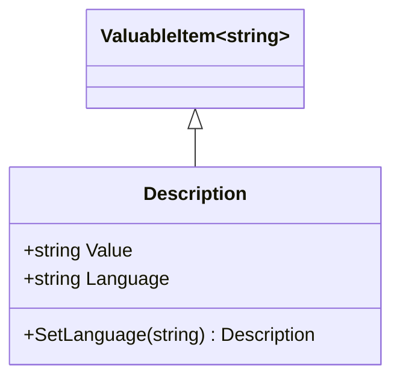

# Description

## Contents
- [Overview](#overview)
- [Files](#files)
- [Types & Members](#types--members)
- [Diagrams](#diagrams)
- [Examples](#examples)
- [See Also](#see-also)

## Overview

Description provides multi-language descriptive text for IIIF resources. Supports single string or language-tagged values (@value/@language). DescriptionJsonConverter handles both forms using Newtonsoft.Json.

## Files

| File | Primary type(s) | LOC (approx) | Responsibility |
|------|-----------------|--------------|----------------|
| [Description.cs](../../../../src/IIIF.Manifest.Serializer.Net/Properties/Description/Description.cs) | `Description` | 18 | Multi-language description |
| [DescriptionJsonConverter.cs](../../../../src/IIIF.Manifest.Serializer.Net/Properties/Description/DescriptionJsonConverter.cs) | `DescriptionJsonConverter` | 55 | Parses plain/language-tagged text |

[↑ Back to top](#contents)

## Types & Members

| Type | Kind | Summary | Inherits/Implements | Key Members |
|------|------|---------|---------------------|-------------|
| `Description` | Class | Descriptive text with optional language | `ValuableItem<string>` | `Value`, `Language`, `SetLanguage` |
| `DescriptionJsonConverter` | Class | JSON converter for description | `JsonConverter` | `ReadJson`, `WriteJson` |

[↑ Back to top](#contents)

## Diagrams



[↑ Back to top](#contents)

## Examples

```csharp
// Simple description
var desc = new Description("A 16th century manuscript");

// Language-tagged description
var descEn = new Description("A 16th century manuscript").SetLanguage("en");
var descFr = new Description("Un manuscrit du 16e siècle").SetLanguage("fr");

manifest.AddDescription(descEn).AddDescription(descFr);
```

**JSON output:**
```json
{
  "description": [
    { "@value": "A 16th century manuscript", "@language": "en" },
    { "@value": "Un manuscrit du 16e siècle", "@language": "fr" }
  ]
}
```

[↑ Back to top](#contents)

## See Also

- [../README.md](../README.md) – Parent Properties folder
- [../../Shared/ValuableItem/README.md](../../Shared/ValuableItem/README.md) – ValuableItem base

[↑ Back to top](#contents)
