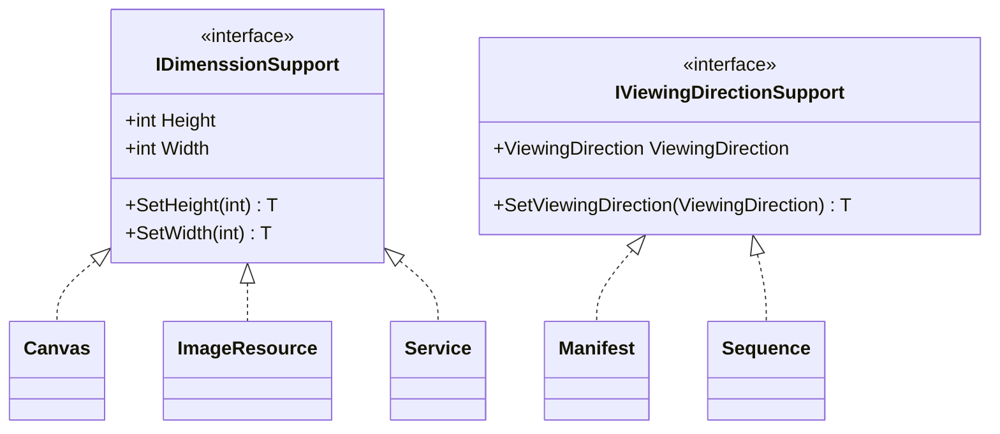

# Interfaces

## Contents
- [Overview](#overview)
- [Files](#files)
- [Types & Members](#types--members)
- [Diagrams](#diagrams)
- [Examples](#examples)
- [See Also](#see-also)

## Overview

Property interfaces define shared capabilities for IIIF resources. IDimenssionSupport provides Height/Width with SetHeight/SetWidth fluent setters. IViewingDirectionSupport provides ViewingDirection enum (left-to-right, right-to-left, top-to-bottom, bottom-to-top). Extension methods parse JToken values to enums.

## Files

| File | Primary type(s) | LOC (approx) | Responsibility |
|------|-----------------|--------------|----------------|
| [IDimenssionSupport.cs](../../../../src/IIIF.Manifest.Serializer.Net/Properties/Interfaces/IDimenssionSupport.cs) | `IDimenssionSupport` | 12 | Height/Width properties and setters |
| [IViewingDirectionSupport.cs](../../../../src/IIIF.Manifest.Serializer.Net/Properties/Interfaces/IViewingDirectionSupport.cs) | `IViewingDirectionSupport` | 10 | ViewingDirection property and setter |

[↑ Back to top](#contents)

## Types & Members

| Type | Kind | Summary | Inherits/Implements | Key Members |
|------|------|---------|---------------------|-------------|
| `IDimenssionSupport` | Interface | Height/Width support | - | `Height`, `Width`, `SetHeight`, `SetWidth` |
| `IViewingDirectionSupport` | Interface | ViewingDirection support | - | `ViewingDirection`, `SetViewingDirection` |

[↑ Back to top](#contents)

## Diagrams



[↑ Back to top](#contents)

## Examples

```csharp
// IDimenssionSupport usage
Canvas canvas = new Canvas("...", new Label("Page 1"), 2000, 1500);
// canvas.Height = 2000, canvas.Width = 1500

ImageResource resource = new ImageResource("...", "image/jpeg")
    .SetHeight(2000)
    .SetWidth(1500);

// IViewingDirectionSupport usage
Manifest manifest = new Manifest("...", new Label("Book"))
    .SetViewingDirection(ViewingDirection.RightToLeft); // for RTL scripts

Sequence sequence = new Sequence("...")
    .SetViewingDirection(ViewingDirection.TopToBottom); // vertical scroll
```

[↑ Back to top](#contents)

## See Also

- [../README.md](../README.md) – Parent Properties folder
- [../ViewingDirection.cs](../ViewingDirection.cs) – ViewingDirection enum
- [../../Nodes/Canvas/README.md](../../Nodes/Canvas/README.md) – Canvas (implements IDimenssionSupport)
- [../../Nodes/Manifest/README.md](../../Nodes/Manifest/README.md) – Manifest (implements IViewingDirectionSupport)

[↑ Back to top](#contents)
