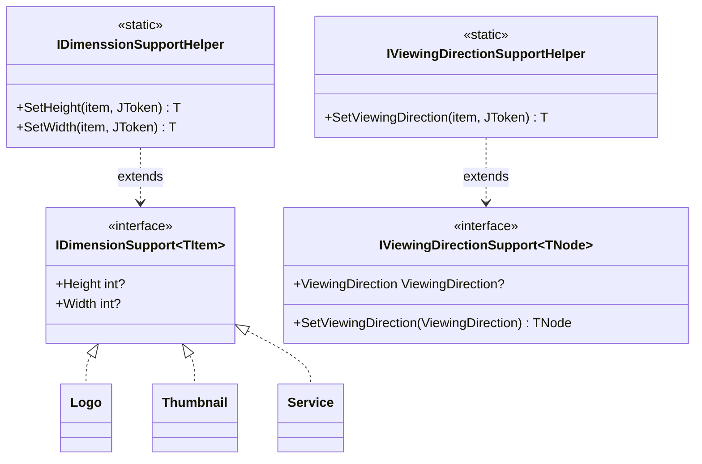

# Interfaces

## Contents

- [Overview](#overview)
- [Files](#files)
- [Types & Members](#types--members)
- [Diagrams](#diagrams)
- [Package Dependencies](#package-dependencies)
- [See Also](#see-also)

## Overview

This folder models two small **cross-cutting capability contracts** shared by otherwise-unrelated
types in [`Properties`](../README.md): "this resource carries pixel dimensions" and "this node
carries a viewing direction." Each capability interface is paired with a `static` helper class that
reads the corresponding value out of a raw `JToken` during hand-rolled JSON parsing (used by
`IiifSerializer`'s legacy-format readers) - the interface defines the public contract, the helper
keeps the JSON-reading logic in one place instead of duplicating it per implementing type. Both
interfaces are structural, not polymorphic: nothing in the SDK dispatches on `IDimensionSupport<T>`
or `IViewingDirectionSupport<T>` at runtime via a `JsonConverter` the way `IBaseService` does in
[`Services`](../Services/README.md); they exist purely to guarantee a consistent property/method
shape across implementers.

## Files

| File | Primary type(s) | LOC (approx) | Responsibility |
| --- | --- | --- | --- |
| `IDimensionSupport.cs` | `IDimensionSupport<TItem>` | 12 | Contract for a `BaseItem<T>` that exposes `Height`/`Width` (e.g. thumbnails, logos, image services). |
| `IDimenssionSupportHelper.cs` | `IDimenssionSupportHelper` | 25 | Extension methods that read `height`/`width` out of a raw `JToken` and apply them via the interface's setters. |
| `IViewingDirectionSupport.cs` | `IViewingDirectionSupport<TNode>` | 13 | Contract for a `BaseNode<T>` that exposes a fluent `ViewingDirection` getter/setter. |
| `IViewingDirectionSupportHelper.cs` | `IViewingDirectionSupportHelper` | 19 | Extension method that reads `viewingDirection` out of a raw `JToken` and applies it via the interface's setter. |

## Types & Members

| Type | Kind | Summary | Inherits/Implements | Key Members |
| --- | --- | --- | --- | --- |
| `IDimensionSupport<TItem>` | interface | Height/Width contract for `BaseItem<T>` implementers | (constrains `TItem : BaseItem<TItem>, IDimensionSupport<TItem>`) | `Height : int?`, `Width : int?` |
| `IDimenssionSupportHelper` | static class | `JToken` → `Height`/`Width` parsing helpers | - | `SetHeight<T>(this T, JToken)`, `SetWidth<T>(this T, JToken)` |
| `IViewingDirectionSupport<TNode>` | interface | ViewingDirection contract for `BaseNode<T>` implementers | (constrains `TNode : BaseNode<TNode>, IViewingDirectionSupport<TNode>`) | `ViewingDirection : ViewingDirection?`, `SetViewingDirection(ViewingDirection) : TNode` |
| `IViewingDirectionSupportHelper` | static class | `JToken` → `ViewingDirection` parsing helper | - | `SetViewingDirection<T>(this T, JToken)` |

### IDimensionSupport&lt;TItem&gt;

- **Kind / Namespace**: interface, `IIIF.Manifests.Serializer.Properties.Interfaces`.
- **Generic constraint**: `TItem : BaseItem<TItem>, IDimensionSupport<TItem>` (CRTP-style self-bound generic, matching the rest of the SDK's fluent-setter pattern).
- **Key properties**: `Height : int?` (`[JsonProperty(Constants.HeightJName)]`), `Width : int?` (`[JsonProperty(Constants.WidthJName)]`) - both getter-only on the interface; concrete implementers (`Logo`, `Thumbnail`, and `Properties/Services/Service`) supply the backing storage and their own `SetHeight`/`SetWidth` fluent methods.
- **Implementers in this SDK**: `Logo`, `Thumbnail` (both in [`Properties`](../README.md)), and `Service` (in [`Properties/Services`](../Services/README.md)).
- **Usage Recipe**:
  ```csharp
  // Any IDimensionSupport<T> implementer exposes the same read shape:
  int? height = logo.Height;
  int? width = thumbnail.Width;
  ```

### IDimenssionSupportHelper

- **Kind / Namespace**: static class, `Properties.Interfaces`. (Note the source spelling "Dimenssion" - a pre-existing typo in the file/class name, kept as-is since it's part of the public surface.)
- **Key methods**:
  - `SetHeight<T>(this T item, JToken element) : T where T : BaseItem<T>, IDimensionSupport<T>` - reads `Constants.HeightJName` off `element` and calls `item.SetHeight(...)` if present; no-op otherwise.
  - `SetWidth<T>(this T item, JToken element) : T where T : BaseItem<T>, IDimensionSupport<T>` - same for width.
- **Usage Recipe**:
  ```csharp
  // Internal usage pattern (legacy JSON parsing), shown for illustration:
  var logo = new Logo(id).SetHeight(rawJObject).SetWidth(rawJObject);
  ```

### IViewingDirectionSupport&lt;TNode&gt;

- **Kind / Namespace**: interface, `Properties.Interfaces`.
- **Generic constraint**: `TNode : BaseNode<TNode>, IViewingDirectionSupport<TNode>`.
- **Key members**: `ViewingDirection : ViewingDirection?` (`[JsonProperty(Constants.ViewingDirectionJName)]`, getter-only on the interface); `SetViewingDirection(ViewingDirection viewingDirection) : TNode` (fluent setter, part of the interface contract itself - unlike `IDimensionSupport<T>`, which leaves the setter to the implementer).
- **Implementers in this SDK**: `Manifest`, `Canvas`, and other `BaseNode`-derived top-level resources that support a reading direction.
- **Usage Recipe**:
  ```csharp
  manifest.SetViewingDirection(ViewingDirection.Rtl);
  var direction = manifest.ViewingDirection; // ViewingDirection.Rtl
  ```

### IViewingDirectionSupportHelper

- **Kind / Namespace**: static class, `Properties.Interfaces`.
- **Key methods**: `SetViewingDirection<T>(this T item, JToken element) : T where T : BaseNode<T>, IViewingDirectionSupport<T>` - reads `Constants.ViewingDirectionJName` off `element`, converts it to a `ViewingDirection` via `JToken.ToObject<ViewingDirection>()`, and applies it if present.
- **Usage Recipe**:
  ```csharp
  // Internal usage pattern (legacy JSON parsing), shown for illustration:
  var manifest = new Manifest(id, label).SetViewingDirection(rawJObject);
  ```

[↑ Back to top](#contents)

## Diagrams


```mermaid
classDiagram
    class IDimensionSupport~TItem~ {
        <<interface>>
        +Height int?
        +Width int?
    }
    class IDimenssionSupportHelper {
        <<static>>
        +SetHeight(item, JToken) T
        +SetWidth(item, JToken) T
    }
    class IViewingDirectionSupport~TNode~ {
        <<interface>>
        +ViewingDirection ViewingDirection?
        +SetViewingDirection(ViewingDirection) TNode
    }
    class IViewingDirectionSupportHelper {
        <<static>>
        +SetViewingDirection(item, JToken) T
    }
    class Logo
    class Thumbnail
    class Service

    IDimenssionSupportHelper ..> IDimensionSupport~TItem~ : extends
    IDimensionSupport~TItem~ <|.. Logo
    IDimensionSupport~TItem~ <|.. Thumbnail
    IDimensionSupport~TItem~ <|.. Service
    IViewingDirectionSupportHelper ..> IViewingDirectionSupport~TNode~ : extends
```
*Each capability interface is paired with a static `JToken`-parsing helper; `IDimensionSupport<T>` is
implemented by `Logo`/`Thumbnail` ([`Properties`](../README.md)) and `Service`
([`Properties/Services`](../Services/README.md)).*

[↑ Back to top](#contents)

## Package Dependencies

| Package | Version | Description | Links |
| --- | --- | --- | --- |
| Newtonsoft.Json | 13.0.4 | JSON.NET - this SDK's serialization engine (custom JsonConverters, attribute-driven read/write) | [NuGet](https://www.nuget.org/packages/Newtonsoft.Json/13.0.4) |

[↑ Back to top](#contents)

## See Also

- [`docs/README.md`](../../README.md) - top-level SDK documentation.
- [`Properties`](../README.md) - parent folder; `Logo`/`Thumbnail` implement `IDimensionSupport<T>` here.

[↑ Back to top](#contents)
