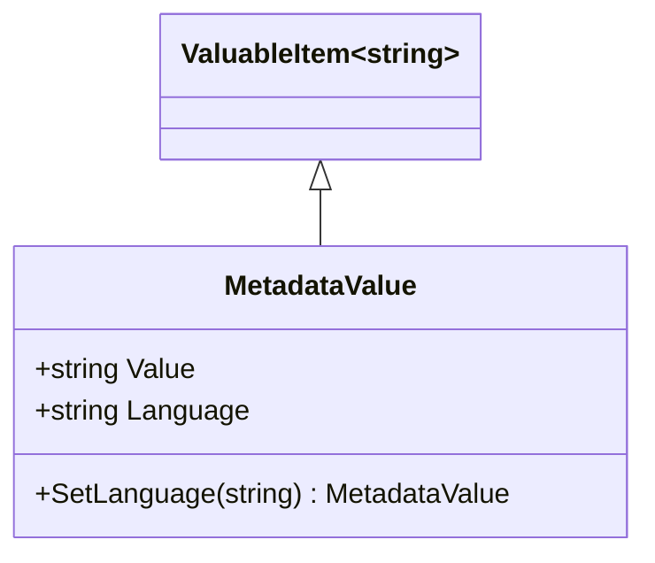

# MetadataValue

## Contents
- [Overview](#overview)
- [Files](#files)
- [Types & Members](#types--members)
- [Diagrams](#diagrams)
- [Examples](#examples)
- [See Also](#see-also)

## Overview

MetadataValue holds individual metadata values with optional language tags. Supports plain strings or @value/@language objects. Used within Metadata collections. MetadataValueJsonConverter writes language-tagged form only when language present using Newtonsoft.Json.

## Files

| File | Primary type(s) | LOC (approx) | Responsibility |
|------|-----------------|--------------|----------------|
| [MetadataValue.cs](../../../../../src/IIIF.Manifest.Serializer.Net/Properties/Metadata/MetadataValue/MetadataValue.cs) | `MetadataValue` | 16 | Metadata value with language |
| [MetadataValueJsonConverter.cs](../../../../../src/IIIF.Manifest.Serializer.Net/Properties/Metadata/MetadataValue/MetadataValueJsonConverter.cs) | `MetadataValueJsonConverter` | 48 | Parses @value/@language |

[↑ Back to top](#contents)

## Types & Members

| Type | Kind | Summary | Inherits/Implements | Key Members |
|------|------|---------|---------------------|-------------|
| `MetadataValue` | Class | Value with optional language | `ValuableItem<string>` | `Value`, `Language`, `SetLanguage` |
| `MetadataValueJsonConverter` | Class | JSON converter | `JsonConverter` | `ReadJson`, `WriteJson` |

[↑ Back to top](#contents)

## Diagrams



[↑ Back to top](#contents)

## Examples

```csharp
// Simple value
var value1 = new MetadataValue("Published in London");

// Language-tagged value
var value2 = new MetadataValue("Publié à Paris").SetLanguage("fr");
```

**JSON output:**
```json
// Plain value serializes as string
"Published in London"

// Language-tagged serializes as object
{ "@value": "Publié à Paris", "@language": "fr" }
```

[↑ Back to top](#contents)

## See Also

- [../README.md](../README.md) – Parent Metadata folder
- [../../../Shared/ValuableItem/README.md](../../../Shared/ValuableItem/README.md) – ValuableItem base

[↑ Back to top](#contents)
