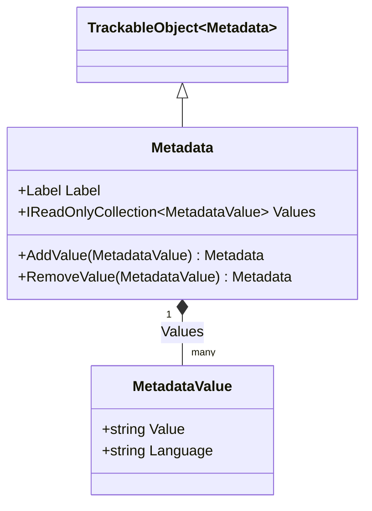

# Metadata

## Contents
- [Overview](#overview)
- [Files](#files)
- [Types & Members](#types--members)
- [Diagrams](#diagrams)
- [Examples](#examples)
- [See Also](#see-also)

## Overview

Metadata aggregates descriptive label-value pairs for IIIF resources. Each entry carries Label (display name) and Values collection (MetadataValue with optional language). MetadataJsonConverter writes array of {label, value} objects using Newtonsoft.Json.

## Files

| File | Primary type(s) | LOC (approx) | Responsibility |
|------|-----------------|--------------|----------------|
| [Metadata.cs](../../../../src/IIIF.Manifest.Serializer.Net/Properties/Metadata/Metadata.cs) | `Metadata` | 26 | Label-value metadata pair |
| [MetadataJsonConverter.cs](../../../../src/IIIF.Manifest.Serializer.Net/Properties/Metadata/MetadataJsonConverter.cs) | `MetadataJsonConverter` | 62 | Parses metadata array |

[↑ Back to top](#contents)

## Types & Members

| Type | Kind | Summary | Inherits/Implements | Key Members |
|------|------|---------|---------------------|-------------|
| `Metadata` | Class | Metadata label-value pair | `TrackableObject<Metadata>` | `Label`, `Values`, `AddValue`, `RemoveValue` |
| `MetadataJsonConverter` | Class | JSON converter for metadata | `TrackableObjectJsonConverter<Metadata>` | `EnrichReadJson`, `EnrichWriteJson` |

[↑ Back to top](#contents)

## Diagrams



[↑ Back to top](#contents)

## Examples

```csharp
var metadata = new Metadata(new Label("Author"))
    .AddValue(new MetadataValue("Jane Smith"))
    .AddValue(new MetadataValue("Jean Dupont").SetLanguage("fr"));

manifest.AddMetadata(metadata);
```

**JSON output:**
```json
{
  "metadata": [
    {
      "label": "Author",
      "value": [
        "Jane Smith",
        { "@value": "Jean Dupont", "@language": "fr" }
      ]
    }
  ]
}
```

[↑ Back to top](#contents)

## See Also

- [./MetadataValue/README.md](./MetadataValue/README.md) – MetadataValue details
- [../README.md](../README.md) – Parent Properties folder

[↑ Back to top](#contents)
