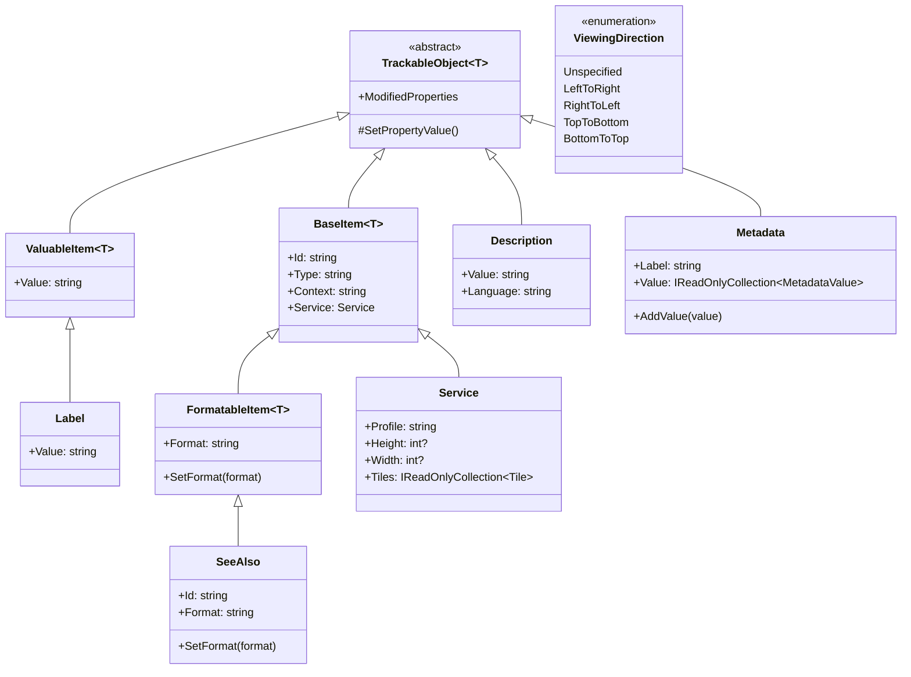
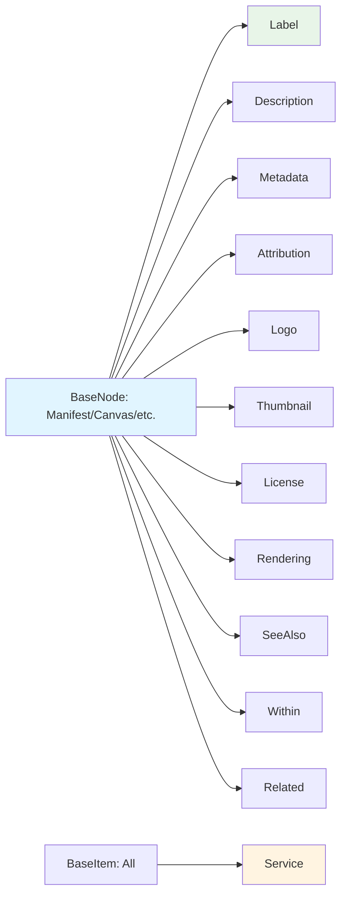

# Properties

## Contents
- [Overview](#overview)
- [Subdirectories](#subdirectories)
- [Files](#files)
- [Types & Members](#types--members)
- [Simple Value Properties](#simple-value-properties)
- [Diagrams](#diagrams)
- [Examples](#examples)
- [See Also](#see-also)

## Overview

The Properties folder provides IIIF Presentation API 2.0 property types that enhance BaseNode resources with descriptive metadata, links, and technical specifications. Simple value-wrapper types (Label, Attribution, License, Logo, Thumbnail, Related, SeeAlso, Within, StartCanvas) extend ValuableItem or FormatableItem for string/URI properties. Complex types include Description (multi-language text with @value/@language), Metadata (label-value pairs with language support), Service (IIIF Image API descriptor with tiles/profile/dimensions), Rendering (alternative format link), Tile (deep-zoom tile specifications), ViewingDirection (enum for page-turn behavior), and interfaces (IDimenssionSupport, IViewingDirectionSupport) for mixin capabilities using Newtonsoft.Json. All types use custom JsonConverters to enforce IIIF serialization patterns (single-or-array, language maps, required fields).

## Subdirectories

| Directory | Purpose |
|-----------|---------|
| [./Description/README.md](./Description/README.md) | Multi-language description text with @value/@language support |
| [./Metadata/README.md](./Metadata/README.md) | Label-value metadata pairs with language-specific values |
| [./Rendering/README.md](./Rendering/README.md) | Alternative format rendering links (PDF, plain text, etc.) |
| [./Service/README.md](./Service/README.md) | IIIF Image API service descriptor with tiles, profile, dimensions |
| [./Tile/README.md](./Tile/README.md) | Deep-zoom tile specifications with width and scale factors |
| [./Within/README.md](./Within/README.md) | Parent collection/manifest links for hierarchical organization |
| [./Interfaces/README.md](./Interfaces/README.md) | IDimenssionSupport and IViewingDirectionSupport mixin interfaces |

## Files

| File | Primary type(s) | LOC (approx) | Responsibility |
|------|-----------------|--------------|----------------|
| [Label.cs](../../src/IIIF.Manifest.Serializer.Net/Properties/Label.cs) | `Label` | 12 | Simple string label; serializes as plain string |
| [Attribution.cs](../../src/IIIF.Manifest.Serializer.Net/Properties/Attribution.cs) | `Attribution` | 12 | Attribution/credit text; serializes as plain string |
| [License.cs](../../src/IIIF.Manifest.Serializer.Net/Properties/License.cs) | `License` | 12 | License URI; serializes as plain string |
| [Logo.cs](../../src/IIIF.Manifest.Serializer.Net/Properties/Logo.cs) | `Logo` | 12 | Logo image URI; serializes as plain string |
| [Thumbnail.cs](../../src/IIIF.Manifest.Serializer.Net/Properties/Thumbnail.cs) | `Thumbnail` | 12 | Thumbnail image URI; serializes as plain string |
| [Related.cs](../../src/IIIF.Manifest.Serializer.Net/Properties/Related.cs) | `Related` | 12 | Related resource URI; serializes as plain string |
| [SeeAlso.cs](../../src/IIIF.Manifest.Serializer.Net/Properties/SeeAlso.cs) | `SeeAlso` | 12 | See-also resource link; inherits FormatableItem for @id/@type/format |
| [StartCanvas.cs](../../src/IIIF.Manifest.Serializer.Net/Properties/StartCanvas.cs) | `StartCanvas` | 12 | Start canvas reference; serializes as string @id |
| [ViewingDirection.cs](../../src/IIIF.Manifest.Serializer.Net/Properties/ViewingDirection.cs) | `ViewingDirection` (enum) | 20 | Enum for viewing direction: LeftToRight, RightToLeft, TopToBottom, BottomToTop |

[↑ Back to top](#contents)

## Types & Members

| Type | Kind | Summary | Inherits/Implements | Key Members |
|------|------|---------|---------------------|-------------|
| `Label` | Class | Human-readable label for resources; serialized as plain string (no @id/@type) | `ValuableItem<Label>` | `Value` (inherited) |
| `Attribution` | Class | Attribution/credit text; serialized as plain string | `ValuableItem<Attribution>` | `Value` (inherited) |
| `License` | Class | License URI; serialized as plain string | `ValuableItem<License>` | `Value` (inherited) |
| `Logo` | Class | Logo image URI; serialized as plain string | `ValuableItem<Logo>` | `Value` (inherited) |
| `Thumbnail` | Class | Thumbnail image URI; serialized as plain string | `ValuableItem<Thumbnail>` | `Value` (inherited) |
| `Related` | Class | Related resource URI; serialized as plain string | `ValuableItem<Related>` | `Value` (inherited) |
| `SeeAlso` | Class | See-also resource link; has @id/@type/format fields | `FormatableItem<SeeAlso>` | `Id`, `Type`, `Format`, `SetFormat` |
| `StartCanvas` | Class | Start canvas reference; serialized as string @id | `ValuableItem<StartCanvas>` | `Value` (inherited) |
| `ViewingDirection` | Enum | Page-turn/viewing behavior; Unspecified=0, LeftToRight=1, RightToLeft=2, TopToBottom=3, BottomToTop=4 | N/A | Enum values |

[↑ Back to top](#contents)

## Simple Value Properties

Most property types in this folder are thin wrappers around ValuableItem<T> that serialize as plain strings without @id/@type. They provide type safety and consistent constructor patterns across the library.

### ValuableItem-based Types

**Label, Attribution, License, Logo, Thumbnail, Related, StartCanvas**

- Inherit `ValuableItem<T>` (which inherits `TrackableObject<T>`)
- Single `Value` property (string)
- Constructor: `new Label("value")`
- Serialize as plain JSON strings: `"label": "My Label"`

### FormatableItem-based Types

**SeeAlso**

- Inherits `FormatableItem<T>` (which inherits `BaseItem<T>`)
- Has @id, @type, format fields
- Constructor: `new SeeAlso(id)`
- Can call `SetFormat("application/xml")`
- Serializes as object: `"seeAlso": { "@id": "...", "format": "..." }`

### Enum Types

**ViewingDirection**

- Enum with JsonConverter
- Values: `Unspecified` (0), `LeftToRight` (1), `RightToLeft` (2), `TopToBottom` (3), `BottomToTop` (4)
- Used by Manifest, Sequence via IViewingDirectionSupport
- Serializes as lowercase string: `"viewingDirection": "left-to-right"`

### Usage

```csharp
// ValuableItem types
var label = new Label("Book Title");
var attribution = new Attribution("© 2024 Example Archive");
var license = new License("https://creativecommons.org/licenses/by/4.0/");
var logo = new Logo("https://example.org/logo.png");
var thumbnail = new Thumbnail("https://example.org/thumb.jpg");

// FormatableItem type
var seeAlso = new SeeAlso("https://example.org/metadata.xml")
    .SetFormat("application/xml");

// Enum
var direction = ViewingDirection.RightToLeft;

// Usage in BaseNode
manifest.AddLabel(label)
        .AddAttribution(attribution)
        .SetLicense(license)
        .SetLogo(logo)
        .SetThumbnail(thumbnail)
        .AddSeeAlso(seeAlso)
        .SetViewingDirection(direction);
```

[↑ Back to top](#contents)

## Diagrams

### Property Type Hierarchy



### Property Serialization Patterns

```mermaid
flowchart TD
    A[Property Type] --> B{Inherits?}
    
    B -->|ValuableItem| C[Plain String]
    B -->|FormatableItem| D[Object with @id/format]
    B -->|Description/Metadata| E[Complex Object]
    B -->|Enum| F[Lowercase String]
    
    C --> G["label": "value"]
    D --> H["seeAlso": @id, format]
    E --> I["metadata": [label, value array]]
    F --> J["viewingDirection": "left-to-right"]
    
    style C fill:#e8f5e8
    style D fill:#fff4e1
    style E fill:#f0e1ff
    style F fill:#e1f5ff
```

### BaseNode Property Usage



[↑ Back to top](#contents)

## Examples

### Using Simple Properties

```csharp
using IIIF.Manifests.Serializer.Nodes;
using IIIF.Manifests.Serializer.Properties;

// Create manifest with simple properties
var manifest = new Manifest("https://example.org/manifest", new Label("Book"))
    .AddAttribution(new Attribution("© 2024 Example Archive"))
    .SetLicense(new License("https://creativecommons.org/licenses/by/4.0/"))
    .SetLogo(new Logo("https://example.org/logo.png"))
    .SetThumbnail(new Thumbnail("https://example.org/thumb.jpg"))
    .SetRelated("https://example.org/related-resource");

// Serializes to:
// {
//   "@context": "...",
//   "@id": "...",
//   "@type": "sc:Manifest",
//   "label": "Book",
//   "attribution": "© 2024 Example Archive",
//   "license": "https://creativecommons.org/licenses/by/4.0/",
//   "logo": "https://example.org/logo.png",
//   "thumbnail": "https://example.org/thumb.jpg",
//   "related": "https://example.org/related-resource"
// }
```

### Using SeeAlso with Format

```csharp
// SeeAlso has @id and format (FormatableItem)
var seeAlso1 = new SeeAlso("https://example.org/metadata.xml")
    .SetFormat("application/xml");

var seeAlso2 = new SeeAlso("https://example.org/metadata.json")
    .SetFormat("application/json");

manifest.AddSeeAlso(seeAlso1)
        .AddSeeAlso(seeAlso2);

// Serializes to:
// "seeAlso": [
//   {
//     "@id": "https://example.org/metadata.xml",
//     "format": "application/xml"
//   },
//   {
//     "@id": "https://example.org/metadata.json",
//     "format": "application/json"
//   }
// ]
```

### Using ViewingDirection

```csharp
// Set viewing direction on manifest (for overall behavior)
manifest.SetViewingDirection(ViewingDirection.RightToLeft);

// Override on specific sequence (for section-specific behavior)
var sequence = new Sequence()
    .SetViewingDirection(ViewingDirection.LeftToRight);

// Enum values:
// - ViewingDirection.Unspecified (default, omitted from JSON)
// - ViewingDirection.LeftToRight (standard Western books)
// - ViewingDirection.RightToLeft (Arabic/Hebrew manuscripts)
// - ViewingDirection.TopToBottom (scrolls)
// - ViewingDirection.BottomToTop (rare)

// Serializes to:
// "viewingDirection": "right-to-left"
```

### Multiple Labels

```csharp
// BaseNode properties are IReadOnlyCollection - can have multiple values
manifest.AddLabel(new Label("Primary Title"))
        .AddLabel(new Label("Alternate Title"));

// Serializes as array:
// "label": ["Primary Title", "Alternate Title"]

// Or single value:
manifest.SetLabel(new[] { new Label("Single Title") });
// "label": "Single Title"
```

### StartCanvas Reference

```csharp
// Sequence can reference a startCanvas to indicate initial view
var canvas1 = new Canvas("https://example.org/canvas/1", new Label("Page 1"), 1000, 800);
var canvas2 = new Canvas("https://example.org/canvas/2", new Label("Page 2"), 1000, 800);

var sequence = new Sequence()
    .AddCanvas(canvas1)
    .AddCanvas(canvas2)
    .SetStartCanvas(new StartCanvas(canvas2.Id)); // Start at page 2

// Serializes to:
// "startCanvas": "https://example.org/canvas/2"
```

[↑ Back to top](#contents)

## See Also

- [./Description/README.md](./Description/README.md) – Multi-language description support
- [./Metadata/README.md](./Metadata/README.md) – Label-value metadata pairs
- [./Rendering/README.md](./Rendering/README.md) – Alternative format links
- [./Service/README.md](./Service/README.md) – IIIF Image API service
- [./Tile/README.md](./Tile/README.md) – Deep-zoom tile specifications
- [./Within/README.md](./Within/README.md) – Parent collection links
- [./Interfaces/README.md](./Interfaces/README.md) – Dimension and viewing direction interfaces
- [../Shared/ValuableItem/README.md](../Shared/ValuableItem/README.md) – Base for simple value types
- [../Shared/FormatableItem/README.md](../Shared/FormatableItem/README.md) – Base for format-aware types
- [../Nodes/README.md](../Nodes/README.md) – Node types that use these properties
- [IIIF Presentation API 2.0 - Descriptive Properties](https://iiif.io/api/presentation/2.0/#descriptive-properties) – Official specification

[↑ Back to top](#contents)
