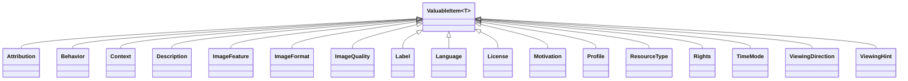
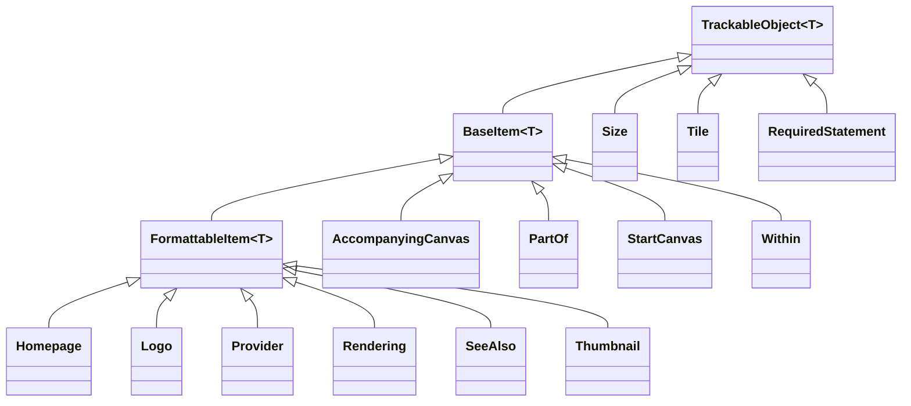

# Properties

## Contents

- [Overview](#overview)
- [Files](#files)
- [Types & Members](#types--members)
- [Diagrams](#diagrams)
- [Package Dependencies](#package-dependencies)
- [See Also](#see-also)

## Overview

This folder holds the small, mostly-immutable **descriptive value types** IIIF Presentation/Image
API documents attach to `Manifest`, `Collection`, `Canvas`, `Range`, and `Annotation` resources -
labels, rights statements, thumbnails, providers, rendering links, viewing behavior, and the
Image API vocabulary (features/formats/qualities/profiles). Most types are `[JsonConverter]`-driven
single-value wrappers (`ValuableItem<T>`) or small structured objects (`BaseItem<T>` /
`FormattableItem<T>`). A recurring pattern here is a **3.0 concept superseding a 2.x-only one**:
`Behavior` replaces `ViewingHint`, `Rights` replaces `License`, `RequiredStatement` replaces
`Attribution`, and `PartOf` replaces `Within` - the legacy type stays present and readable, but the
SDK's fluent authoring API steers new code toward the 3.0 replacement (see
[`SDK_VERSIONING_GUIDE.md`](../SDK_VERSIONING_GUIDE.md) §3-4 for the getter/setter obsolete-tagging
convention this reflects). The [`Interfaces`](Interfaces/README.md),
[`MetadataProperty`](MetadataProperty/README.md), and [`Services`](Services/README.md) subfolders
extend this same "descriptive property" layer with shared capability interfaces, repeatable
metadata pairs, and embedded service descriptors, respectively.

## Files

| File | Primary type(s) | LOC (approx) | Responsibility |
| --- | --- | --- | --- |
| `AccompanyingCanvas.cs` | `AccompanyingCanvas` | 9 | 2.x reference to a canvas that accompanies the manifest (e.g. a title card). |
| `Attribution.cs` | `Attribution` | 9 | Legacy 2.x attribution string; superseded by `RequiredStatement` in 3.0. |
| `Behavior.cs` | `Behavior` | 47 | 3.0 behavior/presentation-hint vocabulary (paged, continuous, facing-pages, ...); replaces `ViewingHint`. |
| `Context.cs` | `Context` | 38 | `@context` URL value object with static constants for every IIIF API's context document. |
| `Description.cs` | `Description` | 25 | A single `@value`/`@language`-tagged description string. |
| `Homepage.cs` | `Homepage` | 28 | 3.0 `homepage` link (replaces 2.x `related`); id + label. |
| `ImageFeature.cs` | `ImageFeature` | 38 | Image API `extraFeatures`/service-capability vocabulary (region/size/rotation features, CORS, ...). |
| `ImageFormat.cs` | `ImageFormat` | 28 | Image API format vocabulary (`image/jpeg`, `image/png`, ...) with an implicit `string` conversion. |
| `ImageQuality.cs` | `ImageQuality` | 20 | Image API quality vocabulary (`default`/`color`/`gray`/`bitonal`). |
| `Label.cs` | `Label` | 39 | A single label value, optionally language-tagged; used throughout `BaseNode`/`Provider`/etc. |
| `Language.cs` | `Language` | 34 | BCP 47 language tag value object with common-language static constants. |
| `License.cs` | `License` | 10 | Legacy 2.x license URI; superseded by `Rights` in 3.0. |
| `Logo.cs` | `Logo` | 41 | Provider/organization logo image reference with `Height`/`Width`. |
| `Motivation.cs` | `Motivation` | 36 | W3C Web Annotation / IIIF motivation vocabulary (`painting`, `commenting`, `tagging`, ...). |
| `PartOf.cs` | `PartOf` | 19 | 3.0 `partOf` reference (id + type); replaces 2.x `within`. |
| `Profile.cs` | `Profile` | 32 | Image API compliance-level / Auth profile vocabulary. |
| `Provider.cs` | `Provider` | 91 | 3.0-only `Agent`/provider descriptor with label, homepage, logo, seeAlso. |
| `Rendering.cs` | `Rendering` | 23 | Alternate-format rendering link (id + required label). |
| `RequiredStatement.cs` | `RequiredStatement` | 47 | 3.0 `{label, value}` attribution pair; replaces 2.x `attribution`. |
| `ResourceType.cs` | `ResourceType` | 53 | `@type`/`type` vocabulary covering 3.0, 2.x (`sc:`-prefixed), content, and service resource types. |
| `Rights.cs` | `Rights` | 38 | 3.0 `rights` URI (Creative Commons / RightsStatements.org); replaces 2.x `license`. |
| `SeeAlso.cs` | `SeeAlso` | 55 | Related-resource link with profile/label and a publicly settable resource type. |
| `Size.cs` | `Size` | 31 | A single supported image `width`/`height` pair (Image API `sizes`). |
| `StartCanvas.cs` | `StartCanvas` | 7 | Legacy plain-id start-canvas reference; 3.0 `start` also supports a full `SpecificResource`. |
| `Thumbnail.cs` | `Thumbnail` | 42 | Thumbnail image reference with `Height`/`Width`. |
| `Tile.cs` | `Tile` | 61 | Image API tile descriptor (`width`/`height`/`scaleFactors`). |
| `TimeMode.cs` | `TimeMode` | 18 | 3.0 temporal playback mode for AV content (`trim`/`scale`/`loop`). |
| `ViewingDirection.cs` | `ViewingDirection` | 19 | Canvas reading direction (`left-to-right`, `right-to-left`, `top-to-bottom`, `bottom-to-top`). |
| `ViewingHint.cs` | `ViewingHint` | 56 | Legacy 2.x/2.1 presentation hint; `[Obsolete]`-deprecated, replaced by `Behavior` in 3.0. |
| `Within.cs` | `Within` | 24 | Legacy 2.x `within` reference (id + label); superseded by `PartOf` in 3.0. |

## Types & Members

| Type | Kind | Summary | Inherits/Implements | Key Members |
| --- | --- | --- | --- | --- |
| `AccompanyingCanvas` | class | 2.x accompanying-canvas reference | `BaseItem<AccompanyingCanvas>` | ctor(id) |
| `Attribution` | class | Legacy attribution string | `ValuableItem<Attribution>` | (value only, via base) |
| `Behavior` | class | 3.0 behavior vocabulary | `ValuableItem<Behavior>` | `Paged`, `Continuous`, `Individuals`, `Unordered`, `FacingPages`, `NonPaged`, `Sequence`, `ThumbnailNav`, `NoNav`, `AutoAdvance`, `NoAutoAdvance`, `Repeat`, `NoRepeat`, `MultiPart`, `Together`, `Hidden` |
| `Context` | class | `@context` URL value object | `ValuableItem<Context>` | `Presentation2/3`, `Image2/3`, `Auth1/2`, `Search1/2`, `Discovery1`, `ContentState1`, `WebAnnotation` |
| `Description` | class | Language-tagged description string | `ValuableItem<Description>` | `Language : string?`, `SetLanguage(string)` |
| `Homepage` | class | 3.0 homepage link | `FormattableItem<Homepage>` | `Label : string?`, ctor(id), ctor(id, label) |
| `ImageFeature` | class | Image API feature vocabulary | `ValuableItem<ImageFeature>` | `RegionByPx/Pct/Square`, `SizeByH/W/Pct/Wh/ConfinedWh`, `SizeUpscaling`, `RotationBy90s/Arbitrary`, `Mirroring`, `BaseUriRedirect`, `Cors`, `JsonldMediaType`, `ProfileLinkHeader`, `CanonicalLinkHeader` |
| `ImageFormat` | class | Image API format vocabulary | `ValuableItem<ImageFormat>` | `Jpg/Png/Gif/Webp/Tif/Jp2/Pdf/Avif/Heic`, implicit `operator ImageFormat(string)` |
| `ImageQuality` | class | Image API quality vocabulary | `ValuableItem<ImageQuality>` | `Default/Color/Gray/Bitonal` |
| `Label` | class | Language-tagged label value | `ValuableItem<Label>` | `Language : string?`, ctor(value), ctor(value, language), `SetLanguage(string)` |
| `Language` | class | BCP 47 language tag | `ValuableItem<Language>` | `English`, `French`, `German`, ... `None` |
| `License` | class | Legacy license URI | `ValuableItem<License>` | (value only, via base) |
| `Logo` | class | Provider logo image | `FormattableItem<Logo>`, `IDimensionSupport<Logo>` | `Height`/`Width : int?`, `SetHeight/SetWidth` |
| `Motivation` | class | Annotation motivation vocabulary | `ValuableItem<Motivation>` | `Painting`, `Supplementing`, `Commenting`, `Describing`, `Tagging`, `Classifying`, `Linking`, `Identifying`, `Bookmarking`, `Highlighting`, `Editing`, `Replying`, `Assessing`, `Moderating`, `Questioning`, `ScPainting` |
| `PartOf` | class | 3.0 partOf reference | `BaseItem<PartOf>` | ctor(id, type) |
| `Profile` | class | Image API / Auth profile vocabulary | `ValuableItem<Profile>` | `Level0/1/2`, `ImageApi2Level0/1/2`, `AuthLogin/Clickthrough/Kiosk/External/Token/Logout` |
| `Provider` | class | 3.0 Agent/provider descriptor | `FormattableItem<Provider>` | `Label`/`Homepage`/`Logo`/`SeeAlso : IReadOnlyCollection<T>`, ctor(id), ctor(id, Label), ctor(id, string), `SetLabel`, `AddHomepage`, `AddLogo`, `AddSeeAlso` |
| `Rendering` | class | Alternate-format rendering link | `FormattableItem<Rendering>` | `Label : string` (required), ctor(id, label) |
| `RequiredStatement` | class | 3.0 `{label,value}` attribution pair | `TrackableObject<RequiredStatement>` | `Label`/`Value : IReadOnlyCollection<T>`, ctor(labels, values), ctor(Label, Description) |
| `ResourceType` | class | `@type`/`type` vocabulary | `ValuableItem<ResourceType>` | `Collection/Manifest/Canvas/Range/AnnotationPage/Annotation/AnnotationCollection`, `Image/Video/Sound/Text/Dataset/Model`, `ImageService2/3`, `SearchService2`, `AutoCompleteService2`, `AuthCookieService1/AuthTokenService1/AuthLogoutService1`, `AuthProbeService2/AuthAccessService2/AuthAccessTokenService2/AuthLogoutService2`, `ScCollection/ScManifest/ScSequence/ScCanvas/ScRange`, `OaAnnotation`, `DctypesImage` |
| `Rights` | class | 3.0 rights URI | `ValuableItem<Rights>` | `CcBy/CcBySa/CcByNd/CcByNc/CcByNcSa/CcByNcNd/Cc0/PublicDomain`, `InCopyright*`, `NoKnownCopyright`, `NoCopyright*`, `CopyrightNotEvaluated/Undetermined` |
| `SeeAlso` | class | Related-resource link | `FormattableItem<SeeAlso>` | `Profile`/`Label : string?`, `SetProfile`, `SetLabel`, `new SetType(string)` (publicly exposed) |
| `Size` | class | Supported image size pair | `TrackableObject<Size>` | `Width`/`Height : int` (required), ctor(width, height) |
| `StartCanvas` | class | Legacy start-canvas reference | `BaseItem<StartCanvas>` | ctor(id) |
| `Thumbnail` | class | Thumbnail image reference | `FormattableItem<Thumbnail>`, `IDimensionSupport<Thumbnail>` | `Height`/`Width : int?`, `SetHeight/SetWidth` |
| `Tile` | class | Image API tile descriptor | `TrackableObject<Tile>` | `Width`/`Height : int?`, `ScaleFactors : IReadOnlyCollection<int>`, `SetWidth/SetHeight`, `AddScaleFactor/RemoveScaleFactor` |
| `TimeMode` | class | 3.0 AV playback mode | `ValuableItem<TimeMode>` | `Trim`, `Scale`, `Loop` |
| `ViewingDirection` | class | Canvas reading direction | `ValuableItem<ViewingDirection>` | `Ltr`, `Rtl`, `Ttb`, `Btt` |
| `ViewingHint` | class | Legacy 2.x/2.1 presentation hint | `ValuableItem<ViewingHint>` | `Paged`, `Continuous`, `Individuals`, `FacingPages`, `NonPaged`, `Top`, `MultiPart` |
| `Within` | class | Legacy 2.x within reference | `BaseItem<Within>` | `Label : string?`, `SetLabel` |

### AccompanyingCanvas

- **Kind / Namespace**: class, `IIIF.Manifests.Serializer.Properties`.
- **Inherits**: `BaseItem<AccompanyingCanvas>` (which supplies `Id`, `Type`, `Context`, `Service`).
- **Attributes**: `[PresentationAPI("2.0")]`.
- **Constructors**: `AccompanyingCanvas(string id)` - fixes `Type` to `"sc:Canvas"`.
- **Usage Recipe**:
  ```csharp
  var accompanying = new AccompanyingCanvas("https://example.org/iiif/canvas/title-card");
  manifest.SetAccompanyingCanvas(accompanying); // via BaseNode's fluent setter
  ```

### Attribution

- **Kind / Namespace**: class, `Properties`. `[PresentationAPI("2.0")]`, `[JsonConverter(typeof(ValuableItemJsonConverter<Attribution>))]`.
- **Inherits**: `ValuableItem<Attribution>` - a bare string value, no label/language structure.
- **Superseded by**: `RequiredStatement` in 3.0 (structural change, not a rename - see
  [`SDK_VERSIONING_GUIDE.md`](../SDK_VERSIONING_GUIDE.md) §5). `BaseNode.Attribution` is a
  computed, read-only legacy view in the wider model; its mutators are `[Obsolete(error: true)]`.
- **Usage Recipe**:
  ```csharp
  // Legacy-only: reading a 2.x document synthesizes BaseNode.Attribution automatically.
  var attribution = new Attribution("Provided by Example Library");
  ```

### Behavior

- **Kind / Namespace**: class, `Properties`. `[PresentationAPI("3.0", Notes = "Replaces viewingHint from API 2.x. Some values also valid in 2.x as viewingHint.")]`.
- **Inherits**: `ValuableItem<Behavior>`.
- **Key static members**: layout (`Paged`, `Continuous`, `Individuals`, `Unordered`), canvas (`FacingPages`, `NonPaged`), range (`Sequence`, `ThumbnailNav`, `NoNav`), temporal (`AutoAdvance`, `NoAutoAdvance`, `Repeat`, `NoRepeat`), collection (`MultiPart`, `Together`), annotation (`Hidden`).
- **Usage Recipe**:
  ```csharp
  manifest.AddBehavior(Behavior.Paged).AddBehavior(Behavior.Individuals);
  ```

### Context

- **Kind / Namespace**: class, `Properties`. `[IIIFVersion("1.0")]` (not `[PresentationAPI]` - context values span every IIIF API family).
- **Inherits**: `ValuableItem<Context>`.
- **Key static members**: `Presentation2`, `Presentation3`, `Image2`, `Image3`, `Auth1`, `Auth2`, `Search1`, `Search2`, `Discovery1`, `ContentState1`, `WebAnnotation`.
- **Usage Recipe**:
  ```csharp
  var ctx = Context.Presentation3.Value; // "http://iiif.io/api/presentation/3/context.json"
  ```

### Description

- **Kind / Namespace**: class, `Properties`. `[JsonConverter(typeof(ValuableItemJsonConverter<Description>))]`.
- **Inherits**: `ValuableItem<Description>`.
- **Key properties**: `Value : string` (`@value`, overrides base to add the `[JsonProperty]`), `Language : string?` (`@language`).
- **Key methods**: `SetLanguage(string language) : Description`.
- **Usage Recipe**:
  ```csharp
  var value = new Description("A hand-written manuscript.").SetLanguage("en");
  var requiredStatement = new RequiredStatement(new Label("Attribution"), value);
  ```

### Homepage

- **Kind / Namespace**: class, `Properties`. `[PresentationAPI("2.0")]`.
- **Inherits**: `FormattableItem<Homepage>` (adds `Format`).
- **Key properties**: `Label : string?`.
- **Constructors**: `[JsonConstructor] Homepage(string id)`; `Homepage(string id, string label)`.
- **Usage Recipe**:
  ```csharp
  provider.AddHomepage(new Homepage("https://example.org", "Example Library"));
  ```

### ImageFeature

- **Kind / Namespace**: class, `Properties`. `[ImageAPI("2.0", Notes = "Supported in both Image API 2.x and 3.0. Feature names consistent across versions.")]`.
- **Inherits**: `ValuableItem<ImageFeature>`.
- **Key static members**: `RegionByPx/Pct/Square`, `SizeByH/W/Pct/Wh/ConfinedWh`, `SizeUpscaling`, `RotationBy90s/Arbitrary`, `Mirroring`, `BaseUriRedirect`, `Cors`, `JsonldMediaType`, `ProfileLinkHeader`, `CanonicalLinkHeader`.
- **Usage Recipe**:
  ```csharp
  imageService.AddExtraFeature(ImageFeature.Mirroring);
  ```

### ImageFormat

- **Kind / Namespace**: class, `Properties`. `[ImageAPI("2.0", Notes = "Supported in both Image API 2.x and 3.0")]`.
- **Inherits**: `ValuableItem<ImageFormat>`.
- **Key static members**: `Jpg`, `Png`, `Gif`, `Webp`, `Tif`, `Jp2`, `Pdf`, `Avif`, `Heic`.
- **Key methods**: `implicit operator ImageFormat(string value)` - lets `AddPreferredFormat("image/webp")`-style overloads accept a bare string.
- **Usage Recipe**:
  ```csharp
  imageService.AddPreferredFormat(ImageFormat.Webp).AddExtraFormat("image/heic");
  ```

### ImageQuality

- **Kind / Namespace**: class, `Properties`. `[ImageAPI("2.0", Notes = "Supported in both Image API 2.x and 3.0")]`.
- **Inherits**: `ValuableItem<ImageQuality>`.
- **Key static members**: `Default`, `Color`, `Gray`, `Bitonal`.
- **Usage Recipe**:
  ```csharp
  imageService.AddExtraQuality(ImageQuality.Bitonal);
  ```

### Label

- **Kind / Namespace**: class, `Properties`. `[JsonConverter(typeof(ValuableItemJsonConverter<Label>))]`.
- **Inherits**: `ValuableItem<Label>`.
- **Key properties**: `Language : string?` - not touched by the converter (bare-string read/write); exists purely so `IiifSerializer`'s language-map grouping logic can bucket entries by language.
- **Constructors**: `Label(string value)`; `Label(string value, string language)`.
- **Key methods**: `SetLanguage(string language) : Label`.
- **Usage Recipe**:
  ```csharp
  var frLabel = new Label("Manuscrit du XVIe siècle", "fr");
  manifest.SetLabel(new Label("16th Century Manuscript")).AddLabel(frLabel);
  ```

### Language

- **Kind / Namespace**: class, `Properties`. `[PresentationAPI("2.0", Notes = "Language tags used in both 2.x and 3.0 for internationalized strings.")]`.
- **Inherits**: `ValuableItem<Language>`.
- **Key static members**: `English`, `EnglishUs`, `EnglishGb`, `French`, `German`, `Spanish`, `Italian`, `Portuguese`, `Dutch`, `Russian`, `Chinese`, `Japanese`, `Korean`, `Arabic`, `Hebrew`, `Latin`, `Greek`, `None`.
- **Usage Recipe**:
  ```csharp
  var tag = Language.French.Value; // "fr"
  ```

### License

- **Kind / Namespace**: class, `Properties`. `[PresentationAPI("2.0")]`, `[JsonConverter(typeof(ValuableItemJsonConverter<License>))]`.
- **Inherits**: `ValuableItem<License>`.
- **Superseded by**: `Rights` in 3.0 (rename, plus the value is constrained to a single URI string rather than an array). `BaseNode.License` is a computed legacy getter; `SetLicense` is `[Obsolete(error: true)]`.
- **Usage Recipe**:
  ```csharp
  var legacyLicense = new License("http://creativecommons.org/licenses/by/4.0/");
  ```

### Logo

- **Kind / Namespace**: class, `Properties`. `[PresentationAPI("2.0")]`.
- **Inherits**: `FormattableItem<Logo>`; **Implements**: `IDimensionSupport<Logo>` (see [`Interfaces`](Interfaces/README.md)).
- **Constructors**: `[JsonConstructor] Logo(string id)` - fixes type to `"dctypes:Image"`.
- **Key properties**: `Height`/`Width : int?`.
- **Key methods**: `SetHeight(int)`, `SetWidth(int)`.
- **Usage Recipe**:
  ```csharp
  provider.AddLogo(new Logo("https://example.org/logo.png").SetHeight(100).SetWidth(120));
  ```

### Motivation

- **Kind / Namespace**: class, `Properties`. `[PresentationAPI("2.0", Notes = "Motivation values. sc:painting in 2.x, painting in 3.0.")]`.
- **Inherits**: `ValuableItem<Motivation>`.
- **Key static members**: `Painting`, `Supplementing` (IIIF); `Commenting`, `Describing`, `Tagging`, `Classifying`, `Linking`, `Identifying`, `Bookmarking`, `Highlighting`, `Editing`, `Replying`, `Assessing`, `Moderating`, `Questioning` (W3C Web Annotation); `ScPainting` (2.0 compatibility).
- **Usage Recipe**:
  ```csharp
  var annotation = new Annotation(id, imageBody, canvas.Id).SetMotivation(Motivation.Painting);
  ```

### PartOf

- **Kind / Namespace**: class, `Properties`. `[PresentationAPI("3.0", Notes = "Replaces within from API 2.x. Restructured to an object array with id/type.")]`.
- **Inherits**: `BaseItem<PartOf>`.
- **Constructors**: `[JsonConstructor] PartOf(string id, string type)`.
- **Supersedes**: `Within` (2.x bare id + optional label) - `BaseNode.PartOf` is the 3.0-native storage; `Within` is the computed legacy view.
- **Usage Recipe**:
  ```csharp
  manifest.AddPartOf(new PartOf("https://example.org/iiif/collection/top", "Collection"));
  ```

### Profile

- **Kind / Namespace**: class, `Properties`. `[ImageAPI("2.0", Notes = "Profile values for Image API compliance levels. Format changed between 2.x (URLs) and 3.0 (keywords).")]`.
- **Inherits**: `ValuableItem<Profile>`.
- **Key static members**: `Level0/1/2` (3.0 keywords); `ImageApi2Level0/1/2` (2.x URLs); `AuthLogin/Clickthrough/Kiosk/External/Token/Logout` (Auth 1.0 profile URLs).
- **Usage Recipe**:
  ```csharp
  var service = new Service(context, id, Profile.Level2.Value);
  ```

### Provider

- **Kind / Namespace**: class, `Properties`. `[PresentationAPI("3.0", Notes = "3.0-only. No 2.x equivalent (2.x had no Agent/provider concept).")]`.
- **Inherits**: `FormattableItem<Provider>`.
- **Key properties**: `Label`, `Homepage`, `Logo`, `SeeAlso : IReadOnlyCollection<T>` (each `[JsonConverter(typeof(ObjectArrayJsonConverter))]`, defaulting to `[]`).
- **Constructors**: `[JsonConstructor] Provider(string id)` (fixes type to `"Agent"`); `Provider(string id, Label label)`; `Provider(string id, string label)`.
- **Key methods**: `SetLabel(IReadOnlyCollection<Label>)`, `AddHomepage(Homepage)`, `AddLogo(Logo)`, `AddSeeAlso(SeeAlso)`.
- **Usage Recipe**:
  ```csharp
  var provider = new Provider("https://example.org", "Example Library")
      .AddHomepage(new Homepage("https://example.org"))
      .AddLogo(new Logo("https://example.org/logo.png").SetHeight(100).SetWidth(120));
  manifest.AddProvider(provider);
  ```

### Rendering

- **Kind / Namespace**: class, `Properties`. `[PresentationAPI("2.0")]`.
- **Inherits**: `FormattableItem<Rendering>`.
- **Key properties**: `Label : string` (required, non-nullable - unlike most other link types here).
- **Constructors**: `[JsonConstructor] Rendering(string id, string label)`.
- **Usage Recipe**:
  ```csharp
  manifest.AddRendering(new Rendering("https://example.org/manifest.pdf", "Download as PDF"));
  ```

### RequiredStatement

- **Kind / Namespace**: class, `Properties`. `[PresentationAPI("3.0", Notes = "Replaces attribution from API 2.x. Structural change: attribution has no label, requiredStatement does.")]`.
- **Inherits**: `TrackableObject<RequiredStatement>` directly (not `BaseItem` - it has no id/type of its own).
- **Key properties**: `Label`, `Value : IReadOnlyCollection<Label>` / `IReadOnlyCollection<Description>`.
- **Constructors**: `[JsonConstructor] RequiredStatement(IReadOnlyCollection<Label>, IReadOnlyCollection<Description>)`; `RequiredStatement(Label, Description)`.
- **Supersedes**: `Attribution` - a structural change, not a rename (see [`SDK_VERSIONING_GUIDE.md`](../SDK_VERSIONING_GUIDE.md) §5); the legacy `attribution` value is carried into `Value` verbatim, with `Label` synthesized.
- **Usage Recipe**:
  ```csharp
  manifest.SetRequiredStatement(new RequiredStatement(new Label("Attribution"), new Description("Courtesy of Example Library")));
  ```

### ResourceType

- **Kind / Namespace**: class, `Properties`. `[PresentationAPI("2.0", Notes = "Type values vary between 2.x (sc: prefix) and 3.0 (no prefix).")]`.
- **Inherits**: `ValuableItem<ResourceType>`.
- **Key static members**: 3.0 (`Collection`, `Manifest`, `Canvas`, `Range`, `AnnotationPage`, `Annotation`, `AnnotationCollection`), content (`Image`, `Video`, `Sound`, `Text`, `Dataset`, `Model`), service (`ImageService2/3`, `SearchService2`, `AutoCompleteService2`, `AuthCookieService1/AuthTokenService1/AuthLogoutService1`, `AuthProbeService2/AuthAccessService2/AuthAccessTokenService2/AuthLogoutService2`), 2.x-prefixed (`ScCollection/ScManifest/ScSequence/ScCanvas/ScRange`, `OaAnnotation`, `DctypesImage`).
- **Usage Recipe**:
  ```csharp
  var typeValue = ResourceType.Manifest.Value; // "Manifest"
  ```

### Rights

- **Kind / Namespace**: class, `Properties`. `[PresentationAPI("2.0", Notes = "In 2.x use 'license', in 3.0 use 'rights'. Values are the same.")]`.
- **Inherits**: `ValuableItem<Rights>`.
- **Key static members**: Creative Commons (`CcBy`, `CcBySa`, `CcByNd`, `CcByNc`, `CcByNcSa`, `CcByNcNd`, `Cc0`, `PublicDomain`); RightsStatements.org (`InCopyright`, `InCopyrightEuOrphanWork`, `InCopyrightEducationalUse`, `InCopyrightNonCommercialUse`, `InCopyrightRightsHolderUnlocatable`, `NoKnownCopyright`, `NoCopyrightContractualRestrictions`, `NoCopyrightNonCommercialUseOnly`, `NoCopyrightOtherKnownLegalRestrictions`, `NoCopyrightUnitedStates`, `CopyrightNotEvaluated`, `CopyrightUndetermined`).
- **Supersedes**: `License` - same underlying value space, single-URI constraint in 3.0.
- **Usage Recipe**:
  ```csharp
  manifest.SetRights(Rights.CcBy);
  ```

### SeeAlso

- **Kind / Namespace**: class, `Properties`. `[PresentationAPI("2.0")]`.
- **Inherits**: `FormattableItem<SeeAlso>`.
- **Key properties**: `Profile`/`Label : string?`.
- **Key methods**: `SetProfile(string)`, `SetLabel(string)`, `new SetType(string) : SeeAlso` - publicly re-exposes the otherwise-`internal` `BaseItem.SetType`, since `seeAlso` entries commonly carry a specific type like `Dataset` (unlike `Rendering`/`Homepage`, which default to `Text`).
- **Usage Recipe**:
  ```csharp
  manifest.AddSeeAlso(new SeeAlso("https://example.org/metadata.xml").SetType("Dataset").SetLabel("MODS metadata"));
  ```

### Size

- **Kind / Namespace**: class, `Properties`.
- **Inherits**: `TrackableObject<Size>` directly.
- **Key properties**: `Width`/`Height : int` (both required, non-nullable).
- **Constructors**: `[JsonConstructor] Size(int width, int height)`.
- **Usage Recipe**:
  ```csharp
  imageService.AddSize(new Size(width: 150, height: 200));
  ```

### StartCanvas

- **Kind / Namespace**: class, `Properties`; declared with primary-constructor syntax: `class StartCanvas(string id) : BaseItem<StartCanvas>(id)`.
- **Inherits**: `BaseItem<StartCanvas>`. `[method: JsonConstructor]` on the primary constructor.
- **Superseded by**: 3.0's `start` property, which supports a full `SpecificResource` (with an optional `PointSelector` time offset), not just a bare canvas id - see [`SDK_VERSIONING_GUIDE.md`](../SDK_VERSIONING_GUIDE.md) §5.
- **Usage Recipe**:
  ```csharp
  var legacyStart = new StartCanvas("https://example.org/iiif/canvas/p3");
  ```

### Thumbnail

- **Kind / Namespace**: class, `Properties`. `[PresentationAPI("2.0")]`.
- **Inherits**: `FormattableItem<Thumbnail>`; **Implements**: `IDimensionSupport<Thumbnail>`.
- **Constructors**: `[JsonConstructor] Thumbnail(string id)` - fixes type to `"dctypes:Image"`.
- **Key properties**: `Height`/`Width : int?`.
- **Key methods**: `SetHeight(int)`, `SetWidth(int)`.
- **Usage Recipe**:
  ```csharp
  canvas.AddThumbnail(new Thumbnail("https://example.org/thumb.jpg").SetHeight(150).SetWidth(120));
  ```

### Tile

- **Kind / Namespace**: class, `Properties`.
- **Inherits**: `TrackableObject<Tile>` directly.
- **Key properties**: `Width : int?`; `Height : int?` (optional per spec - defaults to `Width` when omitted); `ScaleFactors : IReadOnlyCollection<int>`.
- **Key methods**: `SetWidth(int)`, `SetHeight(int)`, `AddScaleFactor(int)`, `RemoveScaleFactor(int)`.
- **Usage Recipe**:
  ```csharp
  imageService.AddTile(new Tile().SetWidth(512).AddScaleFactor(1).AddScaleFactor(2).AddScaleFactor(4));
  ```

### TimeMode

- **Kind / Namespace**: class, `Properties`. `[PresentationAPI("3.0", Notes = "Time mode for temporal media in Presentation API 3.0")]`.
- **Inherits**: `ValuableItem<TimeMode>`.
- **Key static members**: `Trim`, `Scale`, `Loop`.
- **Usage Recipe**:
  ```csharp
  annotation.SetTimeMode(TimeMode.Loop);
  ```

### ViewingDirection

- **Kind / Namespace**: class, `Properties`. `[PresentationAPI("2.0", Notes = "Supported in both 2.x and 3.0")]`.
- **Inherits**: `ValuableItem<ViewingDirection>`. Read via `IViewingDirectionSupport<T>` (see [`Interfaces`](Interfaces/README.md)).
- **Key static members**: `Ltr`, `Rtl`, `Ttb`, `Btt`.
- **Usage Recipe**:
  ```csharp
  manifest.SetViewingDirection(ViewingDirection.Rtl);
  ```

### ViewingHint

- **Kind / Namespace**: class, `Properties`. `[PresentationAPI("2.0", "2.1", IsDeprecated = true, DeprecatedInVersion = "3.0", ReplacedBy = "behavior", Notes = "viewingHint renamed to behavior in API 3.0")]`.
- **Inherits**: `ValuableItem<ViewingHint>`.
- **Key static members**: `Paged`, `Continuous`, `Individuals`, `FacingPages`, `NonPaged`, `Top`, `MultiPart` (each with an XML-doc note on which resource type it applies to).
- **Superseded by**: `Behavior` - `BaseNode.ViewingHint` is the computed legacy getter (untagged, reads cleanly); `SetViewingHint` is `[Obsolete(error: true)]`. This is the SDK's reference implementation for the obsolete-tagging pattern applied to every other 2.x→3.0 pair in this folder.
- **Usage Recipe**:
  ```csharp
  // Legacy read-only view - reflects whatever Behavior values were parsed/set.
  var hint = manifest.ViewingHint;
  ```

### Within

- **Kind / Namespace**: class, `Properties`. `[PresentationAPI("2.0")]`.
- **Inherits**: `BaseItem<Within>`.
- **Constructors**: `Within(string id)`.
- **Key properties**: `Label : string?`.
- **Key methods**: `SetLabel(string) : Within`.
- **Superseded by**: `PartOf` in 3.0 (rename + restructure to an object array with `id`/`type`).
- **Usage Recipe**:
  ```csharp
  var legacyWithin = new Within("https://example.org/iiif/collection/top").SetLabel("Top-level collection");
  ```

[↑ Back to top](#contents)

## Diagrams


```mermaid
classDiagram
    class ValuableItem~T~
    ValuableItem~T~ <|-- Attribution
    ValuableItem~T~ <|-- Behavior
    ValuableItem~T~ <|-- Context
    ValuableItem~T~ <|-- Description
    ValuableItem~T~ <|-- ImageFeature
    ValuableItem~T~ <|-- ImageFormat
    ValuableItem~T~ <|-- ImageQuality
    ValuableItem~T~ <|-- Label
    ValuableItem~T~ <|-- Language
    ValuableItem~T~ <|-- License
    ValuableItem~T~ <|-- Motivation
    ValuableItem~T~ <|-- Profile
    ValuableItem~T~ <|-- ResourceType
    ValuableItem~T~ <|-- Rights
    ValuableItem~T~ <|-- TimeMode
    ValuableItem~T~ <|-- ViewingDirection
    ValuableItem~T~ <|-- ViewingHint
```
*Every single-value property (`ValuableItem<T>`-backed, `[JsonConverter(typeof(ValuableItemJsonConverter<T>))]`) in this folder - the bare-string/enum-like vocabulary types.*


```mermaid
classDiagram
    class TrackableObject~T~
    class BaseItem~T~
    class FormattableItem~T~
    TrackableObject~T~ <|-- BaseItem~T~
    BaseItem~T~ <|-- FormattableItem~T~

    BaseItem~T~ <|-- AccompanyingCanvas
    BaseItem~T~ <|-- PartOf
    BaseItem~T~ <|-- StartCanvas
    BaseItem~T~ <|-- Within

    FormattableItem~T~ <|-- Homepage
    FormattableItem~T~ <|-- Logo
    FormattableItem~T~ <|-- Provider
    FormattableItem~T~ <|-- Rendering
    FormattableItem~T~ <|-- SeeAlso
    FormattableItem~T~ <|-- Thumbnail

    TrackableObject~T~ <|-- Size
    TrackableObject~T~ <|-- Tile
    TrackableObject~T~ <|-- RequiredStatement
```
*The structured (id/type-carrying, or plain-object) property types - `PartOf` supersedes `Within`;
`Logo`/`Thumbnail` also implement `IDimensionSupport<T>` (see [`Interfaces`](Interfaces/README.md)).*

[↑ Back to top](#contents)

## Package Dependencies

| Package | Version | Description | Links |
| --- | --- | --- | --- |
| Newtonsoft.Json | 13.0.4 | JSON.NET - this SDK's serialization engine (custom JsonConverters, attribute-driven read/write) | [NuGet](https://www.nuget.org/packages/Newtonsoft.Json/13.0.4) |

[↑ Back to top](#contents)

## See Also

- [`docs/README.md`](../README.md) - top-level SDK documentation.
- [`SDK_VERSIONING_GUIDE.md`](../SDK_VERSIONING_GUIDE.md) - 2.x↔3.0 mapping table and Obsolete-tagging convention referenced throughout this page.
- [`Properties/Interfaces`](Interfaces/README.md) - `IDimensionSupport`/`IViewingDirectionSupport` capability interfaces implemented by some types above.
- [`Properties/MetadataProperty`](MetadataProperty/README.md) - repeatable label/value metadata pairs.
- [`Properties/Services`](Services/README.md) - embedded service descriptors (Image/Auth/Search/Discovery/Content State).

[↑ Back to top](#contents)
