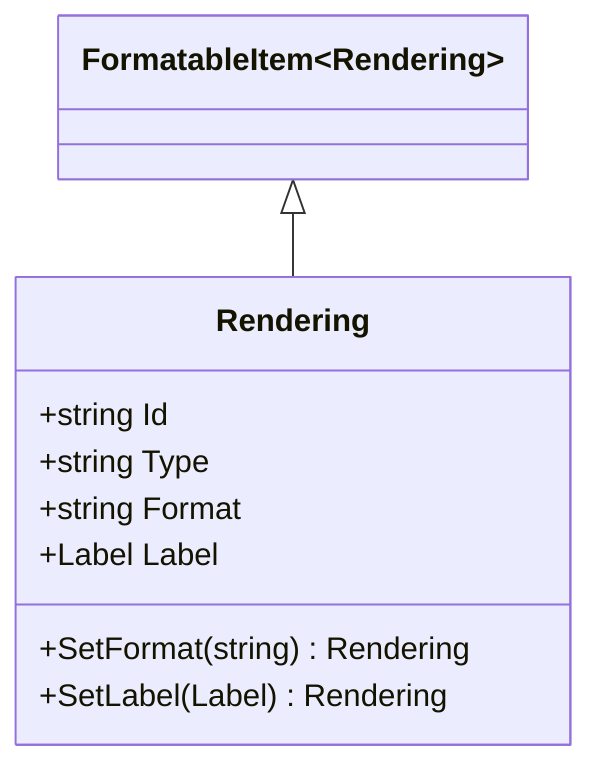

# Rendering

## Contents
- [Overview](#overview)
- [Files](#files)
- [Types & Members](#types--members)
- [Diagrams](#diagrams)
- [Examples](#examples)
- [See Also](#see-also)

## Overview

Rendering links to alternative representations of IIIF resources (PDF, EPUB, plaintext). Inherits FormatableItem for @id, @type, format, label. RenderingJsonConverter disables type checking to accept any MIME type using Newtonsoft.Json.

## Files

| File | Primary type(s) | LOC (approx) | Responsibility |
|------|-----------------|--------------|----------------|
| [Rendering.cs](../../../../src/IIIF.Manifest.Serializer.Net/Properties/Rendering.cs) | `Rendering` | 15 | Alternative format link |
| [RenderingJsonConverter.cs](../../../../src/IIIF.Manifest.Serializer.Net/Properties/Rendering/RenderingJsonConverter.cs) | `RenderingJsonConverter` | 22 | Converts rendering, disables type check |

[↑ Back to top](#contents)

## Types & Members

| Type | Kind | Summary | Inherits/Implements | Key Members |
|------|------|---------|---------------------|-------------|
| `Rendering` | Class | Link to alternative format | `FormatableItem<Rendering>` | `Id`, `Type`, `Format`, `Label`, `SetFormat`, `SetLabel` |
| `RenderingJsonConverter` | Class | JSON converter with no type validation | `FormatableItemJsonConverter<Rendering>` | Constructor (sets DisableTypeChecking=true) |

[↑ Back to top](#contents)

## Diagrams



[↑ Back to top](#contents)

## Examples

```csharp
// Link to PDF download
var pdfRendering = new Rendering("https://example.org/document.pdf")
    .SetFormat("application/pdf")
    .SetLabel(new Label("Download as PDF"));

manifest.AddRendering(pdfRendering);
```

**JSON output:**
```json
{
  "rendering": {
    "@id": "https://example.org/document.pdf",
    "format": "application/pdf",
    "label": "Download as PDF"
  }
}
```

[↑ Back to top](#contents)

## See Also

- [../README.md](../README.md) – Parent Properties folder
- [../../Shared/FormatableItem/README.md](../../Shared/FormatableItem/README.md) – FormatableItem base

[↑ Back to top](#contents)
