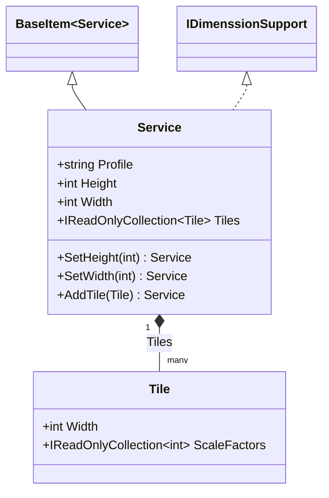
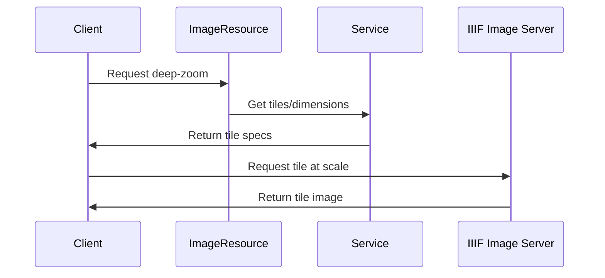

# Service

## Contents
- [Overview](#overview)
- [Files](#files)
- [Types & Members](#types--members)
- [Diagrams](#diagrams)
- [Examples](#examples)
- [See Also](#see-also)

## Overview

Service describes IIIF Image API services for deep-zoom and derivatives. Requires @context, @id (base URI), profile (compliance level). Supports tiles (Tile collection with scale factors) and dimensions (height/width). ServiceJsonConverter enforces required fields and parses tiles array using Newtonsoft.Json. Implements IDimenssionSupport.

## Files

| File | Primary type(s) | LOC (approx) | Responsibility |
|------|-----------------|--------------|----------------|
| [Service.cs](../../../../src/IIIF.Manifest.Serializer.Net/Properties/Service/Service.cs) | `Service` | 32 | IIIF Image API service descriptor |
| [ServiceJsonConverter.cs](../../../../src/IIIF.Manifest.Serializer.Net/Properties/Service/ServiceJsonConverter.cs) | `ServiceJsonConverter` | 78 | Validates @context/@id/profile, parses tiles/dimensions |

[↑ Back to top](#contents)

## Types & Members

| Type | Kind | Summary | Inherits/Implements | Key Members |
|------|------|---------|---------------------|-------------|
| `Service` | Class | IIIF Image Service descriptor | `BaseItem<Service>`, `IDimenssionSupport` | `Profile`, `Height`, `Width`, `Tiles`, `SetHeight`, `SetWidth`, `AddTile`, `RemoveTile` |
| `ServiceJsonConverter` | Class | JSON converter for service | `BaseItemJsonConverter<Service>` | `EnrichReadJson`, `EnrichWriteJson` |

[↑ Back to top](#contents)

## Diagrams



**IIIF Image Service Flow:**


[↑ Back to top](#contents)

## Examples

```csharp
// IIIF Image API 2.0 service
var service = new Service(
    "http://iiif.io/api/image/2/context.json",
    "https://example.org/iiif/image123",
    "http://iiif.io/api/image/2/level1.json"
).SetHeight(4000).SetWidth(3000);

// Add tile specs for deep-zoom
var tile = new Tile(512, new[] { 1, 2, 4, 8, 16 });
service.AddTile(tile);

// Attach to image resource
imageResource.SetService(service);
```

**JSON output:**
```json
{
  "service": {
    "@context": "http://iiif.io/api/image/2/context.json",
    "@id": "https://example.org/iiif/image123",
    "profile": "http://iiif.io/api/image/2/level1.json",
    "height": 4000,
    "width": 3000,
    "tiles": [
      {
        "width": 512,
        "scaleFactors": [1, 2, 4, 8, 16]
      }
    ]
  }
}
```

[↑ Back to top](#contents)

## See Also

- [../Tile/README.md](../Tile/README.md) – Tile details
- [../README.md](../README.md) – Parent Properties folder
- [../Interfaces/README.md](../Interfaces/README.md) – IDimenssionSupport interface

[↑ Back to top](#contents)
