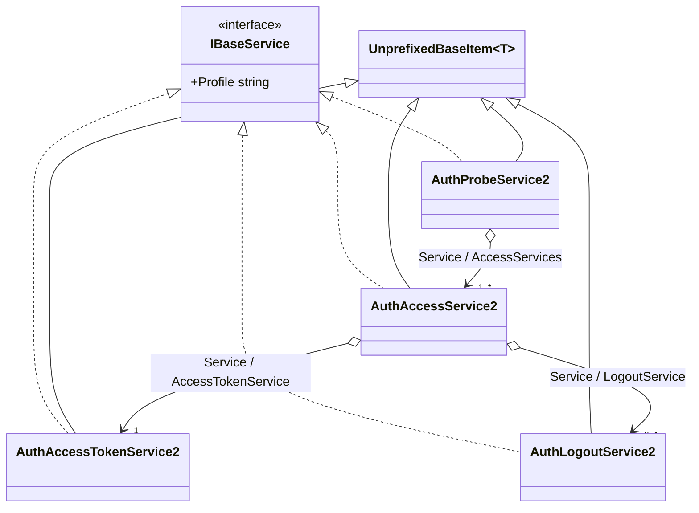

# Auth2

## Contents

- [Overview](#overview)
- [Files](#files)
- [Types & Members](#types--members)
- [Diagrams](#diagrams)
- [Package Dependencies](#package-dependencies)
- [See Also](#see-also)

## Overview

This folder models **IIIF Authentication Flow API 2.0** - the successor to Auth 1.0
(`AuthService1` in the parent [`Services`](../README.md) folder), replacing one flat class with
four distinct service types that each have different required/optional fields per spec: a probe
service the client calls silently to check access, an access service that opens a UI window for
interactive login, an access-token service the access-service window calls to hand back a token,
and an optional logout service. Auth 2.0 postdates Presentation 3.0's "no `@` prefix" convention, so
every type here inherits `UnprefixedBaseItem<T>` rather than `BaseItem<T>`. The
[`Responses`](Responses/README.md) subfolder holds the HTTP/`postMessage` response payloads these
services produce at runtime (as opposed to the service *descriptors* embedded in a manifest, modeled
here).

## Files

| File | Primary type(s) | LOC (approx) | Responsibility |
| --- | --- | --- | --- |
| `AuthAccessService2.cs` | `AuthAccessService2` | 107 | The user-facing UI service the client opens in a new tab/window (active/kiosk/external profiles). |
| `AuthAccessTokenService2.cs` | `AuthAccessTokenService2` | 49 | The service the access-service window calls to obtain an access token. |
| `AuthLogoutService2.cs` | `AuthLogoutService2` | 40 | Lets the client close the user's session (e.g. on a public terminal). |
| `AuthProbeService2.cs` | `AuthProbeService2` | 62 | The service the client calls silently to check whether the user already has access. |

## Types & Members

| Type | Kind | Summary | Inherits/Implements | Key Members |
| --- | --- | --- | --- | --- |
| `AuthAccessService2` | class | Interactive login UI service | `UnprefixedBaseItem<AuthAccessService2>`, `IBaseService` | `Profile`, `Label`/`Heading`/`Note`/`ConfirmLabel : IReadOnlyCollection<Label>`, `AccessTokenService`, `LogoutService?`, `ForExternalProfile(...)` |
| `AuthAccessTokenService2` | class | Access-token issuance service | `UnprefixedBaseItem<AuthAccessTokenService2>`, `IBaseService` | `ErrorHeading`/`ErrorNote : IReadOnlyCollection<Label>` |
| `AuthLogoutService2` | class | Session logout service | `UnprefixedBaseItem<AuthLogoutService2>`, `IBaseService` | `Label : IReadOnlyCollection<Label>` (required) |
| `AuthProbeService2` | class | Silent access-check service | `UnprefixedBaseItem<AuthProbeService2>`, `IBaseService` | `ErrorHeading`/`ErrorNote : IReadOnlyCollection<Label>`, `AccessServices`, `AddAccessService(...)` |

### AuthAccessService2

- **Kind / Namespace**: class, `IIIF.Manifests.Serializer.Properties.Services.Auth2`. `[AuthAPI("2.0", Notes = "Auth API 2.0 access service (active/kiosk/external profiles).")]`.
- **Inherits**: `UnprefixedBaseItem<AuthAccessService2>`; **Implements**: `IBaseService`.
- **Key properties**: `Profile : string` (`[AuthAPI("2.0")]`); `Label`/`Heading`/`Note`/`ConfirmLabel : IReadOnlyCollection<Label>`
  (each `[JsonConverter(typeof(LanguageMapJsonConverter))]` - real language maps, not plain strings);
  `[JsonIgnore] AccessTokenService : AuthAccessTokenService2` (convenience accessor over the inherited
  `Service` collection); `[JsonIgnore] LogoutService : AuthLogoutService2?`.
- **Constructors**:
  - `[JsonConstructor] private AuthAccessService2(string? id, string profile, IReadOnlyCollection<IBaseService> service)`.
  - `AuthAccessService2(string id, string profile, AuthAccessTokenService2 accessTokenService)` - for `active`/`kiosk` profiles (both **require** `id`).
  - `static ForExternalProfile(AuthAccessTokenService2 accessTokenService) : AuthAccessService2` - for the `external` profile, which must **omit** `id` entirely (enabled by `UnprefixedBaseItem<T>`'s nullable `id` parameter).
- **Key methods**: `SetLabel`, `SetHeading`, `SetNote`, `SetConfirmLabel`, `SetLogoutService(AuthLogoutService2)` - all fluent.
- **Constraint notes**: `Label` is required for the `active` profile.
- **Usage Recipe**:
  ```csharp
  var tokenService = new AuthAccessTokenService2("https://example.org/iiif/auth/token");
  var access = new AuthAccessService2("https://example.org/iiif/auth/login", "active", tokenService)
      .SetLabel("Log in to Example Library")
      .SetHeading("Please Log In")
      .SetLogoutService(new AuthLogoutService2("https://example.org/iiif/auth/logout", "Log out of Example Library"));

  // Or, for the "external" profile (id must be absent):
  var external = AuthAccessService2.ForExternalProfile(tokenService);
  ```

### AuthAccessTokenService2

- **Kind / Namespace**: class, `Properties.Services.Auth2`. `[AuthAPI("2.0", Notes = "Auth API 2.0 access token service.")]`.
- **Inherits**: `UnprefixedBaseItem<AuthAccessTokenService2>`; **Implements**: `IBaseService` via
  explicit interface implementation (`string IBaseService.Profile => string.Empty`) - Auth 2.0 defines
  no `profile` field for this service, and the explicit-interface trick keeps Newtonsoft's
  reflection-based serializer from writing a stray `"profile": ""`.
- **Key properties**: `ErrorHeading`/`ErrorNote : IReadOnlyCollection<Label>` (language maps).
- **Constructors**: `[JsonConstructor] AuthAccessTokenService2(string id)`.
- **Key methods**: `SetErrorHeading(string)`, `SetErrorNote(string)` - fluent.
- **Usage Recipe**:
  ```csharp
  var tokenService = new AuthAccessTokenService2("https://example.org/iiif/auth/token")
      .SetErrorHeading("Could Not Issue Token")
      .SetErrorNote("Your session may have expired - please log in again.");
  ```

### AuthLogoutService2

- **Kind / Namespace**: class, `Properties.Services.Auth2`. `[AuthAPI("2.0", Notes = "Auth API 2.0 logout service.")]`.
- **Inherits**: `UnprefixedBaseItem<AuthLogoutService2>`; **Implements**: `IBaseService` (explicit,
  no `profile` field per spec, same trick as `AuthAccessTokenService2`).
- **Key properties**: `Label : IReadOnlyCollection<Label>` (language map) - **required**; must clearly
  identify the domain/institution the user is logging out of.
- **Constructors**: `[JsonConstructor] AuthLogoutService2(string id, IReadOnlyCollection<Label> label)`;
  `AuthLogoutService2(string id, string label)` (convenience single-value overload).
- **Usage Recipe**:
  ```csharp
  var logout = new AuthLogoutService2("https://example.org/iiif/auth/logout", "Log out of Example Library");
  ```

### AuthProbeService2

- **Kind / Namespace**: class, `Properties.Services.Auth2`. `[AuthAPI("2.0", Notes = "Auth API 2.0 probe service.")]`.
- **Inherits**: `UnprefixedBaseItem<AuthProbeService2>`; **Implements**: `IBaseService` (explicit, no
  `profile` field per spec).
- **Key properties**: `ErrorHeading`/`ErrorNote : IReadOnlyCollection<Label>` (language maps);
  `[JsonIgnore] AccessServices : IReadOnlyCollection<AuthAccessService2>` (convenience accessor over
  the inherited `Service` collection - wraps one or more `AuthAccessService2`).
- **Constructors**: `[JsonConstructor] AuthProbeService2(string id, IReadOnlyCollection<IBaseService> service)`;
  `AuthProbeService2(string id, AuthAccessService2 accessService)` (single-value convenience overload).
- **Key methods**: `AddAccessService(AuthAccessService2)`, `SetErrorHeading(string)`, `SetErrorNote(string)`.
- **Usage Recipe**:
  ```csharp
  var probe = new AuthProbeService2("https://example.org/iiif/auth/probe", access)
      .SetErrorHeading("Access Check Failed");

  imageService.AddService(probe); // typically attached to the protected resource's service list
  ```

[↑ Back to top](#contents)

## Diagrams


*The Auth Flow 2.0 chain: a client probes silently (`AuthProbeService2`), which nests one or more
interactive access services (`AuthAccessService2`), each of which nests one required
`AuthAccessTokenService2` and one optional `AuthLogoutService2` via the inherited `Service` collection.*

[↑ Back to top](#contents)

## Package Dependencies

| Package | Version | Description | Links |
| --- | --- | --- | --- |
| Newtonsoft.Json | 13.0.4 | JSON.NET - this SDK's serialization engine (custom JsonConverters, attribute-driven read/write) | [NuGet](https://www.nuget.org/packages/Newtonsoft.Json/13.0.4) |

[↑ Back to top](#contents)

## See Also

- [`docs/README.md`](../../../README.md) - top-level SDK documentation.
- [`SDK_VERSIONING_GUIDE.md`](../../../SDK_VERSIONING_GUIDE.md) - Milestone 11 covers the Auth 2.0 four-type split and its cross-cutting fixes in depth.
- [`Properties/Services`](../README.md) - parent folder; `AuthService1` (Auth 1.0) and the shared `IBaseService`/`ServiceJsonConverter` dispatch mechanism.
- [`Properties/Services/Auth2/Responses`](Responses/README.md) - the HTTP/postMessage response payloads these services produce.

[↑ Back to top](#contents)
