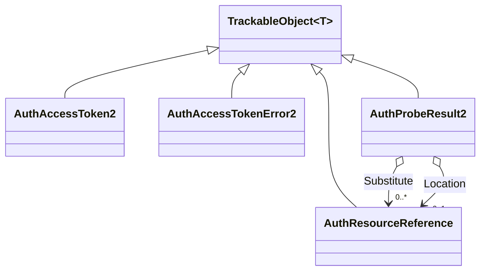

# Responses

## Contents

- [Overview](#overview)
- [Files](#files)
- [Types & Members](#types--members)
- [Diagrams](#diagrams)
- [Package Dependencies](#package-dependencies)
- [See Also](#see-also)

## Overview

This folder models the **HTTP/`postMessage` response payloads** the [`Auth2`](../README.md) service
types produce at runtime, as distinct from the service *descriptors* embedded in a manifest. These
are plain `TrackableObject<T>` types (not `IBaseService` - a response body is never itself embedded
as a service) representing what an `AuthAccessTokenService2` sends back to the client
(`AuthAccessToken2` on success, `AuthAccessTokenError2` on failure) and what an `AuthProbeService2`'s
HTTP response returns (`AuthProbeResult2`), plus the small shared `{id,type}` pointer type
(`AuthResourceReference`) the probe result uses for its `substitute`/`location` fields.

## Files

| File | Primary type(s) | LOC (approx) | Responsibility |
| --- | --- | --- | --- |
| `AuthAccessToken2.cs` | `AuthAccessToken2` | 70 | Successful access-token `postMessage` response body. |
| `AuthAccessTokenError2.cs` | `AuthAccessTokenError2` | 88 | Error `postMessage` response body when a token can't be issued. |
| `AuthProbeResult2.cs` | `AuthProbeResult2` | 99 | JSON body an `AuthProbeService2` HTTP response returns. |
| `AuthResourceReference.cs` | `AuthResourceReference` | 37 | Plain `{id,type}` resource reference used by `AuthProbeResult2`. |

## Types & Members

| Type | Kind | Summary | Inherits/Implements | Key Members |
| --- | --- | --- | --- | --- |
| `AuthAccessToken2` | class | Successful token response | `TrackableObject<AuthAccessToken2>` | `Context`, `Type`, `MessageId`, `AccessToken`, `ExpiresIn : int?` |
| `AuthAccessTokenError2` | class | Token-issuance error response | `TrackableObject<AuthAccessTokenError2>` | `Context`, `Type`, `Profile` (error code), `MessageId`, `Heading`/`Note : IReadOnlyCollection<Label>` |
| `AuthProbeResult2` | class | Probe HTTP response body | `TrackableObject<AuthProbeResult2>` | `Context`, `Type`, `Status : int`, `Substitute : IReadOnlyCollection<AuthResourceReference>`, `Location : AuthResourceReference?`, `Heading`/`Note : IReadOnlyCollection<Label>` |
| `AuthResourceReference` | class | Plain `{id,type}` pointer | `TrackableObject<AuthResourceReference>` | `Id`, `Type : string` |

### AuthAccessToken2

- **Kind / Namespace**: class, `IIIF.Manifests.Serializer.Properties.Services.Auth2.Responses`. `[AuthAPI("2.0")]`.
- **Inherits**: `TrackableObject<AuthAccessToken2>` directly - a response payload, not an embedded service.
- **Key properties**: `Context : string` (defaults to `http://iiif.io/api/auth/2/context.json`),
  `Type : string` (defaults to `"AuthAccessToken2"`), `MessageId : string` (required, correlates the
  response to the client's request), `AccessToken : string` (required, the opaque token), `ExpiresIn : int?`.
- **Constructors**: `[JsonConstructor] AuthAccessToken2(string messageId, string accessToken)`.
- **Key methods**: `SetExpiresIn(int) : AuthAccessToken2`.
- **Usage Recipe**:
  ```csharp
  var tokenResponse = new AuthAccessToken2(messageId: "abc123", accessToken: "opaque-token-value")
      .SetExpiresIn(3600);
  ```

### AuthAccessTokenError2

- **Kind / Namespace**: class, `Responses`. `[AuthAPI("2.0")]`.
- **Inherits**: `TrackableObject<AuthAccessTokenError2>` directly.
- **Key properties**: `Context`, `Type` (defaults, as above); `Profile : string` (required - one of
  the 6 spec error codes below, modeled as a plain string since it's spec-open-ended text);
  `MessageId : string` (required); `Heading`/`Note : IReadOnlyCollection<Label>` (language maps).
- **Key constants**: `InvalidRequest`, `InvalidOrigin`, `MissingAspect`, `InvalidAspect`, `ExpiredAspect`, `Unavailable`.
- **Constructors**: `[JsonConstructor] AuthAccessTokenError2(string profile, string messageId)`.
- **Key methods**: `SetHeading(string)`, `SetNote(string)` - fluent.
- **Usage Recipe**:
  ```csharp
  var error = new AuthAccessTokenError2(AuthAccessTokenError2.ExpiredAspect, messageId: "abc123")
      .SetHeading("Session Expired")
      .SetNote("Please log in again.");
  ```

### AuthProbeResult2

- **Kind / Namespace**: class, `Responses`. `[AuthAPI("2.0")]`.
- **Inherits**: `TrackableObject<AuthProbeResult2>` directly. The outer HTTP status code is always
  200; `Status` carries the "real" access status the client acts on.
- **Key properties**: `Context`, `Type` (defaults, as above); `Status : int` (required);
  `Substitute : IReadOnlyCollection<AuthResourceReference>`; `Location : AuthResourceReference?`;
  `Heading`/`Note : IReadOnlyCollection<Label>` (language maps).
- **Constructors**: `AuthProbeResult2(int status)` (no `[JsonConstructor]` annotation on this one -
  the only single-parameter constructor available).
- **Key methods**: `AddSubstitute(AuthResourceReference)`, `SetLocation(AuthResourceReference)`,
  `SetHeading(string)`, `SetNote(string)` - fluent.
- **Usage Recipe**:
  ```csharp
  var probeResult = new AuthProbeResult2(status: 401)
      .SetHeading("Access Denied")
      .SetNote("This resource requires an active institutional login.")
      .SetLocation(new AuthResourceReference("https://example.org/iiif/auth/login", "AuthAccessService2"));
  ```

### AuthResourceReference

- **Kind / Namespace**: class, `Responses`. `[AuthAPI("2.0")]`.
- **Inherits**: `TrackableObject<AuthResourceReference>` directly.
- **Key properties**: `Id`, `Type : string` (both required).
- **Constructors**: `[JsonConstructor] AuthResourceReference(string id, string type)`.
- **Usage Recipe**:
  ```csharp
  var substitute = new AuthResourceReference("https://example.org/iiif/canvas/1-degraded", "Canvas");
  probeResult.AddSubstitute(substitute);
  ```

[↑ Back to top](#contents)

## Diagrams


*All four response types are plain `TrackableObject<T>` (never `IBaseService` - these are runtime
HTTP/postMessage bodies, not embedded service descriptors); `AuthProbeResult2` composes
`AuthResourceReference` for its optional `substitute`/`location` fields.*

[↑ Back to top](#contents)

## Package Dependencies

| Package | Version | Description | Links |
| --- | --- | --- | --- |
| Newtonsoft.Json | 13.0.4 | JSON.NET - this SDK's serialization engine (custom JsonConverters, attribute-driven read/write) | [NuGet](https://www.nuget.org/packages/Newtonsoft.Json/13.0.4) |

[↑ Back to top](#contents)

## See Also

- [`docs/README.md`](../../../../README.md) - top-level SDK documentation.
- [`SDK_VERSIONING_GUIDE.md`](../../../../SDK_VERSIONING_GUIDE.md) - Milestone 11 covers these response shapes alongside the Auth 2.0 service split.
- [`Properties/Services/Auth2`](../README.md) - parent folder; the service descriptors that produce these responses.
- [`Properties/Services`](../../README.md) - the wider services folder.

[↑ Back to top](#contents)
