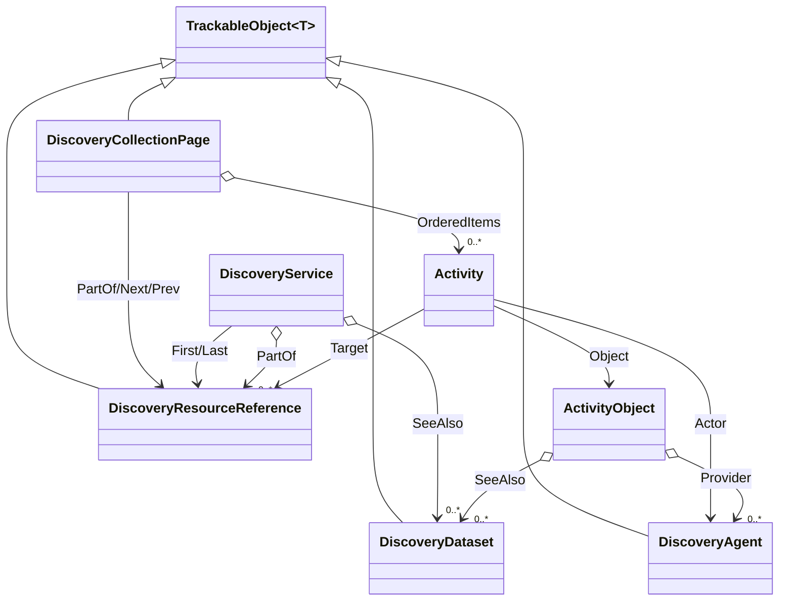

# Discovery

## Contents

- [Overview](#overview)
- [Files](#files)
- [Types & Members](#types--members)
- [Diagrams](#diagrams)
- [Package Dependencies](#package-dependencies)
- [See Also](#see-also)

## Overview

This folder models the **shared reference and paging types** for IIIF Change Discovery API 1.0, an
Activity Streams 2.0-based feed of changes to a collection of resources. The top-level
"OrderedCollection" (`DiscoveryService`) and the `Activity`/`ActivityObject` event types live in the
parent [`Services`](../README.md) folder; this subfolder holds the pieces those types compose:
the actual per-page activity list (`DiscoveryCollectionPage`, the "OrderedCollectionPage" - split out
from `DiscoveryService` because a collection and page are structurally distinct, not conflatable),
the `seeAlso`/dataset reference (`DiscoveryDataset`), the `provider`/`actor` reference
(`DiscoveryAgent`), and the plain `{id,type}` pointer used throughout for `first`/`last`/`partOf`/
`next`/`prev`/`target` (`DiscoveryResourceReference`).

## Files

| File | Primary type(s) | LOC (approx) | Responsibility |
| --- | --- | --- | --- |
| `DiscoveryAgent.cs` | `DiscoveryAgent` | 52 | `{id,type,label}` agent reference (`provider`/`actor` fields). |
| `DiscoveryCollectionPage.cs` | `DiscoveryCollectionPage` | 128 | A single "OrderedCollectionPage" of `Activity` entries, with paging fields. |
| `DiscoveryDataset.cs` | `DiscoveryDataset` | 79 | `seeAlso` "Dataset" reference to supplementary machine-readable data. |
| `DiscoveryResourceReference.cs` | `DiscoveryResourceReference` | 38 | Plain `{id,type}` resource pointer used throughout Discovery 1.0. |

## Types & Members

| Type | Kind | Summary | Inherits/Implements | Key Members |
| --- | --- | --- | --- | --- |
| `DiscoveryAgent` | class | Agent/actor/provider reference | `TrackableObject<DiscoveryAgent>` | `Id`, `Type`, `Label : IReadOnlyCollection<Label>`, `SetLabel(string)` |
| `DiscoveryCollectionPage` | class | OrderedCollectionPage of activities | `TrackableObject<DiscoveryCollectionPage>` | `Context`, `Id`, `Type`, `PartOf`/`Next`/`Prev : DiscoveryResourceReference?`, `StartIndex : int?`, `OrderedItems : IReadOnlyCollection<Activity>`, `AddActivity(...)` |
| `DiscoveryDataset` | class | seeAlso Dataset reference | `TrackableObject<DiscoveryDataset>` | `Id`, `Type`, `Format`, `Label : IReadOnlyCollection<Label>`, `Profile` |
| `DiscoveryResourceReference` | class | Plain `{id,type}` pointer | `TrackableObject<DiscoveryResourceReference>` | `Id`, `Type : string` |

### DiscoveryAgent

- **Kind / Namespace**: class, `IIIF.Manifests.Serializer.Properties.Services.Discovery`. `[DiscoveryAPI("1.0")]`.
- **Inherits**: `TrackableObject<DiscoveryAgent>` directly.
- **Key properties**: `Id`, `Type : string` (both required); `Label : IReadOnlyCollection<Label>`
  (`[JsonConverter(typeof(LanguageMapJsonConverter))]`).
- **Constructors**: `[JsonConstructor] DiscoveryAgent(string id, string type)`.
- **Key methods**: `SetLabel(string) : DiscoveryAgent`.
- **Used by**: `ActivityObject.Provider`, `Activity.Actor` (both in [`Services`](../README.md)) - the
  same `{id,type,label}` shape serves both the `provider` and `actor` fields.
- **Usage Recipe**:
  ```csharp
  var actor = new DiscoveryAgent("https://example.org/agents/curator-bot", "Application")
      .SetLabel("Example Library Curation Bot");
  activity.SetActor(actor);
  ```

### DiscoveryCollectionPage

- **Kind / Namespace**: class, `Services.Discovery`. `[DiscoveryAPI("1.0")]`.
- **Inherits**: `TrackableObject<DiscoveryCollectionPage>` directly - a standalone fetchable
  resource, never embedded as a service (unlike `DiscoveryService`, which *is* `IBaseService`).
- **Key properties**: `Context : string?`, `Id : string` (required), `Type : string` (defaults to
  `"OrderedCollectionPage"`), `PartOf`/`Next`/`Prev : DiscoveryResourceReference?`,
  `StartIndex : int?`, `OrderedItems : IReadOnlyCollection<Activity>` (the actual activity list -
  moved here from `DiscoveryService`, which only *points at* pages).
- **Constructors**: `DiscoveryCollectionPage(string id, IReadOnlyCollection<Activity> orderedItems)`.
- **Key methods**: `SetContext`, `SetPartOf`, `SetNext`, `SetPrev`, `SetStartIndex`, `AddActivity(Activity)` - all fluent.
- **Usage Recipe**:
  ```csharp
  var page = new DiscoveryCollectionPage("https://example.org/iiif/changes/page/1", [])
      .SetContext(Context.Discovery1.Value)
      .SetStartIndex(0)
      .AddActivity(new Activity("Create", new ActivityObject(manifestId, "Manifest"), endTime: "2024-01-01T00:00:00Z"));
  ```

### DiscoveryDataset

- **Kind / Namespace**: class, `Services.Discovery`. `[DiscoveryAPI("1.0")]`.
- **Inherits**: `TrackableObject<DiscoveryDataset>` directly.
- **Key properties**: `Id : string` (required), `Type : string` (defaults to `"Dataset"`),
  `Format : string?`, `Label : IReadOnlyCollection<Label>` (language map), `Profile : string?`.
- **Constructors**: `[JsonConstructor] DiscoveryDataset(string id)`.
- **Key methods**: `SetFormat(string)`, `SetLabel(string)`, `SetProfile(string)` - fluent.
- **Used by**: `DiscoveryService.SeeAlso` and `ActivityObject.SeeAlso` (both in [`Services`](../README.md)).
- **Usage Recipe**:
  ```csharp
  var dataset = new DiscoveryDataset("https://example.org/oai-pmh")
      .SetFormat("application/xml")
      .SetLabel("OAI-PMH Endpoint");
  discoveryService.AddSeeAlso(dataset);
  ```

### DiscoveryResourceReference

- **Kind / Namespace**: class, `Services.Discovery`. `[DiscoveryAPI("1.0")]`.
- **Inherits**: `TrackableObject<DiscoveryResourceReference>` directly.
- **Key properties**: `Id`, `Type : string` (both required).
- **Constructors**: `[JsonConstructor] DiscoveryResourceReference(string id, string type)`.
- **Used by**: `DiscoveryService.First`/`Last`, `DiscoveryCollectionPage.PartOf`/`Next`/`Prev`, and
  `Activity.Target` (the destination of a "Move" activity).
- **Usage Recipe**:
  ```csharp
  var lastPage = new DiscoveryResourceReference("https://example.org/iiif/changes/page/9", "OrderedCollectionPage");
  var discoveryService = new DiscoveryService(Context.Discovery1.Value, "https://example.org/iiif/changes", lastPage);
  ```

[↑ Back to top](#contents)

## Diagrams


*This folder's four reference/paging types (top) and how the parent [`Services`](../README.md)
folder's `DiscoveryService`/`Activity`/`ActivityObject` (bottom, shown for context) compose them.*

[↑ Back to top](#contents)

## Package Dependencies

| Package | Version | Description | Links |
| --- | --- | --- | --- |
| Newtonsoft.Json | 13.0.4 | JSON.NET - this SDK's serialization engine (custom JsonConverters, attribute-driven read/write) | [NuGet](https://www.nuget.org/packages/Newtonsoft.Json/13.0.4) |

[↑ Back to top](#contents)

## See Also

- [`docs/README.md`](../../../README.md) - top-level SDK documentation.
- [`SDK_VERSIONING_GUIDE.md`](../../../SDK_VERSIONING_GUIDE.md) - Milestone 12 covers the Discovery paging/Activity completeness work in depth.
- [`Properties/Services`](../README.md) - parent folder; `DiscoveryService`, `Activity`, and `ActivityObject` compose the types documented here.

[↑ Back to top](#contents)
