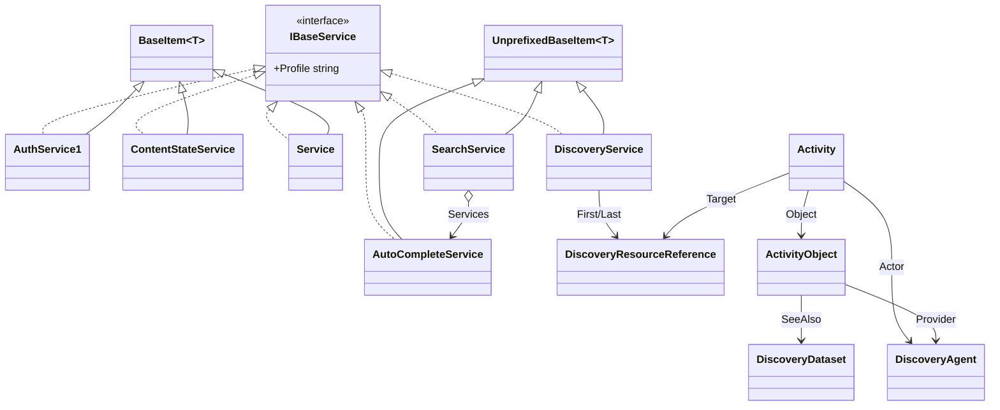

# Services

## Contents

- [Overview](#overview)
- [Files](#files)
- [Types & Members](#types--members)
- [Diagrams](#diagrams)
- [Package Dependencies](#package-dependencies)
- [See Also](#see-also)

## Overview

This folder models IIIF's **companion service specs** - the embedded/top-level descriptors a
`Manifest`/`Canvas`/other resource attaches via its `service`/`services` property, as opposed to the
plain descriptive properties in the parent [`Properties`](../README.md) folder. It covers the
embedded Image API service (`Service`, with `AsImageService2()`/`AsImageService3()` version
toggles), Auth 1.0 (`AuthService1`), Content Search 2.0 (`SearchService`/`AutoCompleteService`),
Change Discovery 1.0 (`DiscoveryService`, plus the `Activity`/`ActivityObject` Activity Streams
types), and Content State 1.0 (`ContentStateService` - an inert, spec-mismatched extension point;
see the [`ContentState`](#contentstateservice) entry below). Every leaf service type implements the
common polymorphic marker interface `IBaseService` (`Shared/Service/IBaseService.cs`, not in this
folder's scope), which carries `[JsonConverter(typeof(ServiceJsonConverter))]` - `ServiceJsonConverter`
dispatches to the correct concrete type on read by inspecting `@type`/`type` and, where that's
ambiguous (Auth 1.0 vs. 2.0), by `@context`. The [`Auth2`](Auth2/README.md), [`Discovery`](Discovery/README.md),
and [`Search`](Search/README.md) subfolders hold the richer, multi-type service families (Auth 2.0's
four service types plus response payloads; Discovery's paging/agent/dataset shapes; Search's
response bodies) that outgrew a single flat class.

## Files

| File | Primary type(s) | LOC (approx) | Responsibility |
| --- | --- | --- | --- |
| `Activity.cs` | `Activity` | 126 | A single Activity Streams change-discovery event (Create/Update/Delete/Move, ...). |
| `ActivityObject.cs` | `ActivityObject` | 87 | The `object` an `Activity` describes a change to (id/type/canonical/seeAlso/provider). |
| `AuthService1.cs` | `AuthService1` | 144 | IIIF Auth API 1.0 service descriptor (login/clickthrough/kiosk/external/token/logout). |
| `AutoCompleteService.cs` | `AutoCompleteService` | 37 | Content Search API 2.0 autocomplete service descriptor. |
| `ContentStateService.cs` | `ContentStateService` | 38 | Legacy, spec-mismatched Content State service descriptor (kept as an inert extension point). |
| `DiscoveryService.cs` | `DiscoveryService` | 121 | Change Discovery API 1.0 top-level "OrderedCollection" (points at pages via `first`/`last`). |
| `SearchService.cs` | `SearchService` | 75 | Content Search API 2.0 search service descriptor; wraps nested `AutoCompleteService`s. |
| `Service.cs` | `Service` | 220 | Embedded Image API service descriptor (2.x and 3.0), plus a standalone `info.json` conversion. |

## Types & Members

| Type | Kind | Summary | Inherits/Implements | Key Members |
| --- | --- | --- | --- | --- |
| `Activity` | class | Activity Streams change event | `TrackableObject<Activity>` | `Id`, `Type`, `Object : ActivityObject`, `Target : DiscoveryResourceReference?`, `StartTime`, `EndTime`, `Summary`, `Actor : DiscoveryAgent?` |
| `ActivityObject` | class | Target object of an `Activity` | `TrackableObject<ActivityObject>` | `Id`, `Type`, `Canonical`, `SeeAlso : IReadOnlyCollection<DiscoveryDataset>`, `Provider : IReadOnlyCollection<DiscoveryAgent>` |
| `AuthService1` | class | Auth API 1.0 service | `BaseItem<AuthService1>`, `IBaseService` | `Profile`, `Label`, `Header`, `Description`, `ConfirmLabel`, `FailureHeader`, `FailureDescription` |
| `AutoCompleteService` | class | Search API 2.0 autocomplete service | `UnprefixedBaseItem<AutoCompleteService>`, `IBaseService` | `Profile : string` |
| `ContentStateService` | class | Legacy Content State service descriptor | `BaseItem<ContentStateService>`, `IBaseService` | `Profile : string` |
| `DiscoveryService` | class | Discovery API 1.0 OrderedCollection | `UnprefixedBaseItem<DiscoveryService>`, `IBaseService` | `First`/`Last : DiscoveryResourceReference`, `TotalItems`, `SeeAlso`, `PartOf`, `Rights` |
| `SearchService` | class | Search API 2.0 search service | `UnprefixedBaseItem<SearchService>`, `IBaseService` | `Profile`, `Services : IReadOnlyCollection<AutoCompleteService>`, `AddService`/`RemoveService` |
| `Service` | class | Embedded Image API service descriptor | `BaseItem<Service>`, `IDimensionSupport<Service>`, `IBaseService` | `Protocol`, `Profile`, `Height`/`Width`, `Tiles`, `Sizes`, `MaxWidth`/`MaxHeight`/`MaxArea`, `Rights`, `PreferredFormats`/`ExtraFormats`/`ExtraQualities`/`ExtraFeatures`, `AsImageService2/3`, `ToInfoJson()` |

### Activity

- **Kind / Namespace**: class, `IIIF.Manifests.Serializer.Properties.Services`. `[DiscoveryAPI("1.0")]`.
- **Inherits**: `TrackableObject<Activity>` directly - deliberately *not* `BaseItem<T>`, since Change
  Discovery 1.0 (like Auth 2.0/Search 2.0/Content State 1.0) postdates Presentation 3.0's
  "no `@` prefix" convention and declares its own unprefixed `id`/`type` properties instead of
  inheriting `BaseItem`'s `@id`/`@type` (see [`SDK_VERSIONING_GUIDE.md`](../../SDK_VERSIONING_GUIDE.md)
  §10 finding 1).
- **Key properties**: `Id : string?`, `Type : string`, `Object : ActivityObject` (the changed
  resource, or the *source* location for a Move), `Target : DiscoveryResourceReference?`
  (`[DiscoveryAPI("1.0")]` - the *destination* for a Move activity), `StartTime`/`EndTime : string?`,
  `Summary : string?`, `Actor : DiscoveryAgent?`.
- **Constructors**: `Activity(string type, ActivityObject @object, string endTime)`.
- **Key methods**: `SetId`, `SetTarget`, `SetStartTime`, `SetSummary`, `SetActor` - all fluent.
- **Usage Recipe**:
  ```csharp
  var moved = new Activity("Move", new ActivityObject(oldId, "Manifest"), endTime: "2024-01-01T00:00:00Z")
      .SetId("https://example.org/activity/1")
      .SetTarget(new DiscoveryResourceReference(newId, "Manifest"));
  page.AddActivity(moved);
  ```

### ActivityObject

- **Kind / Namespace**: class, `Properties.Services`. `[DiscoveryAPI("1.0")]`.
- **Inherits**: `TrackableObject<ActivityObject>` directly (same unprefixed-shape rationale as `Activity`).
- **Key properties**: `Id`, `Type : string` (required), `Canonical : string?`,
  `SeeAlso : IReadOnlyCollection<DiscoveryDataset>`, `Provider : IReadOnlyCollection<DiscoveryAgent>`.
- **Constructors**: `[JsonConstructor] ActivityObject(string id, string type)`.
- **Key methods**: `SetCanonical(string)`, `AddSeeAlso(DiscoveryDataset)`, `AddProvider(DiscoveryAgent)`.
- **Usage Recipe**:
  ```csharp
  var obj = new ActivityObject("https://example.org/iiif/manifest.json", "Manifest")
      .SetCanonical("https://example.org/canonical/manifest.json")
      .AddProvider(new DiscoveryAgent("https://example.org", "Organization"));
  ```

### AuthService1

- **Kind / Namespace**: class, `Properties.Services`. `[AuthAPI("1.0", Notes = "Auth API 1.0 service for content access control.")]`.
- **Inherits**: `BaseItem<AuthService1>` (Auth 1.0 is contemporaneous with Presentation 2.x, so it
  correctly uses `@id`/`@type`); **Implements**: `IBaseService`.
- **Key properties** (all `[AuthAPI("1.0")]`): `Profile : string` (login/clickthrough/kiosk/external/token/logout),
  `Label`, `Header`, `Description`, `ConfirmLabel`, `FailureHeader`, `FailureDescription : string?`.
- **Constructors**: `[JsonConstructor] AuthService1(string id, string profile)` - fixes `@context` to
  `http://iiif.io/api/auth/1/context.json` and leaves `Type` empty (Auth 1.0 typing is profile-driven
  per spec, not `@type`-driven).
- **Key methods**: `SetLabel`, `SetHeader`, `SetDescription`, `SetConfirmLabel`, `SetFailureHeader`,
  `SetFailureDescription` - all fluent.
- **Usage Recipe**:
  ```csharp
  var login = new AuthService1("https://example.org/iiif/login", Profile.AuthLogin.Value)
      .SetLabel("Login to Example Library")
      .SetHeader("Please Log In")
      .SetDescription("Institutional members can log in for full access.");
  imageService.AddService(login);
  ```

### AutoCompleteService

- **Kind / Namespace**: class, `Properties.Services`. `[SearchAPI("2.0", Notes = "AutoComplete service for Content Search API 2.0.")]`.
- **Inherits**: `UnprefixedBaseItem<AutoCompleteService>`; **Implements**: `IBaseService`.
- **Key properties**: `Profile : string` (`[SearchAPI("2.0")]`).
- **Constructors**: `[JsonConstructor] private AutoCompleteService(string id, string profile)` (fixes
  type to `"AutoCompleteService2"`, default context); `AutoCompleteService(string context, string id, string profile)`.
- **Usage Recipe**:
  ```csharp
  var autocomplete = new AutoCompleteService(Context.Search2.Value, "https://example.org/iiif/autocomplete", "https://example.org/iiif/search/profile");
  searchService.AddService(autocomplete);
  ```

### ContentStateService

- **Kind / Namespace**: class, `Properties.Services`. `[ContentStateAPI("1.0", Notes = "Content State API 1.0 service for deep linking and state representation.")]`.
- **Inherits**: `BaseItem<ContentStateService>` (left on the `@id`/`@type`-prefixed base for
  historical reasons rather than migrated to `UnprefixedBaseItem<T>`); **Implements**: `IBaseService`.
- **Key properties**: `Profile : string`.
- **Constructors**: `[JsonConstructor] private ContentStateService(string id, string profile)`
  (fixes type to `"ContentStateService"`); `ContentStateService(string context, string id, string profile)`.
- **Known limitation**: per [`SDK_VERSIONING_GUIDE.md`](../../SDK_VERSIONING_GUIDE.md) §10 finding 2,
  this class's `{"type":"ContentStateService","profile"}` shape doesn't correspond to anything in the
  real Content State 1.0 spec (which has no "service" concept at all) - it's kept as an inert,
  already-tested extension point rather than removed, since no spec-shaped replacement exists to
  migrate callers to. The real Content State 1.0 object model (`ContentState`, `ContentStateCodec`,
  etc.) lives in `Nodes/Contents/ContentState/`, outside this folder's scope.
- **Usage Recipe**:
  ```csharp
  var legacyContentState = new ContentStateService(Context.ContentState1.Value, "https://example.org/iiif/content-state", "profile-uri");
  ```

### DiscoveryService

- **Kind / Namespace**: class, `Properties.Services`. `[DiscoveryAPI("1.0", Notes = "Change Discovery API 1.0 top-level OrderedCollection.")]`.
- **Inherits**: `UnprefixedBaseItem<DiscoveryService>`; **Implements**: `IBaseService` (explicit
  `string IBaseService.Profile => string.Empty` - Discovery 1.0 has no profile concept, same
  no-public-profile-property trick used by several Auth 2.0 types in [`Auth2`](Auth2/README.md)).
- **Key properties**: `First : DiscoveryResourceReference?`, `Last : DiscoveryResourceReference`
  (required), `TotalItems : int?`, `SeeAlso : IReadOnlyCollection<DiscoveryDataset>`,
  `PartOf : IReadOnlyCollection<DiscoveryResourceReference>`, `Rights : string?`.
- **Constructors**: `[JsonConstructor] DiscoveryService(string id, DiscoveryResourceReference last)`;
  `DiscoveryService(string context, string id, DiscoveryResourceReference last)`.
- **Key methods**: `SetFirst`, `SetTotalItems`, `AddSeeAlso`, `AddPartOf`, `SetRights` - all fluent.
- **Only *points at* its pages** - the actual `Activity` list lives on the separate
  [`DiscoveryCollectionPage`](Discovery/README.md#discoverycollectionpage) ("OrderedCollectionPage"),
  which this class previously (incorrectly) conflated itself with.
- **Usage Recipe**:
  ```csharp
  var lastPage = new DiscoveryResourceReference("https://example.org/iiif/changes/page/9", "OrderedCollectionPage");
  var discovery = new DiscoveryService(Context.Discovery1.Value, "https://example.org/iiif/changes", lastPage)
      .SetTotalItems(900);
  ```

### SearchService

- **Kind / Namespace**: class, `Properties.Services`. `[SearchAPI("2.0", Notes = "Content Search API 2.0 service for searching within manifests.")]`.
- **Inherits**: `UnprefixedBaseItem<SearchService>`; **Implements**: `IBaseService`.
- **Key properties**: `Profile : string`, `Services : IReadOnlyCollection<AutoCompleteService>` (`[JsonProperty("service")]` - the nested autocomplete service(s)).
- **Constructors**: `[JsonConstructor] private SearchService(string id, string profile)` (fixes type
  to `"SearchService2"`); `SearchService(string context, string id, string profile)`.
- **Key methods**: `AddService(AutoCompleteService)`, `RemoveService(AutoCompleteService)`.
- **Usage Recipe**:
  ```csharp
  var search = new SearchService(Context.Search2.Value, "https://example.org/iiif/search", "https://example.org/iiif/search/profile")
      .AddService(new AutoCompleteService(Context.Search2.Value, "https://example.org/iiif/autocomplete", "profile-uri"));
  manifest.AddService(search);
  ```

### Service

- **Kind / Namespace**: class, `Properties.Services`. `[ImageAPI("2.0", Notes = "Service descriptor for Image API. Properties vary between 2.x and 3.0.")]`.
- **Inherits**: `BaseItem<Service>`; **Implements**: `IDimensionSupport<Service>` (see
  [`Interfaces`](../Interfaces/README.md)), `IBaseService`. Genuinely spans *two* spec versions in
  one class (unlike Auth2/Search/Discovery's classes, each of which maps to exactly one spec
  version) - `type` is version-dependent and can't be inferred from context.
- **Key properties**: `Protocol : string` (read-only, always `"http://iiif.io/api/image"`),
  `Profile : string`, `Height`/`Width : int?`, `Tiles : IReadOnlyCollection<Tile>`,
  `Sizes : IReadOnlyCollection<Size>`, `MaxWidth`/`MaxHeight : int?` and `MaxArea : long?` (3.0-only),
  `Rights : Rights?` (3.0-only), `PreferredFormats : IReadOnlyCollection<ImageFormat>` (3.0-only),
  `ExtraFormats : IReadOnlyCollection<ImageFormat>`, `ExtraQualities : IReadOnlyCollection<ImageQuality>` (3.0-only),
  `ExtraFeatures : IReadOnlyCollection<ImageFeature>`.
- **Constructors**: `[JsonConstructor] private Service(string id, string profile)` (defaults to
  `type: "ImageService3"`); `Service(string context, string id, string profile)`.
- **Key methods**: `AsImageService2()` / `AsImageService3()` (fluent version toggles), `SetHeight`/`SetWidth`,
  `AddTile`/`RemoveTile`, `AddSize`/`RemoveSize`, `SetMaxWidth`/`SetMaxHeight`/`SetMaxArea`,
  `SetRights(string|Rights)`, `AddPreferredFormat`/`RemovePreferredFormat`,
  `AddExtraFormat`/`RemoveExtraFormat`, `AddExtraQuality`/`RemoveExtraQuality`,
  `AddExtraFeature`/`RemoveExtraFeature`, `ToInfoJson() : string` (serializes as a standalone
  `info.json` document with unprefixed `id`/`type` but still-prefixed `@context`).
- **Usage Recipe**:
  ```csharp
  var imageService = new Service("http://iiif.io/api/image/3/context.json", "https://example.org/iiif/manuscript", "level2")
      .SetHeight(2000).SetWidth(1500)
      .AddTile(new Tile().SetWidth(512).AddScaleFactor(1).AddScaleFactor(2))
      .AddPreferredFormat(ImageFormat.Webp);

  string infoJson = imageService.ToInfoJson(); // standalone info.json shape
  ```

[↑ Back to top](#contents)

## Diagrams


*The `IBaseService` implementers in this folder, split by whether they use the `@id`/`@type`-prefixed
`BaseItem<T>` (specs contemporaneous with Presentation 2.x/3.0) or the unprefixed
`UnprefixedBaseItem<T>` (specs postdating Presentation 3.0's "no `@` prefix" convention). `Activity`/
`ActivityObject` reference the [`Discovery`](Discovery/README.md) subfolder's shared reference types.*

[↑ Back to top](#contents)

## Package Dependencies

| Package | Version | Description | Links |
| --- | --- | --- | --- |
| Newtonsoft.Json | 13.0.4 | JSON.NET - this SDK's serialization engine (custom JsonConverters, attribute-driven read/write) | [NuGet](https://www.nuget.org/packages/Newtonsoft.Json/13.0.4) |

[↑ Back to top](#contents)

## See Also

- [`docs/README.md`](../../README.md) - top-level SDK documentation.
- [`SDK_VERSIONING_GUIDE.md`](../../SDK_VERSIONING_GUIDE.md) - §10 "Extended standards coverage" and Milestones 9-14 cover Auth2/Search/Discovery/Content State/Image API in depth.
- [`Properties`](../README.md) - parent folder; `IDimensionSupport<Service>` is defined in [`Properties/Interfaces`](../Interfaces/README.md).
- [`Properties/Services/Auth2`](Auth2/README.md) - the four-way Auth 2.0 service split plus response payloads.
- [`Properties/Services/Discovery`](Discovery/README.md) - Change Discovery paging/agent/dataset shapes referenced by `Activity`/`ActivityObject`/`DiscoveryService` above.
- [`Properties/Services/Search`](Search/README.md) - Search 2.0 response bodies (`SearchResponse`, `TermPageResponse`).

[↑ Back to top](#contents)
