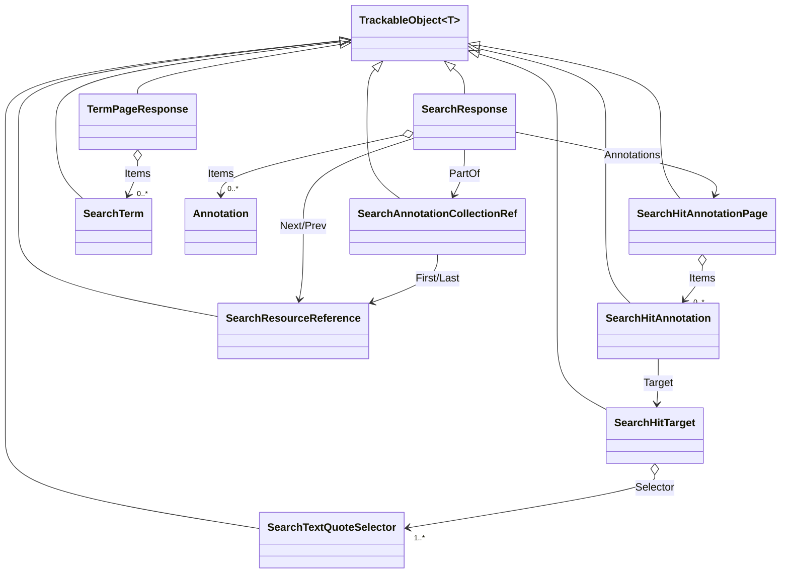

# Search

## Contents

- [Overview](#overview)
- [Files](#files)
- [Types & Members](#types--members)
- [Diagrams](#diagrams)
- [Package Dependencies](#package-dependencies)
- [See Also](#see-also)

## Overview

This folder models the **response bodies** IIIF Content Search API 2.0 returns - as opposed to the
service *descriptors* (`SearchService`/`AutoCompleteService`) in the parent [`Services`](../README.md)
folder. Two response shapes live here: the search-result "AnnotationPage" (`SearchResponse`, whose
`Items` reuse the core Presentation 3.0 `Annotation` type directly, plus a separate "contextualizing"
match-context tree - `SearchHitAnnotationPage`/`SearchHitAnnotation`/`SearchHitTarget`/
`SearchTextQuoteSelector` - for hit-highlighting) and the autocomplete "TermPage"
(`TermPageResponse` of `SearchTerm` suggestions). `SearchAnnotationCollectionRef`/
`SearchResourceReference` are the small shared `{id,type[,paging]}` pointer types both response
shapes' paging fields use.

## Files

| File | Primary type(s) | LOC (approx) | Responsibility |
| --- | --- | --- | --- |
| `SearchAnnotationCollectionRef.cs` | `SearchAnnotationCollectionRef` | 79 | Embedded "AnnotationCollection" pointer (`partOf`) - first/last page + total count. |
| `SearchHitAnnotation.cs` | `SearchHitAnnotation` | 60 | One "contextualizing" match-context entry pointing at a search-result Annotation. |
| `SearchHitAnnotationPage.cs` | `SearchHitAnnotationPage` | 47 | The nested "AnnotationPage" of `SearchHitAnnotation` match-context entries. |
| `SearchHitTarget.cs` | `SearchHitTarget` | 50 | "SpecificResource" target of a `SearchHitAnnotation`, with one or more text selectors. |
| `SearchResourceReference.cs` | `SearchResourceReference` | 38 | Plain `{id,type}` pointer used by `next`/`prev`/`first`/`last`. |
| `SearchResponse.cs` | `SearchResponse` | 153 | The search-request response body - an "AnnotationPage" of matching Annotations. |
| `SearchTerm.cs` | `SearchTerm` | 101 | One autocomplete suggestion (`value`, optional total/label/language/service). |
| `SearchTextQuoteSelector.cs` | `SearchTextQuoteSelector` | 65 | W3C "TextQuoteSelector" (`prefix`/`exact`/`suffix`) identifying matched text. |
| `TermPageResponse.cs` | `TermPageResponse` | 79 | The autocomplete-request response body - a "TermPage" of `SearchTerm` suggestions. |

## Types & Members

| Type | Kind | Summary | Inherits/Implements | Key Members |
| --- | --- | --- | --- | --- |
| `SearchAnnotationCollectionRef` | class | Embedded AnnotationCollection pointer | `TrackableObject<SearchAnnotationCollectionRef>` | `Id`, `Type`, `First`/`Last : SearchResourceReference?`, `Total : int?` |
| `SearchHitAnnotation` | class | Match-context entry | `TrackableObject<SearchHitAnnotation>` | `Id?`, `Type`, `Motivation` (`"contextualizing"`), `Target : SearchHitTarget` |
| `SearchHitAnnotationPage` | class | Nested match-context page | `TrackableObject<SearchHitAnnotationPage>` | `Type`, `Items : IReadOnlyCollection<SearchHitAnnotation>`, `AddItem(...)` |
| `SearchHitTarget` | class | SpecificResource match target | `TrackableObject<SearchHitTarget>` | `Type`, `Source : string`, `Selector : IReadOnlyCollection<SearchTextQuoteSelector>` |
| `SearchResourceReference` | class | Plain `{id,type}` pointer | `TrackableObject<SearchResourceReference>` | `Id`, `Type : string` |
| `SearchResponse` | class | Search-request response body | `TrackableObject<SearchResponse>` | `Context`, `Id`, `Type`, `Items : IReadOnlyCollection<Annotation>`, `Annotations : SearchHitAnnotationPage?`, `PartOf`/`Next`/`Prev`, `StartIndex`, `Ignored` |
| `SearchTerm` | class | One autocomplete suggestion | `TrackableObject<SearchTerm>` | `Type?`, `Value : string` (required), `Total?`, `Label`, `Language?`, `Service : IReadOnlyCollection<IBaseService>` |
| `SearchTextQuoteSelector` | class | W3C TextQuoteSelector | `TrackableObject<SearchTextQuoteSelector>` | `Type`, `Prefix?`, `Exact : string`, `Suffix?` |
| `TermPageResponse` | class | Autocomplete response body | `TrackableObject<TermPageResponse>` | `Context`, `Id`, `Type`, `Items : IReadOnlyCollection<SearchTerm>`, `Ignored`, `AddItem(...)`/`AddIgnored(...)` |

### SearchAnnotationCollectionRef

- **Kind / Namespace**: class, `IIIF.Manifests.Serializer.Properties.Services.Search`. `[SearchAPI("2.0")]`.
- **Inherits**: `TrackableObject<SearchAnnotationCollectionRef>` directly.
- **Key properties**: `Id : string` (required); `Type : string` (defaults to `"AnnotationCollection"`);
  `First`/`Last : SearchResourceReference?`; `Total : int?`.
- **Constructors**: `[JsonConstructor] SearchAnnotationCollectionRef(string id)`.
- **Key methods**: `SetFirst`, `SetLast`, `SetTotal` - fluent.
- **Used by**: `SearchResponse.PartOf`.
- **Usage Recipe**:
  ```csharp
  var collectionRef = new SearchAnnotationCollectionRef("https://example.org/iiif/search/results")
      .SetTotal(42)
      .SetFirst(new SearchResourceReference("https://example.org/iiif/search/results/page/1", "AnnotationPage"));
  ```

### SearchHitAnnotation

- **Kind / Namespace**: class, `Services.Search`. `[SearchAPI("2.0")]`.
- **Inherits**: `TrackableObject<SearchHitAnnotation>` directly. Deliberately a *separate* small type
  tree from the core `Annotation` type rather than extending it - `Annotation.Target` is a plain
  `string` everywhere else in this SDK, and making it polymorphic just for search hit-highlighting
  would be a much larger, riskier cross-cutting change.
- **Key properties**: `Id : string?`; `Type : string` (defaults to `"Annotation"`); `Motivation : string`
  (defaults to `"contextualizing"`); `Target : SearchHitTarget` (required).
- **Constructors**: `[JsonConstructor] SearchHitAnnotation(SearchHitTarget target)`.
- **Key methods**: `SetId(string)`.
- **Usage Recipe**:
  ```csharp
  var hit = new SearchHitAnnotation(new SearchHitTarget(annotationId, [new SearchTextQuoteSelector("manuscript").SetPrefix("a hand-written ")]));
  ```

### SearchHitAnnotationPage

- **Kind / Namespace**: class, `Services.Search`. `[SearchAPI("2.0")]`.
- **Inherits**: `TrackableObject<SearchHitAnnotationPage>` directly.
- **Key properties**: `Type : string` (defaults to `"AnnotationPage"`); `Items : IReadOnlyCollection<SearchHitAnnotation>`.
- **Constructors**: `SearchHitAnnotationPage(IReadOnlyCollection<SearchHitAnnotation> items)`.
- **Key methods**: `AddItem(SearchHitAnnotation)`.
- **Used by**: `SearchResponse.Annotations`.
- **Usage Recipe**:
  ```csharp
  var hitPage = new SearchHitAnnotationPage([]).AddItem(hit);
  searchResponse.SetAnnotations(hitPage);
  ```

### SearchHitTarget

- **Kind / Namespace**: class, `Services.Search`. `[SearchAPI("2.0")]`.
- **Inherits**: `TrackableObject<SearchHitTarget>` directly.
- **Key properties**: `Type : string` (defaults to `"SpecificResource"`); `Source : string` (required
  - the id of the search-result Annotation this hit points back at); `Selector : IReadOnlyCollection<SearchTextQuoteSelector>`.
- **Constructors**: `[JsonConstructor] SearchHitTarget(string source, IReadOnlyCollection<SearchTextQuoteSelector> selector)`.
- **Usage Recipe**:
  ```csharp
  var target = new SearchHitTarget(annotationId, [new SearchTextQuoteSelector("manuscript")]);
  ```

### SearchResourceReference

- **Kind / Namespace**: class, `Services.Search`. `[SearchAPI("2.0")]`.
- **Inherits**: `TrackableObject<SearchResourceReference>` directly.
- **Key properties**: `Id`, `Type : string` (both required).
- **Constructors**: `[JsonConstructor] SearchResourceReference(string id, string type)`.
- **Used by**: `SearchResponse.Next`/`Prev`, `SearchAnnotationCollectionRef.First`/`Last`.
- **Usage Recipe**:
  ```csharp
  var next = new SearchResourceReference("https://example.org/iiif/search/results/page/2", "AnnotationPage");
  ```

### SearchResponse

- **Kind / Namespace**: class, `Services.Search`. `[SearchAPI("2.0")]`.
- **Inherits**: `TrackableObject<SearchResponse>` directly - a standalone response object, not
  embedded via `IiifSerializer`'s hand-built Canvas reader.
- **Key properties**: `Context : string` (defaults to `http://iiif.io/api/search/2/context.json`);
  `Id`, `Type : string` (defaults to `"AnnotationPage"`); `Items : IReadOnlyCollection<Annotation>`
  (reuses `Nodes.Contents.Annotation.Annotation` directly - search-result annotations share the
  `{id,type,motivation,body,target}` shape of painting annotations); `Annotations : SearchHitAnnotationPage?`
  (nested match-context page); `PartOf : SearchAnnotationCollectionRef?`; `Next`/`Prev : SearchResourceReference?`;
  `StartIndex : int?`; `Ignored : IReadOnlyCollection<string>` (query parameters the server ignored).
- **Constructors**: `SearchResponse(string id)`.
- **Key methods**: `AddItem(Annotation)`, `SetAnnotations`, `SetPartOf`, `SetNext`, `SetPrev`,
  `SetStartIndex`, `AddIgnored(string)` - all fluent.
- **Known limitation**: `Annotation.Body` (`IBaseResource`) has no polymorphic-dispatch `JsonConverter`
  for plain `JsonConvert`/`TrackableObject.Parse` round trips - it only resolves correctly through
  `IiifSerializer`'s hand-built V3 Canvas reader. Because `SearchResponse` has no `IiifSerializer`
  integration of its own, round-tripping `Items` through plain `Parse` is not supported (see
  [`SDK_VERSIONING_GUIDE.md`](../../../SDK_VERSIONING_GUIDE.md) §10 Milestone 13's "known follow-up").
- **Usage Recipe**:
  ```csharp
  var response = new SearchResponse("https://example.org/iiif/search/results?q=manuscript")
      .AddItem(matchingAnnotation)
      .SetAnnotations(hitPage)
      .SetPartOf(collectionRef)
      .AddIgnored("motivation");
  ```

### SearchTerm

- **Kind / Namespace**: class, `Services.Search`. `[SearchAPI("2.0")]`.
- **Inherits**: `TrackableObject<SearchTerm>` directly.
- **Key properties**: `Type : string?`; `Value : string` (required - a bare `{"value":"..."}` is a
  valid minimal Term); `Total : int?`; `Label : IReadOnlyCollection<Label>` (language map);
  `Language : string?`; `Service : IReadOnlyCollection<IBaseService>` (reuses the polymorphic service
  dispatch mechanism).
- **Constructors**: `[JsonConstructor] SearchTerm(string value)`.
- **Key methods**: `SetType`, `SetTotal`, `SetLabel`, `SetLanguage`, `AddService(IBaseService)` - all fluent.
- **Usage Recipe**:
  ```csharp
  var term = new SearchTerm("manuscript").SetTotal(12).SetLanguage("en");
  termPage.AddItem(term);
  ```

### SearchTextQuoteSelector

- **Kind / Namespace**: class, `Services.Search`. `[SearchAPI("2.0")]`.
- **Inherits**: `TrackableObject<SearchTextQuoteSelector>` directly.
- **Key properties**: `Type : string` (defaults to `"TextQuoteSelector"`); `Prefix : string?`;
  `Exact : string` (required - the matched text itself); `Suffix : string?`.
- **Constructors**: `[JsonConstructor] SearchTextQuoteSelector(string exact)`.
- **Key methods**: `SetPrefix(string)`, `SetSuffix(string)` - fluent.
- **Usage Recipe**:
  ```csharp
  var selector = new SearchTextQuoteSelector("manuscript").SetPrefix("a hand-written ").SetSuffix(" from the 16th century");
  ```

### TermPageResponse

- **Kind / Namespace**: class, `Services.Search`. `[SearchAPI("2.0")]`.
- **Inherits**: `TrackableObject<TermPageResponse>` directly.
- **Key properties**: `Context : string` (defaults to `http://iiif.io/api/search/2/context.json`);
  `Id`, `Type : string` (defaults to `"TermPage"`); `Items : IReadOnlyCollection<SearchTerm>`;
  `Ignored : IReadOnlyCollection<string>`.
- **Constructors**: `TermPageResponse(string id)`.
- **Key methods**: `AddItem(SearchTerm)`, `AddIgnored(string)` - fluent.
- **Usage Recipe**:
  ```csharp
  var termPage = new TermPageResponse("https://example.org/iiif/autocomplete?q=man")
      .AddItem(new SearchTerm("manuscript"))
      .AddItem(new SearchTerm("mandala"));
  ```

[↑ Back to top](#contents)

## Diagrams


*The two Search 2.0 response trees: `SearchResponse` (search results, reusing the core `Annotation`
type plus a separate hit-highlighting tree) and `TermPageResponse` (autocomplete suggestions).*

[↑ Back to top](#contents)

## Package Dependencies

| Package | Version | Description | Links |
| --- | --- | --- | --- |
| Newtonsoft.Json | 13.0.4 | JSON.NET - this SDK's serialization engine (custom JsonConverters, attribute-driven read/write) | [NuGet](https://www.nuget.org/packages/Newtonsoft.Json/13.0.4) |

[↑ Back to top](#contents)

## See Also

- [`docs/README.md`](../../../README.md) - top-level SDK documentation.
- [`SDK_VERSIONING_GUIDE.md`](../../../SDK_VERSIONING_GUIDE.md) - Milestone 13 covers these response shapes, including the known `Annotation.Body` round-trip limitation noted above.
- [`Properties/Services`](../README.md) - parent folder; `SearchService`/`AutoCompleteService` are the request-side descriptors that pair with these response bodies.

[↑ Back to top](#contents)
