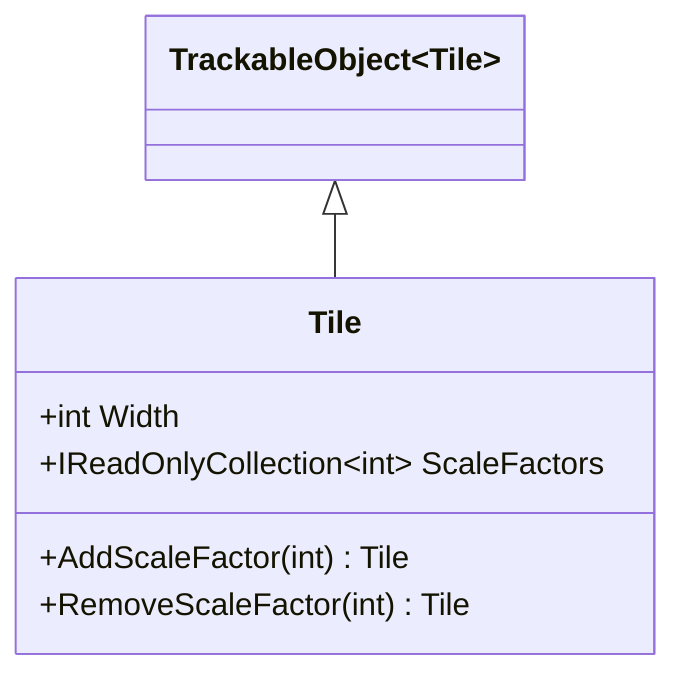
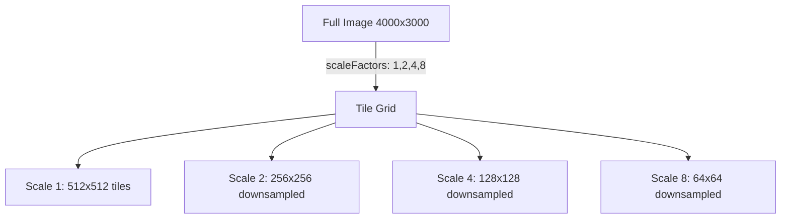

# Tile

## Contents
- [Overview](#overview)
- [Files](#files)
- [Types & Members](#types--members)
- [Diagrams](#diagrams)
- [Examples](#examples)
- [See Also](#see-also)

## Overview

Tile specifies deep-zoom tile dimensions for IIIF Image API services. Carries width (tile size in pixels) and scaleFactors array (zoom levels: 1, 2, 4, 8, etc.). TileJsonConverter writes only populated fields using Newtonsoft.Json.

## Files

| File | Primary type(s) | LOC (approx) | Responsibility |
|------|-----------------|--------------|----------------|
| [Tile.cs](../../../../src/IIIF.Manifest.Serializer.Net/Properties/Tile/Tile.cs) | `Tile` | 18 | Tile specifications |
| [TileJsonConverter.cs](../../../../src/IIIF.Manifest.Serializer.Net/Properties/Tile/TileJsonConverter.cs) | `TileJsonConverter` | 42 | Parses width/scaleFactors |

[↑ Back to top](#contents)

## Types & Members

| Type | Kind | Summary | Inherits/Implements | Key Members |
|------|------|---------|---------------------|-------------|
| `Tile` | Class | Tile size and scale factors | `TrackableObject<Tile>` | `Width`, `ScaleFactors`, `AddScaleFactor`, `RemoveScaleFactor` |
| `TileJsonConverter` | Class | JSON converter for tiles | `TrackableObjectJsonConverter<Tile>` | `EnrichReadJson`, `EnrichWriteJson` |

[↑ Back to top](#contents)

## Diagrams



**Tile Scale Relationship:**


[↑ Back to top](#contents)

## Examples

```csharp
// 512px tiles with 5 zoom levels
var tile = new Tile(512, new[] { 1, 2, 4, 8, 16 });

// Add to service
service.AddTile(tile);

// Or programmatically build scale factors
var tile2 = new Tile(256)
    .AddScaleFactor(1)
    .AddScaleFactor(2)
    .AddScaleFactor(4);
```

**JSON output:**
```json
{
  "tiles": [
    {
      "width": 512,
      "scaleFactors": [1, 2, 4, 8, 16]
    }
  ]
}
```

[↑ Back to top](#contents)

## See Also

- [../Service/README.md](../Service/README.md) – Service details
- [../README.md](../README.md) – Parent Properties folder

[↑ Back to top](#contents)
