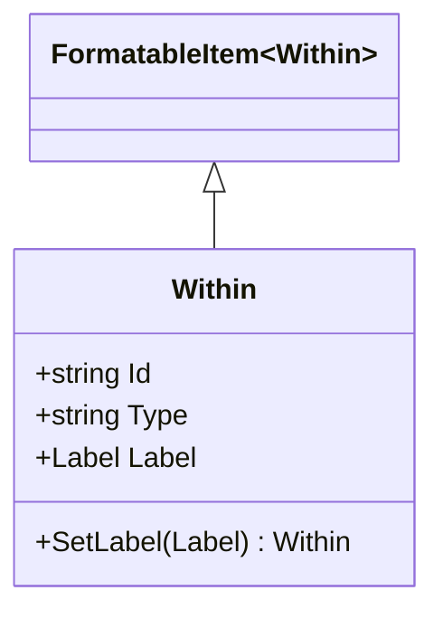

# Within

## Contents
- [Overview](#overview)
- [Files](#files)
- [Types & Members](#types--members)
- [Diagrams](#diagrams)
- [Examples](#examples)
- [See Also](#see-also)

## Overview

Within links IIIF resources to parent collections or aggregations. Supports @id, @type, label. Used to indicate membership in larger sets. WithinJsonConverter disables type checking using Newtonsoft.Json.

## Files

| File | Primary type(s) | LOC (approx) | Responsibility |
|------|-----------------|--------------|----------------|
| [Within.cs](../../../../src/IIIF.Manifest.Serializer.Net/Properties/Within.cs) | `Within` | 14 | Parent collection link |
| [WithinJsonConverter.cs](../../../../src/IIIF.Manifest.Serializer.Net/Properties/Within/WithinJsonConverter.cs) | `WithinJsonConverter` | 22 | Converts within links |

[↑ Back to top](#contents)

## Types & Members

| Type | Kind | Summary | Inherits/Implements | Key Members |
|------|------|---------|---------------------|-------------|
| `Within` | Class | Link to parent collection | `FormatableItem<Within>` | `Id`, `Type`, `Label`, `SetLabel` |
| `WithinJsonConverter` | Class | JSON converter | `FormatableItemJsonConverter<Within>` | Constructor (sets DisableTypeChecking=true) |

[↑ Back to top](#contents)

## Diagrams



[↑ Back to top](#contents)

## Examples

```csharp
var within = new Within("https://example.org/collection/manuscripts")
    .SetLabel(new Label("Medieval Manuscripts Collection"));

manifest.AddWithin(within);
```

**JSON output:**
```json
{
  "within": {
    "@id": "https://example.org/collection/manuscripts",
    "label": "Medieval Manuscripts Collection"
  }
}
```

[↑ Back to top](#contents)

## See Also

- [../README.md](../README.md) – Parent Properties folder
- [../../Shared/FormatableItem/README.md](../../Shared/FormatableItem/README.md) – FormatableItem base

[↑ Back to top](#contents)
