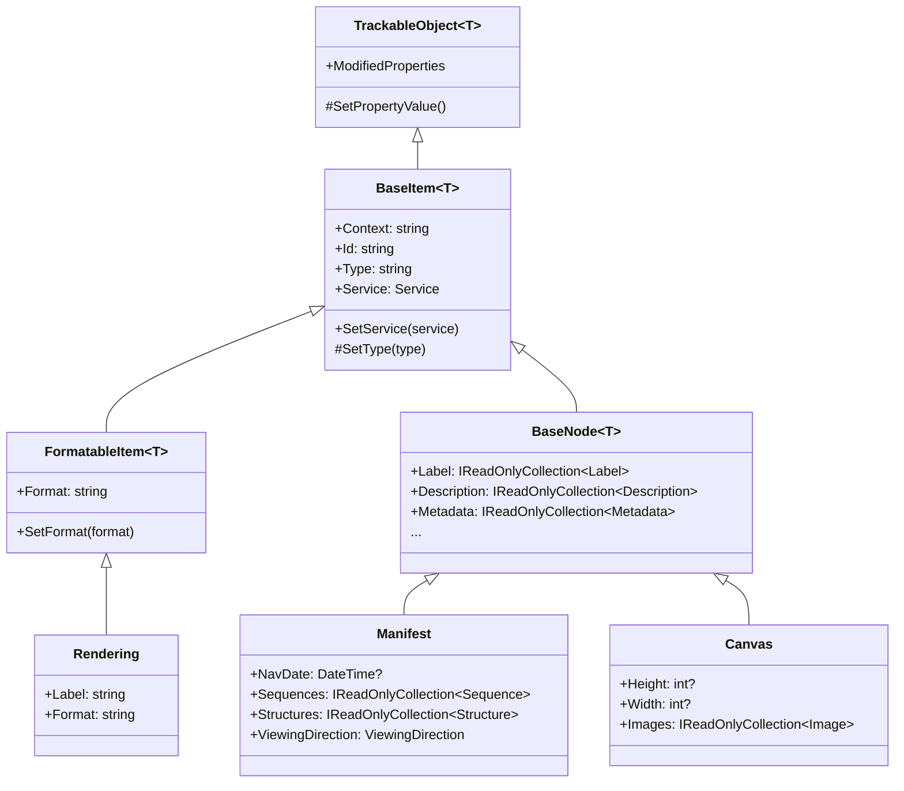
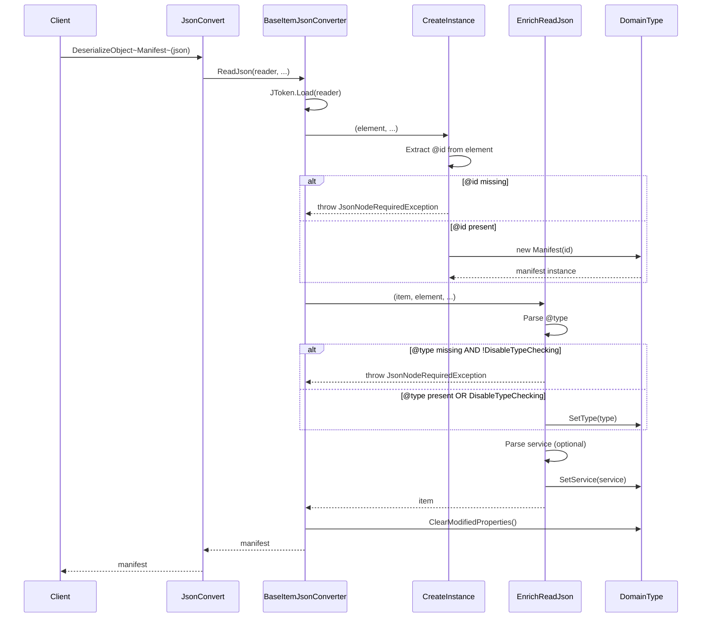
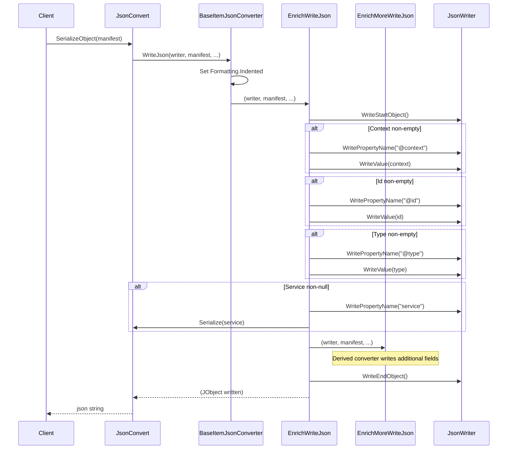

# BaseItem

## Contents
- [Overview](#overview)
- [Files](#files)
- [Types & Members](#types--members)
- [BaseItem](#baseitem-1)
- [BaseItemJsonConverter](#baseitemjsonconverter)
- [Diagrams](#diagrams)
- [Examples](#examples)
- [See Also](#see-also)

## Overview

The BaseItem folder defines the second layer of the IIIF Presentation API 2.0 type hierarchy, adding @context/@id/@type/service fields to TrackableObject. BaseItem establishes the core IIIF identity pattern that all resources and nodes require—a unique @id, an @type indicating the resource class, an optional @context for JSON-LD semantics, and an optional IIIF Image API service descriptor. BaseItemJsonConverter enforces @id/@type validation during deserialization (unless DisableTypeChecking is true), writes these fields in canonical order, and provides EnrichMoreWriteJson extension points for derived converters using Newtonsoft.Json.

## Files

| File | Primary type(s) | LOC (approx) | Responsibility |
|------|-----------------|--------------|----------------|
| [BaseItem.cs](../../../src/IIIF.Manifest.Serializer.Net/Shared/BaseItem/BaseItem.cs) | `BaseItem<T>` | 42 | Generic base with @context/@id/@type/service; default context is IIIF Presentation 2.0 |
| [BaseItemJsonConverter.cs](../../../src/IIIF.Manifest.Serializer.Net/Shared/BaseItem/BaseItemJsonConverter.cs) | `BaseItemJsonConverter<T>` | 100 | Validates @id (required), @type (required unless DisableTypeChecking), parses service, writes in canonical order |

[↑ Back to top](#contents)

## Types & Members

| Type | Kind | Summary | Inherits/Implements | Key Members |
|------|------|---------|---------------------|-------------|
| `BaseItem<T>` | Abstract class | Adds @context (JSON-LD), @id (URI), @type (resource class), and service (IIIF Image API descriptor) to TrackableObject | `TrackableObject<T>` | `Context`, `Id`, `Type`, `Service`, `SetType`, `SetService`, `DefaultContext` |
| `BaseItemJsonConverter<T>` | Abstract class | Enforces @id/@type validation, parses service, writes @context/@id/@type/service in order | `TrackableObjectJsonConverter<T>` | `DisableTypeChecking`, `CreateInstance`, `EnrichReadJson`, `EnrichWriteJson`, `EnrichMoreWriteJson` |

[↑ Back to top](#contents)

## BaseItem

Generic abstract class that adds the four core IIIF identity fields to TrackableObject. All IIIF resources (Manifest, Canvas, Image, Service, etc.) and properties (Rendering, Within, etc.) inherit from BaseItem to ensure consistent @id/@type handling. Context defaults to "http://iiif.io/api/presentation/2/context.json" for top-level resources.

### Properties

- `Context` (string) – JSON-LD @context; defaults to IIIF Presentation 2.0 context; typically only set on Manifest
- `Id` (string) – Required @id URI identifying this resource; immutable after construction
- `Type` (string) – @type indicating resource class (e.g., "sc:Manifest", "sc:Canvas", "oa:Annotation", "dctypes:Image")
- `Service` (Service) – Optional IIIF Image API service descriptor with tiles, dimensions, profile

### Constants

- `DefaultContext` = "http://iiif.io/api/presentation/2/context.json"
- `ContextJName` = "@context"
- `IdJName` = "@id"
- `TypeJName` = "@type"
- `ServiceJName` = "service"

### Constructors

- `BaseItem(string id)` – Protected internal; sets Id and Context to DefaultContext
- `BaseItem(string id, string type)` – Public; calls above and SetType(type)
- `BaseItem(string id, string type, string context)` – Protected internal; sets all three

### Methods

- `SetType(string type)` – Internal; updates Type via SetPropertyValue
- `SetService(Service service)` – Public; attaches IIIF Image API service descriptor

### Usage

```csharp
// Manifest inherits BaseItem<Manifest>
var manifest = new Manifest("https://example.org/manifest", new Label("Book"));
Console.WriteLine(manifest.Context); // "http://iiif.io/api/presentation/2/context.json"
Console.WriteLine(manifest.Id);      // "https://example.org/manifest"
Console.WriteLine(manifest.Type);    // "sc:Manifest"

// Attach IIIF Image API service
var service = new Service(
    "http://iiif.io/api/image/2/context.json",
    "https://example.org/iiif/image",
    "http://iiif.io/api/image/2/level1.json"
);
manifest.SetService(service);

// Service can include tiles for deep-zoom
service.AddTile(new Tile(512, new[] { 1, 2, 4, 8 }));
```

[↑ Back to top](#contents)

## BaseItemJsonConverter

Abstract JsonConverter that enforces IIIF @id/@type validation and writes fields in canonical order (@context, @id, @type, service, then derived fields). DisableTypeChecking allows FormatableItemJsonConverter to skip @type validation for simple link types (Rendering, SeeAlso, Within).

### Properties

- `DisableTypeChecking` (bool) – If true, @type is optional; used by FormatableItemJsonConverter for link types

### Methods

- `CreateInstance(JToken element, Type objectType, ...)` – Extracts @id from JObject or direct string; throws JsonNodeRequiredException if @id missing; calls Activator.CreateInstance with id
- `EnrichReadJson(T item, JToken element, ...)` – Parses @type (throws if missing unless DisableTypeChecking), parses service; base implementation for derived converters
- `EnrichWriteJson(JsonWriter writer, T value, JsonSerializer serializer)` – Writes @context/@id/@type/service in order, then calls EnrichMoreWriteJson for derived fields; sealed to enforce order
- `EnrichMoreWriteJson(JsonWriter writer, T value, JsonSerializer serializer)` – Virtual extension point for derived converters to write additional fields

### Validation Rules

1. @id is required (throws JsonNodeRequiredException<T> if missing)
2. @type is required unless DisableTypeChecking = true (throws JsonNodeRequiredException<T> if missing)
3. @context is optional and only written if non-empty
4. service is optional

### Usage

```csharp
// Example derived converter
public class CanvasJsonConverter : BaseNodeJsonConverter<Canvas>
{
    protected override Canvas CreateInstance(JToken element, ...)
    {
        var jId = element.TryGetToken(BaseItem<Canvas>.IdJName);
        if (jId == null)
            throw new JsonNodeRequiredException<Canvas>(BaseItem<Canvas>.IdJName);
        
        var jLabel = element.TryGetToken(BaseNode<Canvas>.LabelJName);
        var jHeight = element[Constants.HeightJName];
        var jWidth = element[Constants.WidthJName];
        
        return new Canvas(jId.ToString(), label, height, width);
    }
    
    protected override void EnrichMoreWriteJson(JsonWriter writer, Canvas value, JsonSerializer serializer)
    {
        base.EnrichMoreWriteJson(writer, value, serializer); // BaseNodeJsonConverter
        
        // Write canvas-specific fields
        if (value.Images.Count > 0)
        {
            writer.WritePropertyName(Canvas.ImagesJName);
            serializer.Serialize(writer, value.Images);
        }
    }
}
```

[↑ Back to top](#contents)

## Diagrams

### BaseItem Type Hierarchy



### BaseItemJsonConverter Deserialization Flow



### BaseItemJsonConverter Serialization Flow



[↑ Back to top](#contents)

## Examples

### Creating Types with BaseItem

```csharp
// Manifest automatically sets context, type
var manifest = new Manifest("https://example.org/manifest", new Label("Book"));
Console.WriteLine(manifest.Context); // "http://iiif.io/api/presentation/2/context.json"
Console.WriteLine(manifest.Id);      // "https://example.org/manifest"
Console.WriteLine(manifest.Type);    // "sc:Manifest"

// Canvas requires id, label, dimensions
var canvas = new Canvas(
    "https://example.org/canvas/1",
    new Label("Page 1"),
    1000,
    800
);
Console.WriteLine(canvas.Type);      // "sc:Canvas"
Console.WriteLine(canvas.Context);   // "http://iiif.io/api/presentation/2/context.json"

// Image annotation has specific type
var image = new Image(
    "https://example.org/annotation/1",
    new ImageResource("https://example.org/image.jpg", "image/jpeg"),
    "https://example.org/canvas/1"
);
Console.WriteLine(image.Type);       // "oa:Annotation"
```

### Attaching IIIF Image Service

```csharp
// Create ImageResource with IIIF service for deep-zoom
var resource = new ImageResource("https://example.org/image.jpg", "image/jpeg")
    .SetHeight(2000)
    .SetWidth(1600);

// Create service with Image API context and profile
var service = new Service(
    "http://iiif.io/api/image/2/context.json",
    "https://example.org/iiif/image",
    "http://iiif.io/api/image/2/level1.json"
)
.SetHeight(2000)
.SetWidth(1600);

// Add tile specifications for multi-resolution
service.AddTile(new Tile(512, new[] { 1, 2, 4, 8, 16 }));

// Attach service to resource
resource.SetService(service);

// Create image annotation with resource
var image = new Image(
    "https://example.org/annotation/1",
    resource,
    "https://example.org/canvas/1"
);

// Serializes to:
// {
//   "@context": "http://iiif.io/api/presentation/2/context.json",
//   "@id": "https://example.org/annotation/1",
//   "@type": "oa:Annotation",
//   "motivation": "sc:painting",
//   "resource": {
//     "@id": "https://example.org/image.jpg",
//     "@type": "dctypes:Image",
//     "format": "image/jpeg",
//     "height": 2000,
//     "width": 1600,
//     "service": {
//       "@context": "http://iiif.io/api/image/2/context.json",
//       "@id": "https://example.org/iiif/image",
//       "profile": "http://iiif.io/api/image/2/level1.json",
//       "height": 2000,
//       "width": 1600,
//       "tiles": [...]
//     }
//   },
//   "on": "https://example.org/canvas/1"
// }
```

### Custom Type Inheriting BaseItem

```csharp
// Example custom IIIF extension type
[JsonConverter(typeof(CustomResourceJsonConverter))]
public class CustomResource : BaseItem<CustomResource>
{
    [JsonProperty("customField")]
    public string CustomField { get; private set; }
    
    public CustomResource(string id) : base(id, "custom:Resource")
    {
    }
    
    public CustomResource SetCustomField(string value)
        => SetPropertyValue(a => a.CustomField, value);
}

// Custom converter inherits BaseItemJsonConverter
public class CustomResourceJsonConverter : BaseItemJsonConverter<CustomResource>
{
    protected override void EnrichMoreWriteJson(JsonWriter writer, CustomResource value, JsonSerializer serializer)
    {
        if (!string.IsNullOrEmpty(value.CustomField))
        {
            writer.WritePropertyName("customField");
            writer.WriteValue(value.CustomField);
        }
    }
}

// Usage
var resource = new CustomResource("https://example.org/custom/1")
    .SetCustomField("custom value")
    .SetService(service);

var json = JsonConvert.SerializeObject(resource);
// {
//   "@context": "http://iiif.io/api/presentation/2/context.json",
//   "@id": "https://example.org/custom/1",
//   "@type": "custom:Resource",
//   "service": {...},
//   "customField": "custom value"
// }
```

[↑ Back to top](#contents)

## See Also

- [../Trackable/README.md](../Trackable/README.md) – Parent TrackableObject implementation
- [../BaseNode/README.md](../BaseNode/README.md) – Extends BaseItem with full IIIF metadata
- [../FormatableItem/README.md](../FormatableItem/README.md) – BaseItem subclass with format field
- [../../Properties/Service/README.md](../../Properties/Service/README.md) – IIIF Image API service descriptor
- [../README.md](../README.md) – Parent Shared folder overview
- [IIIF Presentation API 2.0 - @context/@id/@type](https://iiif.io/api/presentation/2.0/#resource-structure) – Official specification

[↑ Back to top](#contents)
