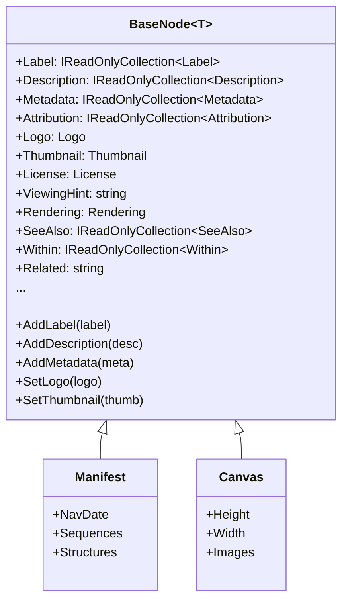

# BaseNode

## Contents
- [Overview](#overview)
- [Files](#files)
- [Types & Members](#types--members)
- [Diagrams](#diagrams)
- [Examples](#examples)
- [See Also](#see-also)

## Overview

BaseNode extends BaseItem with the complete set of IIIF Presentation API 2.0 descriptive metadata fields: label (human-readable titles), description (longer text), metadata (structured label-value pairs), attribution (credits), logo/thumbnail (image URIs), license (rights URI), viewingHint (display behavior), rendering (alternative formats), seeAlso (related resources), within (parent collections), and related (general links). All 15+ metadata fields support collections via Add*/Remove* methods using the TrackableObject pattern. BaseNodeJsonConverter serializes single values as strings/objects and multiple values as arrays, handles multi-language support, and provides extension points for derived node types using Newtonsoft.Json.

## Files

| File | Primary type(s) | LOC (approx) | Responsibility |
|------|-----------------|--------------|----------------|
| [BaseNode.cs](../../../src/IIIF.Manifest.Serializer.Net/Shared/BaseNode/BaseNode.cs) | `BaseNode<T>` | 118 | Adds 15+ IIIF metadata fields to BaseItem with collection support |
| [BaseNodeJsonConverter.cs](../../../src/IIIF.Manifest.Serializer.Net/Shared/BaseNode/BaseNodeJsonConverter.cs) | `BaseNodeJsonConverter<T>` | 180 | Parses metadata fields (single-or-array), writes collections as arrays when count > 1 |

[↑ Back to top](#contents)

## Types & Members

| Type | Kind | Summary | Inherits/Implements | Key Members |
|------|------|---------|---------------------|-------------|
| `BaseNode<T>` | Abstract class | Adds full IIIF descriptive metadata to BaseItem; supports multiple labels/descriptions/metadata/etc. via collections | `BaseItem<T>` | `Label`, `Description`, `Metadata`, `Attribution`, `Logo`, `Thumbnail`, `License`, `ViewingHint`, `Rendering`, `SeeAlso`, `Within`, `Related`; Add*/Remove*/Set* methods for each |
| `BaseNodeJsonConverter<T>` | Abstract class | Parses all metadata fields from JSON (handles single-or-array inputs), writes as arrays when multiple values exist | `BaseItemJsonConverter<T>` | `EnrichReadJson`, `EnrichMoreWriteJson` |

[↑ Back to top](#contents)

## Diagrams

### BaseNode Metadata Fields



[↑ Back to top](#contents)

## Examples

### Using BaseNode Metadata

```csharp
var manifest = new Manifest("https://example.org/manifest", new Label("Book"))
    .AddLabel(new Label("Livre")) // Multiple labels
    .AddDescription(new Description("A historic manuscript"))
    .AddMetadata(new Metadata("Author", "Jane Doe"))
    .AddMetadata(new Metadata("Date", "1850"))
    .AddAttribution(new Attribution("Example Archive"))
    .SetLogo(new Logo("https://example.org/logo.png"))
    .SetThumbnail(new Thumbnail("https://example.org/thumb.jpg"))
    .SetLicense(new License("https://creativecommons.org/licenses/by/4.0/"))
    .SetViewingHint("paged")
    .AddSeeAlso(new SeeAlso("https://example.org/metadata.xml").SetFormat("application/xml"))
    .AddWithin(new Within("https://example.org/collection"));

// All metadata inherited by Manifest, Canvas, Sequence, Structure, etc.
```

[↑ Back to top](#contents)

## See Also

- [../BaseItem/README.md](../BaseItem/README.md) – Parent BaseItem class
- [../../Properties/README.md](../../Properties/README.md) – Metadata property types
- [../../Nodes/README.md](../../Nodes/README.md) – Node types inheriting BaseNode
- [../README.md](../README.md) – Parent Shared folder
- [IIIF Presentation API 2.0 - Descriptive Properties](https://iiif.io/api/presentation/2.0/#descriptive-properties) – Official specification

[↑ Back to top](#contents)
