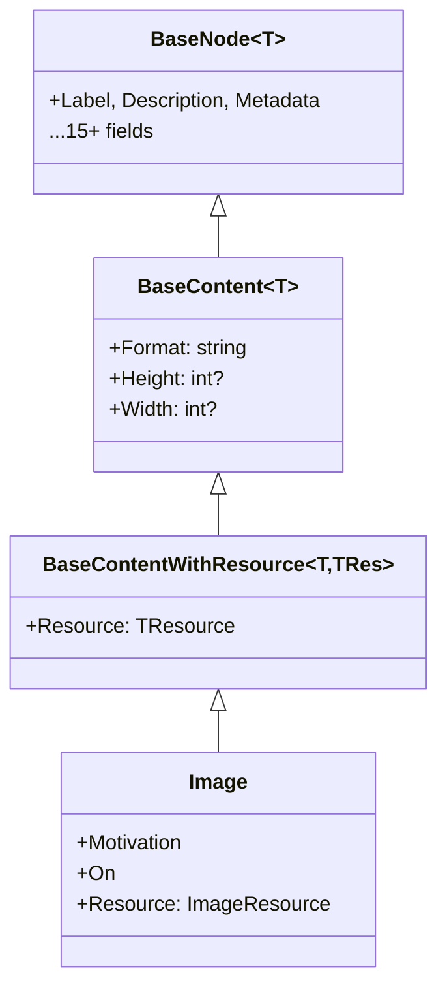

# Content (Shared)

## Contents
- [Overview](#overview)
- [Subdirectories](#subdirectories)
- [Files](#files)
- [Types & Members](#types--members)
- [Diagrams](#diagrams)
- [Examples](#examples)
- [See Also](#see-also)

## Overview

The Shared/Content folder defines BaseContent, the foundation for all IIIF Presentation API 2.0 annotation types. BaseContent<T> extends BaseNode with format and dimensions (height/width), while BaseContent<T,TResource> adds a resource field linking to content (ImageResource, EmbeddedContentResource, SegmentResource). BaseContentJsonConverter enforces resource/on validation, parses format/dimensions, writes within/seeAlso as arrays unconditionally, and provides extension points for annotation-specific fields using Newtonsoft.Json. All content types (Image, EmbeddedContent, Segment, OtherContent) inherit from BaseContent to maintain consistent annotation structure.

## Subdirectories

| Directory | Purpose |
|-----------|---------|
| [./Resources/README.md](./Resources/README.md) | BaseResource foundation for content resources |

## Files

| File | Primary type(s) | LOC (approx) | Responsibility |
|------|-----------------|--------------|----------------|
| [BaseContent.cs](../../../src/IIIF.Manifest.Serializer.Net/Shared/Content/BaseContent.cs) | `BaseContent<T>`, `BaseContent<T,TResource>` | 54 | Adds format/dimensions to BaseNode; resource-aware variant links TResource |
| [BaseContentJsonConverter.cs](../../../src/IIIF.Manifest.Serializer.Net/Shared/Content/BaseContentJsonConverter.cs) | `BaseContentJsonConverter<T>`, `BaseContentJsonConverter<T,TResource>` | 185 | Parses format/height/width/resource, validates resource/on, writes arrays |

[↑ Back to top](#contents)

## Types & Members

| Type | Kind | Summary | Inherits/Implements | Key Members |
|------|------|---------|---------------------|-------------|
| `BaseContent<T>` | Abstract class | Annotation base with format and dimensions | `BaseNode<T>`, `IDimenssionSupport<T>` | `Format`, `Height`, `Width`, `SetFormat`, `SetHeight`, `SetWidth` |
| `BaseContent<T,TResource>` | Abstract class | Resource-aware annotation with typed resource field | `BaseContent<T>` | `Resource` |
| `BaseContentJsonConverter<T>` | Abstract class | Converts BaseContent; enforces format/dimensions parsing, writes within/seeAlso as arrays | `BaseNodeJsonConverter<T>` | `EnrichReadJson`, `EnrichMoreWriteJson` |
| `BaseContentJsonConverter<T,TResource>` | Abstract class | Resource-aware converter; validates resource required | `BaseContentJsonConverter<T>` | Resource validation |

[↑ Back to top](#contents)

## Diagrams

### BaseContent Hierarchy



[↑ Back to top](#contents)

## Examples

```csharp
// Image inherits BaseContent<Image, ImageResource>
var image = new Image(id, resource, canvasId);
// Has: Format, Height, Width (from BaseContent)
// Has: Label, Description, Metadata (from BaseNode)
// Has: Resource (from BaseContent<T,TRes>)
```

[↑ Back to top](#contents)

## See Also

- [./Resources/README.md](./Resources/README.md) – BaseResource for content
- [../BaseNode/README.md](../BaseNode/README.md) – Parent BaseNode class
- [../../Nodes/Content/README.md](../../Nodes/Content/README.md) – Concrete annotation types
- [../README.md](../README.md) – Parent Shared folder

[↑ Back to top](#contents)
