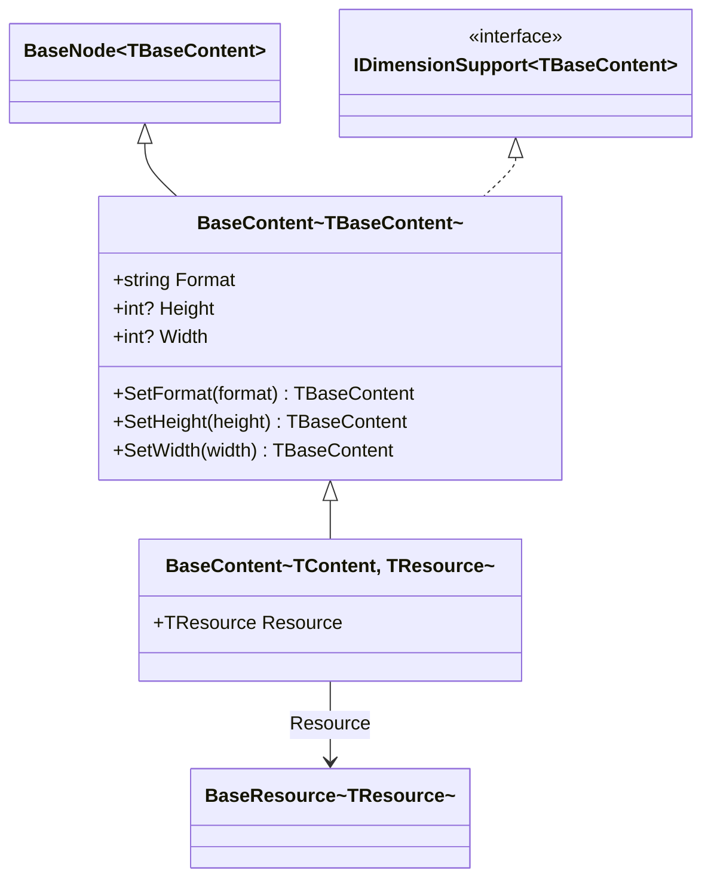

# Content

## Contents

- [Overview](#overview)
- [Files](#files)
- [Types & Members](#types--members)
  - [BaseContent\<TBaseContent\>](#basecontenttbasecontent)
  - [BaseContent\<TContent, TResource\>](#basecontenttcontent-tresource)
- [Diagrams](#diagrams)
- [Package Dependencies](#package-dependencies)
- [See Also](#see-also)

## Overview

`Shared/Content` provides the base class(es) for IIIF "content" nodes — the layer that sits above a
polymorphic annotation-body `Resource` (see [`Resources`](./Resources/README.md)) and adds the
content-level metadata that the IIIF Presentation API §3 Structural Properties table assigns to
Image/Sound/Video/Text-shaped bodies: `format`, `height`, and `width`. It is the single shared
ancestor that every concrete content type in the wider SDK (`ImageContent`, `AudioContent`,
`VideoContent`, `TextualContent`, etc., under `Nodes/Contents/*`, out of scope here) derives from,
so those concrete types only need to declare their own resource/selector shape and inherit
format/dimension support "for free." The folder contains exactly one file, `BaseContent.cs`, which
declares two cooperating generic classes using the curiously-recurring-template (CRTP) pattern
already used throughout this SDK's node hierarchy (`BaseNode<TSelf>`).

[↑ Back to top](#contents)

## Files

| File | Primary type(s) | LOC (approx) | Responsibility |
|------|------------------|--------------|----------------|
| `BaseContent.cs` | `BaseContent<TBaseContent>`, `BaseContent<TContent, TResource>` | 79 | Base class(es) for content nodes: adds `format`/`height`/`width` metadata (single type-parameter form) and, for content types that must also carry an embedded polymorphic resource, a strongly-typed `Resource` property (two type-parameter form). |

[↑ Back to top](#contents)

## Types & Members

| Type | Kind | Summary | Inherits/Implements | Key Members |
|------|------|---------|----------------------|--------------|
| `BaseContent<TBaseContent>` | public generic class (CRTP) | Adds `Format`, `Height`, `Width` metadata to a node. | `BaseNode<TBaseContent>`, `IDimensionSupport<TBaseContent>` | `Format`, `Height`, `Width`, `SetFormat`, `SetHeight`, `SetWidth` |
| `BaseContent<TContent, TResource>` | public generic class (CRTP) | Extends the single-parameter form with an embedded, strongly-typed `Resource`. | `BaseContent<TContent>` | `Resource` |

### BaseContent\<TBaseContent\>

- **Kind**: `public class`, generic (self-referential/CRTP: `where TBaseContent : BaseContent<TBaseContent>`), namespace `IIIF.Manifests.Serializer.Shared.Content`.
- **Inherits/Implements**: `BaseNode<TBaseContent>` (tracked-node base, documented under `Shared`/`Shared/Trackable`); `IDimensionSupport<TBaseContent>` (from `IIIF.Manifests.Serializer.Properties.Interfaces`) — the marker/contract this type satisfies for width/height-bearing nodes.
- **Notable attributes**: none at the class level; the deserialization constructor is marked `[JsonConstructor]`.
- **Key properties**:
  - `Format : string` — JSON `"format"` (constant `FormatJName`). Getter defaults to `string.Empty` instead of `null` (never nullable to callers); private setter routed through the trackable-object `SetElementValue`/`GetElementValue` plumbing.
  - `Height : int?` — JSON `"height"` (`Constants.HeightJName`). Nullable; omitted from output when unset.
  - `Width : int?` — JSON `"width"` (`Constants.WidthJName`). Nullable; omitted from output when unset.
- **Key methods**:
  - `SetFormat(string format) : TBaseContent` — fluent setter, returns `this` cast to the derived type for chaining.
  - `SetHeight(int height) : TBaseContent` — fluent setter.
  - `SetWidth(int width) : TBaseContent` — fluent setter.
- **Constructors**:
  - `protected internal BaseContent(string id)` — `[JsonConstructor]`; used by Newtonsoft during deserialization. `protected internal` keeps it usable by derived types within the assembly and by Newtonsoft's activator, while blocking arbitrary external direct construction.
  - `public BaseContent(string id, string type)` — the "author a new node" constructor; forwards `id`/`type` to `BaseNode<TBaseContent>`.
- **Thread-safety/immutability**: not immutable — properties have private setters exposed indirectly via the fluent `Set*` methods; instances are typically built once via the fluent API before serialization, consistent with the rest of the trackable-node hierarchy.
- **Usage Recipe**: `BaseContent<TBaseContent>` is only ever consumed through a concrete derived type (declared elsewhere, e.g. `Nodes/Contents/*`). A minimal derived type and its usage:

```csharp
// Concrete content type (illustrative — real concrete types live under Nodes/Contents/*)
public class MyContent : BaseContent<MyContent>
{
    public MyContent(string id, string type) : base(id, type) { }
}

var content = new MyContent("https://example.org/content/1", "Image")
    .SetFormat("image/jpeg")
    .SetWidth(3000)
    .SetHeight(2000);
```

### BaseContent\<TContent, TResource\>

- **Kind**: `public class`, doubly-generic (CRTP on `TContent`, constrained resource type on `TResource`), namespace `IIIF.Manifests.Serializer.Shared.Content`.
- **Inherits/Implements**: `BaseContent<TContent>` (the single-parameter form above), so it also carries `Format`/`Height`/`Width`. Type constraints: `TContent : BaseContent<TContent, TResource>`, `TResource : BaseResource<TResource>` (see [`Resources`](./Resources/README.md)).
- **Notable attributes**: deserialization constructor marked `[JsonConstructor]`.
- **Key properties**:
  - `Resource : TResource` — JSON `"resource"` (constant `ResourceJName`). Strongly typed to whatever concrete `BaseResource<TResource>`-derived type the content type declares (e.g. an `ImageResource`); getter uses the null-forgiving operator since a content node of this shape is expected to always carry a resource.
- **Constructors**:
  - `[JsonConstructor] public BaseContent(string id, string type, TResource resource)` — the only constructor; both authoring and deserialization go through it, forwarding `id`/`type` to the base `BaseContent<TContent>` constructor and assigning `Resource`.
- **Thread-safety/immutability**: same model as the single-parameter base — mutable via fluent setters inherited from `BaseContent<TContent>`, `Resource` itself is set once at construction (no `SetResource` fluent method is exposed at this level).
- **Usage Recipe**:

```csharp
// Concrete content type wrapping a specific resource kind (illustrative)
public class MyImageContent : BaseContent<MyImageContent, ImageResource>
{
    public MyImageContent(string id, string type, ImageResource resource)
        : base(id, type, resource) { }
}

var imageResource = new ImageResource("https://example.org/image/1", "Image");
var content = new MyImageContent("https://example.org/content/1", "Image", imageResource)
    .SetFormat("image/jpeg");
```

[↑ Back to top](#contents)

## Diagrams


```mermaid
classDiagram
    class BaseNode~TBaseContent~
    class IDimensionSupport~TBaseContent~ {
        <<interface>>
    }
    class BaseContent_1["BaseContent~TBaseContent~"] {
        +string Format
        +int? Height
        +int? Width
        +SetFormat(format) TBaseContent
        +SetHeight(height) TBaseContent
        +SetWidth(width) TBaseContent
    }
    class BaseContent_2["BaseContent~TContent, TResource~"] {
        +TResource Resource
    }
    class BaseResource_T["BaseResource~TResource~"]

    BaseNode~TBaseContent~ <|-- BaseContent_1
    IDimensionSupport~TBaseContent~ <|.. BaseContent_1
    BaseContent_1 <|-- BaseContent_2
    BaseContent_2 --> BaseResource_T : Resource
```

The single-parameter `BaseContent<TBaseContent>` adds format/dimension metadata on top of the shared
`BaseNode<T>`/`IDimensionSupport<T>` foundation; the two-parameter form layers an embedded, strongly
typed `Resource` (constrained to `BaseResource<TResource>`, see the [Resources](./Resources/README.md)
folder) on top of that for content types that need both.

[↑ Back to top](#contents)

## Package Dependencies

| Package | Version | Description | Links |
|---------|---------|--------------|-------|
| Newtonsoft.Json | 13.0.4 | JSON.NET — this SDK's serialization engine (custom JsonConverters, attribute-driven read/write) | [NuGet](https://www.nuget.org/packages/Newtonsoft.Json/13.0.4) |

[↑ Back to top](#contents)

## See Also

- [Resources](./Resources/README.md) — the polymorphic annotation-body resource abstractions (`IBaseResource`/`BaseResource`) that `BaseContent<TContent, TResource>` wraps.
- [Shared](../README.md) — the parent `Shared` folder documentation.
- [IIIF.Manifest.Serializer.Net](../../README.md) — top-level project README.
- [SDK Versioning Guide](../../SDK_VERSIONING_GUIDE.md) — how this SDK handles IIIF Presentation API version differences.

[↑ Back to top](#contents)
