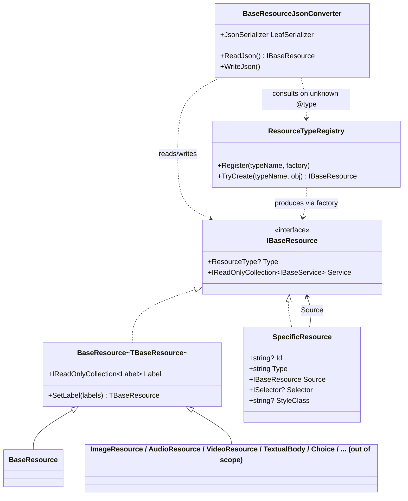
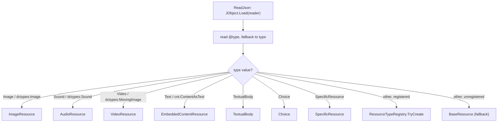

# Resources

## Contents

- [Overview](#overview)
- [Files](#files)
- [Types & Members](#types--members)
  - [IBaseResource](#ibaseresource)
  - [BaseResource\<TBaseResource\>](#baseresourcetbaseresource)
  - [BaseResource](#baseresource)
  - [BaseResourceJsonConverter](#baseresourcejsonconverter)
  - [ResourceTypeRegistry](#resourcetyperegistry)
  - [SpecificResource](#specificresource)
- [Diagrams](#diagrams)
- [Package Dependencies](#package-dependencies)
- [See Also](#see-also)

## Overview

`Shared/Content/Resources` models the W3C Web Annotation "body" abstraction that an IIIF
`Annotation`'s `body` (and a `SpecificResource`'s `source`) is polymorphically typed as:
`IBaseResource`. It provides the non-generic contract (`IBaseResource`), the generic CRTP base
implementation (`BaseResource<TBaseResource>` and its concrete closed form `BaseResource`), the
Newtonsoft `JsonConverter` that resolves `@type`/`type` to the correct concrete .NET resource type
on read (`BaseResourceJsonConverter`), an extensibility hook so assemblies outside this SDK can
register their own resource types for that same dispatch (`ResourceTypeRegistry`), and the
`SpecificResource` wrapper (resource + selector) used to crop/select part of an embedded resource.
Every concrete content-resource type in the wider SDK (`ImageResource`, `AudioResource`,
`VideoResource`, `EmbeddedContentResource`, `TextualBody`, `Choice`, etc., under `Nodes/Contents/*`,
out of scope here) derives from `BaseResource<TBaseResource>` and is dispatched to by name through
this folder's converter and registry.

[↑ Back to top](#contents)

## Files

| File | Primary type(s) | LOC (approx) | Responsibility |
|------|------------------|--------------|----------------|
| `BaseResource.cs` | `IBaseResource`, `BaseResource<TBaseResource>`, `BaseResource` | 84 | Declares the polymorphic resource contract and its CRTP base implementation (label + type + service-default), plus a directly-instantiable closed form. |
| `BaseResourceJsonConverter.cs` | `BaseResourceJsonConverter` | 90 | Newtonsoft `JsonConverter<IBaseResource>` that inspects `@type`/`type` on read and dispatches to the matching concrete resource type, guarding against converter re-entrancy on both read and write. |
| `ResourceTypeRegistry.cs` | `ResourceTypeRegistry` | 31 | Thread-safe registry letting external assemblies register a factory for their own `IBaseResource` implementer, keyed by JSON type name. |
| `SpecificResource.cs` | `SpecificResource` | 92 | Models the W3C "SpecificResource" wrapper: a `Source` resource plus a `Selector` (and optional `Id`/`StyleClass`) used to select/crop part of that resource. |

[↑ Back to top](#contents)

## Types & Members

| Type | Kind | Summary | Inherits/Implements | Key Members |
|------|------|---------|----------------------|--------------|
| `IBaseResource` | public interface | Polymorphic contract for anything usable as an annotation `body`/`source`. | (none; carries `[JsonConverter(typeof(BaseResourceJsonConverter))]`) | `Type`, `Service` (default interface member) |
| `BaseResource<TBaseResource>` | public generic class (CRTP) | Base implementation of `IBaseResource`: adds `Label` and explicit `Type`. | `FormattableItem<TBaseResource>`, `IBaseResource` | `Label`, `SetLabel` (x2), ctors |
| `BaseResource` | public class | Directly instantiable closed form of `BaseResource<TBaseResource>`. | `BaseResource<BaseResource>` | ctors only |
| `BaseResourceJsonConverter` | public class (`JsonConverter<IBaseResource>`) | Resolves `@type`/`type` to a concrete resource type on read; writes via a recursion-safe leaf serializer. | `Newtonsoft.Json.JsonConverter<IBaseResource>` | `LeafSerializer`, `ReadJson`, `WriteJson` |
| `ResourceTypeRegistry` | public static class | Extension point mapping a JSON type-name string to a resource factory. | (static) | `Register`, `TryCreate` |
| `SpecificResource` | public class | W3C "SpecificResource" wrapper: resource + selector. | `TrackableObject<SpecificResource>`, `IBaseResource` | `Id`, `Type`, `Source`, `Selector`, `StyleClass`, `SetId`, `SetSelector`, `SetStyleClass` |

### IBaseResource

- **Kind**: `public interface`, namespace `IIIF.Manifests.Serializer.Shared.Content.Resources`.
- **Notable attributes**: `[JsonConverter(typeof(BaseResourceJsonConverter))]` on the interface itself — every property/field declared as `IBaseResource` (e.g. an `Annotation.Body`, or `SpecificResource.Source`) automatically gets polymorphic read/write dispatch through `BaseResourceJsonConverter` without each call site re-declaring the attribute.
- **Key members**:
  - `Type : ResourceType?` — the resource's discriminator (get-only).
  - `Service : IReadOnlyCollection<IBaseService>` — a **C# 8 default interface member** returning `[]` (empty). Per its XML doc, this default is "automatically satisfied without any code change by every `BaseResource<TBaseResource>`-derived type," which already exposes the real `Service` via inherited `FormattableItem`/`BaseItem.Service` — the default only matters for `IBaseResource` implementers that have no service concept at all (`TextualBody`, `Choice`, `SpecificResource`). This lets the hand-rolled V3 writer always emit a spec-correct, always-array `"service"` regardless of concrete resource type, without a per-type switch.
- **Usage Recipe**: consumers rarely reference `IBaseResource` members directly; they declare a property as `IBaseResource` to get polymorphic behavior for free:

```csharp
public IBaseResource Body { get; private set; } // resolved to ImageResource/TextualBody/etc. on read
```

### BaseResource\<TBaseResource\>

- **Kind**: `public class`, generic CRTP (`where TBaseResource : BaseResource<TBaseResource>`), namespace `IIIF.Manifests.Serializer.Shared.Content.Resources`.
- **Inherits/Implements**: `FormattableItem<TBaseResource>` (documented elsewhere under `Shared`; supplies id/type plumbing and the real `Service` collection referenced by `IBaseResource.Service`'s default implementation), `IBaseResource`.
- **Notable attributes**: deserialization constructor marked `[JsonConstructor]`.
- **Key properties**:
  - `Type` (explicit interface implementation, `IBaseResource.Type : ResourceType?`) — wraps the inherited `base.Type` string in a `ResourceType` when non-blank, else `null`.
  - `Label : IReadOnlyCollection<Label>` — JSON `"label"` (constant `LabelJName`), `[JsonConverter(typeof(ObjectArrayJsonConverter))]`. Per IIIF spec §3 Structural Properties, lets a content resource carry its own label — used e.g. by `Choice` body items to name each alternative (cookbook recipes 0033-choice / 0434-choice-av: "Natural Light" vs "X-Ray", "MP3" vs "FLAC"). Defaults to an empty collection, never `null`.
- **Key methods**:
  - `SetLabel(IReadOnlyCollection<Label> labels) : TBaseResource` — fluent setter.
  - `SetLabel(Label label) : TBaseResource` — convenience single-label overload, delegates to the collection overload.
- **Constructors**:
  - `protected internal BaseResource(string id)` — internal/derived-type use.
  - `[JsonConstructor] public BaseResource(string id, string type)` — takes the raw `type` **string** rather than a `ResourceType`, deliberately: per the file's inline comment, Newtonsoft's constructor-parameter matching binds a raw JSON string value directly to whichever constructor parameter it targets *without* running that parameter type's own `JsonConverter`, so a `ResourceType`-typed `[JsonConstructor]` parameter throws `InvalidCastException` when deserializing a bare resource. Taking a plain string mirrors how the inherited `@type` property is itself stored as a string.
  - `public BaseResource(string id, ResourceType type)` — convenience overload for authoring code, delegates to the string-based constructor via `type.Value`; intentionally **not** marked `[JsonConstructor]`.
- **Thread-safety/immutability**: not immutable; standard trackable-node mutation model via private setters + fluent `Set*` methods.
- **Usage Recipe**: like `BaseContent<TBaseContent>`, this type is consumed via concrete derived types declared elsewhere (`Nodes/Contents/*`):

```csharp
// Concrete resource type (illustrative — real ones live under Nodes/Contents/*)
public class MyResource : BaseResource<MyResource>
{
    public MyResource(string id, string type) : base(id, type) { }
}

var resource = new MyResource("https://example.org/res/1", "Image")
    .SetLabel(new Label().SetValue("en", ["A label"]));
```

### BaseResource

- **Kind**: `public class` (non-generic, closed form), namespace `IIIF.Manifests.Serializer.Shared.Content.Resources`.
- **Inherits/Implements**: `BaseResource<BaseResource>` — closes the CRTP generic with itself, so it can be instantiated directly rather than only through a further-derived type.
- **Constructors**: mirrors the base type's three constructors (`protected internal BaseResource(string id)`; `[JsonConstructor] public BaseResource(string id, string type)`; `public BaseResource(string id, ResourceType type)`), each forwarding to the corresponding base constructor.
- **Role**: acts as the fallback/catch-all concrete type. `BaseResourceJsonConverter.ReadJson` deserializes into plain `BaseResource` (via `obj.ToObject<BaseResource>(LeafSerializer)`) whenever the `@type`/`type` value doesn't match any known concrete resource type or registered `ResourceTypeRegistry` entry.
- **Usage Recipe**:

```csharp
// Directly instantiable — used as a fallback for unrecognized resource "type" values,
// or when a caller doesn't need a more specific concrete resource type.
var fallback = new BaseResource("https://example.org/res/2", "SomeUnknownType");
```

### BaseResourceJsonConverter

- **Kind**: `public class`, namespace `IIIF.Manifests.Serializer.Shared.Content.Resources`; implements `Newtonsoft.Json.JsonConverter<IBaseResource>`.
- **Purpose**: the converter registered on `IBaseResource` itself (via that interface's `[JsonConverter]` attribute) that deserializes an `Annotation`'s polymorphic `body` (or any other `IBaseResource`-typed property, e.g. `SpecificResource.Source`) into the correct concrete resource type by inspecting `@type`/`type`. Without it, only `IiifSerializer`'s hand-built V3 Canvas reader could resolve a body's concrete type — a standalone `Annotation` (e.g. a Content Search 2.0 result) round-tripped through plain `JsonConvert`/`TrackableObject.Parse` would otherwise throw trying to instantiate the `IBaseResource` interface directly.
- **Key members**:
  - `public static readonly JsonSerializer LeafSerializer` — a serializer configured with the same `Formatting`/`NullValueHandling`/`DefaultValueHandling`/`ReferenceLoopHandling` as `TrackableObject.JsonSerializerSettings`, but with a custom `ContractResolver` (`LeafContractResolver`, private nested class) that strips `BaseResourceJsonConverter` back off the contract for any type other than `IBaseResource` itself. This is the recursion guard: every concrete `IBaseResource` implementer (e.g. `ImageResource`) also inherits the interface's `[JsonConverter]` attribute, so serializing/deserializing the *concrete* leaf type through the normal serializer would re-enter `BaseResourceJsonConverter.ReadJson`/`WriteJson` again (infinite recursion on read; silently written as `null` via `ReferenceLoopHandling.Ignore` on write). `LeafSerializer` is deliberately `public` so extension assemblies (e.g. navPlace's `Feature`, cookbook recipe 0139) can register their own `IBaseResource` implementer with `ResourceTypeRegistry` using this same safe serializer, rather than re-implementing the recursion-guard contract resolver themselves.
  - `ReadJson(JsonReader reader, Type objectType, IBaseResource? existingValue, bool hasExistingValue, JsonSerializer serializer) : IBaseResource?` — loads a `JObject`, reads `@type` (falling back to `type`), and switches on the value: `"dctypes:Image"`/`"Image"` → `ImageResource`; `"dctypes:Sound"`/`"Sound"` → `AudioResource`; `"dctypes:MovingImage"`/`"Video"` → `VideoResource`; `"cnt:ContentAsText"`/`"Text"` → `EmbeddedContentResource`; `"TextualBody"` → `TextualBody`; `"Choice"` → `Choice`; `"SpecificResource"` → `SpecificResource`; otherwise consults `ResourceTypeRegistry.TryCreate`; final fallback is plain `BaseResource`. Returns `null` for a JSON `null` token.
  - `WriteJson(JsonWriter writer, IBaseResource? value, JsonSerializer serializer) : void` — writes `null` for a `null` value; otherwise serializes via `LeafSerializer` (not the passed-in `serializer`) to avoid the same re-entrancy problem on write.
- **Nested type**: `private sealed class LeafContractResolver : IIIFJsonContractResolver` — overrides `ResolveContractConverter` to return `null` (i.e., no converter) whenever the resolved converter is `BaseResourceJsonConverter` and the object type isn't `IBaseResource` itself; otherwise defers to the base resolver.
- **Thread-safety**: `LeafSerializer` is a `static readonly` `JsonSerializer` — Newtonsoft serializers are safe for concurrent read/write use, so this is safe to share across threads.
- **Usage Recipe**: this converter is applied automatically wherever `IBaseResource` appears as a declared type — no manual wiring is normally needed:

```csharp
// Deserializing a standalone Annotation whose body is polymorphic:
var annotation = JsonConvert.DeserializeObject<Annotation>(json); // body resolved via this converter

// Registering a custom resource type for the same dispatch mechanism (see ResourceTypeRegistry):
ResourceTypeRegistry.Register("Feature", obj => obj.ToObject<Feature>(BaseResourceJsonConverter.LeafSerializer)!);
```

### ResourceTypeRegistry

- **Kind**: `public static class`, namespace `IIIF.Manifests.Serializer.Shared.Content.Resources`.
- **Purpose**: lets an extension assembly register its own `IBaseResource` implementer as a recognizable `Annotation` body type, without the core SDK taking a compile-time dependency on that extension. Used by navPlace's `Feature` type (cookbook recipe 0139-geolocate-canvas-fragment, which embeds a bare GeoJSON `Feature` directly as an `Annotation` body — distinct from navPlace's usual Manifest/Canvas-level `navPlace` property). Consulted by both `BaseResourceJsonConverter.ReadJson` (the generic `JsonConvert`/`TrackableObject.Parse` path) and `IiifSerializer`'s hand-rolled V3 Canvas reader.
- **Key members**:
  - `private static readonly ConcurrentDictionary<string, Func<JObject, IBaseResource>> Factories` — thread-safe backing store, keyed by JSON type name.
  - `public static void Register(string typeName, Func<JObject, IBaseResource> factory)` — registers/overwrites the factory for a given type name. Typically called from a registering type's static constructor, which the CLR runs the first time that type is touched — by the time a document referencing that type needs to be *read*, calling code must already have constructed/referenced the type to have produced that document in the first place, so registration is effectively guaranteed to have happened.
  - `public static IBaseResource? TryCreate(string typeName, JObject obj)` — looks up and invokes the factory for `typeName`, or returns `null` if none is registered.
- **Thread-safety**: fully thread-safe — backed by `ConcurrentDictionary`, with no other mutable state.
- **Usage Recipe**:

```csharp
// In an extension assembly's static constructor:
static FeatureRegistration()
{
    ResourceTypeRegistry.Register("Feature",
        obj => obj.ToObject<Feature>(BaseResourceJsonConverter.LeafSerializer)!);
}

// Later, BaseResourceJsonConverter.ReadJson transparently resolves a body
// with "type": "Feature" to this registered factory.
```

### SpecificResource

- **Kind**: `public class`, namespace `IIIF.Manifests.Serializer.Shared.Content.Resources`.
- **Inherits/Implements**: `TrackableObject<SpecificResource>` (tracked-value plumbing shared across the SDK), `IBaseResource`.
- **Notable attributes**: `[PresentationAPI("3.0")]` — marks this type as specific to IIIF Presentation API 3.0 (see the SDK's version-awareness mechanism, `SDK_VERSIONING_GUIDE.md`).
- **Purpose**: models a W3C "SpecificResource," used as an `Annotation`'s `body` — it wraps another resource (`Source`, dispatched polymorphically via `BaseResourceJsonConverter`, e.g. an `ImageResource`) together with a `Selector` that crops/selects part of it (cookbook recipe 0299-region: an `ImageApiSelector` cropping an embedded Image resource). It is distinct from `AnnotationTarget` (elsewhere in the SDK), which wraps a plain resource *reference* (id/type/partOf) rather than a full embeddable resource.
- **Key properties**:
  - `Id : string?` — JSON `"id"`. Optional.
  - `Type : string` — JSON `"type"`. Getter defaults to the literal `"SpecificResource"` if unset.
  - `Source : IBaseResource` — JSON `"source"`; the wrapped resource, polymorphically typed. Getter is null-forgiving (expected always to be set — assigned in the constructor).
  - `Selector : ISelector?` — JSON `"selector"`; the selector describing which part of `Source` is targeted (see `Shared/Selectors`). Optional.
  - `StyleClass : string?` — JSON `"styleClass"`. Per its doc comment, an unofficial community convention (cookbook recipe 0045-css) for associating a CSS class with this wrapper. Optional.
- **Key methods**:
  - `SetId(string id) : SpecificResource` — fluent setter.
  - `SetSelector(ISelector selector) : SpecificResource` — fluent setter.
  - `SetStyleClass(string styleClass) : SpecificResource` — fluent setter.
- **Constructors**:
  - `[JsonConstructor] public SpecificResource(IBaseResource source)` — the only constructor; sets `Type` to the literal `"SpecificResource"` and assigns `Source`. Used for both authoring and deserialization.
- **Thread-safety/immutability**: not immutable; `Source`/`Type` are effectively fixed after construction (no fluent setter exposed for `Source`), while `Id`/`Selector`/`StyleClass` are mutable via fluent setters.
- **Usage Recipe**:

```csharp
var imageResource = new ImageResource("https://example.org/image/full.jpg", "Image");

var specificResource = new SpecificResource(imageResource)
    .SetSelector(new ImageApiSelector().SetRegion("0,0,300,300"))
    .SetStyleClass("cropped-thumbnail");

// Used as an Annotation body:
// annotation.SetBody(specificResource);
```

[↑ Back to top](#contents)

## Diagrams



`IBaseResource` is the polymorphic contract every resource type satisfies (either through the
`BaseResource<TBaseResource>` CRTP base, or directly like `SpecificResource`).
`BaseResourceJsonConverter` is the single point of dispatch attached to the interface itself; it
resolves well-known concrete types inline and falls back to `ResourceTypeRegistry` for
externally-registered types before defaulting to plain `BaseResource`.



Read-side dispatch order inside `BaseResourceJsonConverter.ReadJson`: well-known types are matched
first by literal string, `ResourceTypeRegistry` is consulted next for extension-registered types,
and plain `BaseResource` is the final fallback for anything unrecognized.

[↑ Back to top](#contents)

## Package Dependencies

| Package | Version | Description | Links |
|---------|---------|--------------|-------|
| Newtonsoft.Json | 13.0.4 | JSON.NET — this SDK's serialization engine (custom JsonConverters, attribute-driven read/write) | [NuGet](https://www.nuget.org/packages/Newtonsoft.Json/13.0.4) |

[↑ Back to top](#contents)

## See Also

- [Content](../README.md) — the parent folder; `BaseContent<TContent, TResource>` embeds a `BaseResource<TResource>`-derived resource from this folder.
- [Shared](../../README.md) — the `Shared` root folder documentation.
- [IIIF.Manifest.Serializer.Net](../../../README.md) — top-level project README.
- [SDK Versioning Guide](../../../SDK_VERSIONING_GUIDE.md) — how this SDK handles IIIF Presentation API version differences (relevant to `SpecificResource`'s `[PresentationAPI("3.0")]` attribute).

[↑ Back to top](#contents)
