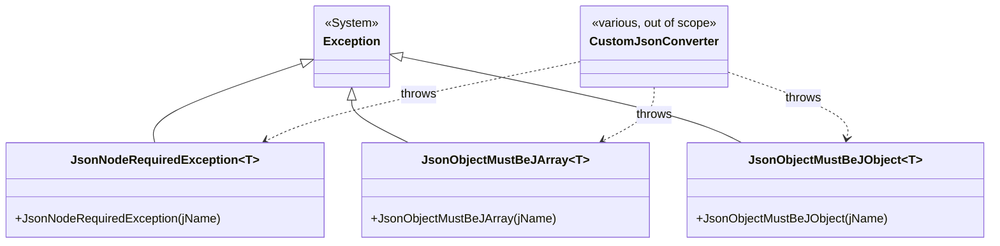

# Exceptions

## Contents
- [Overview](#overview)
- [Files](#files)
- [Types & Members](#types--members)
  - [JsonNodeRequiredException\<T\>](#jsonnoderequiredexceptiont)
  - [JsonObjectMustBeJArray\<T\>](#jsonobjectmustbejarrayt)
  - [JsonObjectMustBeJObject\<T\>](#jsonobjectmustbejobjectt)
- [Diagrams](#diagrams)
- [Package Dependencies](#package-dependencies)
- [See Also](#see-also)

## Overview

`IIIF.Manifests.Serializer.Shared.Exceptions` holds three small, generic `System.Exception` subclasses used to report malformed input JSON while parsing an IIIF manifest: a required node was missing (`JsonNodeRequiredException<T>`), a node was present but wasn't a JSON array where one was expected (`JsonObjectMustBeJArray<T>`), and a node was present but wasn't a JSON object where one was expected (`JsonObjectMustBeJObject<T>`). Each is generic over the owning model type `T` so the thrown exception's message names both the offending JSON property and the .NET type that was being parsed, giving callers of custom `JsonConverter`s a precise, typed failure signal rather than a generic `JsonSerializationException`. Per the SDK's own contributor guidance (`.github/copilot-instructions.md`), these are the intended vocabulary for "error handling" in hand-written converters that validate required tokens or array/object shape before delegating to Json.NET.

## Files

| File | Primary type(s) | LOC (approx) | Responsibility |
| --- | --- | --- | --- |
| `JsonNodeRequiredException.cs` | `JsonNodeRequiredException<T>` | 11 | Thrown when a required JSON property is missing from the input for type `T`. |
| `JsonObjectMustBeJArray.cs` | `JsonObjectMustBeJArray<T>` | 11 | Thrown when a JSON property expected to be a JSON array is a different token type for type `T`. |
| `JsonObjectMustBeJObject.cs` | `JsonObjectMustBeJObject<T>` | 11 | Thrown when a JSON property expected to be a JSON object is a different token type for type `T`. |

[↑ Back to top](#contents)

## Types & Members

| Type | Kind | Summary | Inherits/Implements | Key Members |
| --- | --- | --- | --- | --- |
| `JsonNodeRequiredException<T>` | class (generic exception) | Required JSON node missing. | `System.Exception` | ctor `(string jName)` |
| `JsonObjectMustBeJArray<T>` | class (generic exception) | JSON node must be an array. | `System.Exception` | ctor `(string jName)` |
| `JsonObjectMustBeJObject<T>` | class (generic exception) | JSON node must be an object. | `System.Exception` | ctor `(string jName)` |

### JsonNodeRequiredException\<T\>

- **Kind / Namespace**: public generic class, `IIIF.Manifests.Serializer.Shared.Exceptions`.
- **Inherits/Implements**: `System.Exception`.
- **Type parameter**: `T` — the model type being parsed when the required node was found missing; used only to render its name (`typeof(T)`) into the message, not as a constraint.
- **Constructors**: `JsonNodeRequiredException(string jName)` — builds the message `"Invalid manifest json file, {jName} of {typeof(T)} is required"`, where `jName` is the JSON property name that was absent.
- **Thread-safety/immutability**: standard `Exception` semantics — immutable after construction.
- **Usage Recipe**:
```csharp
using IIIF.Manifests.Serializer.Shared.Exceptions;

// Inside a custom JsonConverter.ReadJson for a Manifest-like type:
var idToken = jObject["id"];
if (idToken is null)
{
    throw new JsonNodeRequiredException<Manifest>("id");
}
```

[↑ Back to top](#contents)

### JsonObjectMustBeJArray\<T\>

- **Kind / Namespace**: public generic class, `IIIF.Manifests.Serializer.Shared.Exceptions`.
- **Inherits/Implements**: `System.Exception`.
- **Type parameter**: `T` — the model type being parsed; used only for the message text.
- **Constructors**: `JsonObjectMustBeJArray(string jName)` — builds the message `"Invalid manifest json file, {jName} of {typeof(T)} must be array"`.
- **Usage Recipe**:
```csharp
using IIIF.Manifests.Serializer.Shared.Exceptions;
using Newtonsoft.Json.Linq;

var itemsToken = jObject["items"];
if (itemsToken is not null && itemsToken.Type != JTokenType.Array)
{
    throw new JsonObjectMustBeJArray<Manifest>("items");
}
```

[↑ Back to top](#contents)

### JsonObjectMustBeJObject\<T\>

- **Kind / Namespace**: public generic class, `IIIF.Manifests.Serializer.Shared.Exceptions`.
- **Inherits/Implements**: `System.Exception`.
- **Type parameter**: `T` — the model type being parsed; used only for the message text.
- **Constructors**: `JsonObjectMustBeJObject(string jName)` — builds the message `"Invalid manifest json file, {jName} of {typeof(T)} must be object"`.
- **Usage Recipe**:
```csharp
using IIIF.Manifests.Serializer.Shared.Exceptions;
using Newtonsoft.Json.Linq;

var serviceToken = jObject["service"];
if (serviceToken is not null && serviceToken.Type != JTokenType.Object)
{
    throw new JsonObjectMustBeJObject<Manifest>("service");
}
```

[↑ Back to top](#contents)

## Diagrams



All three exceptions share a common shape — a generic `Exception` subtype parameterized on the model type `T`, each constructed from the offending JSON property name — and are the intended, uniform vocabulary that this SDK's custom `JsonConverter` implementations use to report shape-validation failures while parsing manifest JSON (per `.github/copilot-instructions.md`'s "Error handling" guidance), though no converter in the current snapshot throws them yet.

[↑ Back to top](#contents)

## Package Dependencies

| Package | Version | Description | Links |
| --- | --- | --- | --- |
| Newtonsoft.Json | 13.0.4 | JSON.NET — this SDK's serialization engine (custom JsonConverters, attribute-driven read/write) | [NuGet](https://www.nuget.org/packages/Newtonsoft.Json/13.0.4) |

[↑ Back to top](#contents)

## See Also

- [`../README.md`](../README.md) — Shared root
- [`../../README.md`](../../README.md) — top-level SDK docs
- [`../../SDK_VERSIONING_GUIDE.md`](../../SDK_VERSIONING_GUIDE.md) — SDK versioning guide

[↑ Back to top](#contents)
