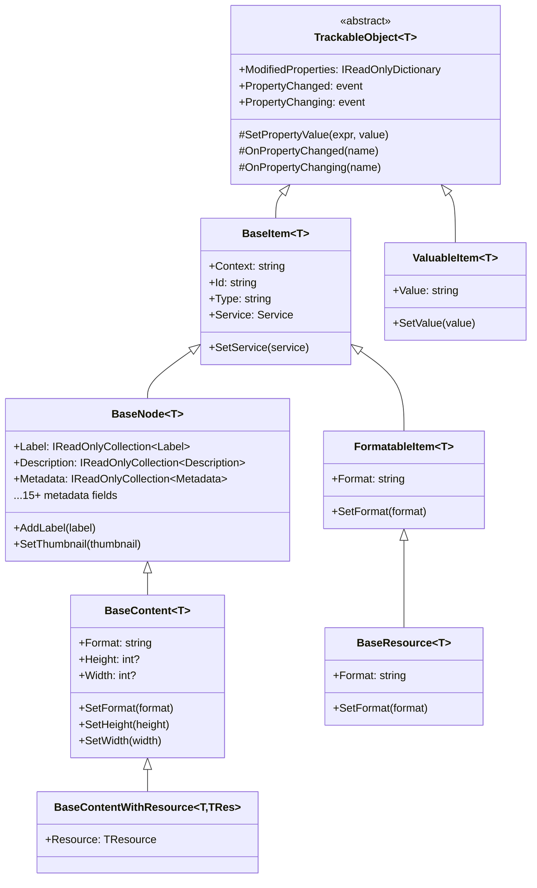
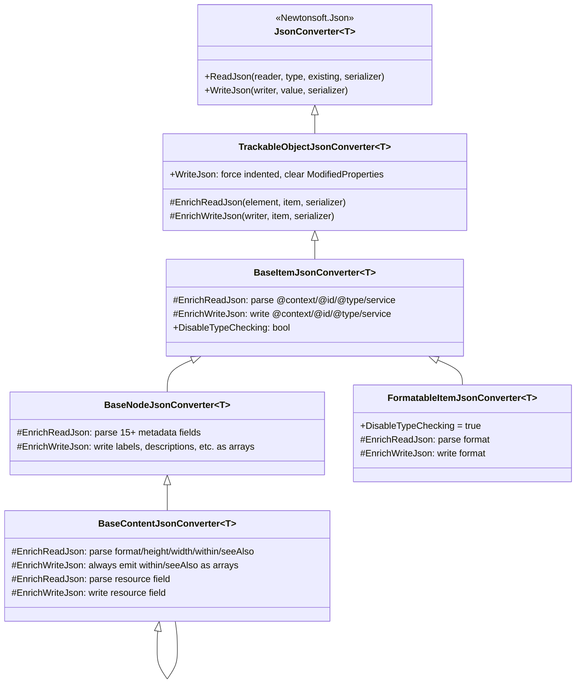
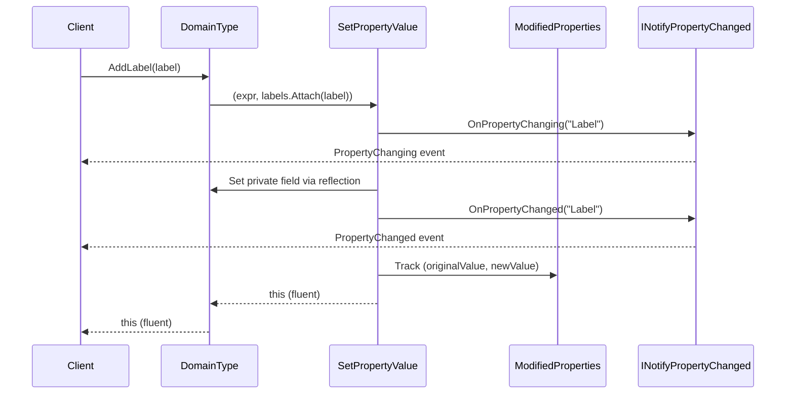

# Shared

## Contents
- [Overview](#overview)
- [Subdirectories](#subdirectories)
- [Files](#files)
- [Types & Members](#types--members)
- [Constants](#constants)
- [Diagrams](#diagrams)
- [Examples](#examples)
- [See Also](#see-also)

## Overview

The Shared folder contains foundational base classes, interfaces, and infrastructure that underpin the entire IIIF Presentation API 2.0 serialization library. It provides the TrackableObject pattern for change tracking and immutable properties, the three-tier inheritance hierarchy (TrackableObject → BaseItem → BaseNode → BaseContent), custom JsonConverter base classes that enforce IIIF spec validation (@context/@id/@type), exception types for deserialization errors, and common IIIF field constants. All domain types inherit from these shared types to maintain architectural consistency using Newtonsoft.Json.

## Subdirectories

| Directory | Purpose |
|-----------|---------|
| [./Trackable/README.md](./Trackable/README.md) | TrackableObject base class with ModifiedProperties tracking and change notification |
| [./BaseItem/README.md](./BaseItem/README.md) | Adds @context/@id/@type/service fields to TrackableObject |
| [./BaseNode/README.md](./BaseNode/README.md) | Extends BaseItem with full IIIF metadata (label, description, metadata, attribution, etc.) |
| [./Content/README.md](./Content/README.md) | BaseContent hierarchy for annotations with format/dimensions and resource patterns |
| [./FormatableItem/README.md](./FormatableItem/README.md) | BaseItem subclass adding format field for resources |
| [./ValuableItem/README.md](./ValuableItem/README.md) | Simple value-wrapper TrackableObject for properties |
| [./Exceptions/README.md](./Exceptions/README.md) | Custom exception types for JSON validation errors |

## Files

| File | Primary type(s) | LOC (approx) | Responsibility |
|------|-----------------|--------------|----------------|
| [Constants.cs](../../src/IIIF.Manifest.Serializer.Net/Shared/Constants.cs) | `Constants` | 9 | Shared JSON property name constants (width, height, viewingDirection) |

[↑ Back to top](#contents)

## Types & Members

| Type | Kind | Summary | Inherits/Implements | Key Members |
|------|------|---------|---------------------|-------------|
| `Constants` | Class | Defines shared JSON property name constants used across multiple types to avoid string duplication | N/A | `WidthJName` = "width", `HeightJName` = "height", `ViewingDirectionJName` = "viewingDirection" |

[↑ Back to top](#contents)

## Constants

Simple class holding JSON property name constants shared by multiple IIIF types. Centralizes these strings to prevent typos and ensure consistency across serialization and deserialization.

**Key Members:**
- `WidthJName` – "width" (used by IDimenssionSupport, Canvas, Service, etc.)
- `HeightJName` – "height" (used by IDimenssionSupport, Canvas, Service, etc.)
- `ViewingDirectionJName` – "viewingDirection" (used by Manifest, Sequence, IViewingDirectionSupport)

**Usage:**
```csharp
// In BaseContent, Canvas, ImageResource, etc.
[JsonProperty(Constants.HeightJName)]
public int? Height { get; private set; }

[JsonProperty(Constants.WidthJName)]
public int? Width { get; private set; }

// In JsonConverters
var jHeight = element.TryGetToken(Constants.HeightJName);
var jWidth = element.TryGetToken(Constants.WidthJName);
```

[↑ Back to top](#contents)

## Diagrams

### Shared Type Hierarchy



### JsonConverter Hierarchy



### SetPropertyValue Flow



[↑ Back to top](#contents)

## Examples

### Inheritance Chain Example

```csharp
// Manifest inherits full chain
public class Manifest : BaseNode<Manifest>, IViewingDirectionSupport<Manifest>
{
    // From TrackableObject: ModifiedProperties, SetPropertyValue
    // From BaseItem: Context, Id, Type, Service
    // From BaseNode: Label, Description, Metadata, Logo, Thumbnail, etc.
    // Own fields: NavDate, Sequences, Structures, ViewingDirection
}

// Usage demonstrates inherited capabilities
var manifest = new Manifest("https://example.org/manifest", new Label("Book"))
    .SetThumbnail(new Thumbnail("https://example.org/thumb.jpg"))  // BaseNode
    .SetService(new Service(...))                                    // BaseItem
    .SetViewingDirection(ViewingDirection.LeftToRight)              // IViewingDirectionSupport
    .AddSequence(sequence);                                          // Manifest-specific

// ModifiedProperties tracked across all levels
Console.WriteLine(manifest.ModifiedProperties.Count); // Shows all changed properties
```

### Custom Type Using Shared Base

```csharp
// Example of creating a custom IIIF extension type
public class CustomAnnotation : BaseContent<CustomAnnotation>
{
    public const string CustomFieldJName = "customField";
    
    [JsonProperty(CustomFieldJName)]
    public string CustomField { get; private set; }
    
    public CustomAnnotation(string id) : base(id, "custom:Annotation")
    {
    }
    
    public CustomAnnotation SetCustomField(string value) 
        => SetPropertyValue(a => a.CustomField, value);
}

// Automatically gets: Context, Id, Type, Service, Label, Description,
// Metadata, Attribution, Logo, Thumbnail, Format, Height, Width
// Plus: ModifiedProperties, PropertyChanged, SetPropertyValue
```

### Using Constants

```csharp
// In a custom JsonConverter
public override Canvas ReadJson(JsonReader reader, ...)
{
    var jObject = JObject.Load(reader);
    
    // Use Constants for shared field names
    var height = jObject[Constants.HeightJName].Value<int>();
    var width = jObject[Constants.WidthJName].Value<int>();
    
    var canvas = new Canvas(id, label, height, width);
    
    // IDimenssionSupportHelper also uses Constants
    canvas.SetHeight(jObject, Constants.HeightJName);
    
    return canvas;
}
```

[↑ Back to top](#contents)

## See Also

- [./Trackable/README.md](./Trackable/README.md) – Core TrackableObject implementation
- [./BaseItem/README.md](./BaseItem/README.md) – @context/@id/@type support
- [./BaseNode/README.md](./BaseNode/README.md) – Full IIIF metadata support
- [./Content/README.md](./Content/README.md) – Annotation content types
- [./Exceptions/README.md](./Exceptions/README.md) – JSON validation errors
- [../Nodes/README.md](../Nodes/README.md) – Domain types using these bases
- [IIIF Presentation API 2.0](https://iiif.io/api/presentation/2.0/) – Official specification

[↑ Back to top](#contents)
