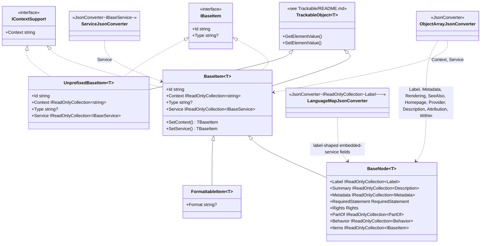

# Shared

## Contents

- [Overview](#overview)
- [Files](#files)
- [Types & Members](#types--members)
  - [IBaseItem](#ibaseitem)
  - [BaseItem\<TBaseItem\>](#baseitemtbaseitem)
  - [BaseNode\<TBaseNode\>](#basenodetbasenode)
  - [Constants](#constants)
  - [FormattableItem\<TFormattableItem\>](#formattableitemtformattableitem)
  - [IContextSupport](#icontextsupport)
  - [LanguageMapJsonConverter](#languagemapjsonconverter)
  - [ObjectArrayJsonConverter](#objectarrayjsonconverter)
  - [ServiceJsonConverter](#servicejsonconverter)
  - [UnprefixedBaseItem\<TBaseItem\>](#unprefixedbaseitemtbaseitem)
- [Diagrams](#diagrams)
- [Package Dependencies](#package-dependencies)
- [See Also](#see-also)

## Overview

`Shared` is the base-class and converter layer that sits between the change-tracking core in
[`Trackable/`](./Trackable/README.md) and every concrete IIIF domain model (Manifest, Collection,
Canvas, Range, and the various embedded services). It defines the two CRTP base classes almost every
resource in this SDK derives from — `BaseItem<T>` (the `@id`/`@type`/`@context`/`service` envelope)
and `BaseNode<T>` (every descriptive property shared by Manifest/Collection/Canvas/Range, plus the
IIIF 2.x↔3.0 compatibility shims) — together with `UnprefixedBaseItem<T>`, the equivalent envelope for
service specs that use unprefixed `id`/`type`. It also hosts the three Newtonsoft.Json converters
(`ObjectArrayJsonConverter`, `LanguageMapJsonConverter`, `ServiceJsonConverter`) that give those base
classes' properties their IIIF-correct JSON shapes, plus small supporting pieces (`Constants`,
`FormattableItem<T>`, `IContextSupport`). Every property here is backed by `TrackableObject<T>`'s
change-tracking storage (`GetElementValue`/`SetElementValue`), so mutation is exposed only through
fluent `SetX`/`AddX`/`RemoveX` methods that return the CRTP-typed self.

[↑ Back to top](#contents)

## Files

| File | Primary type(s) | LOC (approx) | Responsibility |
| --- | --- | --- | --- |
| `BaseItem.cs` | `IBaseItem`, `BaseItem<TBaseItem>` | 124 | Adds `@id`/`@context`/`@type`/`service` on top of `TrackableObject<T>`; the envelope every prefixed (2.x/3.0-shaped) IIIF resource derives from. |
| `BaseNode.cs` | `BaseNode<TBaseNode>` | 446 | Adds every descriptive property common to Manifest/Collection/Canvas/Range (label, summary/description, metadata, thumbnail, rendering, homepage, seeAlso, rights/license, requiredStatement/attribution, partOf/within, behavior/viewingHint, provider, items), including the 2.0⇄3.0 legacy-view computed properties. |
| `Constants.cs` | `Constants` | 9 | Shared JSON property-name constants (`width`, `height`, `viewingDirection`) referenced by `[JsonProperty]` attributes across many domain/property types outside this folder. |
| `FormattableItem.cs` | `FormattableItem<TFormattableItem>` | 30 | Thin `BaseItem<T>` subclass adding the `format` (MIME type) property used by content-resource types. |
| `IContextSupport.cs` | `IContextSupport` | 5 | Marker interface exposing a single `Context` string, implemented explicitly by both item base classes to normalize access to "the" context value regardless of the underlying multi-context collection. |
| `LanguageMapJsonConverter.cs` | `LanguageMapJsonConverter` | 58 | Reads/writes a real IIIF language map (`{"none": ["..."]}`) for label-shaped fields (e.g. Auth 2.0's `label`/`heading`/`note`) that never pass through the hand-built V3 manifest writer. |
| `ObjectArrayJsonConverter.cs` | `ObjectArrayJsonConverter` | 96 | Generic "single value or array" converter: collapses a one-element collection to a bare JSON value on write, and accepts a bare value, an array, or `null` on read. |
| `ServiceJsonConverter.cs` | `ServiceJsonConverter` (+ private nested `LeafContractResolver`) | 255 | Polymorphic converter for the `service`/`Service` property: detects concrete service type by `@type`/`type` (falling back to `profile` substring matching) and dispatches to the right leaf type, normalizing prefixed/unprefixed `id`/`type` keys as needed. |
| `UnprefixedBaseItem.cs` | `UnprefixedBaseItem<TBaseItem>` | 124 | Sibling of `BaseItem<T>` for service specs (Search 2.0, Discovery 1.0, Auth 2.0, Content State 1.0) that use unprefixed `id`/`type` instead of `@id`/`@type`. |

[↑ Back to top](#contents)

## Types & Members

| Type | Kind | Summary | Inherits/Implements | Key Members |
| --- | --- | --- | --- | --- |
| `IBaseItem` | interface | Minimal contract exposing `Id`/`Type` for any child-item reference (used by `BaseNode<T>.Items`). | *(none)* | `Id`, `Type` |
| `BaseItem<TBaseItem>` | class (CRTP, generic) | `@id`/`@context`/`@type`/`service` envelope. | `TrackableObject<TBaseItem>`, `IBaseItem`, `IContextSupport` | `Id`, `Context`, `Type`, `Service`, `SetContext`/`AddContext`/`RemoveContext`, `SetService`/`AddService`/`RemoveService` |
| `BaseNode<TBaseNode>` | class (CRTP, generic) | Descriptive-property layer for Manifest/Collection/Canvas/Range, with 2.0⇄3.0 legacy views. | `BaseItem<TBaseNode>` | `Label`, `Summary`/`Description`, `Metadata`, `RequiredStatement`/`Attribution`, `Rights`/`License`, `PartOf`/`Within`, `Behavior`/`ViewingHint`, `Homepage`/`Related`, `Items`, many `Add`/`Remove`/`Set*` fluent methods |
| `Constants` | class (constants holder) | Shared JSON property-name literals used across the whole model layer. | *(none)* | `WidthJName`, `HeightJName`, `ViewingDirectionJName` |
| `FormattableItem<TFormattableItem>` | class (CRTP, generic) | Adds the `format` property. | `BaseItem<TFormattableItem>` | `Format`, `SetFormat` |
| `IContextSupport` | interface | Uniform single-`Context`-string accessor. | *(none)* | `Context` |
| `LanguageMapJsonConverter` | class (`JsonConverter<T>`) | Strict-write/lenient-read language-map converter for `IReadOnlyCollection<Label>`. | `JsonConverter<IReadOnlyCollection<Label>>` | `WriteJson`, `ReadJson` |
| `ObjectArrayJsonConverter` | class (`JsonConverter`) | Value-or-array collapsing converter for any `IEnumerable`. | `JsonConverter` | `CanConvert`, `ReadJson`, `WriteJson` |
| `ServiceJsonConverter` | class (`JsonConverter<T>`) | Polymorphic dispatch converter for `IBaseService`. | `JsonConverter<IBaseService>` | `ReadJson`, `WriteJson`, `DetectAndDeserializeService`, `WithPrefixedIdType`, `WithUnprefixedIdType` |
| `UnprefixedBaseItem<TBaseItem>` | class (CRTP, generic) | `id`/`context`/`type`/`service` envelope with unprefixed keys and a nullable id. | `TrackableObject<TBaseItem>`, `IBaseItem`, `IContextSupport` | `Id` (nullable-input), `Context`, `Type`, `Service`, same fluent `Set/Add/Remove` set as `BaseItem<T>` |

### IBaseItem

- **Kind / Namespace**: public interface, `IIIF.Manifests.Serializer.Shared`.
- **Inherits/Implements**: none.
- **Key properties**:
  - `Id : string` — the resource's identifier.
  - `Type : string?` — the resource's `@type`/`type`; nullable.
- Implemented by both `BaseItem<T>` and `UnprefixedBaseItem<T>`, and used as the element type of `BaseNode<T>.Items` so a Manifest's `items` collection can hold heterogeneous child references (Canvas, Range, etc.) without a shared concrete base.

**Usage Recipe**

```csharp
// Any BaseItem<T>/UnprefixedBaseItem<T> descendant already satisfies IBaseItem, so it can be
// added to another node's Items collection generically.
IBaseItem childRef = someCanvas;
manifest.AddItem(childRef);
```

[↑ Back to top](#contents)

### BaseItem\<TBaseItem\>

- **Kind / Namespace**: public class, generic, curiously-recurring template pattern (`where TBaseItem : BaseItem<TBaseItem>`); `IIIF.Manifests.Serializer.Shared`.
- **Inherits/Implements**: `TrackableObject<TBaseItem>` (see [Trackable/README.md](./Trackable/README.md)), `IBaseItem`, `IContextSupport`.
- **Notable constants**: `DefaultContext = "http://iiif.io/api/presentation/2/context.json"`, `ContextJName = "@context"`, `IdJName = "@id"`, `TypeJName = "@type"`, `ServiceJName = "service"`.
- **Key properties**:
  - `Id : string` — `[JsonProperty("@id")]`; private setter (set only via constructor/`Set*`).
  - `Context : IReadOnlyCollection<string>` — `[JsonProperty("@context")][JsonConverter(typeof(ObjectArrayJsonConverter))]`; defaults to `[DefaultContext]` when unset.
  - `Type : string?` — `[JsonProperty("@type")]`; nullable.
  - `Service : IReadOnlyCollection<IBaseService>` — `[JsonProperty("service")][JsonConverter(typeof(ObjectArrayJsonConverter))]`; defaults to empty.
  - `IContextSupport.Context : string` (explicit interface impl) — returns `Context.ElementAt(0)`.
- **Constructors**:
  - `[JsonConstructor] protected internal BaseItem(string id)` — sets `Id` and `Context = [DefaultContext]`.
  - `public BaseItem(string id, string type) : this(id)` — also sets `Type`.
  - `protected internal BaseItem(string id, string type, string context) : this(id, type)` — also overrides `Context` to `[context]`; used internally by domain types whose default context differs from Presentation 2.0 (e.g. 3.0-native resources).
- **Key methods** (all fluent, return `TBaseItem` via CRTP cast):
  - `internal TBaseItem SetType(string type)`.
  - `TBaseItem SetContext(IReadOnlyCollection<string>)` / `SetContext(string)` / `AddContext(string)` / `RemoveContext(string)`.
  - `TBaseItem SetService(IReadOnlyCollection<IBaseService>)` / `SetService<TService>(TService)` / `AddService<TService>(TService)` / `RemoveService<TService>(TService)`.
- **Thread-safety/immutability**: instances are mutable (fluent setters mutate and return `this`); all reads/writes go through `TrackableObject<T>`'s `GetElementValue`/`SetElementValue`, so the same thread-safety characteristics as `TrackableObject<T>` apply (see Trackable docs) — not independently synchronized here.

**Usage Recipe**

```csharp
public sealed class MyResource : BaseItem<MyResource>
{
    public MyResource(string id, string type) : base(id, type) { }
}

var resource = new MyResource("https://example.org/res/1", "Resource")
    .AddContext("http://iiif.io/api/extension/context.json")
    .SetService(new Properties.Services.Service("https://example.org/img/1", "ImageService3"));

Console.WriteLine(resource.Id);   // https://example.org/res/1
Console.WriteLine(resource.Type); // Resource
```

[↑ Back to top](#contents)

### BaseNode\<TBaseNode\>

- **Kind / Namespace**: public class, generic (CRTP); `IIIF.Manifests.Serializer.Shared`.
- **Inherits/Implements**: `BaseItem<TBaseNode>`.
- **Notable attributes**: most properties carry `[PresentationAPI("2.0"/"3.0", ...)]` (from `IIIF.Manifests.Serializer.Attributes`) documenting version applicability, and `IsDeprecated`/`ReplacedBy` metadata for the 2.x→3.0 migration; several legacy setters/methods carry `[Obsolete(..., error: true)]` to hard-block callers from using a removed 2.x shape (e.g. `AddAttribution`, `AddWithin`, `SetRelated`, `SetLicense`).
- **Key properties** (2.x-legacy view / 3.0-native pairs are related by computed get/set, not two independent stores):
  - `Label : IReadOnlyCollection<Label>` — display label; `ObjectArrayJsonConverter`.
  - `Description : IReadOnlyCollection<Description>` *(2.0, deprecated → `summary`)* — pure alias of `Summary` (rename only).
  - `Summary : IReadOnlyCollection<Description>` *(3.0)* — `[JsonIgnore]`, native 3.0 storage; written explicitly by `IiifSerializer`'s V3 writer.
  - `Metadata : IReadOnlyCollection<Metadata>` *(2.0)*.
  - `Attribution : IReadOnlyCollection<Attribution>` *(2.0, deprecated → `requiredStatement`)* — computed from `RequiredStatement.Value`, discarding its label on read; on set, wraps values into a `RequiredStatement` labeled `"Attribution"`.
  - `RequiredStatement : RequiredStatement?` *(3.0)* — `[JsonIgnore]`, native storage.
  - `Logo : Logo?`, `Thumbnail : Thumbnail?` *(2.0)*.
  - `License : License?` *(2.0, deprecated → `rights`)* — rename view of `Rights`.
  - `Rights : Rights?` *(3.0)* — `[JsonIgnore]`, native storage.
  - `ViewingHint : ViewingHint?` *(2.0/2.1, deprecated → `behavior`, `[Obsolete]`)*.
  - `Rendering : IReadOnlyCollection<Rendering>` *(2.0)*.
  - `Within : IReadOnlyCollection<Within>` *(2.0, deprecated → `partOf`)* — computed from `PartOf`; on set, defaults each entry's type to `"Manifest"` (2.x `within` carries no type).
  - `PartOf : IReadOnlyCollection<Properties.PartOf>` *(3.0)* — `[JsonIgnore]`, native storage, restructured to id+type objects.
  - `SeeAlso`, `Homepage`, `Provider` : `IReadOnlyCollection<...>` *(2.0)*.
  - `AccompanyingCanvas : AccompanyingCanvas?` *(2.0)*.
  - `Behavior : IReadOnlyCollection<Behavior>` *(3.0-only, no 2.x equivalent shape)* — `[JsonIgnore]`.
  - `Related : string?` *(2.0, deprecated → `homepage`)* — first `Homepage.Id`; on set, replaces the whole `Homepage` collection with one entry.
  - `Items : IReadOnlyCollection<IBaseItem>` — `[JsonIgnore]`; 3.0-native primary storage for child items (Canvas/Range refs, AnnotationPage/Annotation, etc.); every IIIF version shapes "child items" differently, so version-aware readers/writers handle it explicitly rather than generic reflection.
- **Constructors**:
  - `[JsonConstructor] protected internal BaseNode(string id) : base(id)`.
  - `public BaseNode(string id, string type) : base(id, type)`.
- **Key methods**: `SetLabel`/`AddLabel`/`RemoveLabel`, `AddDescription`/`RemoveDescription`, `SetSummary`/`AddSummary`/`RemoveSummary`, `AddMetadata`/`RemoveMetadata`, `SetRequiredStatement`, `AddSeeAlso`/`RemoveSeeAlso`, `AddRendering`/`RemoveRendering`, `AddHomepage`/`RemoveHomepage`, `AddProvider`/`RemoveProvider`, `AddBehavior`/`RemoveBehavior`, `AddPartOf`/`RemovePartOf`, `SetAccompanyingCanvas`, `SetLogo`, `SetThumbnail`, `SetRights`, `SetItems`/`SetItem`/`AddItem`/`RemoveItem`; plus obsolete/error-gated legacy equivalents (`AddAttribution`, `AddWithin`, `SetLicense`, `SetViewingHint`, `SetRelated`).
- **Thread-safety/immutability**: same as `BaseItem<T>` — mutable, backed by `TrackableObject<T>` storage.

**Usage Recipe**

```csharp
public sealed class MyNode : BaseNode<MyNode>
{
    public MyNode(string id, string type) : base(id, type) { }
}

var node = new MyNode("https://example.org/manifest/1", "Manifest")
    .AddLabel(new Label("My Manifest"))
    .AddSummary(new Description("A short summary"))
    .SetRequiredStatement(new RequiredStatement([new Label("Attribution")], [new Description("Provided by Example Org")]))
    .AddBehavior(new Behavior("paged"));
```

[↑ Back to top](#contents)

### Constants

- **Kind / Namespace**: public class (plain constants holder, not `static`); `IIIF.Manifests.Serializer.Shared`.
- **Inherits/Implements**: none.
- **Key members**: `const string WidthJName = "width"`, `const string HeightJName = "height"`, `const string ViewingDirectionJName = "viewingDirection"`.
- Referenced from `[JsonProperty(...)]` attributes across many types outside this folder — `Canvas`, `Manifest`, `Collection`, `Sequence`, `Structure`, `Logo`, `Thumbnail`, `Service`, `ImageResource`, `VideoResource`, `IDimensionSupport`/`IDimenssionSupportHelper`, `IViewingDirectionSupport`/`IViewingDirectionSupportHelper` — to keep the literal JSON key spelling in one place.
- **Thread-safety/immutability**: fully immutable (compile-time constants).

**Usage Recipe**

```csharp
public class MyDimensioned
{
    [JsonProperty(Constants.WidthJName)]
    public int? Width { get; set; }

    [JsonProperty(Constants.HeightJName)]
    public int? Height { get; set; }
}
```

[↑ Back to top](#contents)

### FormattableItem\<TFormattableItem\>

- **Kind / Namespace**: public class, generic (CRTP); `IIIF.Manifests.Serializer.Shared`.
- **Inherits/Implements**: `BaseItem<TFormattableItem>`.
- **Key properties**: `Format : string?` — `[JsonProperty("format")]`; the resource's MIME type; nullable.
- **Constructors**: `[JsonConstructor] protected internal FormattableItem(string id) : base(id)`; `public FormattableItem(string id, string type) : base(id, type)`.
- **Key methods**: `TFormattableItem SetFormat(string format)` — fluent.
- Used as a base for content-resource types (documented separately under `Shared/Content/`) that need a `format` alongside the standard `@id`/`@type` envelope.

**Usage Recipe**

```csharp
public sealed class MyContentResource : FormattableItem<MyContentResource>
{
    public MyContentResource(string id, string type) : base(id, type) { }
}

var image = new MyContentResource("https://example.org/img/1.jpg", "Image")
    .SetFormat("image/jpeg");
```

[↑ Back to top](#contents)

### IContextSupport

- **Kind / Namespace**: public interface; `IIIF.Manifests.Serializer.Shared`.
- **Inherits/Implements**: none.
- **Key members**: `Context : string` — read-only.
- Implemented explicitly by both `BaseItem<T>` (returns `Context.ElementAt(0)` from the `@context` collection) and `UnprefixedBaseItem<T>` (same, from `context`), so generic code that needs "the" context value can use one interface regardless of which envelope shape (prefixed vs. unprefixed) the concrete resource uses.

**Usage Recipe**

```csharp
IContextSupport ctxSource = someManifest;
Console.WriteLine(ctxSource.Context); // e.g. "http://iiif.io/api/presentation/3/context.json"
```

[↑ Back to top](#contents)

### LanguageMapJsonConverter

- **Kind / Namespace**: public class; `IIIF.Manifests.Serializer.Shared`.
- **Inherits/Implements**: `JsonConverter<IReadOnlyCollection<Label>>`.
- **Purpose**: writes/reads a spec-correct IIIF language map (`{"none": ["value", ...]}`) independent of the hand-built V3 manifest writer in `IiifSerializer`. Needed because label-shaped fields on embedded Auth 2.0 services (`label`, `heading`, `note`, `confirmLabel`, `errorHeading`, `errorNote`) never pass through that writer, unlike `BaseNode.Label` (which relies on `ObjectArrayJsonConverter` plus the V3 writer to become a real language map).
- **Key methods**:
  - `WriteJson(JsonWriter, IReadOnlyCollection<Label>?, JsonSerializer)` — filters out blank `Label.Value`s; writes JSON `null` if the result is empty, else `{"none": [...]}`.
  - `ReadJson(JsonReader, ...)` — lenient: `null` → `null`; JSON string → single `Label`; JSON array → one `Label` per element; JSON object → flattens every property's value(s) (string or array) into `Label`s, ignoring the key name (so any language tag, not just `"none"`, is accepted).
- **Thread-safety**: stateless converter; safe to share/reuse (Newtonsoft converters are typically instantiated once via the attribute).

**Usage Recipe**

```csharp
public class AuthUiText
{
    [JsonProperty("label")]
    [JsonConverter(typeof(LanguageMapJsonConverter))]
    public IReadOnlyCollection<Label> Label { get; set; } = [];
}

// Reads {"label": "Login"} or {"label": {"en": ["Login"]}} equally well.
```

[↑ Back to top](#contents)

### ObjectArrayJsonConverter

- **Kind / Namespace**: public class; `IIIF.Manifests.Serializer.Shared`.
- **Inherits/Implements**: `JsonConverter` (non-generic).
- **Purpose**: implements IIIF's pervasive "single value or array of values" JSON idiom generically for any `IEnumerable`-typed property (used on `Context`, `Service`, `Label`, `Description`, `Metadata`, `Attribution`, `Rendering`, `Within`, `SeeAlso`, `Homepage`, `Provider`, and more across `BaseItem<T>`/`BaseNode<T>`).
- **Key methods**:
  - `CanConvert(Type)` — true for any `IEnumerable`-assignable type.
  - `ReadJson(...)` — builds a `List<TElement>` (element type from the target's generic argument) via reflection; a JSON `null` yields an **empty** list (not a single null element, which would otherwise NRE downstream computed/legacy views); a JSON array reads element-by-element; a bare scalar/object reads as a single-element list.
  - `WriteJson(...)` — `null` → JSON `null`; empty collection → JSON `null`; exactly one element → serialize that element bare (no wrapping array); 2+ elements → a proper JSON array. Non-enumerable values pass straight through to the serializer.
- **Thread-safety**: stateless; safe to reuse.

**Usage Recipe**

```csharp
public class MyResource
{
    [JsonProperty("rendering")]
    [JsonConverter(typeof(ObjectArrayJsonConverter))]
    public IReadOnlyCollection<Rendering> Rendering { get; set; } = [];
}

// A JSON payload with a single rendering object *or* an array of rendering objects both deserialize correctly.
```

[↑ Back to top](#contents)

### ServiceJsonConverter

- **Kind / Namespace**: public class; `IIIF.Manifests.Serializer.Shared`.
- **Inherits/Implements**: `JsonConverter<IBaseService>`.
- **Notable nested type**: `private sealed class LeafContractResolver : IIIFJsonContractResolver` — overrides `ResolveContractConverter` to suppress `ServiceJsonConverter` for *concrete leaf* service types (which otherwise inherit it via the `[JsonConverter]` attribute placed on the `IBaseService` interface, causing infinite recursion), while keeping the converter active when the requested type is `IBaseService` itself (needed because Auth 2.0 services nest *other* services polymorphically, e.g. `AuthProbeService2.Service` holding an `AuthAccessService2`).
- **Static field**: `private static readonly JsonSerializer LeafSerializer` — built once from `TrackableObject.JsonSerializerSettings`'s `Formatting`/`NullValueHandling`/`DefaultValueHandling`/`ReferenceLoopHandling`, with `ContractResolver = new LeafContractResolver()`; used for all leaf (de)serialization to avoid re-entering this converter.
- **Key methods**:
  - `ReadJson(...)` — loads the token; if a `JArray`, tries each element via `DetectAndDeserializeService` and returns the first one that resolves; if a `JObject`, resolves it directly.
  - `private IBaseService? DetectAndDeserializeService(JToken)` — dispatch by exact `@type`/`type` string:
    | Type value | Leaf type | Id/Type shape |
    | --- | --- | --- |
    | `ImageService2`, `ImageService3` | `Properties.Services.Service` | prefixed (`@id`/`@type`) |
    | `AuthCookieService1`, `AuthTokenService1`, `AuthLogoutService1` | `AuthService1` | prefixed |
    | `AuthProbeService2` | `AuthProbeService2` | unprefixed (`id`/`type`) |
    | `AuthAccessService2` | `AuthAccessService2` | unprefixed |
    | `AuthAccessTokenService2` | `AuthAccessTokenService2` | unprefixed |
    | `AuthLogoutService2` | `AuthLogoutService2` | unprefixed |
    | `SearchService2` | `SearchService` | unprefixed |
    | `AutoCompleteService2` | `AutoCompleteService` | unprefixed |
    | `OrderedCollection` | `DiscoveryService` | unprefixed |
    | `ContentStateService` | `ContentStateService` | unprefixed |

    If `@type`/`type` is missing or unrecognized (typical for Image/Auth 1.0 services, whose constructors never set an explicit `@type`), it falls back to substring-matching the `profile` field (case-insensitive) against `"auth"`, `"search"`, `"discovery"`, `"content-state"`, `"image"`; if that also fails, it makes a final attempt to deserialize as `Properties.Services.Service` and returns `null` on failure.
  - `private static JToken WithPrefixedIdType(JToken)` / `WithUnprefixedIdType(JToken)` — clone the `JObject` and rename `id`↔`@id` / `type`↔`@type` so `ToObject<TService>()` binds the leaf type's constructor parameters correctly, regardless of which shape the source JSON used (a V3 manifest's top-level `services` array always writes unprefixed `id`/`type`, even for leaf types that model `@id`/`@type` internally).
  - `WriteJson(...)` — delegates to `LeafSerializer.Serialize` (never the ambient `serializer`) to avoid re-entering this converter through the runtime type's own inherited `[JsonConverter]` attribute.
- **Thread-safety**: `LeafSerializer` is a `static readonly` instance shared across all (de)serialization; `JsonSerializer` instances are safe for concurrent use once configured and not mutated afterward, which holds here.

**Usage Recipe**

```csharp
// IBaseService carries [JsonConverter(typeof(ServiceJsonConverter))], so consumers never invoke
// this converter directly - polymorphism resolves automatically during manifest deserialization.
var manifest = IiifSerializer.Deserialize<Manifest>(json);
IBaseService service = manifest.Service.First(); // resolved to e.g. Service (ImageService3) or AuthAccessService2
```

[↑ Back to top](#contents)

### UnprefixedBaseItem\<TBaseItem\>

- **Kind / Namespace**: public class, generic (CRTP); `IIIF.Manifests.Serializer.Shared`.
- **Inherits/Implements**: `TrackableObject<TBaseItem>`, `IBaseItem`, `IContextSupport`.
- **Notable constants**: `DefaultContext = "http://iiif.io/api/presentation/3/context.json"`, `ContextJName = "@context"`, `IdJName = "id"`, `TypeJName = "type"`, `ServiceJName = "service"` — same shape as `BaseItem<T>` except `id`/`type` are unprefixed, matching specs that postdate the Presentation 3.0 "no `@` prefix" convention (Auth 2.0, Content Search 2.0, Change Discovery 1.0, Content State 1.0).
- **Key properties**: `Id : string` (backed by nullable-input constructor — see below), `Context : IReadOnlyCollection<string>`, `Type : string?`, `Service : IReadOnlyCollection<IBaseService>` — same converters and defaulting behavior as `BaseItem<T>`.
- **Constructors**:
  - `[JsonConstructor] protected internal UnprefixedBaseItem(string? id)` — **`id` is nullable**, unlike `BaseItem<T>`'s constructor: Auth 2.0's `AuthAccessService2` must omit `id` entirely for its `"external"` profile; `SetElementValue` already treats a `null` value as "no element," so `Id` simply reads back `null` and is omitted on write via `NullValueHandling.Ignore` rather than throwing.
  - `public UnprefixedBaseItem(string? id, string type) : this(id)`.
  - `protected internal UnprefixedBaseItem(string? id, string type, string context) : this(id, type)`.
- **Key methods**: identical fluent surface to `BaseItem<T>` — `SetType` (internal), `SetContext`/`AddContext`/`RemoveContext`, `SetService`/`AddService`/`RemoveService`.
- **Thread-safety/immutability**: same as `BaseItem<T>` — mutable, `TrackableObject<T>`-backed.

**Usage Recipe**

```csharp
public sealed class MySearchLikeService : UnprefixedBaseItem<MySearchLikeService>
{
    public MySearchLikeService(string? id, string type) : base(id, type) { }
}

// id may legitimately be null (e.g. an "external" Auth 2.0 profile service).
var svc = new MySearchLikeService(null, "AuthAccessService2");
Console.WriteLine(svc.Id is null); // True
```

[↑ Back to top](#contents)

## Diagrams


```mermaid
classDiagram
    class TrackableObject~T~ {
        <<see Trackable/README.md>>
        +GetElementValue()
        +SetElementValue()
    }

    class IBaseItem {
        <<interface>>
        +Id string
        +Type string?
    }

    class IContextSupport {
        <<interface>>
        +Context string
    }

    class BaseItem~T~ {
        +Id string
        +Context IReadOnlyCollection~string~
        +Type string?
        +Service IReadOnlyCollection~IBaseService~
        +SetContext() TBaseItem
        +SetService() TBaseItem
    }

    class BaseNode~T~ {
        +Label IReadOnlyCollection~Label~
        +Summary IReadOnlyCollection~Description~
        +Metadata IReadOnlyCollection~Metadata~
        +RequiredStatement RequiredStatement
        +Rights Rights
        +PartOf IReadOnlyCollection~PartOf~
        +Behavior IReadOnlyCollection~Behavior~
        +Items IReadOnlyCollection~IBaseItem~
    }

    class UnprefixedBaseItem~T~ {
        +Id string
        +Context IReadOnlyCollection~string~
        +Type string?
        +Service IReadOnlyCollection~IBaseService~
    }

    class FormattableItem~T~ {
        +Format string?
    }

    TrackableObject~T~ <|-- BaseItem~T~
    TrackableObject~T~ <|-- UnprefixedBaseItem~T~
    IBaseItem <|.. BaseItem~T~
    IContextSupport <|.. BaseItem~T~
    IBaseItem <|.. UnprefixedBaseItem~T~
    IContextSupport <|.. UnprefixedBaseItem~T~
    BaseItem~T~ <|-- BaseNode~T~
    BaseItem~T~ <|-- FormattableItem~T~

    class ObjectArrayJsonConverter {
        <<JsonConverter>>
    }
    class LanguageMapJsonConverter {
        <<JsonConverter~IReadOnlyCollection~Label~~~>>
    }
    class ServiceJsonConverter {
        <<JsonConverter~IBaseService~>>
    }

    ObjectArrayJsonConverter ..> BaseItem~T~ : Context, Service
    ObjectArrayJsonConverter ..> BaseNode~T~ : Label, Metadata, Rendering, SeeAlso, Homepage, Provider, Description, Attribution, Within
    ServiceJsonConverter ..> BaseItem~T~ : Service
    LanguageMapJsonConverter ..> BaseNode~T~ : label-shaped embedded-service fields
```

`BaseItem<T>` and `UnprefixedBaseItem<T>` both sit directly on `TrackableObject<T>` (fully documented in
[`Trackable/README.md`](./Trackable/README.md)) and implement `IBaseItem`/`IContextSupport`; `BaseNode<T>`
and `FormattableItem<T>` extend `BaseItem<T>` with descriptive and format properties respectively. The three
converters attach via `[JsonConverter(...)]` to specific properties on these base types to give collections
and the polymorphic `service` field their IIIF-correct JSON shapes.

[↑ Back to top](#contents)

## Package Dependencies

| Package | Version | Description | Links |
| --- | --- | --- | --- |
| Newtonsoft.Json | 13.0.4 | JSON.NET — this SDK's serialization engine (custom JsonConverters, attribute-driven read/write) | [NuGet](https://www.nuget.org/packages/Newtonsoft.Json/13.0.4) |

[↑ Back to top](#contents)

## See Also

- [Content/README.md](./Content/README.md)
- [Exceptions/README.md](./Exceptions/README.md)
- [Selectors/README.md](./Selectors/README.md)
- [Service/README.md](./Service/README.md)
- [Trackable/README.md](./Trackable/README.md)
- [ValuableItem/README.md](./ValuableItem/README.md)
- [Top-level docs index](../README.md)
- [SDK Versioning Guide](../SDK_VERSIONING_GUIDE.md)

[↑ Back to top](#contents)
