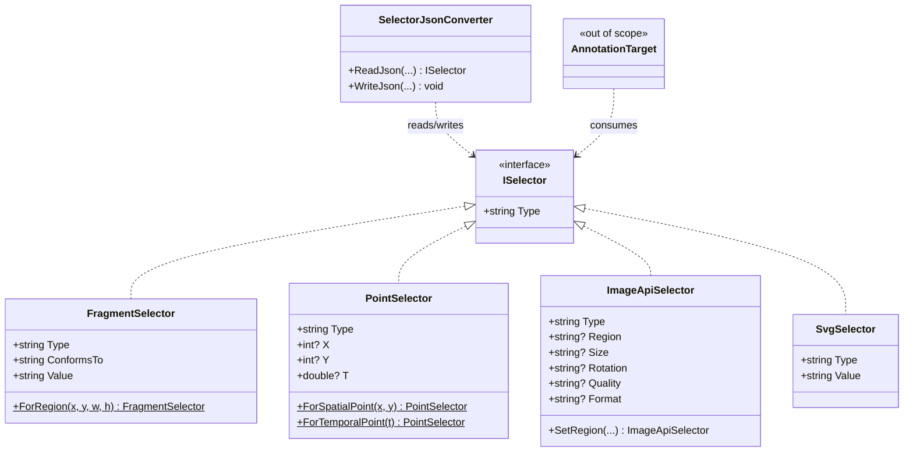

# Selectors

## Contents
- [Overview](#overview)
- [Files](#files)
- [Types & Members](#types--members)
  - [ISelector](#iselector)
  - [FragmentSelector](#fragmentselector)
  - [PointSelector](#pointselector)
  - [ImageApiSelector](#imageapiselector)
  - [SvgSelector](#svgselector)
  - [SelectorJsonConverter](#selectorjsonconverter)
- [Diagrams](#diagrams)
- [Package Dependencies](#package-dependencies)
- [See Also](#see-also)

## Overview

`IIIF.Manifests.Serializer.Shared.Selectors` models the W3C Web Annotation / Media Fragments selection types the IIIF Presentation API uses to point at a sub-part of a resource: a rectangular/temporal fragment (`FragmentSelector`), a single spatial or temporal point (`PointSelector`), an IIIF Image API region/size/rotation/quality/format transform (`ImageApiSelector`), or an arbitrary SVG shape (`SvgSelector`). All four implement the shared `ISelector` marker interface, and `SelectorJsonConverter` resolves the concrete type polymorphically from the JSON `type` discriminator on read, while delegating straight to the leaf type's own contract on write. This is the same "interface carries `[JsonConverter]`, leaf types must bypass it" pattern used elsewhere in the SDK (e.g. `Properties/Services`), and it lets selector-typed properties (most notably `AnnotationTarget`, in `Nodes/Contents/Annotation`, outside this folder's scope) hold any selector shape without a `switch` at every call site.

## Files

| File | Primary type(s) | LOC (approx) | Responsibility |
| --- | --- | --- | --- |
| `ISelector.cs` | `ISelector` | 16 | Marker interface for all selector shapes; carries the `[JsonConverter(typeof(SelectorJsonConverter))]` attribute. |
| `FragmentSelector.cs` | `FragmentSelector` | 49 | Media Fragments spec selector (`xywh=`/`t=` value string). |
| `PointSelector.cs` | `PointSelector` | 56 | Single spatial (`x`/`y`) or temporal (`t`) point selector. |
| `ImageApiSelector.cs` | `ImageApiSelector` | 100 | IIIF Image API region/size/rotation/quality/format selector. |
| `SvgSelector.cs` | `SvgSelector` | 39 | Arbitrary-shape selector expressed as inline SVG markup. |
| `SelectorJsonConverter.cs` | `SelectorJsonConverter` | 65 | Polymorphic `ISelector` reader/writer, dispatching on the `type` JSON property. |

[↑ Back to top](#contents)

## Types & Members

| Type | Kind | Summary | Inherits/Implements | Key Members |
| --- | --- | --- | --- | --- |
| `ISelector` | interface | Marker contract shared by all selector shapes. | *(none)* | `Type` |
| `FragmentSelector` | class | Media-fragment region/time-range selector. | `TrackableObject<FragmentSelector>`, `ISelector` | `Type`, `ConformsTo`, `Value`, ctor, `ForRegion(...)` |
| `PointSelector` | class | Single spatial or temporal point selector. | `TrackableObject<PointSelector>`, `ISelector` | `Type`, `X`, `Y`, `T`, `ForSpatialPoint(...)`, `ForTemporalPoint(...)` |
| `ImageApiSelector` | class | IIIF Image API region/size/rotation/quality/format selector. | `TrackableObject<ImageApiSelector>`, `ISelector` | `Type`, `Region`, `Size`, `Rotation`, `Quality`, `Format`, fluent `Set*` methods |
| `SvgSelector` | class | Arbitrary-region selector via inline SVG. | `TrackableObject<SvgSelector>`, `ISelector` | `Type`, `Value`, ctor |
| `SelectorJsonConverter` | class | Polymorphic JSON converter for `ISelector`. | `JsonConverter<ISelector>` | `ReadJson(...)`, `WriteJson(...)` |

### ISelector

- **Kind / Namespace**: public interface, `IIIF.Manifests.Serializer.Shared.Selectors`.
- **Inherits/Implements**: none.
- **Attributes**: `[JsonConverter(typeof(SelectorJsonConverter))]` — every property typed `ISelector` (or a collection thereof) is read/written through `SelectorJsonConverter` unless the concrete leaf type's own converter intercepts first.
- **Key properties**:
  - `Type : string` — the IIIF/W3C `type` discriminator (e.g. `"FragmentSelector"`); read-only from the interface's perspective.
- **Usage Recipe**:
```csharp
using IIIF.Manifests.Serializer.Shared.Selectors;

// Any of the four concrete selectors can be used wherever ISelector is expected,
// e.g. as an AnnotationTarget's selector.
ISelector selector = FragmentSelector.ForRegion(x: 0, y: 0, width: 200, height: 200);
Console.WriteLine(selector.Type); // "FragmentSelector"
```

[↑ Back to top](#contents)

### FragmentSelector

- **Kind / Namespace**: public class (sealed by convention, not by keyword), `IIIF.Manifests.Serializer.Shared.Selectors`.
- **Inherits/Implements**: `TrackableObject<FragmentSelector>`, `ISelector`.
- **Attributes**: none on the class; properties carry `[JsonProperty]` for `type`/`conformsTo`/`value`.
- **Constants**: `TypeJName = "type"`, `ConformsToJName = "conformsTo"`, `ValueJName = "value"`, `MediaFragmentConformsTo = "http://www.w3.org/TR/media-frags/"`.
- **Key properties**:
  - `Type : string` — always `"FragmentSelector"`; private setter, defaults via `GetElementValue`.
  - `ConformsTo : string` — defaults to the W3C Media Fragments spec URI; private setter.
  - `Value : string` — the fragment value, e.g. `xywh=10,10,100,100` or `t=10,20`; non-null (`!` on getter).
- **Constructors**: `[JsonConstructor] public FragmentSelector(string value)` — sets `Type`/`ConformsTo` to their defaults and `Value` to the supplied fragment string.
- **Factory methods**: `static FragmentSelector ForRegion(int x, int y, int width, int height)` — convenience wrapper that builds the `xywh=` value string.
- **Thread-safety/immutability**: instance state is mutated only through the private `Trackable` setters; not designed for concurrent mutation, consistent with the rest of the `TrackableObject` family.
- **Usage Recipe**:
```csharp
using IIIF.Manifests.Serializer.Shared.Selectors;

var regionSelector = FragmentSelector.ForRegion(x: 100, y: 100, width: 300, height: 200);
var timeSelector = new FragmentSelector("t=30,60");

Console.WriteLine(regionSelector.Value);     // "xywh=100,100,300,200"
Console.WriteLine(regionSelector.ConformsTo); // "http://www.w3.org/TR/media-frags/"
```

[↑ Back to top](#contents)

### PointSelector

- **Kind / Namespace**: public class, `IIIF.Manifests.Serializer.Shared.Selectors`.
- **Inherits/Implements**: `TrackableObject<PointSelector>`, `ISelector`.
- **Attributes**: `[JsonProperty]` on `Type`/`X`/`Y`/`T`.
- **Constants**: `TypeJName = "type"`, `XJName = "x"`, `YJName = "y"`, `TJName = "t"`.
- **Key properties**:
  - `Type : string` — always `"PointSelector"`.
  - `X : int?` — pixel x-coordinate for a spatial point; `null` for a temporal-only point.
  - `Y : int?` — pixel y-coordinate for a spatial point; `null` for a temporal-only point.
  - `T : double?` — seconds into an AV recording for a temporal point; `null` for a spatial-only point.
- **Constructors**: private parameterless `[JsonConstructor]` constructor (only reachable via deserialization or the static factories); the class does not expose a public constructor, forcing callers through the named factories below.
- **Factory methods**:
  - `static PointSelector ForSpatialPoint(int x, int y)` — builds a point with `X`/`Y` set, `T` left `null`.
  - `static PointSelector ForTemporalPoint(double t)` — builds a point with `T` set, `X`/`Y` left `null`.
- **Usage Recipe**:
```csharp
using IIIF.Manifests.Serializer.Shared.Selectors;

var spatial = PointSelector.ForSpatialPoint(x: 120, y: 45);
var temporal = PointSelector.ForTemporalPoint(t: 12.5);
```

[↑ Back to top](#contents)

### ImageApiSelector

- **Kind / Namespace**: public class, `IIIF.Manifests.Serializer.Shared.Selectors`.
- **Inherits/Implements**: `TrackableObject<ImageApiSelector>`, `ISelector`.
- **Attributes**: `[JsonProperty]` on `Type`/`Region`/`Size`/`Rotation`/`Quality`/`Format`.
- **Constants**: `TypeJName`, `RegionJName`, `SizeJName`, `RotationJName`, `QualityJName`, `FormatJName`.
- **Key properties** (all nullable — every field is optional; only populated ones constrain the selection):
  - `Type : string` — always `"ImageApiSelector"`.
  - `Region : string?` — Image API region parameter syntax (e.g. `"0,0,200,200"`).
  - `Size : string?` — Image API size parameter syntax.
  - `Rotation : string?` — Image API rotation parameter syntax.
  - `Quality : string?` — Image API quality parameter (e.g. `"default"`, `"gray"`).
  - `Format : string?` — Image API format parameter (e.g. `"jpg"`).
- **Constructors**: `[JsonConstructor] public ImageApiSelector()` — sets `Type` and leaves all optional fields `null`.
- **Key methods** (fluent, each returns `this`):
  - `SetRegion(string region)` — sets the raw region string.
  - `SetRegion(int x, int y, int width, int height)` — convenience overload building `"x,y,width,height"`.
  - `SetSize(string size)` / `SetRotation(string rotation)` / `SetQuality(string quality)` / `SetFormat(string format)`.
- **Usage Recipe**:
```csharp
using IIIF.Manifests.Serializer.Shared.Selectors;

var selector = new ImageApiSelector()
    .SetRegion(0, 0, 512, 512)
    .SetSize("400,")
    .SetRotation("90")
    .SetQuality("default")
    .SetFormat("jpg");
```

[↑ Back to top](#contents)

### SvgSelector

- **Kind / Namespace**: public class, `IIIF.Manifests.Serializer.Shared.Selectors`.
- **Inherits/Implements**: `TrackableObject<SvgSelector>`, `ISelector`.
- **Attributes**: `[JsonProperty]` on `Type`/`Value`.
- **Constants**: `TypeJName = "type"`, `ValueJName = "value"`.
- **Key properties**:
  - `Type : string` — always `"SvgSelector"`.
  - `Value : string` — the inline SVG markup string; non-null (`!` on getter).
- **Constructors**: `[JsonConstructor] public SvgSelector(string value)`.
- **Notes**: documented as the "generic, core-library counterpart" to a Georeference extension's `GeoreferenceSvgSelector`, which intentionally stays in that extension package rather than referencing this one — matching the SDK's established per-API small-type-duplication precedent (e.g. Auth/Discovery/Search `*ResourceReference` types).
- **Usage Recipe**:
```csharp
using IIIF.Manifests.Serializer.Shared.Selectors;

var svgSelector = new SvgSelector("<svg><polygon points=\"10,10 20,20 10,20\"/></svg>");
```

[↑ Back to top](#contents)

### SelectorJsonConverter

- **Kind / Namespace**: public class, `IIIF.Manifests.Serializer.Shared.Selectors`.
- **Inherits/Implements**: `JsonConverter<ISelector>`.
- **Design notes**: Uses the same recursion-guard technique as `ServiceJsonConverter`/`BaseResourceJsonConverter` elsewhere in the SDK. Because `ISelector` carries `[JsonConverter(typeof(SelectorJsonConverter))]` and every concrete selector implements `ISelector`, naively serializing/deserializing a leaf type would recurse back into this converter. The private nested `LeafContractResolver : IIIFJsonContractResolver` strips `SelectorJsonConverter` from contract resolution for any type other than `ISelector` itself, and a private static `LeafSerializer` (built from `TrackableObject.JsonSerializerSettings` plus that resolver) is used for the actual leaf read/write.
- **Key methods**:
  - `ReadJson(JsonReader reader, Type objectType, ISelector? existingValue, bool hasExistingValue, JsonSerializer serializer) : ISelector?` — loads a `JObject`, inspects its `type` property, and dispatches to `FragmentSelector`, `PointSelector`, `ImageApiSelector`, or `SvgSelector` via `LeafSerializer`; throws `JsonSerializationException` for an unrecognized `type` value; returns `null` for a JSON `null` token.
  - `WriteJson(JsonWriter writer, ISelector? value, JsonSerializer serializer) : void` — writes `null` for a `null` value, otherwise serializes via `LeafSerializer` (which resolves to the concrete runtime type's own contract).
- **Thread-safety**: `LeafSerializer` is a `static readonly` field built once; the converter itself holds no mutable instance state, so a single converter instance is safe to reuse/share across serialization calls.
- **Usage Recipe**: this converter is applied automatically via `[JsonConverter(typeof(SelectorJsonConverter))]` on `ISelector` — callers do not construct or invoke it directly. It runs implicitly whenever a `TrackableObject`-derived type (e.g. `AnnotationTarget`, `SpecificResource`) exposes an `ISelector`-typed property and is serialized/deserialized through `TrackableObject.Serialize()` / `TrackableObject.Parse<T>(json)`:
```csharp
using IIIF.Manifests.Serializer.Shared.Selectors;

// Deserialization dispatches on "type" automatically:
// { "type": "PointSelector", "x": 10, "y": 20 }  ->  PointSelector instance
```

[↑ Back to top](#contents)

## Diagrams



The four concrete selector types all implement `ISelector`; `SelectorJsonConverter` polymorphically resolves between them based on the JSON `type` discriminator, and consumers like `AnnotationTarget` (outside this folder) hold selectors only through the `ISelector` abstraction.

[↑ Back to top](#contents)

## Package Dependencies

| Package | Version | Description | Links |
| --- | --- | --- | --- |
| Newtonsoft.Json | 13.0.4 | JSON.NET — this SDK's serialization engine (custom JsonConverters, attribute-driven read/write) | [NuGet](https://www.nuget.org/packages/Newtonsoft.Json/13.0.4) |

[↑ Back to top](#contents)

## See Also

- [`../README.md`](../README.md) — Shared root
- [`../../README.md`](../../README.md) — top-level SDK docs
- [`../../SDK_VERSIONING_GUIDE.md`](../../SDK_VERSIONING_GUIDE.md) — SDK versioning guide

[↑ Back to top](#contents)
