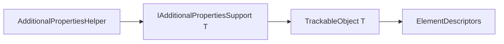

# Trackable Additional Properties

## Overview

`IIIF.Manifests.Serializer.Shared.Trackable.AdditionalProperties` contains
`IAdditionalPropertiesSupport<TAdditionalPropertiesSupport>`, the contract that allows unknown or
extension JSON properties to use the same element-descriptor storage and change tracking as known
model properties.

The interface exposes typed `SetElementValue` and `GetElementValue` operations. Consumers
normally use the public `AdditionalPropertiesHelper.SetAdditionalProperty` and
`GetAdditionalProperty` extension methods instead of calling the contract directly.

The interface is a pure abstract contract - all four members are implemented explicitly by
`TrackableObject<T>` (`TrackableObject.AdditionalProperties.cs`), none has a default body. It
previously carried default interface implementations for the `memberName`-only and
`expression`-only convenience overloads, but those bodies had the exact same erased signature as
`TrackableObject<T>`'s own `protected` `GetElementValue`/`SetElementValue` overloads (which serve
ordinary, non-additional properties and must skip the `IsAdditional` check the interface path
enforces) - a non-public class member hiding a public default interface method is legal C# but
triggers a compiler/IDE warning, and `new` does not cleanly suppress it across that
protected-vs-public boundary. Removing the default bodies resolved the warning at its root; the two
real callers of that convenience shape (`AdditionalPropertiesHelper.SetAdditionalProperty`/
`GetAdditionalProperty`) now call the two core (non-convenience) interface members directly.

## Diagrams

## See also

- [Trackable overview](../README.md)
- [Trackable objects](../Objects/README.md)
- [Helpers](../../../Helpers/README.md)
