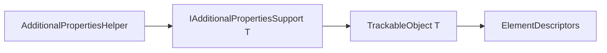

# Trackable Additional Properties

## Overview

`IIIF.Manifests.Serializer.Shared.Trackable.AdditionalProperties` contains
`IAdditionalPropertiesSupport<TAdditionalPropertiesSupport>`, the contract that allows unknown or
extension JSON properties to use the same element-descriptor storage and change tracking as known
model properties.

The interface exposes typed `SetElementValue` and `GetElementValue` operations. Consumers
normally use the public `AdditionalPropertiesHelper.SetAdditionalProperty` and
`GetAdditionalProperty` extension methods instead of calling the contract directly.

## Diagrams

## See also

- [Trackable overview](../README.md)
- [Trackable objects](../Objects/README.md)
- [Helpers](../../../Helpers/README.md)
