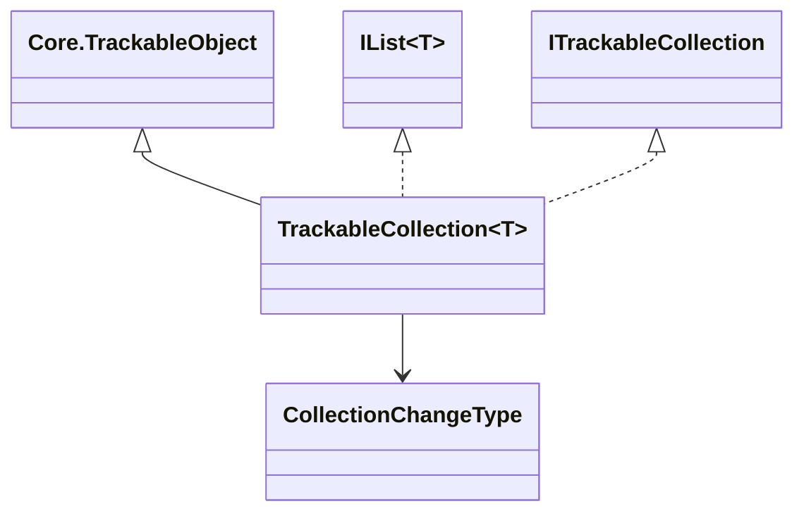

# Trackable Collections

## Overview

`IIIF.Manifests.Serializer.Shared.Trackable.Collections` provides mutable collections whose item
descriptors preserve baseline, addition, removal, and nested-child changes.

| File | Public type(s) | Purpose |
| --- | --- | --- |
| `TrackableCollection.cs` | `ITrackableCollection`, `TrackableCollection<T>` | `IList<T>` implementation with changing/changed events |
| `TrackableCollection.ChangeTracking.cs` | `TrackableCollection<T>` (partial) | Recursive descriptor-based change enumeration and acceptance |
| `CollectionChangeType.cs` | `CollectionChangeType` | `None`, `Added`, `Changed`, and `Removed` event states |

Constructor items form the accepted baseline. New items are `Added`; removing a newly added item
cancels that pending change; removing an accepted item records `Removed` until changes are
accepted. Enumeration and `Count` expose only current items.

## Diagrams

## See also

- [Trackable overview](../README.md)
- [Notification event arguments](../Notifications/README.md)
- [Change-tracking semantics](../../../CHANGE_TRACKING.md)
