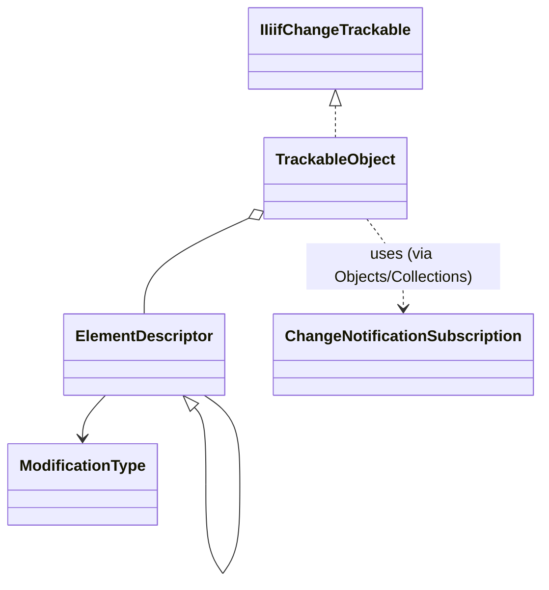

# Trackable Core

## Overview

`IIIF.Manifests.Serializer.Shared.Trackable.Core` contains the non-generic tracking base and the
descriptors that store accepted and modified values.

| File | Public type(s) | Purpose |
| --- | --- | --- |
| `TrackableObject.cs` | `TrackableObject` | Element-descriptor store plus Newtonsoft.Json `Serialize`, `Parse<T>`, and `TryParse<T>` helpers |
| `TrackableObject.ChangeTracking.cs` | `TrackableObject` (partial) | Recursive `IIiifChangeTrackable` implementation; `IsItemCollection`'s reflection result is memoized per concrete `Type` in a `ConcurrentDictionary` since it's re-checked on every traversal |
| `ElementDescriptor.cs` | `ElementDescriptor<T>`, `ElementDescriptor` | Accepted/current value storage and modification state (a plain data holder - not `IDisposable`) |
| `ModificationType.cs` | `ModificationType` | `Unknown`, `Unchanged`, `Added`, `Changed`, and `Removed` states |
| `ChangeNotificationSubscription.cs` | `ChangeNotificationSubscription` (internal) | Attaches/detaches the `ITrackableCollection`/`INotifyPropertyChanging`/`INotifyPropertyChanged` handler trio for a nested value or collection item, forwarding to fixed callbacks. Shared by `Objects.TrackableObject<T>` (one instance cached per property name) and `Collections.TrackableCollection<T>` (one instance per collection, reused for every item) so the interface-checking mechanics exist in exactly one place |

## Diagrams

## See also

- [Trackable overview](../README.md)
- [Public change model](../../../ChangeTracking/README.md)
