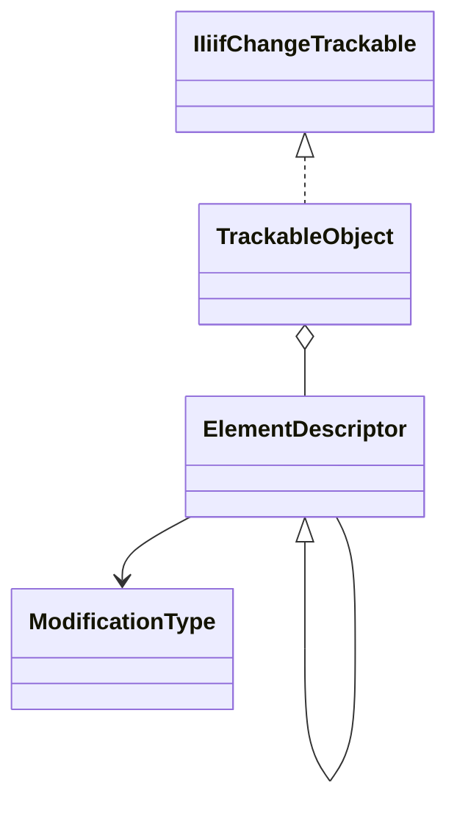

# Trackable Core

## Overview

`IIIF.Manifests.Serializer.Shared.Trackable.Core` contains the non-generic tracking base and the
descriptors that store accepted and modified values.

| File | Public type(s) | Purpose |
| --- | --- | --- |
| `TrackableObject.cs` | `TrackableObject` | Element-descriptor store plus Newtonsoft.Json `Serialize`, `Parse<T>`, and `TryParse<T>` helpers |
| `TrackableObject.ChangeTracking.cs` | `TrackableObject` (partial) | Recursive `IIiifChangeTrackable` implementation |
| `ElementDescriptor.cs` | `ElementDescriptor<T>`, `ElementDescriptor` | Accepted/current value storage and modification state |
| `ModificationType.cs` | `ModificationType` | `Unknown`, `Unchanged`, `Added`, `Changed`, and `Removed` states |

## Diagrams

## See also

- [Trackable overview](../README.md)
- [Public change model](../../../ChangeTracking/README.md)
